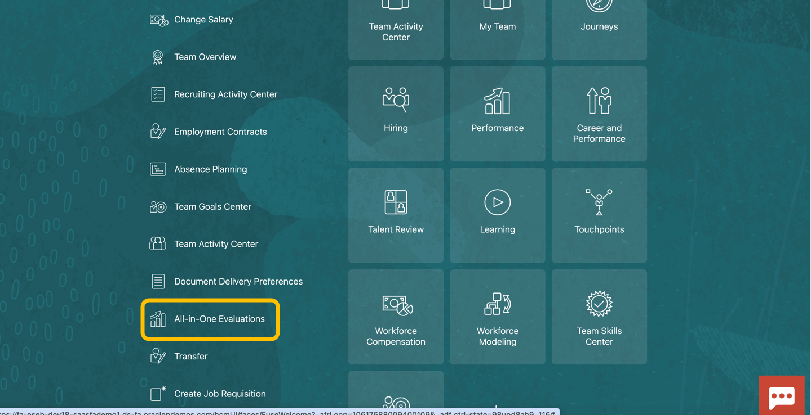
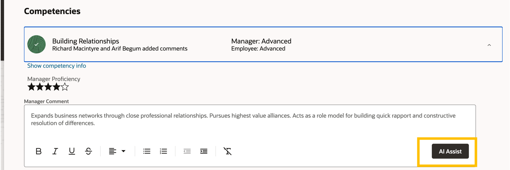

# HCM AI Assist - Performance Reviews

## Introduction

Integrating generative AI features to streamline HR processes, automate routine tasks and enhance employee experience has become one of the main priorities for most organizations. In this demo, we will guide you through the process of enabling the embedded Gen AI features in Oracle HCM Cloud.

Estimated Time: 10 minutes

### Objectives

Use the embedded Gen AI features in Oracle HCM Cloud to help create a performance review.

## Task 1: Use the embedded Gen AI features in Oracle HCM Cloud to help create a performance review.

1. First you will navigate to Annual Evaluations.  

   > Navigate to Home Page -> **Me**, then select **Career and Performance**.

   

   > Select **All-In-One-Evaluations**.

   

   > Select **2024 Annual Cycle** for Review Period and **Annual Evaluation** for Performance Document

   

   > Select **Arif Begum**.

   
   

3. Now you will use AI assist to help create a new performance Review

   > Navigate “down” to Competencies and expand “Building Relationships” by clicking the down  on the right-and side on the screen

   

   > Click **AI Assist** button.

   

   > See the AI generated formatted response.

   

## Summary

By following these steps, you  successfully activated the AI capabilities to enhance efficiency, improve accuracy, and provide a more engaging experience for employees. Embrace the future of human capital management with the power of AI!

**You have successfully completed the Activity!**

## Acknowledgements
* **Author** - Stephen Chung, Principal SaaS Cloud Technologist, Advanced Technology Services
* **Contributors** -  
* **Last Updated By/Date** - Stephen Chung, September 2024
