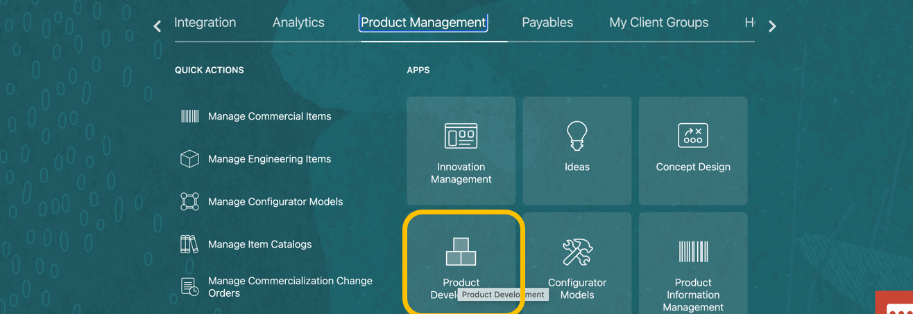
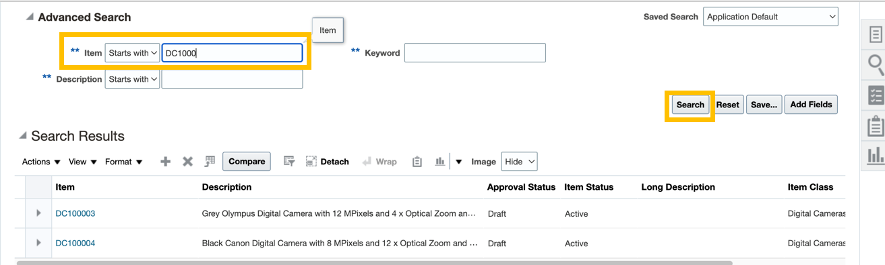
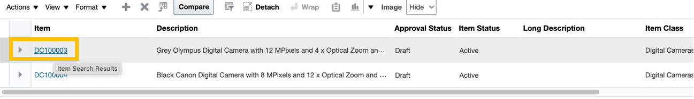
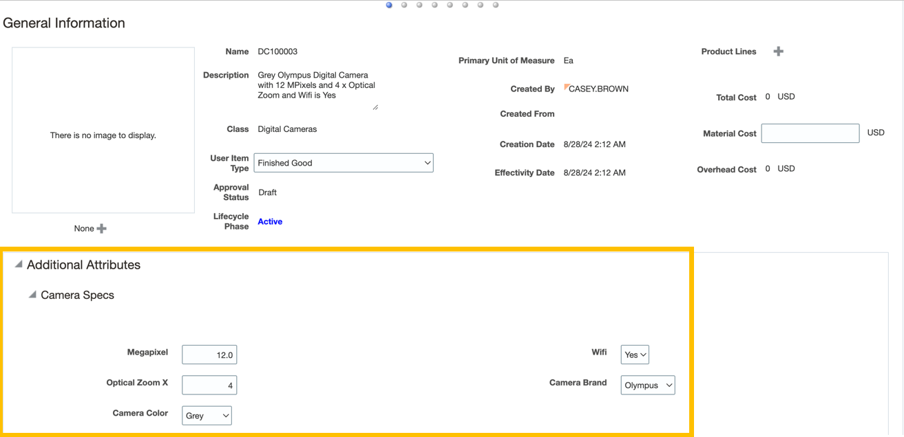
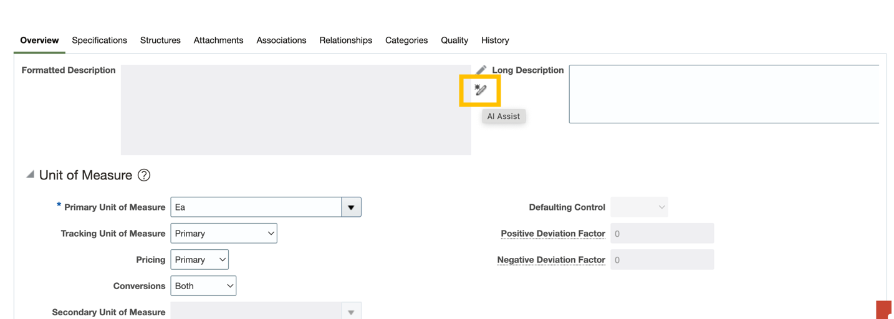
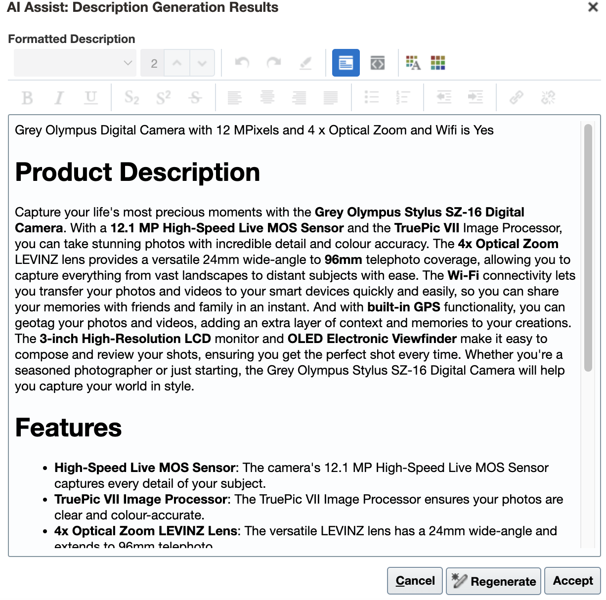

# SCM / ERP AI Assist - Product Description

## Introduction

XXXXXXXXXXXXXXX

Estimated Time: 10 minutes

### Objectives

Use the embedded Gen AI features in Oracle HCM Cloud to help create a performance review.

## Task 1: Use the embedded Gen AI features in Oracle SCM / ERP Cloud to help create a product description.

1. First you will navigate to Product Development

   > Navigate to Home Page -> **Product Management**.

   

   > Select **Product Development**.

   

2.  Now you will select a specific item.

   > Click  on the right-hand side on the page

   

   > Select **Items -> Manage Item**

   

   > Enter **“DC1000”** in the ***Item search box** then press 

   

   > Click on Item **“DC100003”** 

   

   > Take note that the camera is configured with **12 Mega Pixel, 4x Optical Zoom, Wifi-enabled,** etc.

   

   > Select **Actions -> Commercialization View**

   

3.  Now you will use AI assist to create a new product description.

   > on the AI Assist Button  besides “Formatted Description”

   

4.  See the AI generated formatted response, esp. including the product attributes like 12MP, Wifi-enabled, etc.  

   If interested in further demo, you can go back and change (and Save) the product attributes (e.g. higher MP camera) and re-generate the AI generated responses.

   

## Summary

XXXXXXXXXXXXXXXXXXXXXX

**You have successfully completed the Activity!**

## Acknowledgements
* **Author** - Stephen Chung, Principal SaaS Cloud Technologist, Advanced Technology Services
* **Contributors** -  
* **Last Updated By/Date** - Stephen Chung, September 2024
