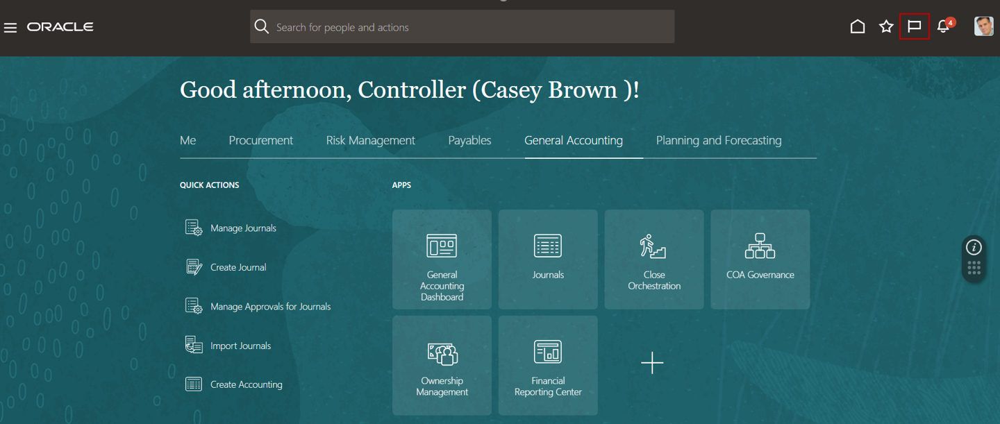
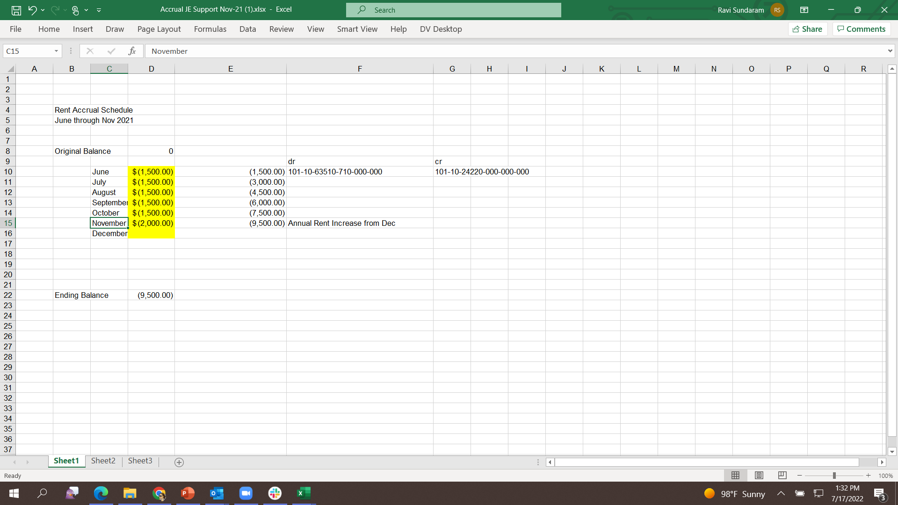
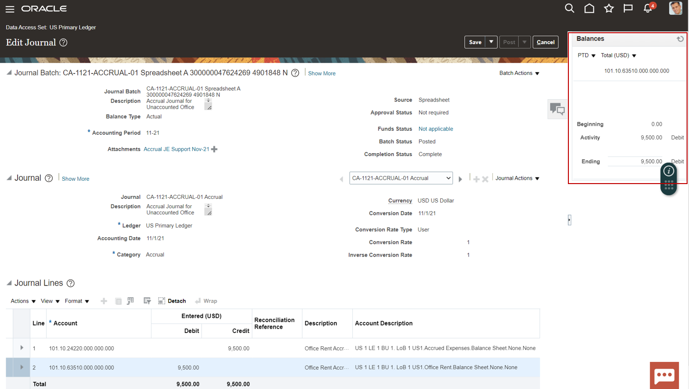

# Manage Journals

## Introduction

In this lab, you are going to learn to navigate within journals. You learn how to access journal details and review T-Accounts.

Estimated Time: 30 minutes

### Objectives

In this lab, you will:
* Manage Journals

## Task 1: View the Accrual Journal

1. To see how you can easily manage journals and review account balance impact even before posting the journal in the same screen.

    > Go to **Home Page**, then click on top right corner before the bell icon

    

2. Here’s where you can visualize all the Watchlist items based on your role. The list shows all the saved searches like unapproved journals, journals requiring attention etc	

    > Click on **‘Cloud Adventure JE Link’**

    

3. Here you can see the Accrual Journal to review

    > Click on the journal link ‘**XX CA-1121-ACCRUAL-01 Accrual’** to review the journal

      

4. This opens the journal that was posted for rent accrual. Notice the Attachment which is the audit backup for the accrual. 
   
    > **Click** on the attachments **‘Accrual JE Support Nvov-21’**.
    **Click** on the file downloaded to the PC if it doesn’t open automatically

      

5. Here you can view the backup for the accrual and the associated calculation. This is important and will remain as an attachment to the journal for any future audit.

      

## Task 2: View Journal details

1. **Close** the attachment opened in the previous task and go back to the **Edit Journal** screen and scroll down to review the journal lines, account description and line description

    

2. Here you can review the journal lines, Dr & Cr entries.

    > **Click** on the **‘Debit’** row

    

3. Here you are presented the projected account balance after this journal will be posted

    > **Highlight** the debit line and click the **refresh**  icon in the Balances area at the top right

    

## Task 3: Review Journal Header

1. Here you can review the journal header

    > Click on ‘Show More’

      

2. Now you can review the reversal period, reversal method along with the status of the reversal journal. 

    > **Click** on the **‘Reversal’** tab and **Click** on the Reversal Journal Entry Name **‘Reverses CA.’**

    

3. You can see that the reversal journal has the Dr and Cr flipped from the original accrual journal entry.

    

## Task 4: Review T-Accounts

1. You can see the originating journal details in the Reversal Area.

    > **Click** on the Originating Journal **‘CA-1121-ACCRUAL-01 Accrual’**

    

2. You can now review the T-Accounts for the accrual journal

    > **Click** on **‘View T-Accounts’**

       

3. You can see the T-Account Balance in this pop-up window

      

4. Here you can view the T-Account balances for various balance option like PTD, QTD and YTD!!

    > **Click** on dropdown **‘Balance Options’**  

      

5. Close the pop up window for the T-Accounts to return to the accrual journal

    > **Click ‘Done’**

    

6. You are now back in the journal review page

    > **Click** the **'Home'** button

      

7. You are back at the Home Page

      

## Learn More

* [URL text 1](http://docs.oracle.com)
* [URL text 2](http://docs.oracle.com)

## Acknowledgements
* **Author** - Michael Gobbo, Distinguished Sales Consultant, ERP Services
* **Contributors** -  Harold Dickerman, Business Architect
* **Last Updated By/Date** - Kevin Lazarz, September 2022
