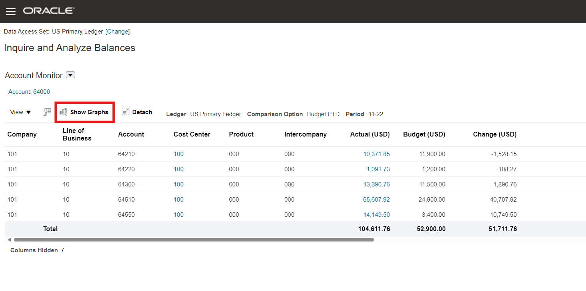
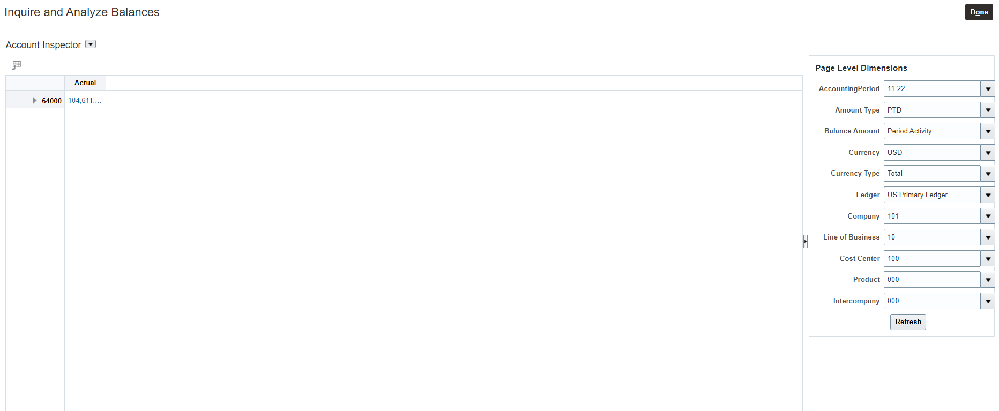
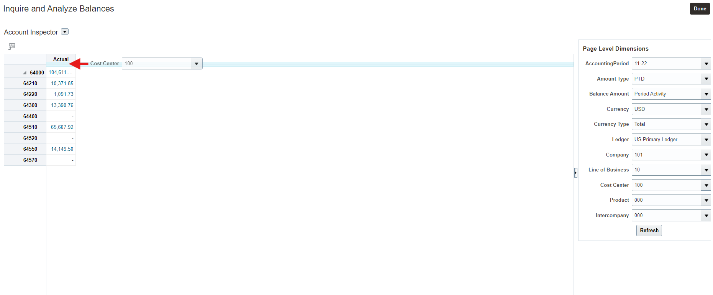
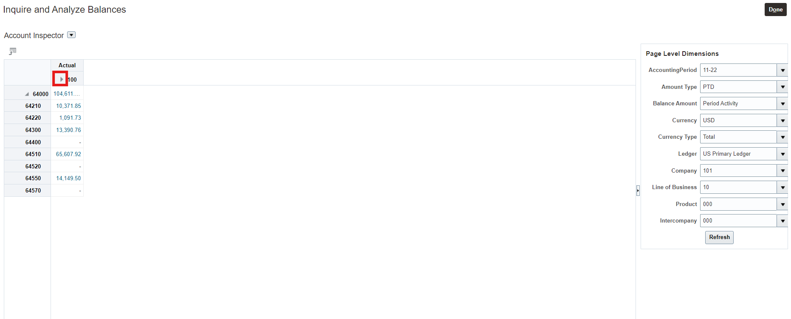
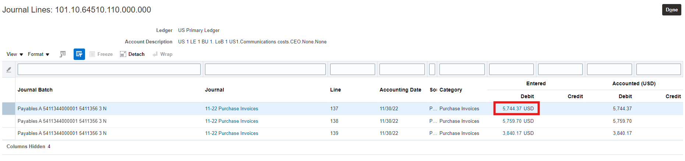

# Account Monitor

## Introduction

In this activity you'll discover how easy it is to monitor any account code combination and alert you of anomalies and provide you a path to the details to do root cause analysis.

Estimated Time: 6 minutes

### Objectives

In this activity, you will:
* Easily manage monitoring Key Accounts, Account Balance KPIs and drilldown seamlessly from a Summary account to any Subledger Transaction details

## Task 1: Account Monitor

1. 

  To see how you can leverage a unique multi-dimensional reporting and analysis platform that provides real-time access to financial information from a summary account to drilling down to an AP/AR (or any subledger) transaction along with any audit attachments.

    > Go to **General Accounting Tab**, then click **‘General Accounting Dashboard’**

    

2. 

  Here’s where you can visualize all the key accounts along with the KPIs that are most important to you. This screen also provides you a single place to visualize Intercompany Journals, Standard Journals and Period Statuses for all the Subledgers.	

    > **Scroll from top of the screen** to visualize Account Monitor, Intercompany Journals, Standard Journals and Period Statuses. **Change the Period** to **‘11-21’** if it is not ‘**11-21’**. **Change the Ledger** to ‘**US Primary Ledger**’ if it is not already set.”

    

3. 
   Here you can view the different account groups and manage/edit the account groups.	

    > Select “Account Group” and “Manage” 

    

4. 

  Here you can manage all the account groups. 

  Account Groups provide the ability to group accounts that you want monitor along with various  other options that you will see in the next sections

    > Click on the ‘Actual Vs Budget’ row 

    

5. 
   > Click on the ‘Actual Vs Budget’ row 

    

6. 

  Here you are presented with a list of values for configuring the comparison options for the account balances

    > Review the dropdown values available for Comparison Options 

    

7. 

  Here you can choose either comparing budget or prior period PTD, QTD and YTD

    > Options available are PTD, QTD and YTD 

    

8. 

  Now you have reviewed the options available to configure Account Group by reviewing the “Budget Vs Actual” Account Group.

    > Click the **‘Cancel’** Button 

    

9. 

  We have now reviewed the Manage Account Group option and how a user can easily configure account balances without any need of Technical Help.

    > Click **‘Done’** Button 

    

10. 

  You can see all of the account balances configured for the “Key Accounts Budget Vs Actual” Account Group. You can quickly notice that the 60500 Acc has the largest variance from the budget.
    
    

11. 

  You can now review the detailed balances of the 60500 summary account.

    > Click on Acc **‘60500’**  

    

12. 

  This brings up the child account balances for the account.
    
    

13. 

  Here you can view a graphical representation of the balances. A picture is worth 1000 words !!

    > Click on Acc **‘Show Graphs’**  

    

14. 

  Notice the account with the largest balance and variance.

    > Hover over the graph for the **60512** Account  

    

15. 

  You can review what caused the increase in spending for Airfare 60512 account. Scroll the screen up to change the view from Account Monitor to Account Inspector.

    > Select **“Account Inspector”** from the drop down where it currently shows Account Monitor  

    

16. 

  Here you can review account balances in an excel pivot fashion. This gives you a grid view making the detailed analysis of two sets of values across the rows and columns. Review the page level dimensions on the left.

    

17. 

  You would like review the account balances. Expand the parent account of 60500.

    > Click on the ”>“ icon.  

    

18. 

  This view shows the all the detail account balances of the Account 60500.

    

19. 

  You would like to further analyze what cost center caused the variance for 60512.

    > Drag the “Cost Center 400 ” field to the section right inside the Actual row  

    
    

20. 

  This breaks out the account balances in a grid view between the child account values and the child cost center values. 

    > Drop the “Cost Center 400 ” field as shown in the image to the right. 

    
    

21. 

    > Click on “>” before the 400 cost center value 

    
    
22. 

  Now you can review the balances in an excel pivot view that the Finance team loves to see and analyze data. 

    
    
23. 
  Review the data to see which account/cost center intersection has the largest account balance
  
    > Click on **“15,491.88”** to drilldown to the details 

    

24. 

  Review the Detail Balance drill down, showing the beginning balance, period activity and ending balance. 
    
    > Click on **“15,491.88”**
    
    

25. 

  Review the journal lines that made up the account balance. You are now reviewing the Journal batch/journal details in this drilldown. This batch has been posted from Payables. 
    
    > Click on **“372.88”**
    
    

26. 

  You can review the actual transaction and are looking at the subledger drilldown which holds the rich AP data in this case, while the GL Journal is summarized in GL. This provides you all the data you need to analyze while keeping the GL Thin. 
    
    > Click on **“View Transaction”**
    
    

27. 

  You can now review the AP Invoice, the lines that made up this AP Invoice even though we only drilled down on the Airfare which is line #6. 
        
    

28. 

  You are able to review and audit any attachments available in the transaction without having to call the AP department in a self service way. 
    
    > Click on the Attachment named **“Air Travel Expense.pdf”**
    
    

29. 

  You can review the attachment and validate that the receipt is right for the air travel and reasonable cost charged by the employee. 
        
    

## Summary

  You can easily configure the key accounts that is important to you and compare balances real time to PTD, QTD, YTD. Click on the home link to navigate back to the home page. This concludes this activity of account monitor, to summarize – you were able to first define what are the key accounts you want to monitor and then easily view the variances, you were able to very easily identify the variance and drill down to the lowest level of the transaction along with viewing attachments. 

  > Click the **‘Home’** Icon

## Acknowledgements
* **Author** - Michael Gobbo, Distinguished Sales Consultant, ERP Services
* **Contributors** -  Harold Dickerman, Business Architect
* **Last Updated By/Date** - Kevin Lazarz, September 2022