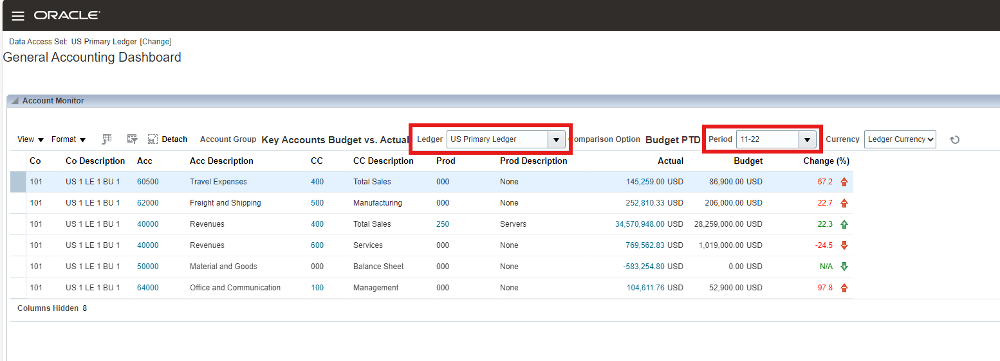
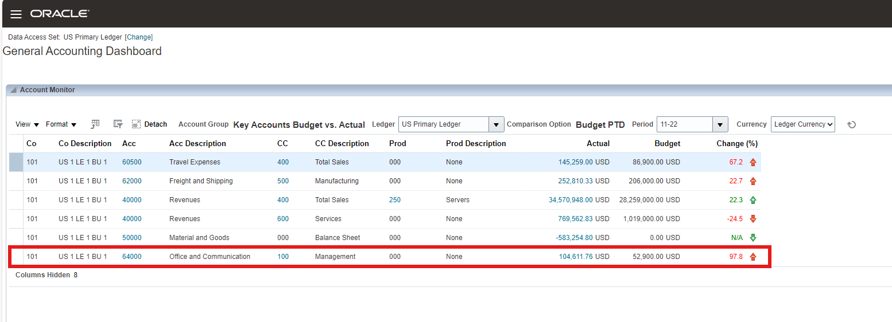
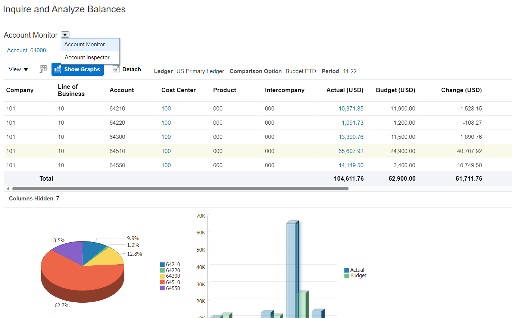
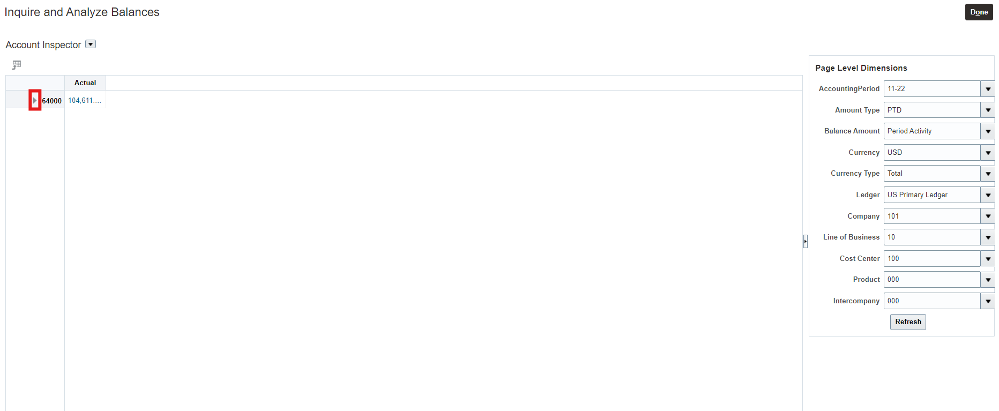
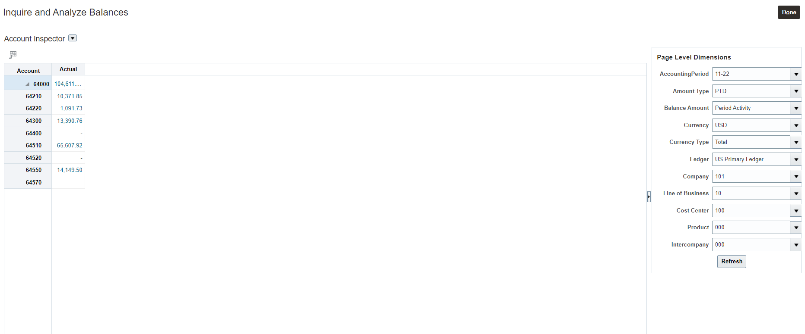
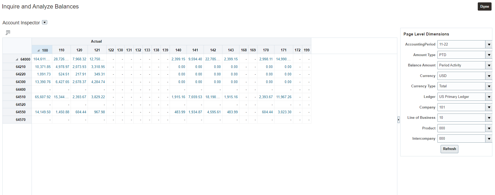
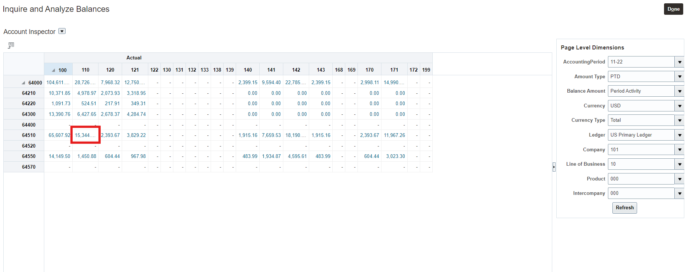
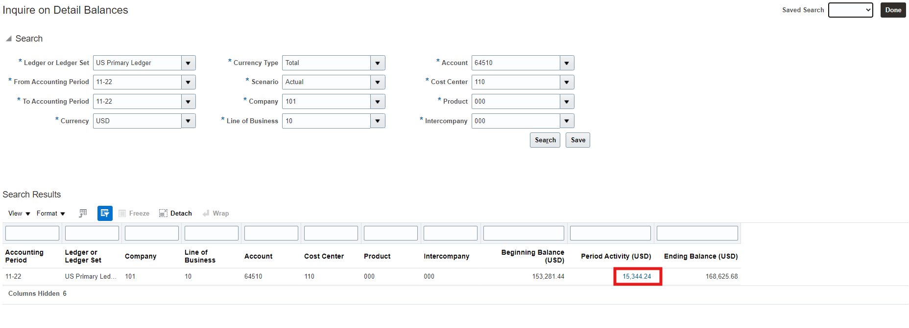
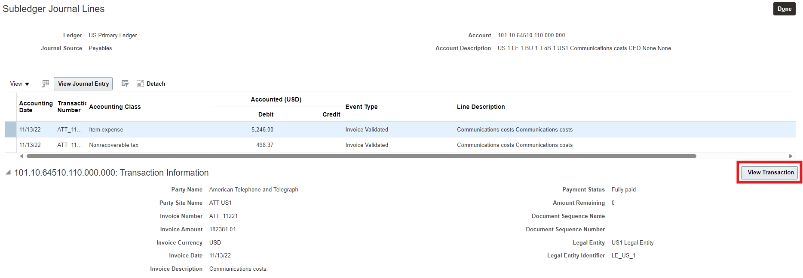
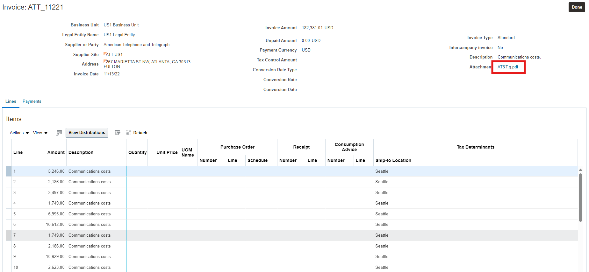

# Account Monitor

## Introduction

In this activity you'll discover how easy it is to monitor any account code combination and alert you of anomalies and provide you a path to the details to do root cause analysis.

Estimated Time: 6 minutes

### Objectives

In this activity, you will:
* Easily manage monitoring Key Accounts, Account Balance KPIs and drilldown seamlessly from a Summary account to any Subledger Transaction details

## Task 1: Account Monitor

1. 

  To see how you can leverage a unique multi-dimensional reporting and analysis platform that provides real-time access to financial information from a summary account to drilling down to an AP/AR (or any subledger) transaction along with any audit attachments.

    > Go to **General Accounting Tab**, then click **‘General Accounting Dashboard’**

    

2. 

  Here’s where you can visualize all the key accounts along with the KPIs that are most important to you. This screen also provides you a single place to visualize Intercompany Journals, Standard Journals and Period Statuses for all the Subledgers.	

    > **Scroll from top of the screen** to visualize Account Monitor, Intercompany Journals, Standard Journals and Period Statuses. **Change the Period** to **‘11-22’** if it is not ‘**11-22’**. **Change the Ledger** to ‘**US Primary Ledger**’ if it is not already set.”

    

3.   

  You can see all of the account balances configured for the “Key Accounts Budget Vs Actual” Account Group. You can quickly notice that the 64000 Acc has the largest variance from the budget.
    
    

4. 

  You can now review the detailed balances of the 64000 summary account.

    > Click on Acc **‘64000’**  

    

5. 

  This brings up the child account balances for the account.
    
    

6. 

  Here you can view a graphical representation of the balances. A picture is worth 1000 words !!

    > Click on Acc **‘Show Graphs’**  

    

7. 

  Notice the account with the largest balance and variance.

    > Hover over the graph for the **64510** Account  

    

8. 

  You can review what caused the increase in spending for Communications Costs 64510 account. Scroll the screen up to change the view from Account Monitor to Account Inspector.

    > Select **“Account Inspector”** from the drop down where it currently shows Account Monitor  

    

9. 

  Here you can review account balances in an excel pivot fashion. This gives you a grid view making the detailed analysis of two sets of values across the rows and columns. Review the page level dimensions on the left.

    

10. 

  You would like review the account balances. Expand the parent account of 64000.

    > Click on the ”>“ icon.  

    

11. 

  This view shows all the detail account balances of the Account 64000.

    

12. 

  You would like to further analyze what cost center caused the variance for 64510.

    > Drag the “Cost Center 100 ” field to the section right inside the Actual row  

    
    

13. 

  This breaks out the account balances in a grid view between the child account values and the child cost center values. 

    > Drop the “Cost Center 100 ” field as shown in the image to the right. 

    
    

14. 

    > Click on “>” before the 100 cost center value 

    
    
15. 

  Now you can review the balances in an excel pivot view that the Finance team loves to see and analyze. 

    
    
16.  
  Review the data to see which account under cost center 110 has the largest account balance, excluding the summary account 64000.
  
    > Click on **“15,344.24”** to drilldown to the details 

    

17.  

  Review the Detail Balance drill down, showing the beginning balance, period activity and ending balance. 
    
    > Click on **“15,344.24”**
    
    

18. 

  Review the journal lines that made up the account balance. You are now reviewing the Journal batch/journal details in this drilldown. This batch has been posted from Payables. 
    
    > Click on **“5,744.37”**
    
    

19. 

  You can review the actual transaction and are looking at the subledger drilldown which holds the rich AP data in this case, while the GL Journal is summarized in GL. This provides you all the data you need to analyze while keeping the GL Thin. 
    
    > For amount $5,246.00, click on **“View Transaction”**
    
    

20. 

  You can now review the AP Invoice and the lines that made up this AP Invoice. We drilled down to Communications Costs line #1.
        
    

21. 

  You are able to review and audit any attachments available in the transaction without having to call the AP department in a self service way. 
    
    > Click on the Attachment named **“AT&T.q.pdf”**
    
    

22. 

  You can review the attachment and validate the cost by comparing to the invoice received from the vendor.
        
    

23. 

    Adventure awaits, show what you know, and rise to the top of the leader board!!!
    
     
    
    [Click here](https://apex.oracle.com/pls/apex/f?p=159406:10:) 

## Summary

  You can easily configure the key accounts that is important to you and compare balances real time to PTD, QTD, YTD. Click on the home link to navigate back to the home page. This concludes this activity of account monitor, to summarize – you were able to first define what are the key accounts you want to monitor and then easily view the variances, you were able to very easily identify the variance and drill down to the lowest level of the transaction along with viewing attachments. 

  > Click the **‘Home’** Icon

## Acknowledgements
* **Author** - Michael Gobbo, Distinguished Sales Consultant, ERP Services
* **Contributors** -  Neelima Bondelepati, Principal Sales Consultant
* **Last Updated By/Date** - Kevin Lazarz, August 2023