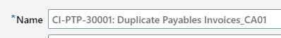
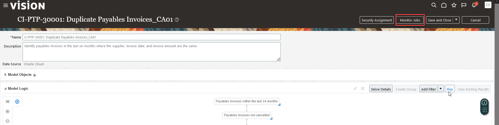
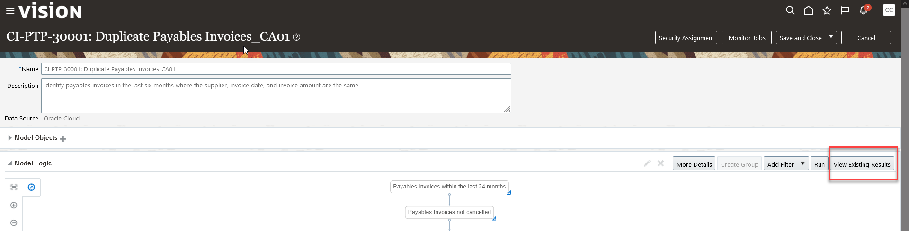
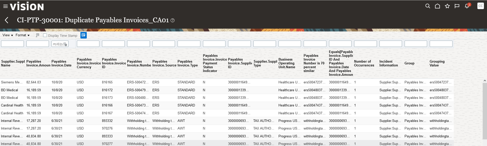

# Risk Management

## Introduction

In this activity you'll discover how easy it is to detect anomalies and provide details to mitigate concerns.

Estimated Time: 5 minutes

### Objectives

In this activity, you will:
* Detect Anomalies

## Task 1: Risk Management

1. 

  To further the discussion on how impactful/empowering this functionality is for business users, let’s drill into how the rules engine tailor a control for our own purposes...

    > Go to **Risk Management Cloud tab**, then click **‘Advanced Controls’**

    

2. 

      > **Click** on the ‘**Models**’ icon on left side of screen (NOTE – ‘Models’ is the 2nd icon)

    

3. 

      > Use the search feature to **find control PTP-30001**

    

4. 

      > **Select** Results Count **‘75’** (or whatever # is displayed) – to see results. Take note the number of results displayed.

    

5. 

      > Review the results. See Payables Invoice.Number column to see potential duplicates

    

6. 

      > **Next, click the carrot ‘<’  to go back**

    

7. 

  A common objective for business controls is to adapt controls to a company’s risk profile.  Materiality levels differ by company.  Here we see how easy it is to tweak the control to make more relevant and impactful for our own objective.

    > •	**Select** the model **‘CI-PTP-30001: Duplicate Payables Invoices’** 
    >	•	Note: Click the white space next to the hyperlink so the line  item becomes shaded blue (Do not click the hyper link itself)

    

8. 
 
    > Next, **click** the ‘**Actions**’ drop-down menu, then **select ‘Copy’**

    

9. 
  
    > Click the hyper link for the newly-copied model

    

10. 
  
    > **Click Edit** in upper right corner

    

11. 
  
    > **Rename/append** the name of the model with **CAOxx** (the user you’re logged in as)

    

12. 
  
    > **Click ‘Add Filter‘**

    

13. 

    > (1) Enter Filter Name as ‘**Amount**’   

    > (2) Change condition to ‘**Greater than or equal to**’   

    > (3) Enter a number threshold limit in **Value** field (NOTE – Value should be less than 500,000)

    

14. 
  
    > **Click ‘Run’**

    

15. 
  
    > **Click ‘Yes’**

    

16. 

      > **Select ‘Monitor Jobs’** (to confirm the job completes)

    

17. 
  
    > Note: Job says ‘Completed’ once done 
    > **Next, click the carrot ‘<’  to go back**

    

18. 
  
    > **Click ‘View Existing Results ‘**

    

19. 
  
    > Note: Results Screen shows Duplicate Invoice advanced control results – above the materiality threshold you selected in step 13.  **Click the carrot** ‘<’ to go back   

    > **Click the carrot ‘<’** to go back

    

20. 
    > **Select > Save and Close**

    

21. 

    Adventure awaits, show what you know, and rise to the top of the leader board!!!

    

## Acknowledgements
* **Author** - Michael Gobbo, Distinguished Sales Consultant, ERP Services
* **Contributors** -  Steve Quinton, Team Lead – Risk Solutions 
* **Last Updated By/Date** - Kevin Lazarz, August 2023
