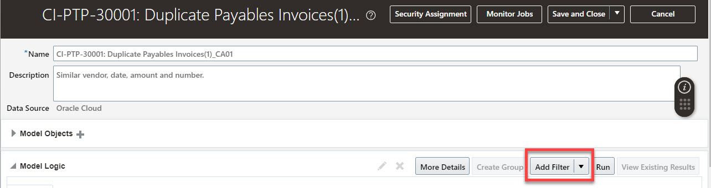
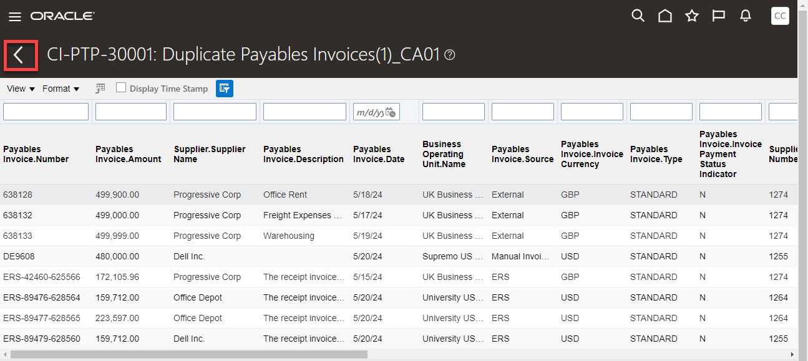

# Risk Management

## Introduction

In this activity you'll discover how easy it is to detect anomalies and provide details to mitigate concerns.

Estimated Time: 5 minutes

### Objectives

In this activity, you will:
* Detect Anomalies

## Task 1: Risk Management

1. 

  To further the discussion on how impactful/empowering this functionality is for business users, let’s drill into how the rules engine tailor a control for our own purposes...

    > Go to **Risk Management Cloud tab**, then click **‘Advanced Controls’**

    

2. 

      > **Click** on the ‘**Models**’ icon on left side of screen (NOTE – ‘Models’ is the 2nd icon).

    

3. 

      > **Select** Results Count **‘64’** (or whatever # is displayed) – to see results.

    

4. 

      > Review the results. See Payables Invoice. Number column to see potential duplicates.

    

5. 

      > **Next, click the carrot ‘<’  to go back**.

    

6. 

  Let’s see how easy it is to modify a control by adding a materiality threshold.  

    > •	Click the row (white space) for **‘CI-PTP-30001: Duplicate Payables Invoices’** so that the row becomes shaded blue (Do not click the Model name/hyperlink itself).

    

7. 
 
    > Next, **click** the ‘**Actions**’ drop-down menu, then **select ‘Copy’**.

    

8. 
  
    > Click the hyper link for the newly-copied model.

    

9. 
  
    > **Click Edit** in upper right corner.

    

10. 
  
    > **Rename/append** the name of the model with **CAOxx** (the user you’re logged in as).

    

11. 
  
    > **Click ‘Add Filter‘**.

    

12. 

    > (1) Enter Filter Name ‘**Amount**’   

    > (2) Select Object:  ‘**Payables Invoice**’   

    > (3) Change condition to ‘**Greater than or equal to**’   

    > (4) Enter a dollar limit in **Value** field (NOTE – Value should be less than 500,000)  

    > (5) Click **OK**

    

13. 

    > **Click ‘Run’** > **Click ‘Yes’** > **Click ‘Ok’**.

    

    

    

14. 

      > **Select ‘Monitor Jobs’** (to confirm the job completes).

    

15. 
  
    > Note: (1) Once job is ‘**Completed**’ (2) Next, **click the carrot ‘<’ to go back**.

    

16. 
  
    > **Click ‘View Existing Results ‘**.

    

17. 
  
    > Note: Results Screen show updated results based on Amount threshold chosen in previous step.    

    > **Click the carrot ‘<’** to go back.

    

20. 
    > **Select > Save and Close**.

    

21. 

    Adventure awaits, show what you know, and rise to the top of the leader board!!!

    

    [Click here](https://apex.oracle.com/pls/apex/f?p=159406:10:) 

## Acknowledgements
* **Author** - Michael Gobbo, Distinguished Sales Consultant, ERP Services
* **Contributors** -  Steve Quinton, Team Lead – Risk Solutions 
* **Last Updated By/Date** - Ramona Magadan, Technical Program Manager, Database Product Management, August 2024
