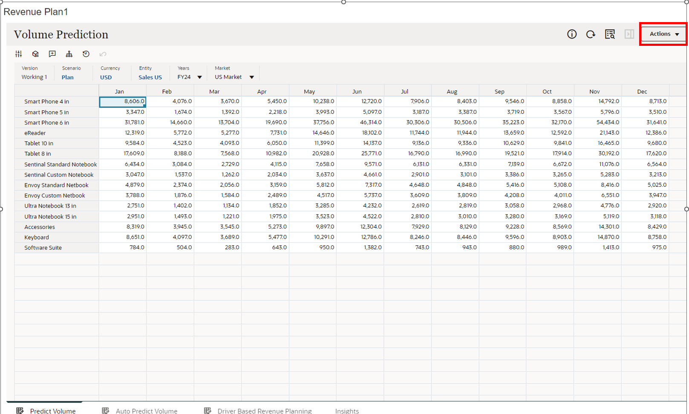

# Predictive

## Introduction

In this activity you'll discover the power in predictive capabilities powered by Machine Learning and Artificial Intelligence.

Estimated Time: 5 minutes

### Objectives

In this activity, you will:

- Perform predictive capabilities

## Task 1: Predictive

1. To see how we can work with predictive analytics we will use predictive planning and auto-predict to create a revenue forecast.

   > Go to **Planning and Forecasting** Section, then click **‘Revenue Plan’**

   

2. Here you can see a revenue forecast for unit sales by products. Let’s look at how you can use predictive planning to help you generate or validate this forecast.

   > Click the **‘Actions’** dropdown button

   

3. > Select the **‘Predictive Planning’** dropdown item

   

4. Here you are shown your predictive volume for Smart Phone 4 in. Note: how we can see past actuals in the chart on the left and future prediction in the chart on the right. Let's expand this view so you can see more details.

   > Click on the [] **‘expand’** Icon

   

5. Expanding on the details you can see insights on the historical data as well as the accuracy of the prediction and which of the 13 prediction methods was most accurate. 

   > Click on the **‘settings’** icon

   

6. Here you can see prediction options.

   > Click **‘Close’**

   

7. Next let’s see how you can paste in the prediction values to seed a forecast.

    > Click the **‘Paste’** Icon

    

8. You are presented with the ability to paste either the prediction, best case, or worst case into your forecast. You can paste an entire forecast or a range of dates. You can also apply this data for all products or just the currently selected member. Let’s paste this forecast.

    > Click **‘Close’**

    

9. Let’s look at how predictive planning can be automatically provided to you.

    > Click **‘Auto Predict Volume Horizontal Tab’**

    

10. The system is providing you with an error message letting you know you have unsaved changes. Let’s proceed.

    > Click **‘OK’**

    

11. Here you are automatically presented with a most likely, worst-case, and best-case scenario. This gives you the ability to validate and compare your sales volume forecast. Let’s return to the home and watch the rest of the walk through.

    > Click the **‘Home’** Icon

    

12. Adventure awaits, show what you know, and rise to the top of the leader board!!!

     
   
    [Click here](https://apex.oracle.com/pls/apex/f?p=159406:10:) 

## Acknowledgements

- **Author** - Michael Gobbo, Distinguished Sales Consultant, ERP Services
- **Contributors** - Steve Quinton, Team Lead – Risk Solutions
- **Last Updated By/Date** - Ramona Magadan, Technical Program Manager, Database Product Management, August 2024
