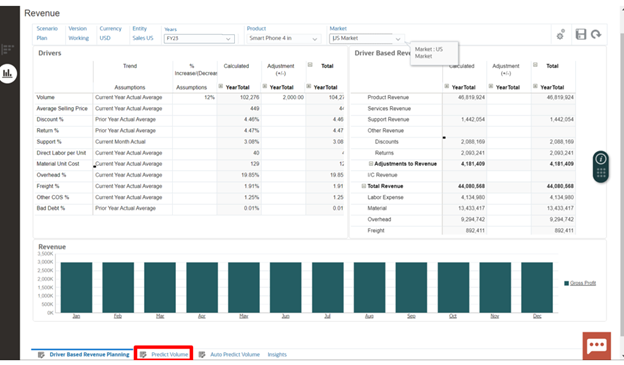
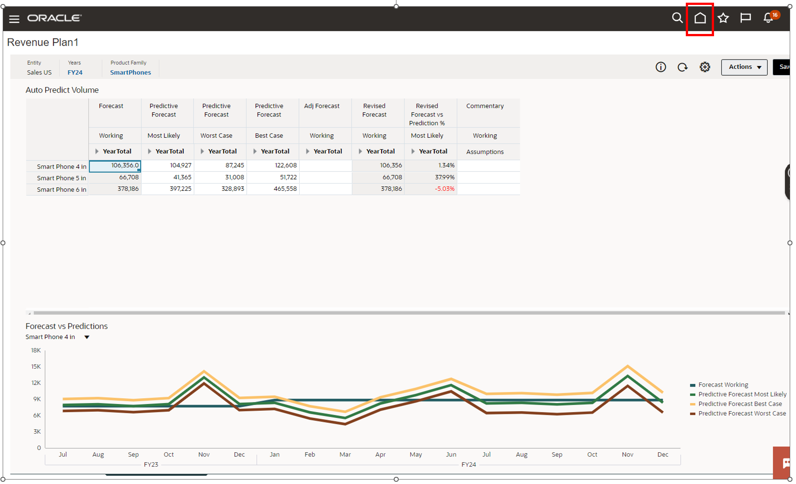
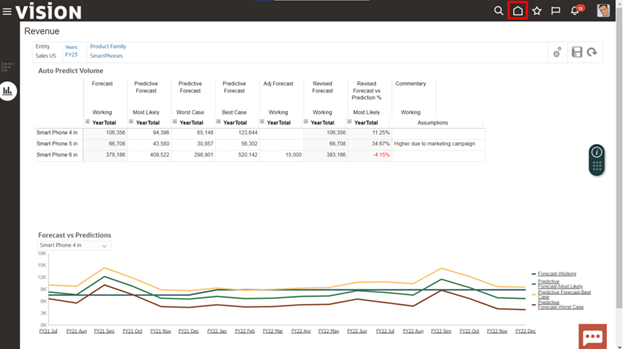

# Predictive

## Introduction

In this activity you'll discover the power in predictive capabilities powered by Machine Learning and Artificial Intelligence.

Estimated Time: 5 minutes

### Objectives

In this activity, you will:

- Perform predictive capabilities

## Task 1: Predictive

1. To see how we can work with predictive analytics we will use predictive planning and auto-predict to create a revenue forecast.

   > Go to **Planning and Forecasting** Section, then click **‘Revenue Plan’**

   

2. Here’s where you can visualize your revenue forecast for next year. Next we will see how we can utilize predictive analytics to create this and improve forecast accuracy.

   > **Click** on the **‘2nd Vertical’** tab (on left side of screen)

   

3. Here is where you can manually create a forecast based on both drivers and revenue using both percentages and adjustments.

   > **Click** on the **‘Predict Volume’** Horizontal Tab

   

4. Here you can see a revenue forecast for unit sales by products. Let’s look at how you can use predictive planning to help you generate or validate this forecast.

   > Click the **‘Actions’** dropdown button

   

5. > Select the **‘Predictive Planning’** dropdown item

   

6. Here you are shown your predictive volume for Smart Phone 4 in. Note: how we can see past actuals in the chart on the left and future prediction in the chart on the right. Let's expand this view so you can see more details.

   > Click on the [] **‘expand’** Icon

   

7. Expanding on the details you can see insights on the historical data as well as the accuracy of the prediction and which of the 13 prediction methods was most accurate. Let’s look at how you can change the time periods.

   > Click on the **‘settings’** icon

   

8. Here you are presented with a list of charts you can select from. Let’s see how you can Change the date ranges.

   > Next, click **‘Date Ranges’**

   

9. Here you can change the historical date ranges as well as how far into the future you would like to run predictions for.

   > Click **‘Cancel’**

   

10. Next let’s see how you can paste in the prediction values to seed a forecast.

    > Click the **‘Paste’** Icon

    

11. You are presented with the ability to paste either the prediction, best case, or worst case into your forecast. You can paste an entire forecast or a range of dates. You can also apply this data for all products or just the currently selected member. Let’s paste this forecast.

    > Click **‘Paste’**

    

12. You may receive the warning message shown below. If so, choose ‘OK’ to close the message. If not, continue to step 13.

    > Click **‘Auto Predict Volume Horizontal Tab’**

    

13. You can see all of the values that have been pasted highlighted in yellow. Let’s look at how predictive planning can be automatically provided to you.

    > Click **‘Auto Predict Volume Horizontal Tab’**

    

14. The system is providing you with an error message letting you know you have unsaved changes. Let’s proceed.

    > Click **‘OK’**

    

15. Here you are automatically presented with a most likely, worst-case, and best-case scenario. This gives you the ability to validate and compare your sales volume forecast. Let’s return to the home and watch the rest of the walk through.

    > Click the **‘Home’** Icon

    

16. Adventure awaits, show what you know, and rise to the top of the leader board!!!

     
    
    [Click here](https://apex.oracle.com/pls/apex/f?p=159406:10:) 

## Acknowledgements

- **Author** - Michael Gobbo, Distinguished Sales Consultant, ERP Services
- **Contributors** - Steve Quinton, Team Lead – Risk Solutions
- **Last Updated By/Date** - Kevin Lazarz, August 2023
