# Procurement

## Introduction

In this activity you'll discover how easy it is to buy indirect items through an easy to use shopping cart experience and how to effectively negotiate contracts.

Estimated Time: 5 minutes

### Objectives

In this activity, you will:
* Purchase business related supplies through self-service and negotiate contracts with key suppliers 

## Task 1: Strategic Procurement – Negotiations (Sourcing)

1. 

  You need to figure out why the Automatic Award Recommendation has elected not to award EIP Inc. this negotiation. You will need to go to the negotiations page.

    > Navigate to the **Procurement** tab and select **Negotiations**

    

2. 

  This is the negotiations dashboard that has Infolets with insights into sourcing programs and activity. This information is drillable to give the user an intuitive experience. You need to drill into Award Completed to analyze the recent sourcing negotiation.

    > In the **‘My Negotiations’** Infolet select the **‘Award Completed’** piece of the pie chart (Purple)

    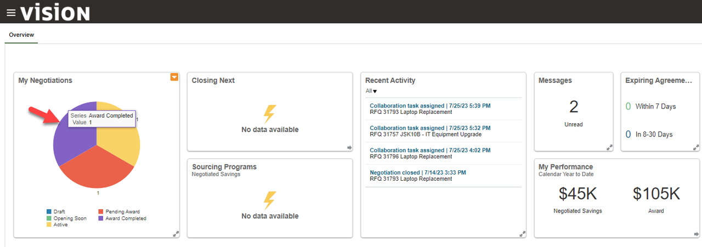

3. 

  You could drill into the negotiation details by clicking the hyperlink. However, you need to analyze the individual supplier responses, so you need to click the monitor icon.

    > Click the **‘Monitor’** icon for Negotiation **31796**

    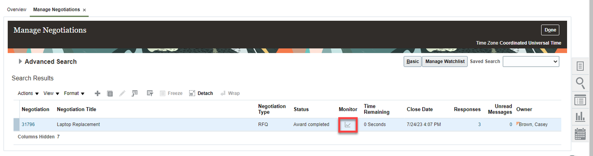

4. 

  Here is the initial monitor page with analytical information for current value, potential savings, and supplier response amounts.  
  At the bottom of the page are the suppliers. Five were invited and three responded. Notice EIP was ranked first, but wasn’t awarded, so you have to dive deeper to find why.

  To see more information about this negotiation you can use the analytical tools available through Cloud Procurement
  
    > Select **Actions** drop-down menu, then click **Analyze**, select **Analyze Negotiation** from the drop-down menu
    
      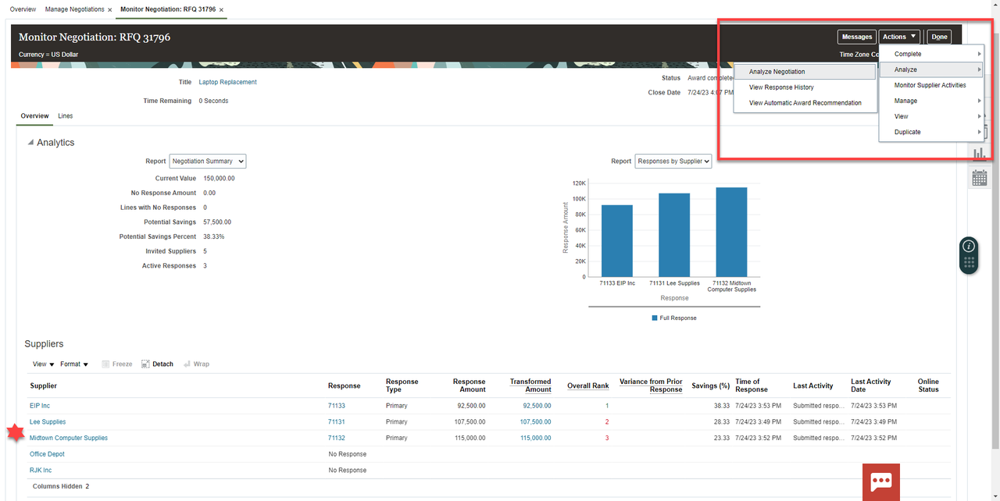

5. 

  With analytics built into the sourcing process, we see awards by supplier, total savings, and savings by line item.  
  At the bottom of the page are supplier response information where we can pull in response details to see why EIP Inc wasn’t awarded this negotiation despite the highest savings potential.

    > Click **Scroll-bar** down to bottom of page

    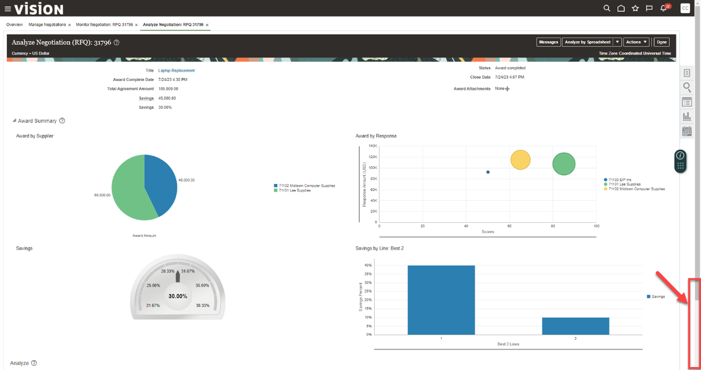

6. 

     > Click the **white space next to ‘Supplier’** as indicated (in blue).

     > Click **Analyze**
   
    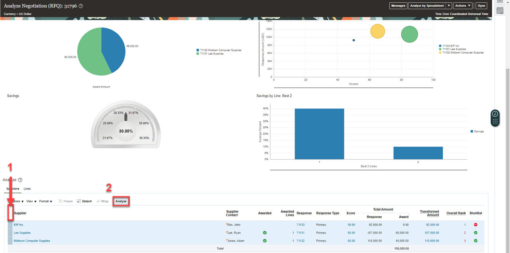

7. 

  Additional built-in analytics provide further insights about savings and response scores.  
  As you scroll down you see a summary of response elements.  
  To drill deeper and find out specifically why EIP was not awarded, we can evaluate the response details.  
  To do this:

    > Select the **Actions** drop-down and click “**Add or Remove Response Elements**”
  
    > Next, highlight “**Requirements: All Levels**” and click the single **right arrow icon**
  
    > Click OK

    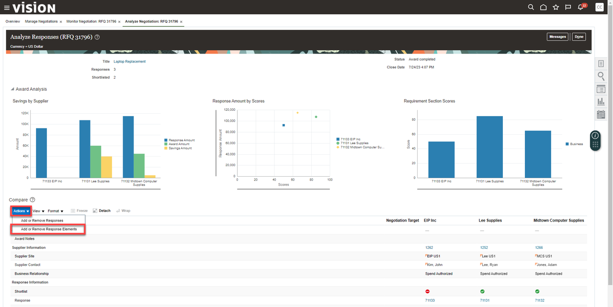

    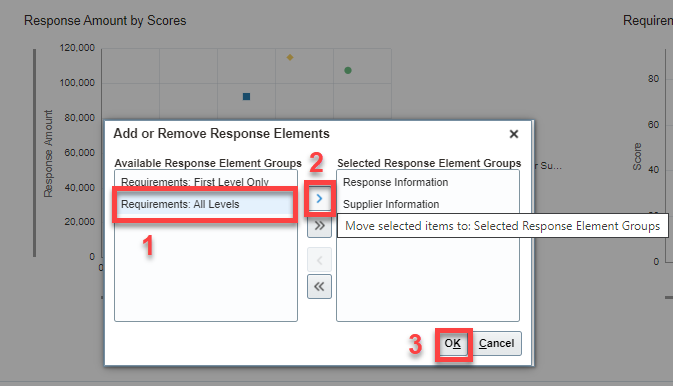

8. 

  Now we can see how the Procurement system AI has automatically disqualified EIP because they are missing a required certification. 
     
    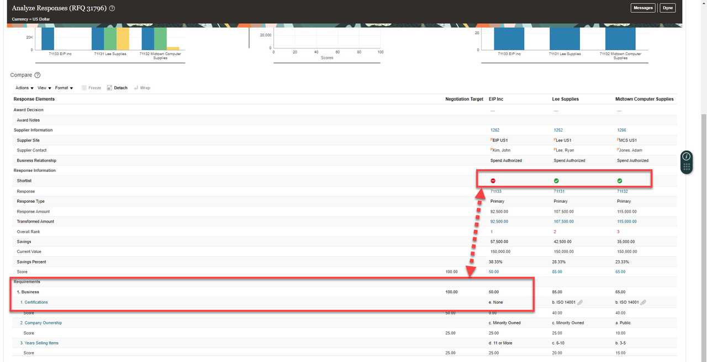

9. 

  Select the ‘Home’ icon in the top ribbon to navigate back to the Procurement springboard
     
    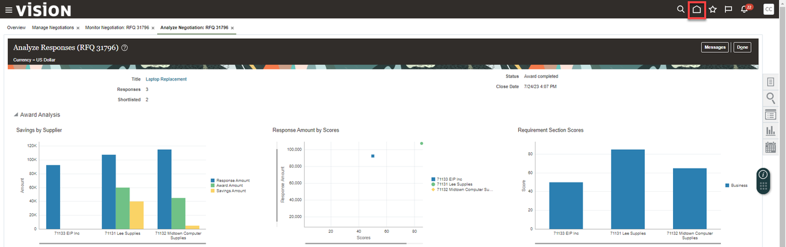

10. 
    
  Adventure awaits, show what you know, and rise to the top of the leader board!!!

    

## Task 2: Strategic Procurement – Self-Service Procurement

1. 

  You have recently been given approval to work remotely and need to requisition a new printer and ink. This is a simple tasks with Self Service Procurement.

    > Go to **Procurement**, then click **‘Purchase Requisitions’**

    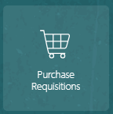

2. 

  The catalog shopping experience has intuitive search capabilities built in. Due to this you can search for pre-approved printer options quickly.

    > Click on the Search Bar and search for **‘printer’**

    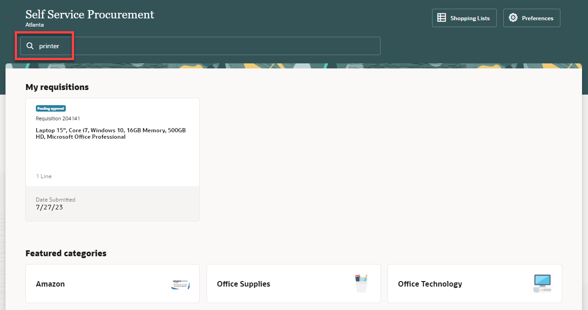

3. 

  The catalog will populate all the pre-approved printer options but you just need something simple and quick.

    > Scroll down and find **HP OfficeJet Pro 8210** wireless printer.  **Click** to see more details for this printer.  

    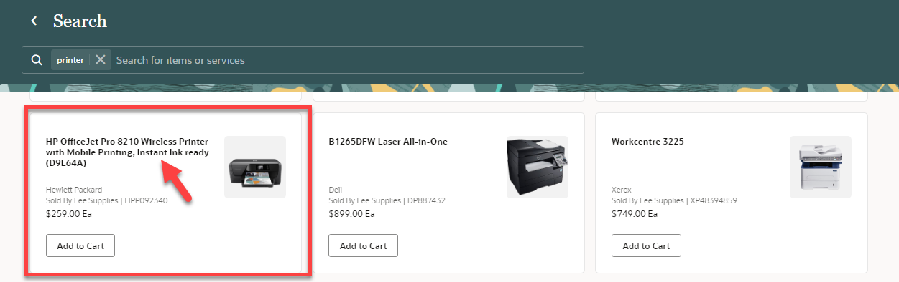

4. 

  Here you can review details and compare to other printers.  For now, this one meets our needs, so we’ll add to cart.  

    > Click ‘**Add to Cart**’ and then click **View Cart** (if the banner message closes, select **Cart** at bottom of page)

    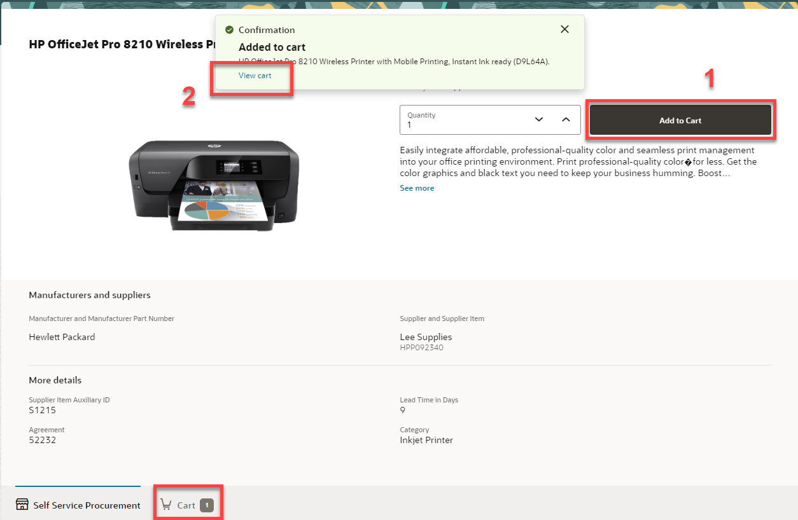

5. 

  As you review your Cart, you realize, you need ink!  So let’s go shop for printer ink.

      > Click the ‘**Self Service Procurement**’ to return to homepage

    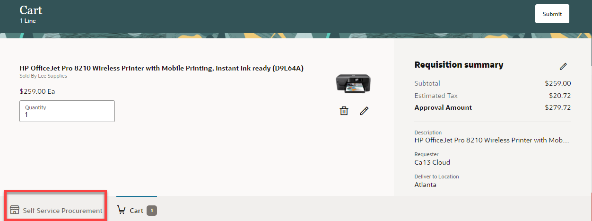

6. 

  The  Self Service Procurement homepage, allows you to easily punch-out to other vendors by selecting conveniently located icons.

    > Select the ‘**Amazon Business**’ link to punch out to Amazon’s website

    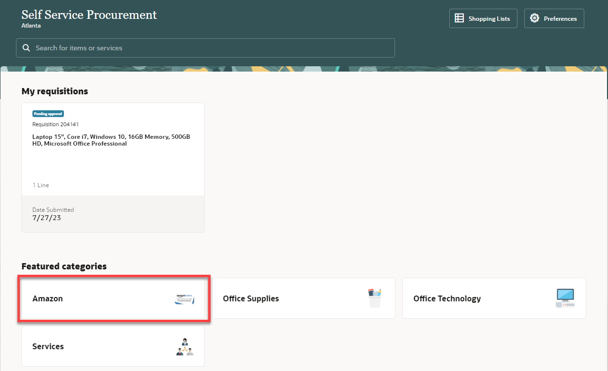

7. 

  For added security, the Amazon punch out will ask you for your username (e.g. Ca01, Ca02, Ca03…etc) in order to access Amazon Business.

    > Enter your individual Cloud Adventure username and select ‘**Start Shopping**’

    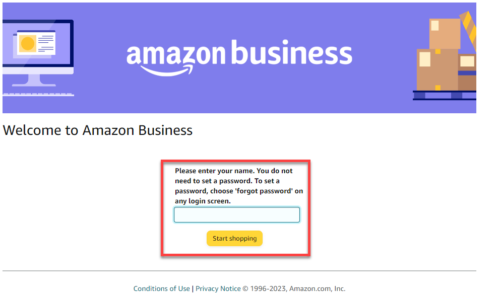

8. 

  Once you have punched out to Amazon Business you can utilize the Amazon portal to search for what you need and compare products.

    > Search for ‘**HP 64 color instant ink**’ Press ‘**Enter**’

    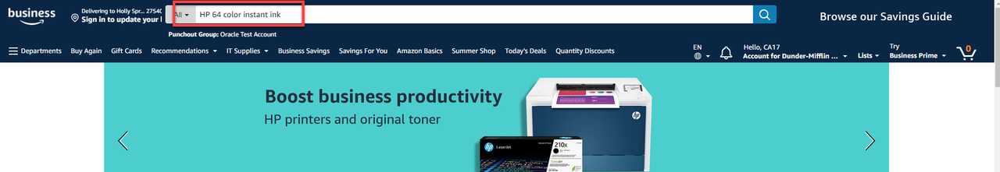

9. 

      > Next, select: ‘**Original HP 64XL Tri-color High-yield Ink Cartridges**’

    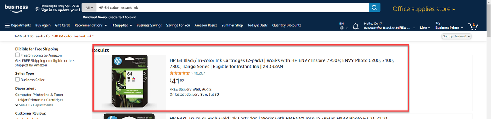

10. 

  Amazon will give you all the product details as well as pricing and potential savings.  

    > Click ‘**Add to Cart**’

    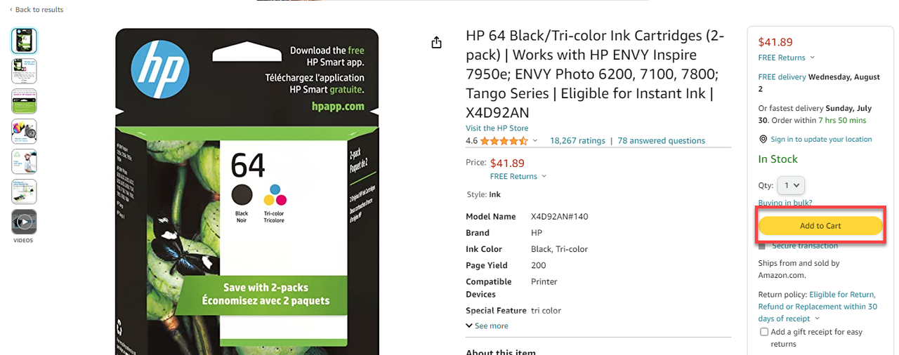

11. 

  Similar to catalog shopping you can continue to shop and add more items to the cart or submit this item for approval.
  
    > Click the ‘**Submit these items for approval**’

    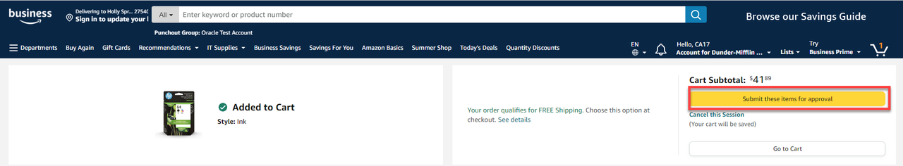

12.  

  As you can see Self Service Procurement has empowered you to catalog shop and punch out to another vendor seamlessly. The items from both activities have been added to the *same* requisition. 

    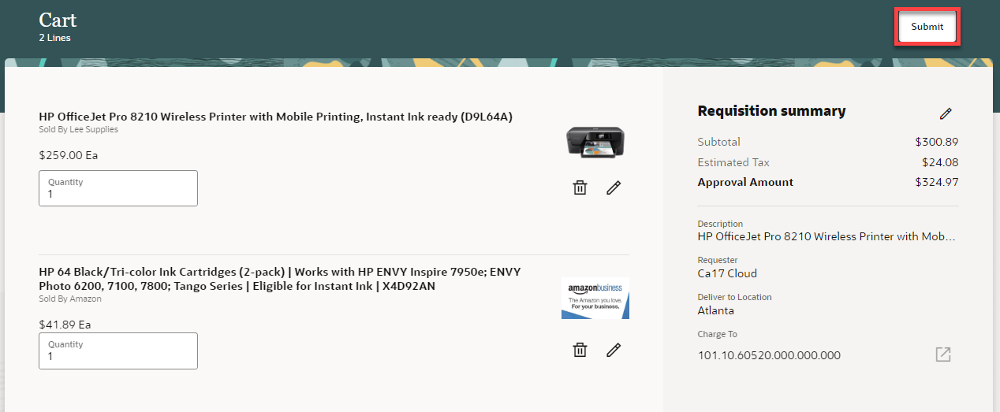
    

13. 

  Adventure awaits, show what you know, and rise to the top of the leader board!!!

      

# Acknowledgements
* **Author** - Michael Gobbo, Distinguished Sales Consultant, ERP Services
* **Contributors** -  Steve Quinton, Team Lead – Risk Solutions 
* **Last Updated By/Date** - Kevin Lazarz, August 2023
