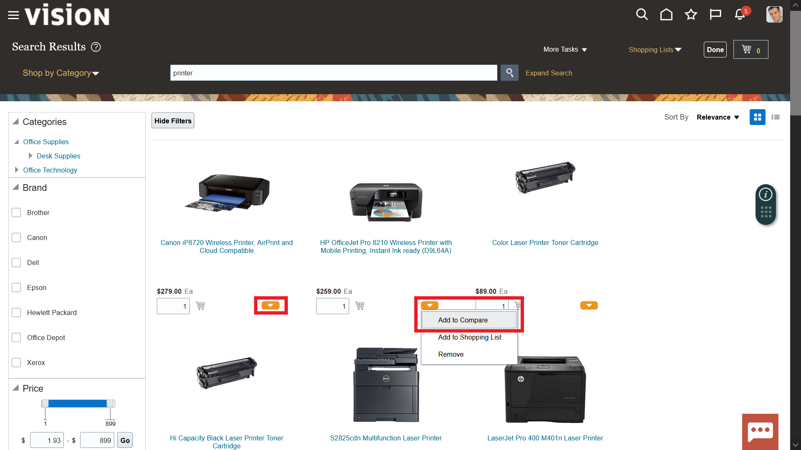
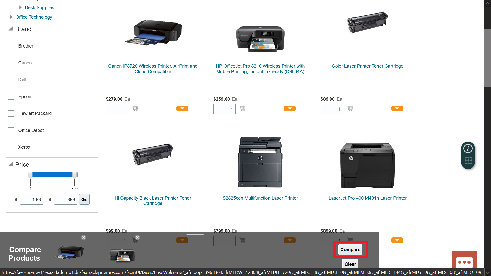
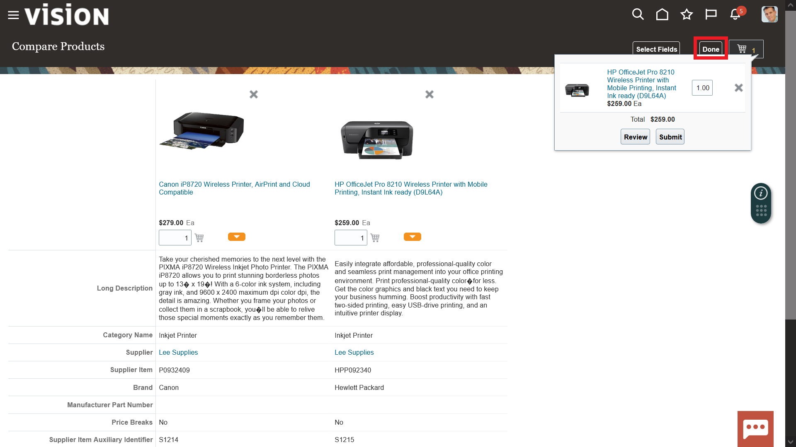
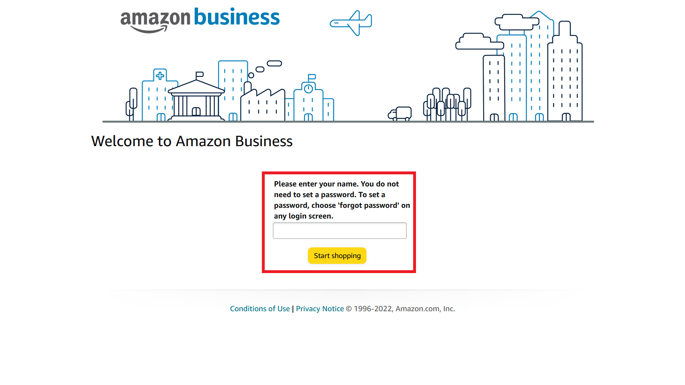
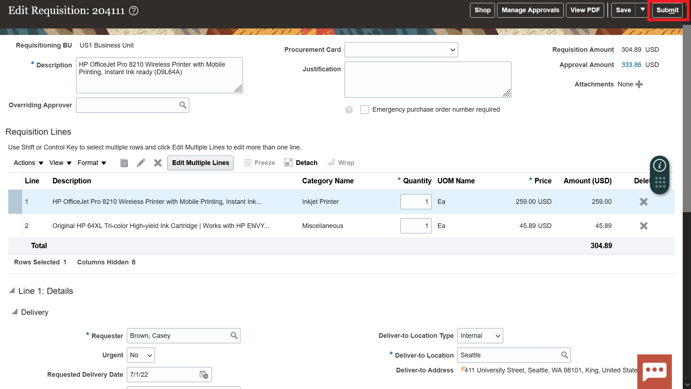
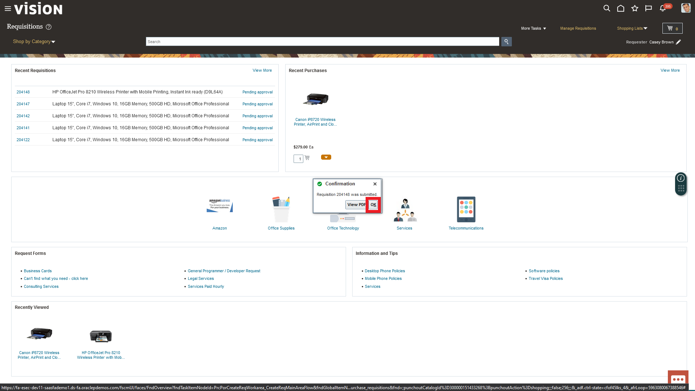
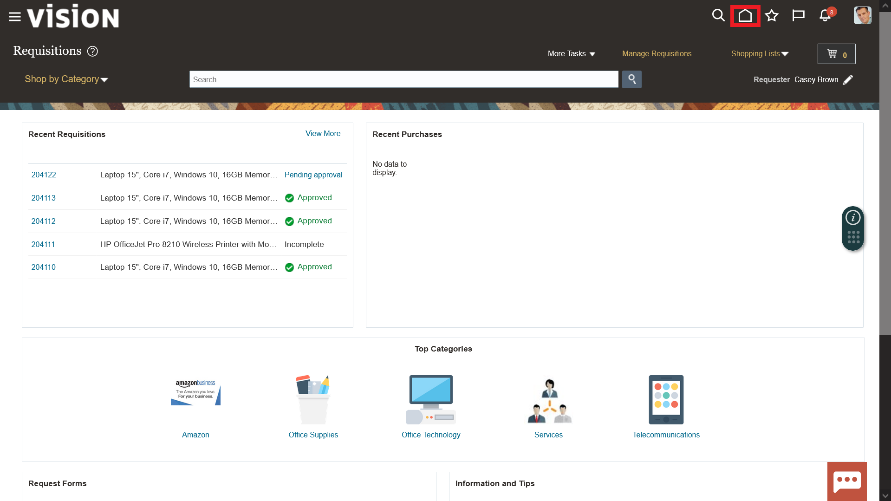

# # Predictive

## Introduction

*In this activity you'll discover how easy it is to buy indirect items through an easy to use shopping cart experience and how to effectively negotiate contracts.

Estimated Time: 5 minutes

### Objectives

*List objectives for this lab using the format below*

In this activity, you will:
* Purchase business related supplies through self-service and negotiate contracts with key suppliers 

## Task 1: Strategic Procurement – Self-Service Procurement

1. 

  You have recently been given approval to work remotely and need to requisition a new printer and ink. To do this you will need to utilize Self Service Procurement.

    > Go to **Procurement**, then click **‘Purchase Requisitions’**

    

2. 

  The catalog shopping experience has intuitive search capabilities built in. Due to this you can search for pre-approved printer options quickly.

    > Click on the Search Bar and search for **‘printer’**

    

3. 

  The catalog will populate all the pre-approved printer options but you just need something simple and quick.

    > **Click each orange drop box** and click **‘add to compare’** for each printer to create a comparison

    

4. 

  You are going to do a detailed comparison of the **Canon iP8720** and **HP Officejet Pro 8210** wireless printers.

    > At the bottom of the screen under **‘Compare Products’** ribbon click **Compare**

    

5. 

  As you look through the comprehensive details of both options, you decide that since they are essentially the same printer you will opt for the cheaper option (HP) 

  If neither of these options would have worked you could always remove/add more options for comparison..

    > Click the **‘Cart’** icon to add the desired printer to your cart

    

6. 

  Navigate back to the catalog after adding the **HP OfficeJet Pro 8210** to the cart. 

  When you navigate back to the catalog you can continue to shop and add items to this requisition.

    > Select the **‘Done’** button in the top ribbon

    

7. 

  Next, you will see how simple it is to punch out to another vendor and add to the same requisition.

  First, you need to go back to the homepage.

    > Under **‘Compare Products’** ribbon select **Clear**
    > Then,
    > In the top ribbon select **Done** once more

    

8. 

  Once you have cleared the Compare Products ribbon you will be taken back to the requisition’s homepage. The consolidated dashboard allows you to easily punch-out to other vendors by selecting conveniently located icons.

    > Select the **‘Amazon Business’** link to punch out to Amazon’s website

    

9. 

  For added security, the Amazon punch out will ask you for your username (e.g. CA01.CLOUD, CA02.CLOUD…etc) in order to access Amazon Business.

    > Enter your individual Cloud Adventure username and select **‘Start Shopping’**

    

10. 

  Once you have punched out to Amazon Business you can utilize the entire Amazon UI to search for what you need and compare products.

    > Search for **‘HP 64 color instant ink’**

    > Press **‘Enter’**

    

11. 

  
    > Next, select:
    
    > **‘Original HP 64XL Tri-color High-yield Ink Cartridges’**

    

12. 

  Amazon will give you all the product details as well as pricing and potential savings. 

  Notice the buy more save more option!

  Once you have determined this is the ink you would like to buy add it to your cart.

    > Click **‘Add to Cart’**

    

13. 

  Similar to catalog shopping you can continue to shop and add more items to the cart.

  For now, all you need is ink to get your home office started. Submit this item for approval.

    > Click the **‘Submit these items for approval’**

    
    

14. 

  As you can see Self Service Procurement has empowered you to catalog shop and punch out to another vendor seamlessly. The items from both activities have been added to the same requisition. To submit this order so it can go through the correct approval workflows all you have to do is select submit.

    > Review the requisition document

    > Click **‘Submit’**

    > A confirmation box will appear click **‘OK’**

    
    

15. 

  
    > Select the **‘Home’** icon in the top ribbon to navigate back to the Procurement springboard

    
    

## Task 2: Strategic Procurement – Negotiations (Sourcing)

1. 

  You need to figure out why the Automatic Award Recommendation has elected not to award EIP Inc. this negotiation. You will need to go to the negotiations page.

    > Navigate to the **Procurement** tab and select **Negotiations**

    

2. 

  This is the negotiations dashboard has Infolets with insights into sourcing programs and activity. This information is drillable to give the user and intuitive experience. You need to drill into Award Completed to analyze the recent sourcing negotiation.

    > In the **‘My Negotiations’** Infolet select the **‘Award Completed’** piece of the pie chart (Purple)

    

3. 

  You could drill into the negotiation details by clicking the hyperlink. However, you need to analyze the individual supplier responses, so you need to click the monitor icon.

    > Click the **‘Monitor’** icon for Negotiation **31792**

    

4. 

  Here is the initial monitor page. There is some analytical information available at the top of the page. This includes the current value, potential savings, and supplier response amounts.

  At the bottom of the page are the suppliers. Four were invited, and three responded. You can see the details to the right. Once again you will notice EIP was ranked first but still wasn’t awarded so you have to dive deeper.

    > Select **Actions** drop down in the top ribbon

    
    

5. 

   In order to see more information about this negotiation you need to utilize the analytical tools available through Cloud Procurement. To do this, select analyze negotiation from the menu options.

    > First, click **Analyze**

    > Then, select **Analyze Negotiation** from the drop-down menu

    

6. 

  Here are more analytics built into the sourcing process. The analysis breaks down the awards by supplier, total savings, and savings by line item.

  At the bottom of the page are supplier response details. These details still don’t tell the full story. You need to analyze the response details further to see why EIP Inc wasn’t awarded this negotiation despite the highest savings potential.

    
    

7. 

     > To highlight all the supplier responses, click the **white space next to ‘Supplier’** as indicated.

     > Once they are all highlighted in blue, click **Analyze**
   
    
    

8. 

  Once, the analysis has been run there will be more analytics provided at the top of the page. As you scroll down you will see comprehensive response details for each supplier including the requirement scoring. You will notice that EIP is missing a required certification and therefore they have not been awarded part of this negotiation. In order to ensure this doesn’t happen again or if you wish to let them re-bid this sourcing negotiation your team must communicate the need for this certification.
    
    
    

9. 

    > Select the **‘Home’** icon in the top ribbon to navigate back to the Procurement springboard
     
    
    

# Acknowledgements
* **Author** - Michael Gobbo, Distinguished Sales Consultant, ERP Services
* **Contributors** -  Harold Dickerman, Business Architect
* **Last Updated By/Date** - Kevin Lazarz, September 2022
