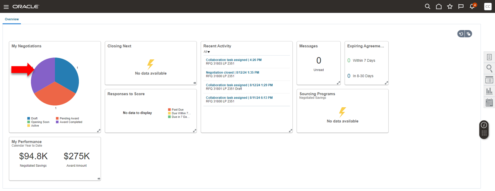
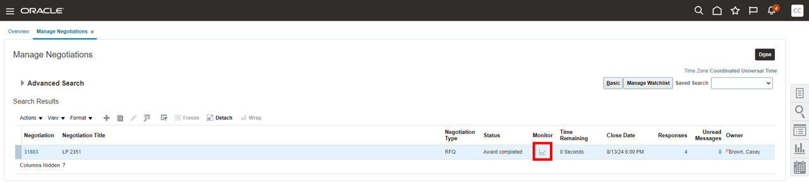
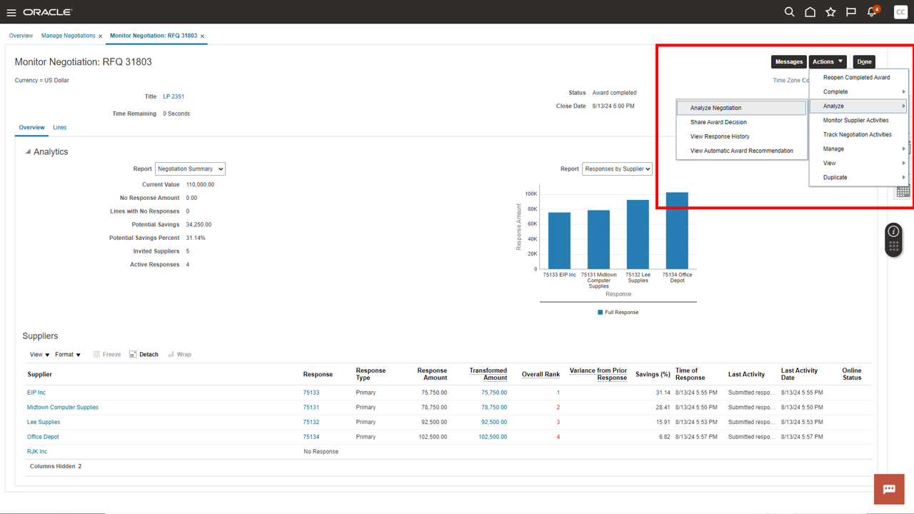
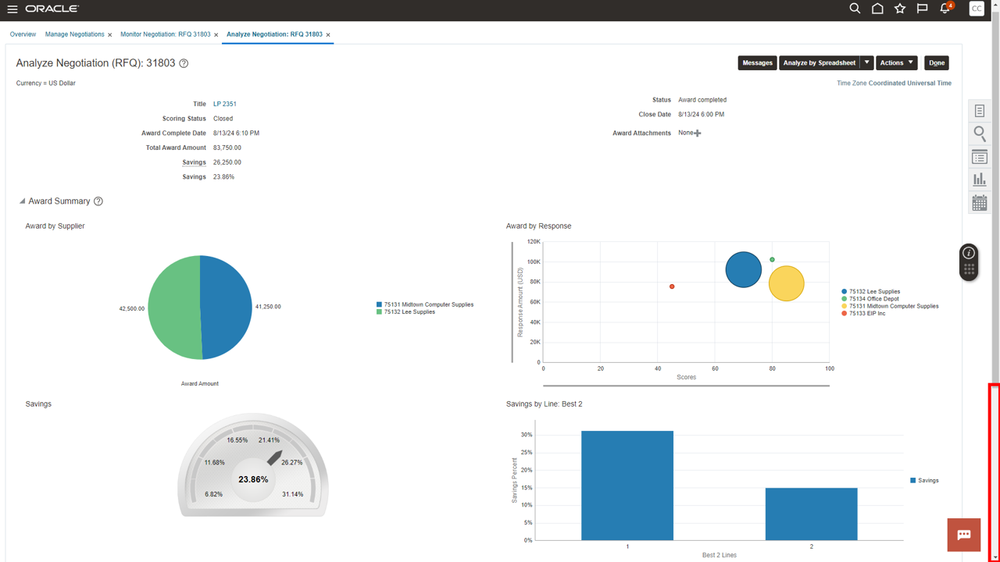
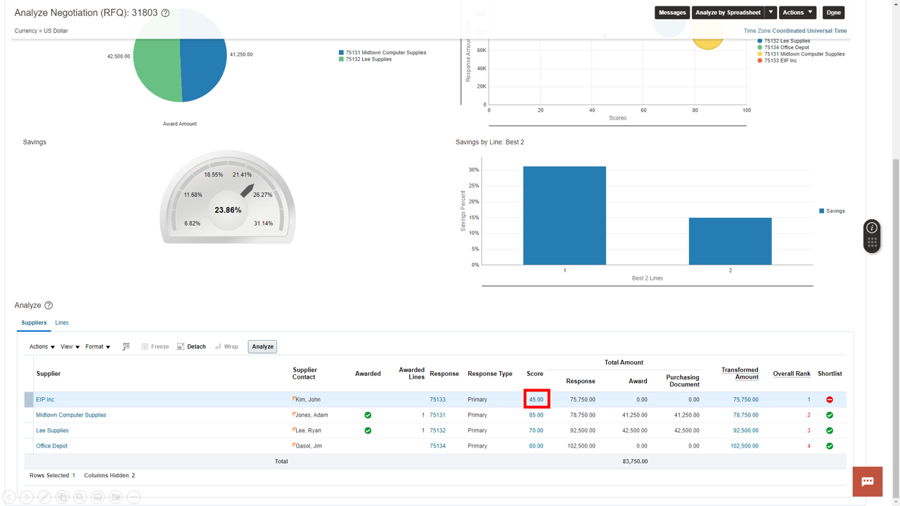
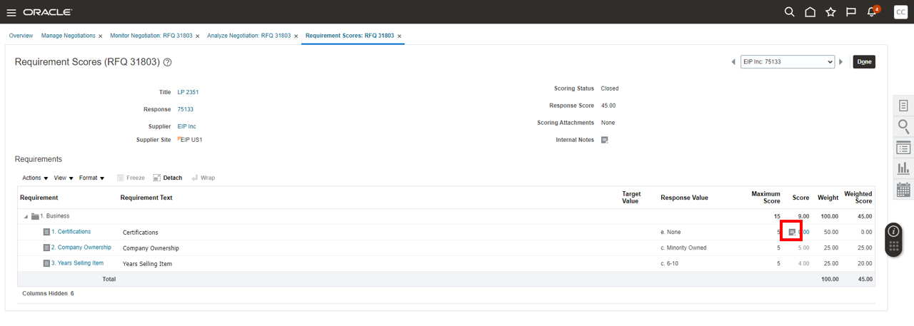
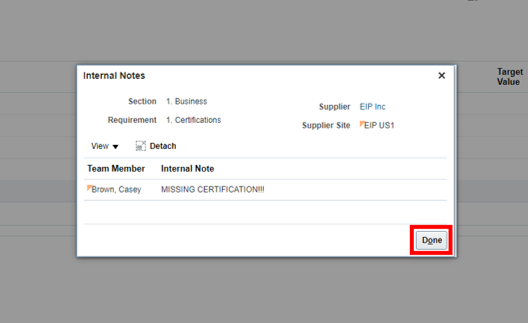
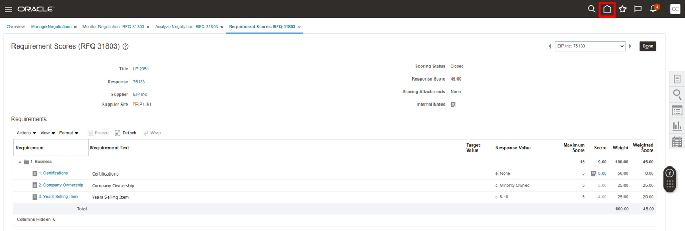
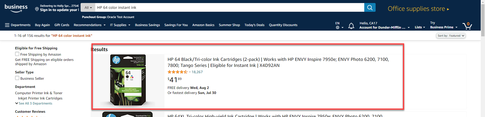
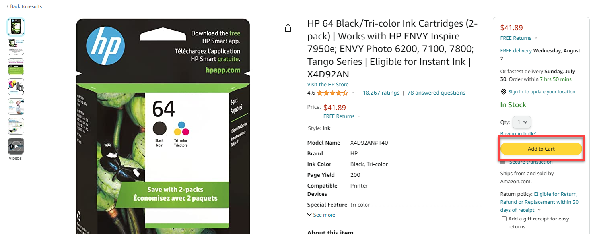

# Procurement

## Introduction

In this activity you'll discover how easy it is to buy indirect items through an easy to use shopping cart experience and how to effectively negotiate contracts.

Estimated Time: 5 minutes

### Objectives

In this activity, you will:
* Purchase business related supplies through self-service and negotiate contracts with key suppliers 

## Task 1: Strategic Procurement – Negotiations (Sourcing)

1. 

  You need to figure out why the Automatic Award Recommendation has elected not to award EIP Inc. this negotiation. You will need to go to the negotiations page.

    > Navigate to the **Procurement** tab and select **Negotiations**.

    

2. 

  This is the negotiations dashboard that has Infolets with insights into sourcing programs and activity. This information is drillable to give the user an intuitive experience. You need to drill into Award Completed to analyze the recent sourcing negotiation.

    > In the **‘My Negotiations’** Infolet select the **‘Award Completed’** piece of the pie chart (Purple).

    

3. 

  You could drill into the negotiation details by clicking the hyperlink. However, you need to analyze the individual supplier responses, so you need to click the monitor icon.

    > Click the **‘Monitor’** icon for Negotiation **31803**.

    

4. 

  Here is the initial monitor page with analytical information about responses.  
  Notice EIP was ranked first, but wasn’t awarded.  Let’s dive deeper to find why.  
  We can use the analytical tools available through Cloud Procurement to analyze further.
  
    > Select **Actions** drop-down menu, then click **Analyze**, select **Analyze Negotiation** from the drop-down menu.
    
      

5. 

  With analytics built into the sourcing process, we see awards details, savings analysis, and supplier response information. 

    > Click **Scroll-bar** down to bottom of page.

    

6. 

    Notice EIP is ranked first, but has lowest score.  

     > Click the **score ‘45’** to access EIP’s response details.
   
    

7. 

  Now we see how the Procurement system AI scored a zero and automatically disqualified EIP because they are missing a required certification which was set as pre-built knockout criteria.

    > Click the **attachment icon** to access the internal note left by the evaluator.

    

    > Click **Done**.

    

8. 

  Congratulations!  You’ve completed this part of the Adventure!

    > Click the **‘Home’** Icon to return to Procurement springboard.

    

9. 
    
  Adventure awaits, show what you know, and rise to the top of the leader board!!!

    

    [Click here](https://apex.oracle.com/pls/apex/f?p=159406:10:) 

## Task 2: Strategic Procurement – Self-Service Procurement

1. 

  You have recently been given approval to work remotely and need to requisition a new printer and ink. This is a simple tasks with Self Service Procurement.

    > Go to **Procurement**, then click **‘Purchase Requisitions’**

    

2. 

  The catalog shopping experience has intuitive search capabilities built in. Due to this you can search for pre-approved printer options quickly.

    > Click on the Search Bar and search for **‘printer’**

    

3. 

  The catalog will populate all the pre-approved printer options but you just need something simple and quick.

    > Scroll down and find **HP OfficeJet Pro 8210** wireless printer.  **Click** to see more details for this printer.  

    

4. 

  Here you can review details and compare to other printers.  For now, this one meets our needs, so we’ll add to cart.  

    > Click ‘**Add to Cart**’ and then click **View Cart** (if the banner message closes, select **Cart** at bottom of page)

    

5. 

  As you review your Cart, you realize, you need ink!  So let’s go shop for printer ink.

      > Click the ‘**Self Service Procurement**’ to return to homepage

    

6. 

  The  Self Service Procurement homepage, allows you to easily punch-out to other vendors by selecting conveniently located icons.

    > Select the ‘**Amazon Business**’ link to punch out to Amazon’s website

    

7. 

  For added security, the Amazon punch out will ask you for your username (e.g. Ca01, Ca02, Ca03…etc) in order to access Amazon Business.

    > Enter your individual Cloud Adventure username and select ‘**Start Shopping**’

    

8. 

  Once you have punched out to Amazon Business you can utilize the Amazon portal to search for what you need and compare products.

    > Search for ‘**HP 64 color instant ink**’ Press ‘**Enter**’

    

9. 

      > Next, select: ‘**Original HP 64XL Tri-color High-yield Ink Cartridges**’

    

10. 

  Amazon will give you all the product details as well as pricing and potential savings.  

    > Click ‘**Add to Cart**’

    

11. 

  Similar to catalog shopping you can continue to shop and add more items to the cart or submit this item for approval.
  
    > Click the ‘**Submit these items for approval**’

    

12.  

  As you can see Self Service Procurement has empowered you to catalog shop and punch out to another vendor seamlessly. The items from both activities have been added to the *same* requisition. 

    
    

13. 

  Adventure awaits, show what you know, and rise to the top of the leader board!!!

      

      [Click here](https://apex.oracle.com/pls/apex/f?p=159406:10:) 

# Acknowledgements
* **Author** - Michael Gobbo, Distinguished Sales Consultant, ERP Services
* **Contributors** -  Steve Quinton, Team Lead – Risk Solutions 
* **Last Updated By/Date** - Ramona Magadan, Technical Program Manager, Database Product Management, August 2024
