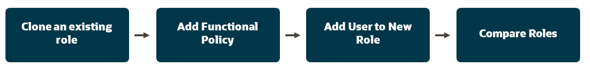

# Security

<!-- rem ## Path 1: Assign AI Privileges -->
## **Assign AI Privileges**

### **Introduction**

  Welcome to Oracle’s Cloud Adventure for Security Administration.  This is a fresh and unique way to offer you a chance for hands-on experience of highly differentiated and specifically curated content of numerous vignettes that are typically encountered in accounting and finance. We hope you will enjoy today’s adventure exploring a complete and unified solution for the office of the CIO.

### **Objectives**

  During this adventure, you will perform a time sensitive task of granting permissions to a user.

  Estimated Time: 15 minutes

  Do not forget to answer the Adventure Check Point questions at the end of the exercise!

### **Begin Exercise**

1. During this adventure, you will perform a time sensitive task of granting permissions to a user.  These are the steps you will perform:

  

     > At this point, you should be logged into your environment with a username CIO.xx where xx is a two number code assigned to your laptop.

2. Oracle Cloud Applications are delivered with a complete set of roles which control access to application functions and data.

    > To add a new privilege to a user, you will need to first copy an existing role. 
    > This is the Springboard where you’ll access all features.

   

3. Accessing Security Console

    > 1. Select the **Tools** tab menu.  

    > 2. Select **Security Console**.

    

4. You’ll be working from this single console for most of the examples today.  By default, you are viewing the Roles tab of the console.

    > Security Console - Roles.

    

5. Notice how the search is dynamic and offers available options as you type.

    > (1) In the search field provided at the top, type: **Adventure**.  

    > (2) Then **click** on the **Adventure Accounts Payable Manager** job role.

    

6. You can now see a list of the roles which are granted to a user when they are provided with the Accounts Payable Manager.

    > (1) Notice that the table may be exported to Microsoft Excel using the button provided at the top right.  

    > (2) (Nothing to perform here)

    

7. Always make changes to a copied role to ensure that your custom configurations are preserved on updates.

    > (1) Tasks associated with the role are available from this pull-down menu.  
    > (2) Select **Copy Role**.

    `

8. Now you'll execute the copy role.

    > (1) Select **Copy top role**.  

    > (2) Press the **Copy Role** button.

    

9. Notice that you are provided with a list of ordered steps at the top.  For this example, we will only provide answers to steps 1, 2 and 7.

  We start by giving our copied role a unique name.

    > (1) Add **your initials and xx Code** to the name of the **role name** and **role code** as shown.  

    > This will keep your version separate from the other participants, and it will help you find the new role later in this Cloud Journey.  

    > (2) Press the **Next** button.

    

10. Using Function Security Policy, you will add the privileges Brian Bell needs

    > (1) Press the **Add + Function Security Policy** button.

    

11. You will now find the required policy using the search form.

    > (1) Type **Cancel Supplier Negotiation** in the search field and select the policy.

    

12. You can now add the selected privilege to the role

    > (1) Press the **Add Privilege to Role** button.

    

13. Note that the search window did not automatically dismiss.  This is done so you can continue to add more policies in this process.

    > (1) Press the **Cancel** button to continue.

    

14. The new policy has been added.

    You will skip the next three items in the numbered guided track until you arrive at ‘Users (7)’ in the Copy Role process.

    > (1) Press the **7 (Users)** task at the top of the screen.

    

15. Using a similar search tool, you will now search for Brian Bell and provide him with this new role and its associated privileges.

    > (1) Press the **Add User** button.

  

16. Now you can add Brian Bell as a user of this role.

    > (1) Type **Brian.Bell** in the search form then **Select** his name when found.  

    > Be sure to include the **‘.’** between the first and last name.

  

17. You can finish the Add User to Role step now. 

    > (1) Press the **Add User to Role** button.

  

18. Again, the search box remains in case you want to add additional users.

    > (2) Press the **Cancel** button.

  

19. Brian Bell has been added to this new role, so you can move to the next step.

    > (1) Press the **Next** button.

  

20. This screen shows a summary of your changes.

    > (1) Note confirmation that we have added one Security Policy and one user  
    > (2) Press the **Submit and Close** button.

  

21. You'll now receive a pop-up message that you changes are complete.

  Success!

    > (1) Press the **OK** button.

  

22. Next, you'll use the Compare Roles feature, where you can quickly identify the changes you’ve made compared to the out of the box roles provided by Oracle or other custom roles.

    > (1) From the Security Console, press the **Compare Roles button**.

    

23. You will need to enter the name of your new role

    > (1) Press the **Search**  icon for the First Role

    

24.  > (1) Type in your **three initials and XX Code** which you used to name your custom role.

   

25.  > **Select** your custom role

   

26.  > Press the **OK** button.

 

27. Now you will repeat these steps for the original role

    > (1) Press the **Search** icon for the Second Role

   

28. > (1) In the search field type **Adventure**.  

    > (2) **Select** the first entry.

    

29. > (1) Press the **OK** button.

    

30. > (1) Press the **Compare** button.

 

31. Immediately you see that Cancel Supplier Negotiation has been added to the first role and does not exist in the second role.

 

32. Adventure awaits, click on the image, show what you know and rise to the top of the leader board!!!

    

<!--  ## Path 2: Request Access with Risk Management -->

### Summary

Security Console is used to quickly manage user access to the entire Fusion applications suite.

**You have successfully completed the Activity!**

### Learn More

* [Oracle Supply Chain & Manufacturing - Secure](https://docs.oracle.com/en/cloud/saas/supply-chain-and-manufacturing/24d/secure.html)
* [Oracle Human Resources - Secure](https://docs.oracle.com/en/cloud/saas/human-resources/24b/secure.html)
* [Oracle Documentation](http://docs.oracle.com)

## Acknowledgements
* **Author** - Nate Weinsaft, Cloud Technologist, Advanced Technology Services
* **Contributors** -
* **Last Updated By/Date** - Nate Weinsaft, October 2025
