# Configure

## **HCM: Configure the Change Salary Experience**

### **Introduction**

Oracle offers hundreds of prebuilt pages, workflows and forms “out of the box” as part of the Oracle Fusion Cloud.  Many of our customers want to configure these pages and workflows to meet their specific business needs.  You can unify your experience in our applications by using Redwood.

Oracle Redwood is Oracle Fusion’s new design system that enhances the user experience through a visually stimulating, easy-to-use interface. By uniting customer-inspired design philosophies with industry-leading technology solutions, Oracle Redwood helps companies reduce costs, foster efficiency, revitalize the customer journey, and evolve continuously toward the future.

### **Objectives**

In this lab, you will use Redwood to quickly and efficiently improve the user experience in Oracle Fusion Cloud.

Estimated Time: 15 minutes

Do not forget to answer the Adventure Check Point questions at the end of the exercise!

### **Begin Exercise**

1. You will use Redwood, Oracle’s next-generation design system, and Visual Builder to quickly and efficiently update Change Salary Page for Non-HR managers.

    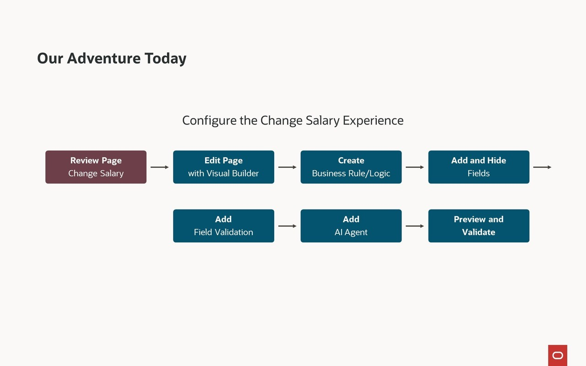

2. You will first navigate to the Change Salary Page.

    > (1) From the application home page, click on the **My Team** tab.

    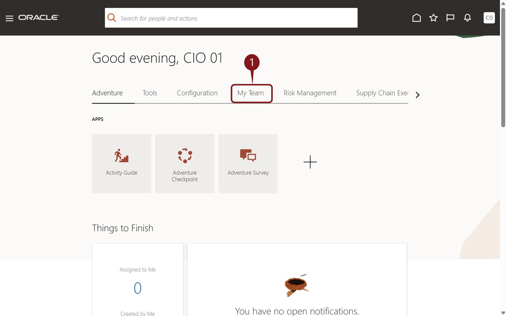.

3. You can access Change Salary from an individual worker record, from the search bar, or via the Quick Actions feature.  You'll use the Quick Actions feature.

    > (1) Click on **Change Salary** under **Quick Actions**.

    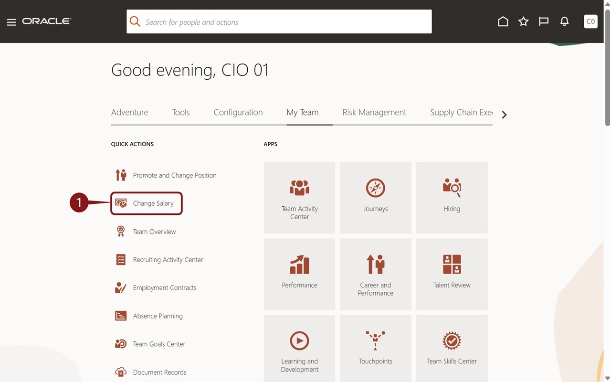

4. By default this screen shows information on any Direct Reports.  Since you don't have any, you can remove this filter.

    > (1) Click on the 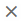  **Icon** to remove the Direct Reports Filter because your user does not have any direct reports.  This action allows you to see other people.

    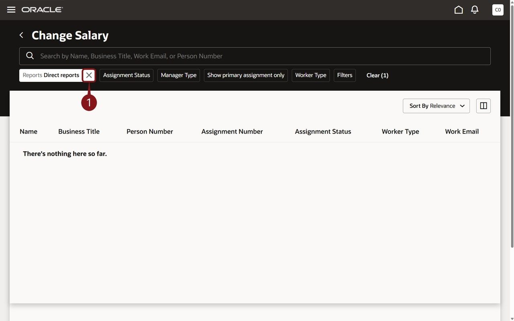

5.  Now you can search for and select a person to begin the Change Salary process.

    > (1) Type  keyword **Reed** OR **Barrett Reed** in the search field.  

    > (2) Select **Barrett Reed** in the drop down.  

    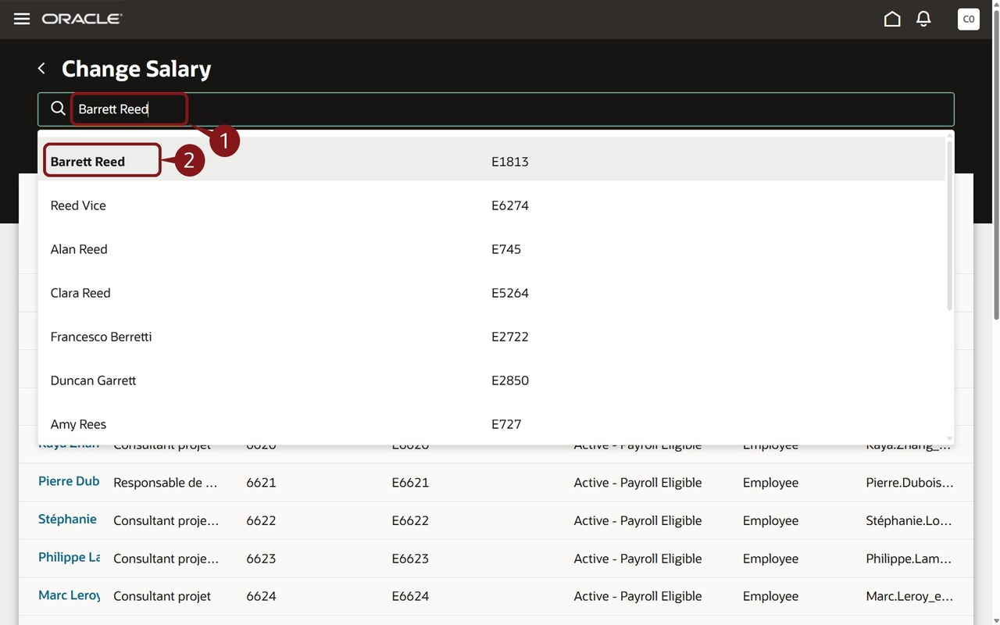

6.  You are now in the first step of the Change Salary process.  You're not going to make any changes to this step, so you'll need to enter the requested information before moving to step 2.  Enter the information as described below.

    > (1) When does the salary change start?: Type a **future date (eg. 12/31/26)**  

    > (2) What's the action name?: Select **Change Salary** from the dropdown.  

    > (3) Why are you changing the salary?: Select **Career Progression** from the dropdown.  

    > (4) Click **Continue**.

    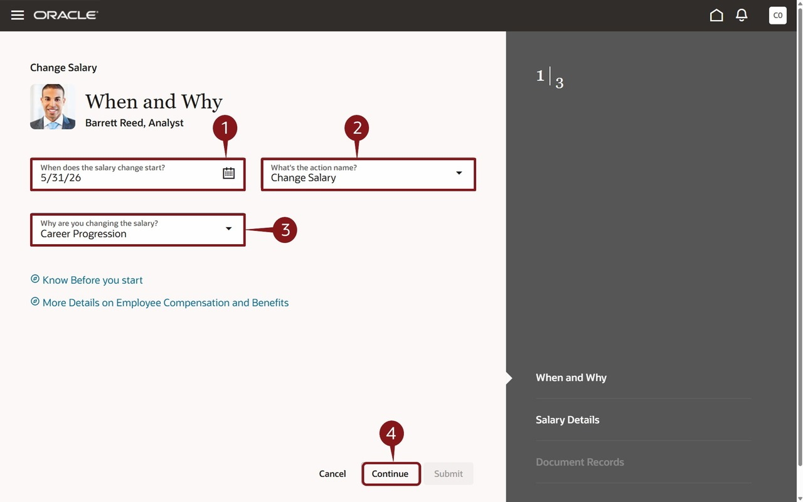

7. You're now on the Salary Details page and want to make some changes to the information that is displayed for Non-HR Manager users. You can do this by creating condition-based rules.  You will now create a new rule that hides Annualized Full-Time Salary and hide Compa-Ratio.  Your rule will also display the Action Reason.  We can make these configuration changes by leveraging the embedded Vision Studio Builder capabilities.

    > (1) No action is required for Step 1.  Just note that the Annualized Full-Time Salary and Compa-Ratio fields are visible.  
    > (2) Click the **logged in user icon** icon  next to the bell icon in the top right corner of the screen and select **Edit Page in Visual Builder Studio** from the resulting drop-down.

    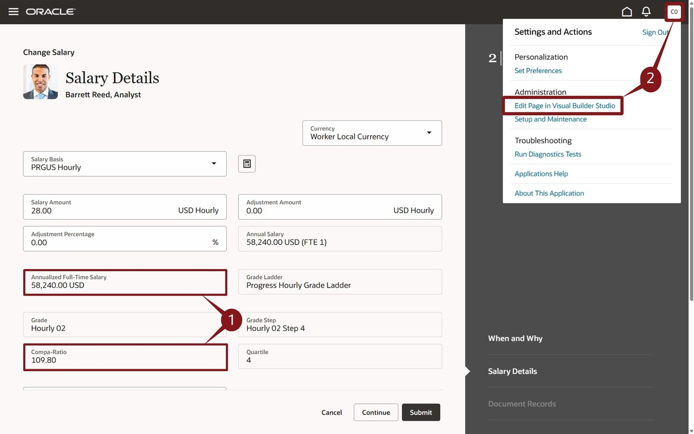

8.  Welcome to Oracle Visual Builder Studio (VB Studio), a robust application development platform that helps your team effectively plan and manage your work throughout all stages of the application development lifecycle: design, build, test, and deploy. You will use VB Studio to make the required changes to the Change Salary Form.

    > (1) Click on **Configure Fields and Regions** button.

    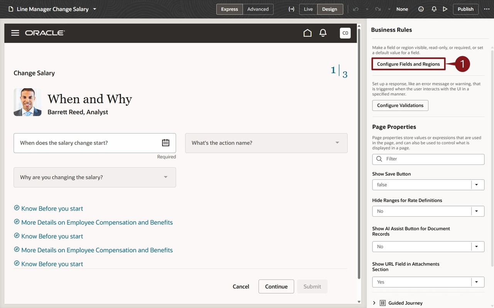

9. First you will create a new form rule.

    > (1) Click on the 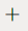  **Icon** next to **Form Rules**.

    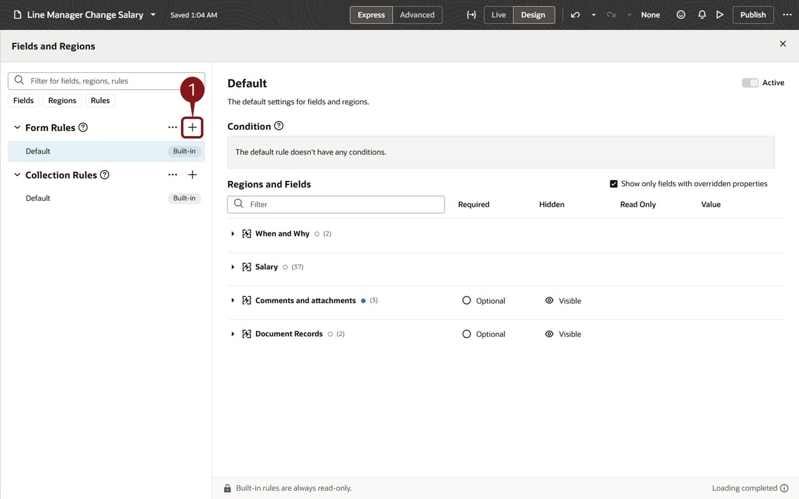

10. You can name your new rule and optionally include a description.

    > (1) Label: Type **Change Salary Non-HR**.  

    > (2) Click the **Create** button.

    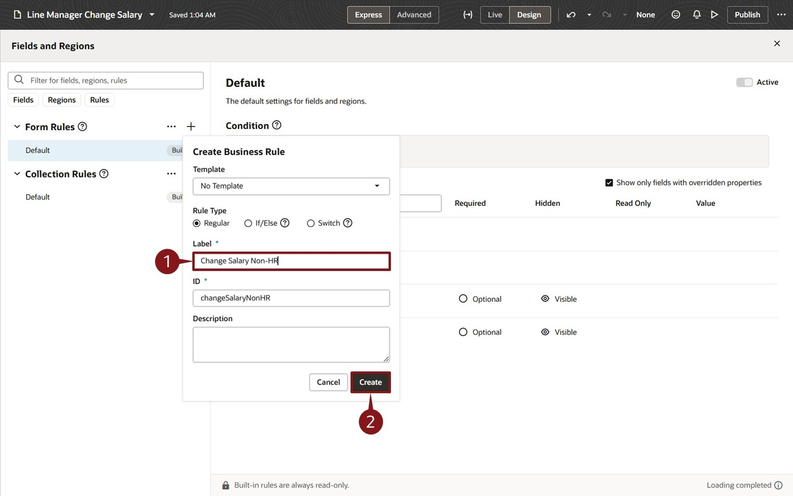

11. You will add the Conditions for this rule to apply to all non-HR personnel.

    > (1) Click on the **Edit button**.

    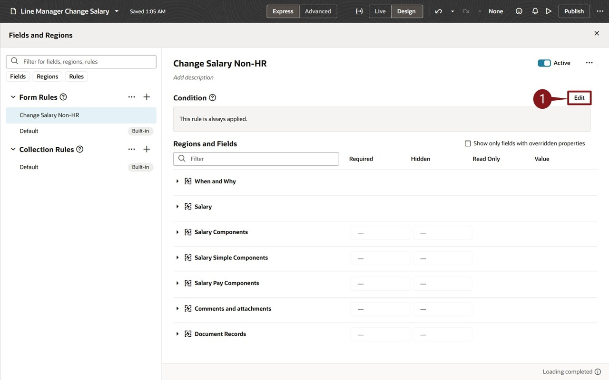

12. You can complete the additional fields in User Roles condition in the first line. This rule will display this version of the Change Salary Form to all people who are not assigned to the Human Resource Manager Role.

    > (1) For 2nd column in the **User Roles** row, select **does not contain** from the drop down.   

    > (2) For 3nd column in the **User Roles**, type **Human Resource Manager** and select the 1st instance of  **Human Resource Manager** from the resulting dropdown. 

    > (3) Click on the **Drop Down** 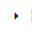  Icon to the left of **Salary** to expand the Salary section 

      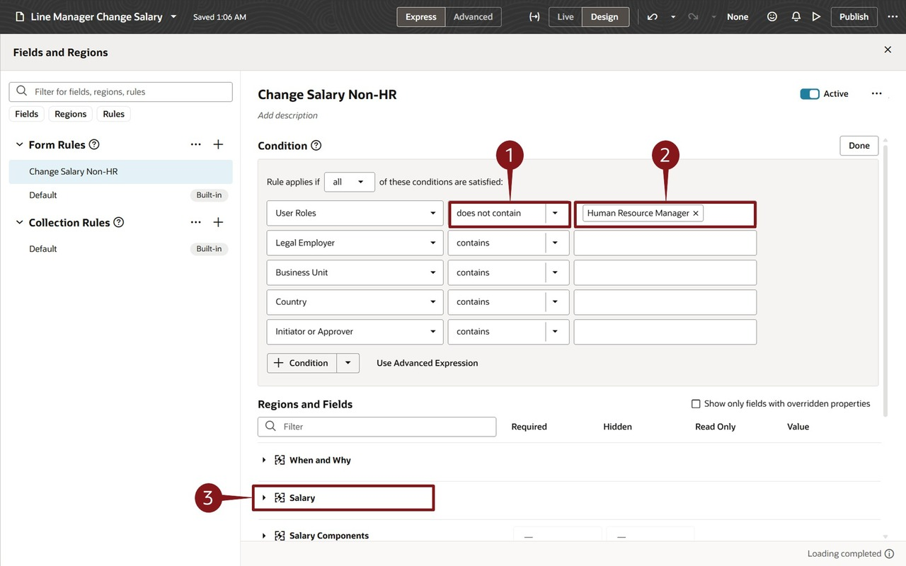

13.  Now you want to add and hide fields.  You do this by changing the value in the Hidden column for specific fields.  Make the selections as shown below.

     > (1) Action Reason: select **Visible** from the dropdown in the Hidden column.    

     > (2) Annualized Full-Time Salary: select **Hidden** from the dropdown in the Hidden column.    

     > (3) Compa-Ratio: select **Hidden** from the dropdown in the Hidden column.  

     > (4) Click the 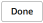 icon to complete the definition of this rule. 

     > (5) Click the  to close the Fields and Regions section. 

     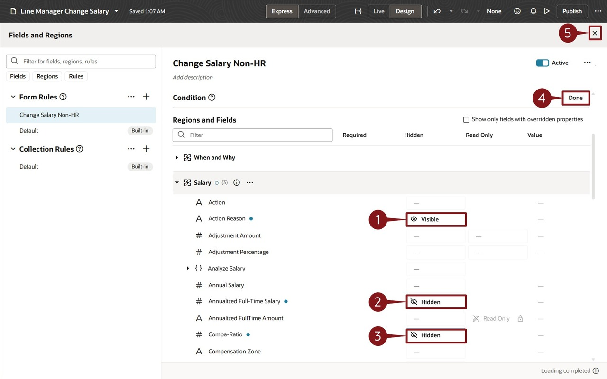

14. Now you will add a validation step for the Adjustment Percentage.  You want to prevent users from entering a  Salary Percentage Greater than 15%

    > (1) Click on the **Configure Validations** button.

    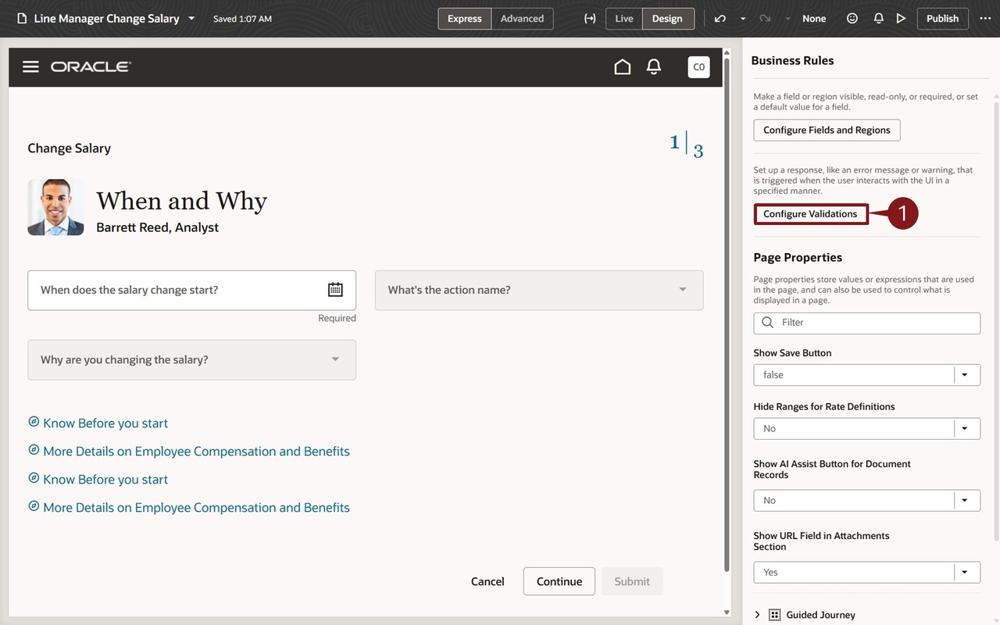

15. You can see any existing Validations and/or create new ones.

    > (1) Click the  icon to create a new Validation.

    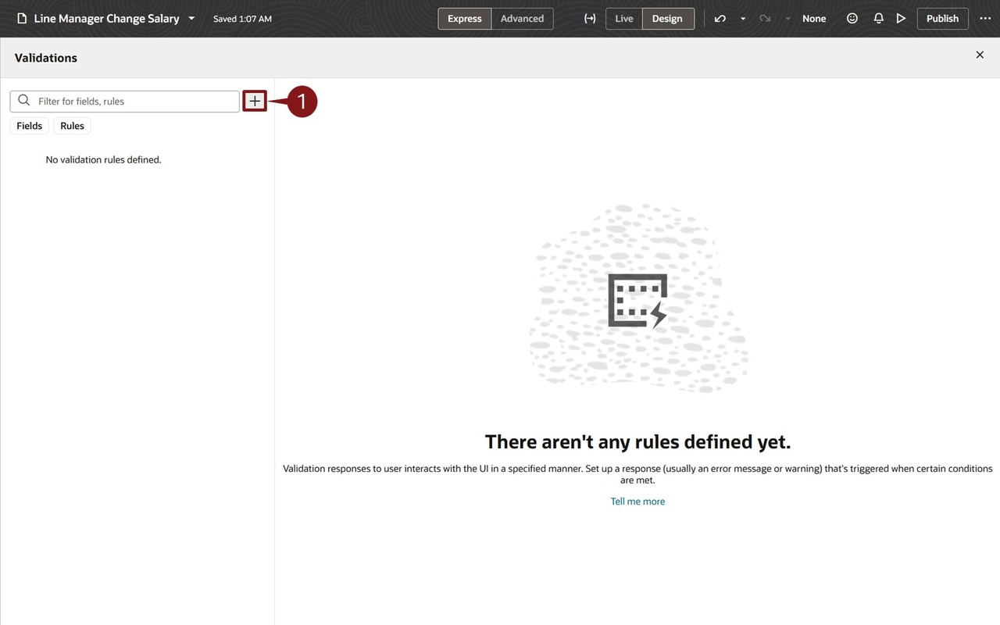

16. Your first step is to name your Validation.

    > (1) Label: type **Adjustment Percentage**.     

    > (2) Click the **Create** button.

    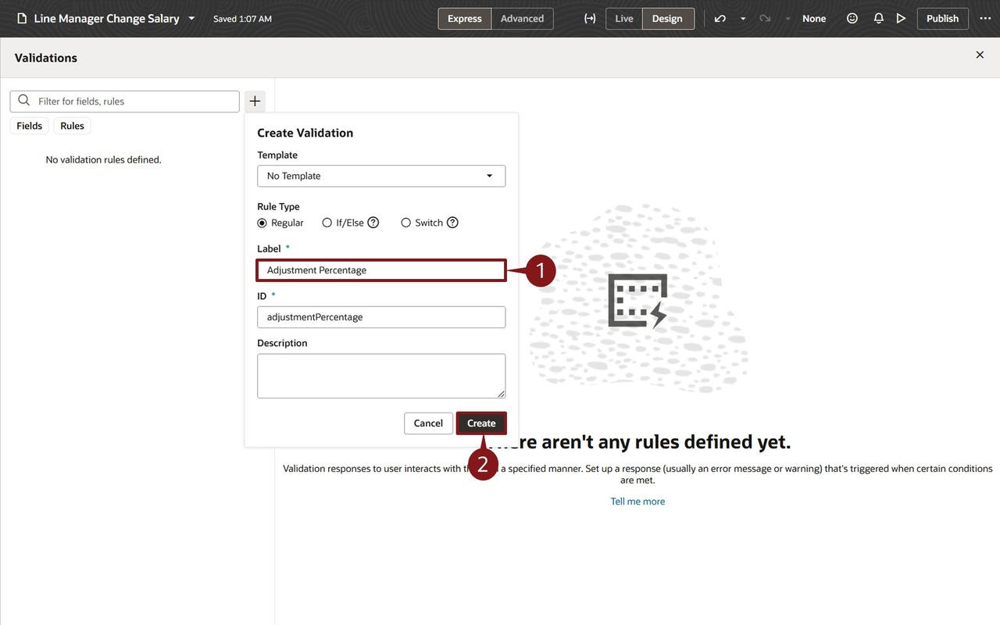

17.  Now you will set the conditions for this rule so that the form will not accept any adjustment percentage greater than 15%.

     > (1) Click on the **Edit** button.

     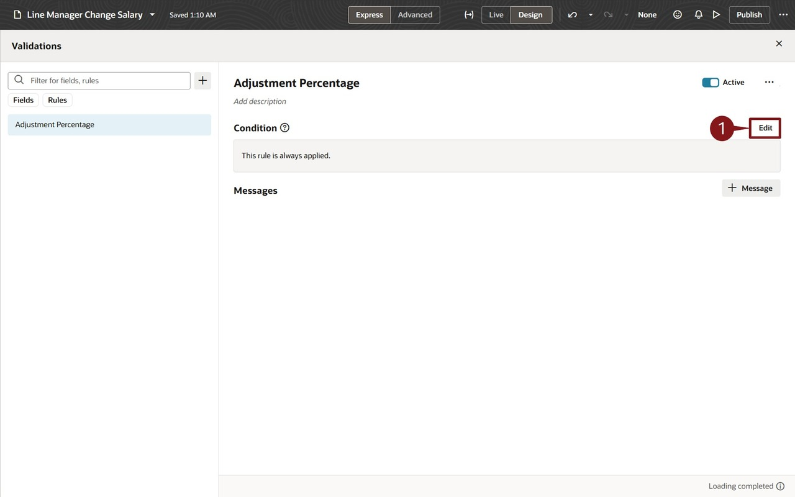

18.  Instead of using the pre-defined condition rows, you'll create a new one.

     > (1) Click the 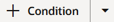 button.

     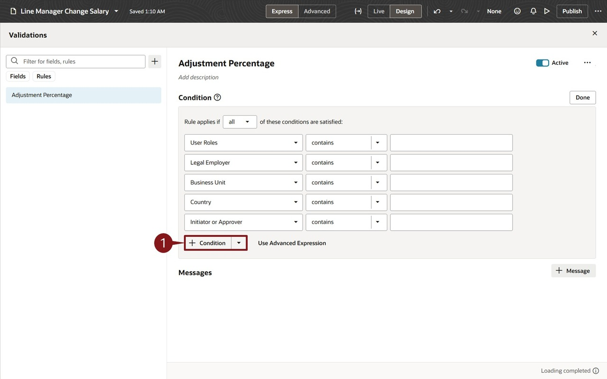

19.  You now have a blank row at the bottom of the Condition section.  You'll fill out this row for your new Adjustment Percentage condition.    **Note:** **Adjustment Percentage** will appear multiple times in the list of values, so be sure to select the correct one as described below.
     > (1) Click the dropdown  icon in the first column of the blank row. 
     > (2) Click the Expand  icon next to **{} Field Values** to expand that section.

     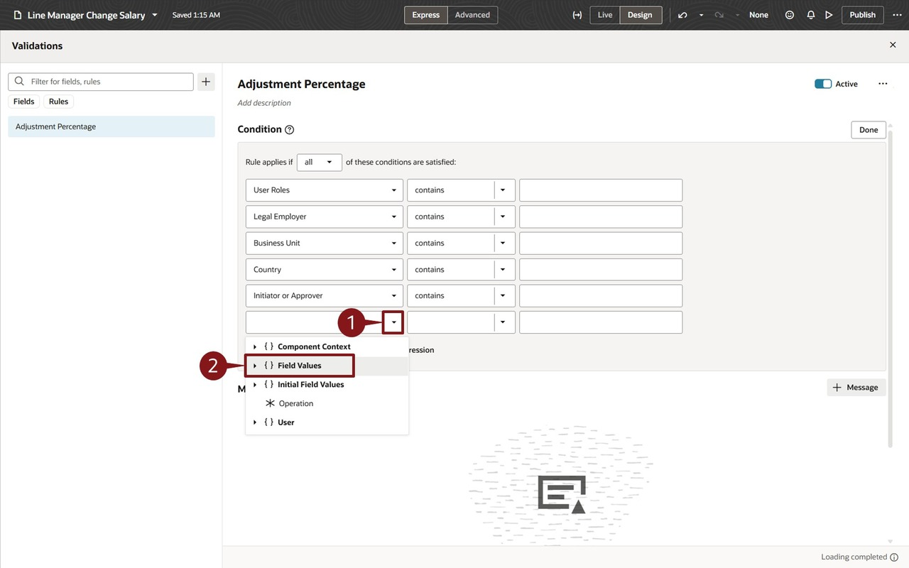

20.  The condition will be based on the Adjustment Percentage, so you need to select that from the resulting dropdown list.

     > (1) Click the Expand  icon next to **{} Salary Details** to expand that section. 
     > (2) Select **# Adjustment Percentage** from the Salary Details section.

     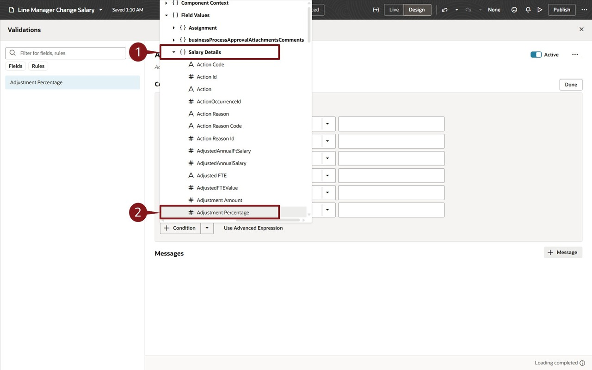

21.  Next you will fill in the rest of the condition.

     > (1) Select **greater than** from the dropdown in the second column.    
     > (2) Enter **15** in the third column. 
     > (3) Click the 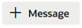 button. 

     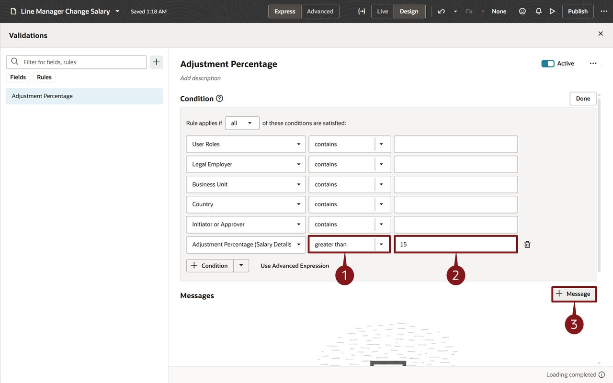

22. Now you will configure the error message users will see if they enter an Adjustment Percentage greater than 15%.

     > (1) Summary:  Type **Adjustment Percentage is too high**.     

     > (2) Severity:  Select **Error** from the dropdown.  

     > (3) Detail:  Type **The Adjustment Percentage must be lower than 15%**.  

     > (4) Click the  icon to complete the definition of this rule. 

     > (5) Click the  to close the Validations section. 

     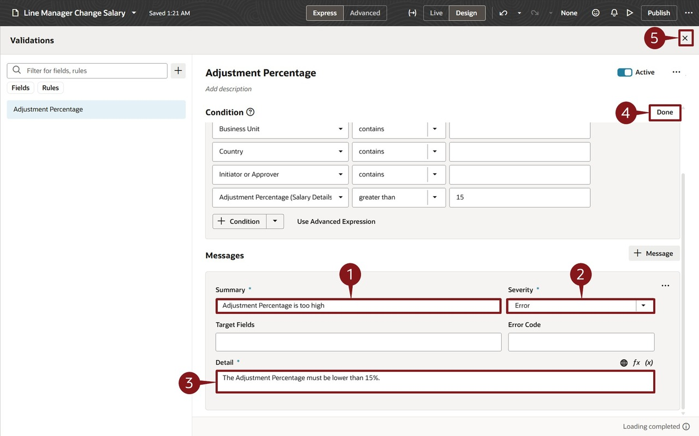

23. Well done.  You're going to do one more configuration that will display an AI Agent to assist the user in determining the appropriate salary change by checking market compensation information.  You'll do this by leveraging the Guided Journey configuration feature.  Guided Journeys allow you to embed information, including documents, links, reports and more in standard application screens.  You'll use it to embed an AI Agent.

    > (1) Type **Guided** in the **Filter** field in the **Page Properties** section of the panel on the right of the screen. 
    > (2) Type **Salary** in the **Set Guided Journeys Code at the Page Level** field. 
    > (3) Select **Salary Advisor Agent** from the resulting dropdown. 

       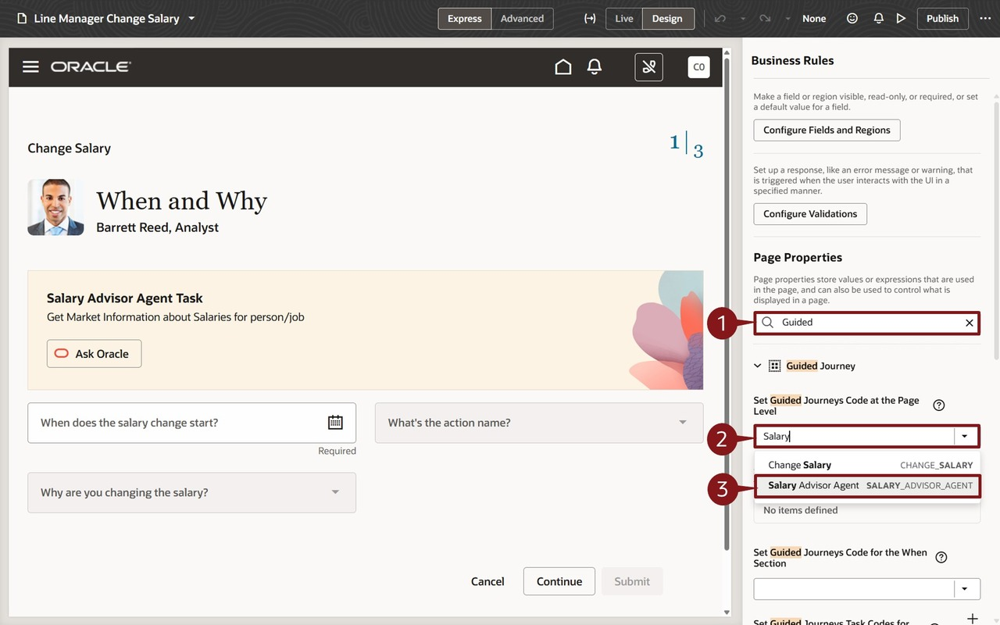

24. You can see the the Salary Advisor Agent Task Agent banner appear on the page.  You're done with configurations and ready to Preview your changes.

    > (1) Click on the **Preview**  icon in the upper right of the screen.  The Preview will appear in a new browser tab.

       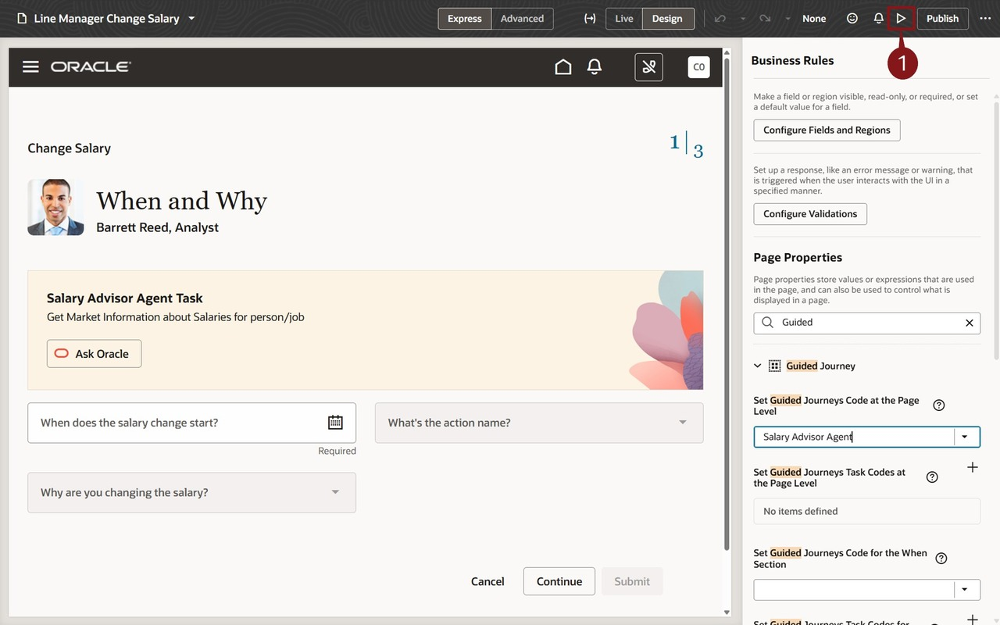

25. You have re-entered the Change Salary Form. Before submitting the salary change, you'll use the Salary Advisor Agent to get some marketplace comparative estimates.

    > (1) Click on the **Ask Oracle** 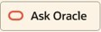 button.

       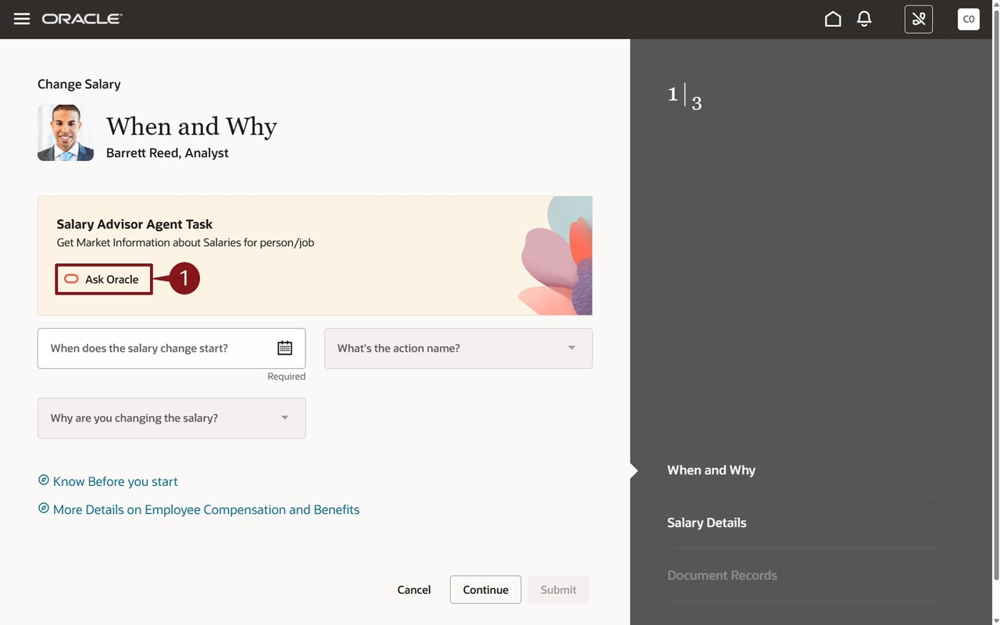

26. You want to see some prospective salary information for Barrett Reed based on variety attributes, including his title, location, and years of service.

    > (1) In the **Ask Oracle** dialog box on the bottom right of the screen. tu[e] **What is the market compensation estimate for Barrett Reed**. 
    > (2) Press the **<****Enter****>** key or click the **Up Arrow** icon  

       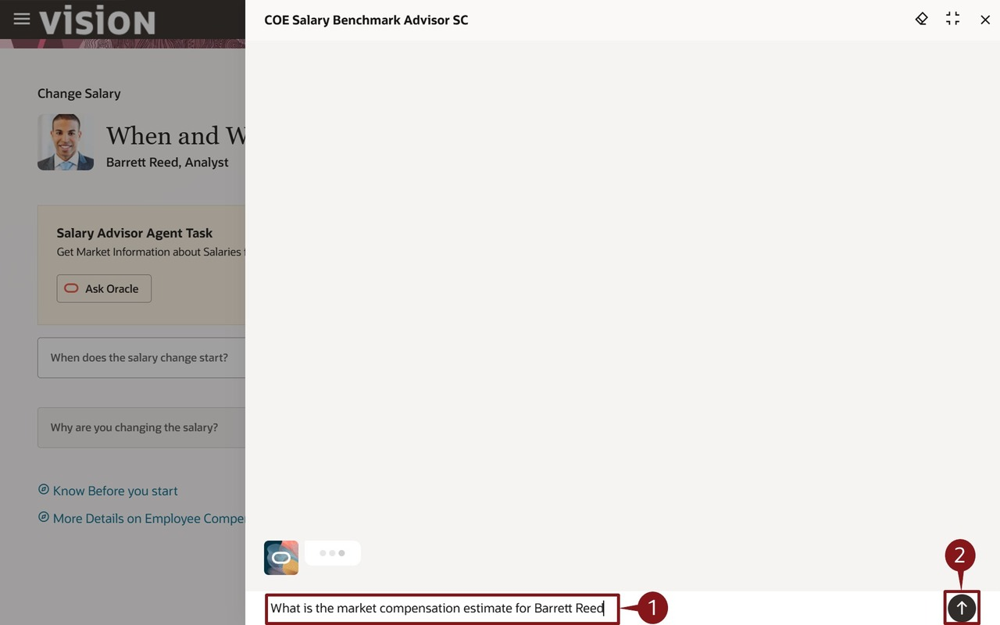

27. You can now see how Barrett Reed compares to market averages and medians.

    > (1) Review the market compensation information and when finished, click the the  icon in the upper right.

       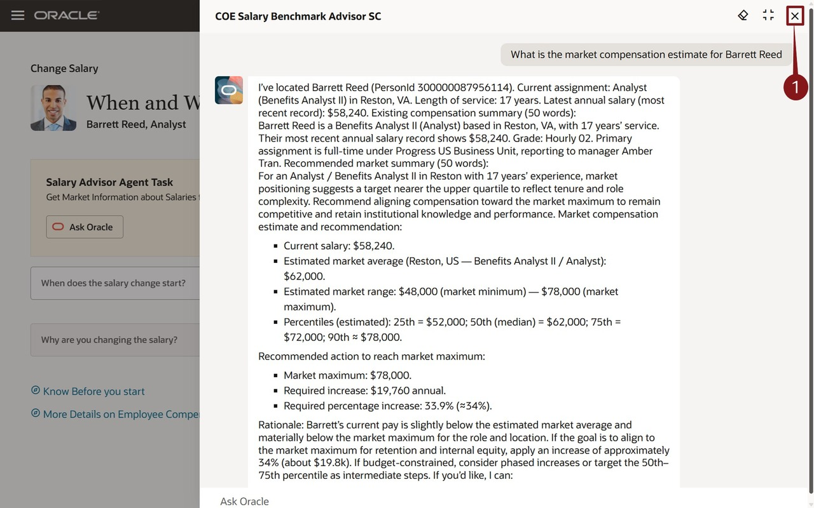

28. Based on the AI Agent response, you decide to move him into the higher portion of the estimated range by increasing his salary to $70,000, which is approximately a 20% increase.  You can start the Change Salary Request by entering the information below.

    > (1) When does the salary change start?: Type a **future date (eg. 12/31/26)**  

    > (2) What's the action name?: Select **Change Salary** from the dropdown.  

    > (3) Why are you changing the salary?: Select **Career Progression** from the dropdown.  

    > (4) Click **Continue**.

    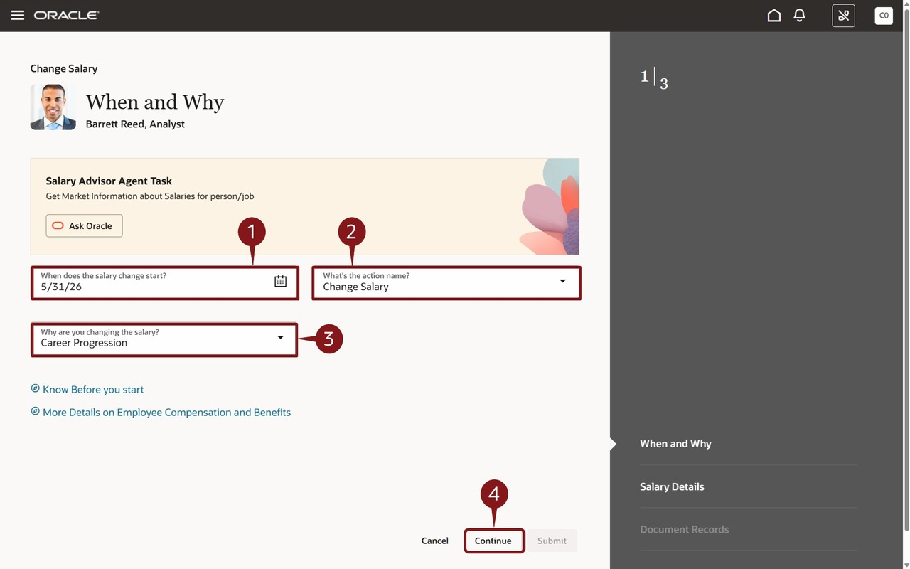

29. Note that Annualized Full-Time Salary and Compa-Ratio are no longer visible and Action Reason is now Visible. Now you will test the validation for the Adjustment Amount Percentage but requesting a 20% increase.

    > (1) Enter **20** in the **Adjustment Percentage** field (or any value greater than 15) and either **<****Tab****>** out of the field or press the **<****Enter****>** key on the keyboard.

    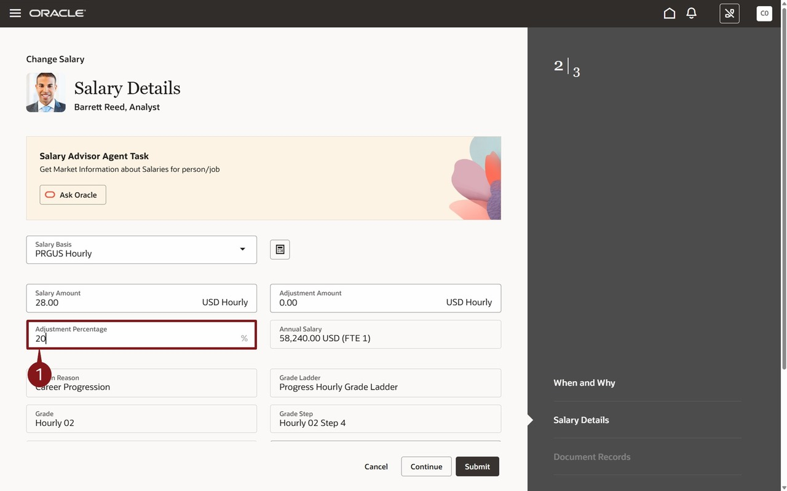

30. The system will not allow the user to continue because the Adjustment Percentage exceeds 15%!

    > (1) Your error message and description is clearly presented on the screen.

    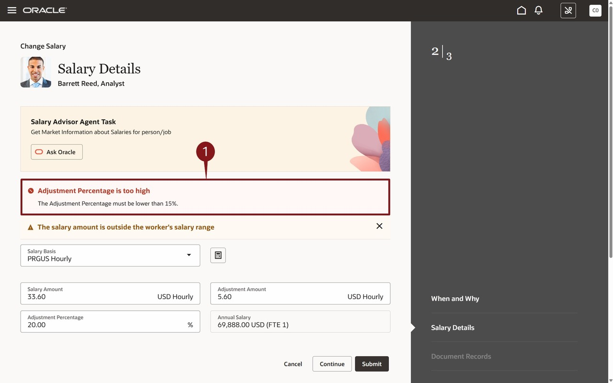

27.  Congratulations!  

> **You've completed this Adventure**.  Please close this tab and the Visual Builder tab and get ready for your next Adventure.

27. Adventure awaits, click on the image, show what you know and rise to the top of the leader board!!!

    

### Summary

In this adventure you experience the power of application configuration, including the ability to define rules, control screen content, and define validation rules.  This adventure leveraged Visual Builder, the same tool that Oracle uses to build the application. Visual Builder allows you to configure the application and also create new application screens that can leverage both Oracle and non-Oracle data. These features allow you to fine tune your Oracle Fusion Cloud Applications for peak performance, business processes tailored to you requirements, and fast, efficient usage.

And remember, application configurations are automatically maintained during the release update process.

**Sync up as a team, lock in your harness, get ready for the the next high-octane adventure.**

### Learn More
* [Getting Started with Redwood](https://redwood.oracle.com/?pageId=COREAF423D6E53F34D12BCD7BF41B42BDAC3&shell=getting-started)
* [Configuring and Extending Applications](https://docs.oracle.com/en/cloud/saas/applications-common/26a/oaext/overview-of-using-visual-builder-studio.html#s20072861)
* [Oracle Documentation](http://docs.oracle.com)

## Acknowledgements
* **Author** - Charlie Moff, Distinguished Cloud Technologist; Casey Doody, Cloud Technologist; Sajid Saleem, Master Principal Cloud Technologist
* **Contributors** - The AI Adventure Team (Gus, Kris, Sajid, Casey, Stephen, Jamil, Sohel, Xavier, Nate, Charlie)
* **Last Updated By/Date** - Charlie Moff; Sajid Saleem, January 2026

