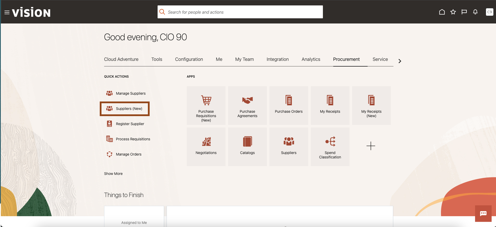
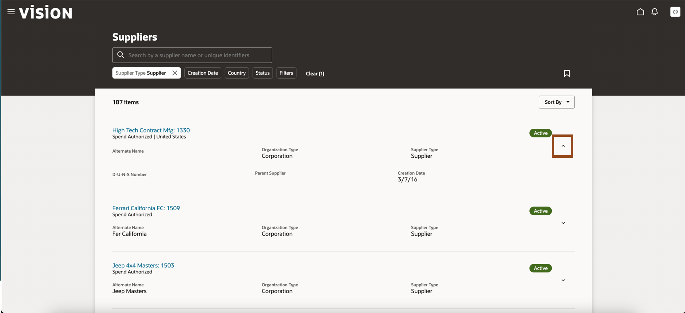
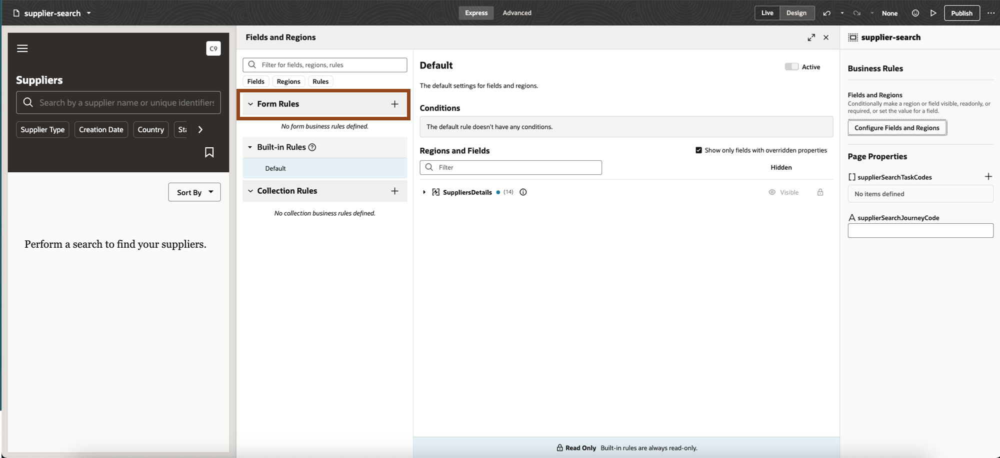
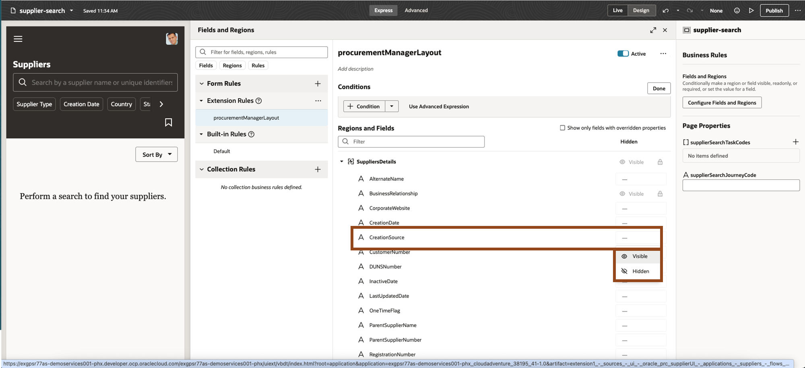
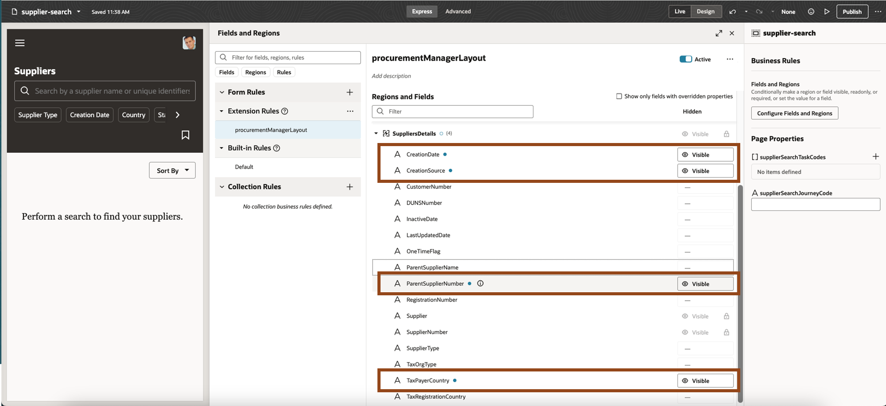

# Configure

## ERP & SCM: Update Suppliers (New) Listing Page

### Introduction

Oracle offers hundreds of prebuilt pages, workflows and forms “out of the box” as part of the Oracle Fusion Cloud.  Many of our customers want to configure these pages and workflows to meet their specific business needs.  You can unify your experience in our applications by using Redwood.

Oracle Redwood is Oracle Fusion’s new design system that enhances the user experience through a visually stimulating, easy-to-use interface. By uniting customer-inspired design philosophies with industry-leading technology solutions, Oracle Redwood helps companies reduce costs, foster efficiency, revitalize the customer journey, and evolve continuously toward the future.

### Objectives

In this lab, you will use Redwood to quickly and efficiently improve the user experience in Oracle Fusion Cloud.

Estimated Time: 15 minutes

Do not forget to answer the Adventure Check Point questions at the end of the exercise!

### Begin Exercise

1. You will use Redwood, Oracle’s next-generation design system, to quickly and efficiently update the Suppliers (New) listing page providing more visibility to Procurement Managers. Suppliers (New) is a dynamic listing page that allows you to create role-based layouts based on configurable criteria.

2. You will first navigate to the Suppliers (New) Listing Page.

    > From the application home page, click on the **Procurement** tab.

    .

    > Click on **Suppliers (New)** under **Quick Actions**.

    

    > Click on the **Supplier Type** to display the Filter and click into the Search box **Supplier Type**.

    

    > Click and select **Supplier (187)** to display list of suppliers.

    

    > Click anywhere in the page away from the search filter **Supplier (187)**

    

3. Now you will enter the Suppliers (New) Page that displays lists of suppliers.

    > (1) Click on drop-down icon to expand a specific supplier row.

    

4.  You can see the supplier information displayed is limited. We will update the page to display more fields for procurement managers.   Now you will leverage Visual Builder Studio to update the Suppliers (New) page.

    > (1) Click on the  **Image** in the top right corner of the screen.   

    > (2) Then select Edit Page in Visual Builder Studio from the drop down options.

    

5. The following image appears as Visual Builder Studio is loading.

    

6. Welcome to Oracle Visual Builder Studio (VB Studio), a robust application development platform that helps your team effectively plan and manage your work throughout all stages of the application development lifecycle: design, build, test, and deploy.    Now we will use VB Studio to make the required changes to the Suppliers (New) page.

    > Click on **Configure Fields and Regions**.  

    

7.  First we will create a new role-based form rule for Suppliers (New) page

    > Click on the  **Icon** to add a new form rule.

    

    > (1) Enter **procurementManagerLayout** in label.  

    > (2) Click on **Create**.

    

8.  Note that rules are based on a hierarchy.  The rules on top supersede the rules below .

    > Click on the **Edit button.**

    

9.  Now we will add the conditions that applies this rule to all Procurement Managers.

    > Click on the **Condition button**.

    

  In the first box, enter **Roles** and select **Roles** from the drop-down.

    > (1) Enter **Procurement Manager** in the right most box of the **User Roles** row.        

    > (2) Select the first **Procurement Manager** role from the drop-down list.

    

10. Now you want to add and hide fields.

    > Click on the   Icon to the left of Supplier Details to expand the section.

    

11. First you want to the configure the page  to display the **Creation Source**.

    > (1) Click in the Box in the **Hidden Column** for **Creation Source Field** row.     

    > (2) Then select **Visble** from the options that appear.

    

12.  Now repeat the above steps for fields Creation Date, Parent Supplier Number and Tax Payer Country to make them visible.

    > (1) Click the Box in the **Hidden Column** for **each of these** rows.     

    > (2) Then select **Visible** from the options that appear.

13. Well done. You have configured a new role-based page layout for Procurement Managers. Redwood offers a quick way to review your changes as they appear in the application.

    > (1) Click on the **Preview**  icon in the upper right of the screen 

    > (2) A new windows will pop up in a new browser tab.

    

14. You have reentered the Suppliers (New) page. Let’s review the changes.

    Click on the **Supplier Type** to display the Filter and click into the Search box **Supplier Type**.

15.  You need to select the search filter Supplier (187) again.

> Click and select **Supplier (187)** to display list of suppliers.

>  Click anywhere in the page away from the search filter **Supplier (187)**

 

16.  Now you will enter the Suppliers (New) Page that displays lists of suppliers.

> Click on **drop-down icon** to expand a specific supplier row

17.  You can see all the changes we just configured for displaying additional fields to Procurement Managers.

> Click on the **Home Icon** 

18. Adventure awaits, click on the image, show what you know and rise to the top of the leader board!!!

    

### Summary

Oracle Redwood is Oracle Fusion’s new design system that enhances the user experience through a visually stimulating, easy-to-use interface. By uniting customer-inspired design philosophies with industry-leading technology solutions, Oracle Redwood helps companies reduce costs, foster efficiency, revitalize the customer journey, and evolve continuously toward the future.

**You have successfully completed the Activity!**

### Learn More

* [Overview of Redwood Application Extension](https://docs.oracle.com/en/cloud/saas/human-resources/fauvb/overview-of-redwood-application-extensions.html)
* [Configuring and Extending Applications](https://docs.oracle.com/en/cloud/saas/applications-common/25d/oaext/overview-of-using-visual-builder-studio.html#s20072861)
* [Oracle Documentation](http://docs.oracle.com)

## Acknowledgements
* **Author** - Charlie Moff, Distinguished Cloud Technologist; Casey Doody, Cloud Technologist; Sajid Saleem, Master Principal Cloud Technologist
* **Contributors** - The AI Adventure Team (Gus, Kris, Sajid, Casey, Stephen, Jamil, Sohel, Xavier, Nate, Charlie)
* **Last Updated By/Date** - Sajid Saleem, November 2025