# Configure

## Introduction

Oracle offers hundreds of prebuilt pages, workflows and forms “out of the box” as part of the Oracle Fusion Cloud.  Many of our customers want to configure these pages and workflows to meet their specific business needs.  You can unify your experience in our applications by using Redwood.

Oracle Redwood is Oracle Fusion’s new design system that enhances the user experience through a visually stimulating, easy-to-use interface. By uniting customer-inspired design philosophies with industry-leading technology solutions, Oracle Redwood helps companies reduce costs, foster efficiency, revitalize the customer journey, and evolve continuously toward the future.

### Objectives

In this lab, you will use Redwood to quickly and efficiently improve the user experience in Oracle Fusion Cloud.

Estimated Time: 15 minutes

Do not forget to answer the Adventure Check Point questions at the end of the exercise!

## HCM: Enhance the Change Salary Experience

1.  You will use Redwood, Oracle’s next-generation design system, to quickly and efficiently update Change Salary Page for Non-HR managers.

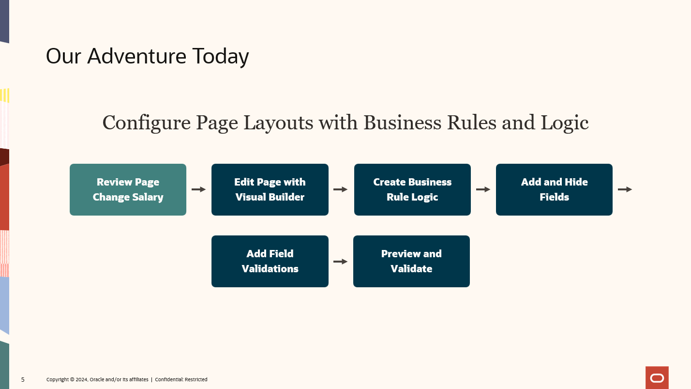

2. You will first navigate to the Change Salary Page.

    > From the application home page, click on the **My Team** tab.

    .

    > Click on **Change Salary** under **Quick Actions**.

    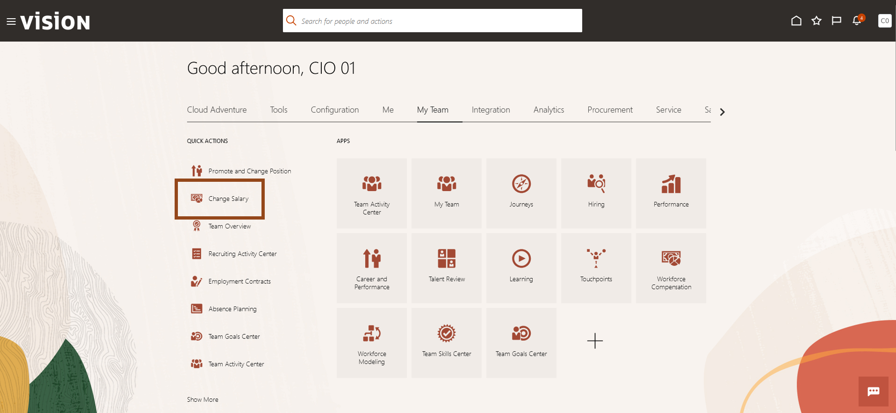

    > Click on the   **Icon** to remove the Direct Reports Filter because your user does not have any direct reports.  This action allows you to see other people.

    

3. Now you will enter the Change Salary Form so we can make the required changes using Visual Builder Studio.  Now you will select a person so you can enter the Change Salary form.

    > (1) Search for **Barrett Reed** in the search field.  

    > (2) Select **Barrett Reed** in the drop down.  

    

4.  You have entered the Change Salary Form.  Now you will quickly review the current configuration of the Change Salary Form.  You need to enter in some information to access the form

    > (1) When does the salary will start?: Type a **future date**  

    > (2) What is the action name?: Select **Change Salary**.  

    > (3) Why you are changing the salary?: Select **Career Progression**.  

    > (4) Click **Continue** once complete.

    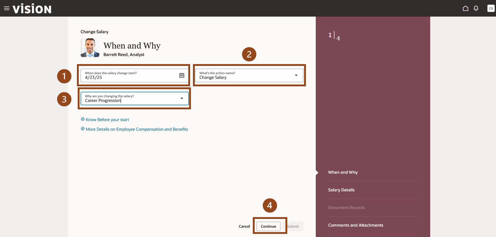

5. You will now create new rule that hides Annualized Full-Time Salary because it is repetitive.  You will also hide Compa-Raito since this is mainly used by HR.  You also want to show the action reason in this section of the Change Salary Form.

    

6. Now you will enter the Visual Builder Studio.

    > (1) Click on the 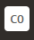  **Image** in the top right corner of the screen.   

    > (2) Then select **Edit Page in Visual Builder Studio** from the drop down options.

    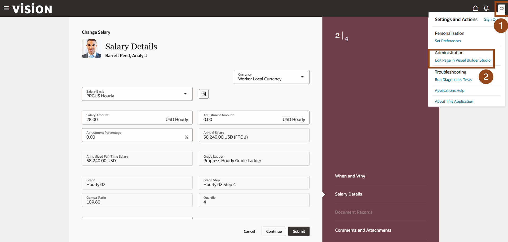

    The following image appears as Visual Builder Studio is loading.

    

7.  Welcome to Oracle Visual Builder Studio (VB Studio), a robust application development platform that helps your team effectively plan and manage your work throughout all stages of the app dev lifecycle: design, build, test, and deploy.

    Now we will use VB Studio to make the required changes to the Change Salary Form.

    > Click on **Configure Fields and Regions**.

    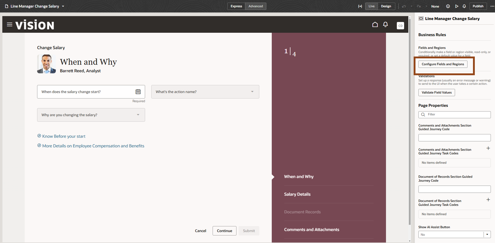

8. First we will create a new form rule for change salary.

    > Click on the   **Icon** to add a new form rule.

    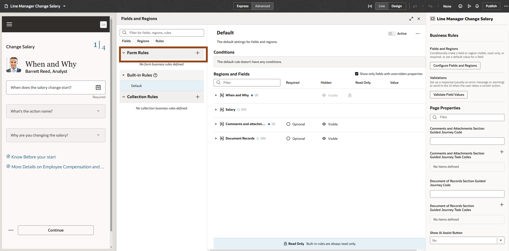

    > (1) Label: Type **Change Salary Non-HR**.  

    > (2) Click on **Create**.

    

9.  Note that rules are based on a hierarchy.  The rules on top supersede the rules below .

    Now we will add the conditions that applies this rule to all non-HR personnel

    > Click on the **Edit button.**

    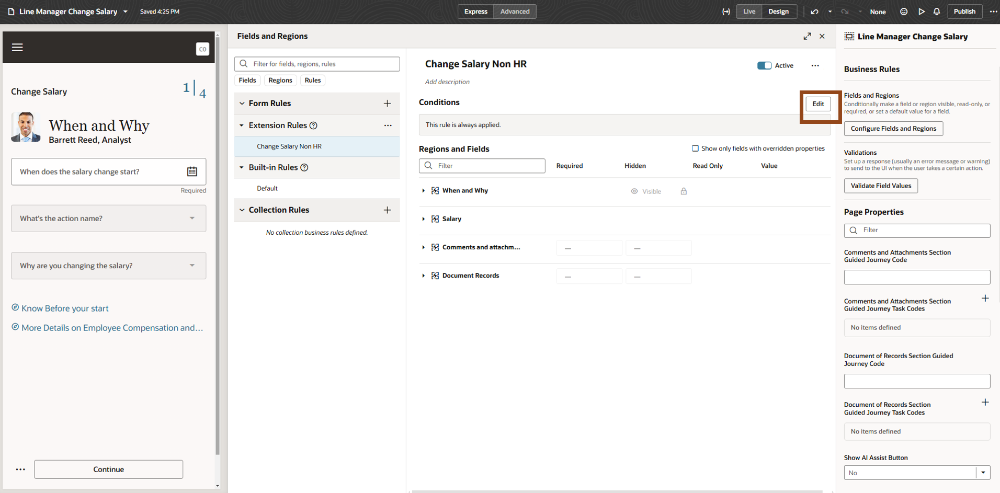

    > (1) For **User Roles**, select **does not contain** from the drop down options.   

    > (2) For **User Roles**, type **Human Resource Manager** and select **Human Resource Manager**.

    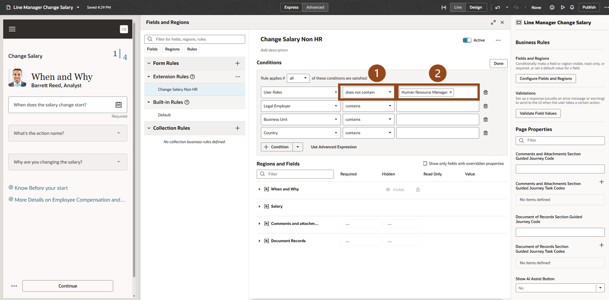

     **Note:** This configuration displays this version of the Change Salary Form to all people who are not assigned to the Human Resource Manager Role

10.  Now you want to add and hide fields.

     > Click on the **Drop Down**   Icon to the left of Salary to expand the salary section.

     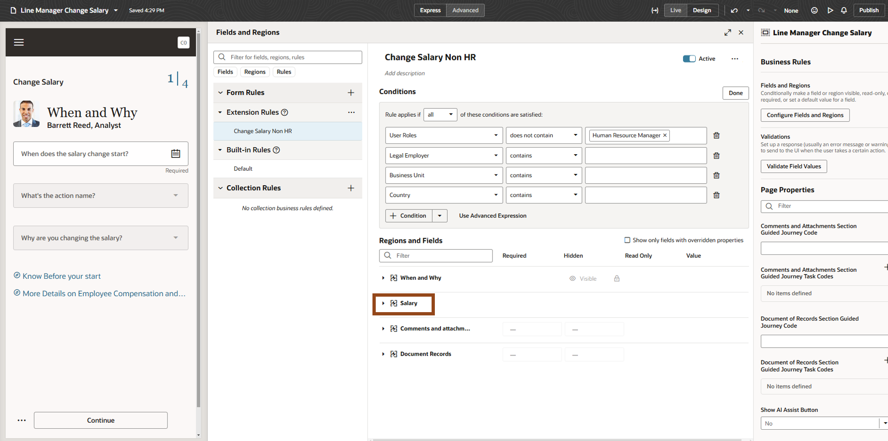

     > (1) Action Reason: select **Visible**      

     > (2) Annualized Full-Time Salary: select **Hidden**    

     > (3) Compa-Ratio: select **Hidden**

     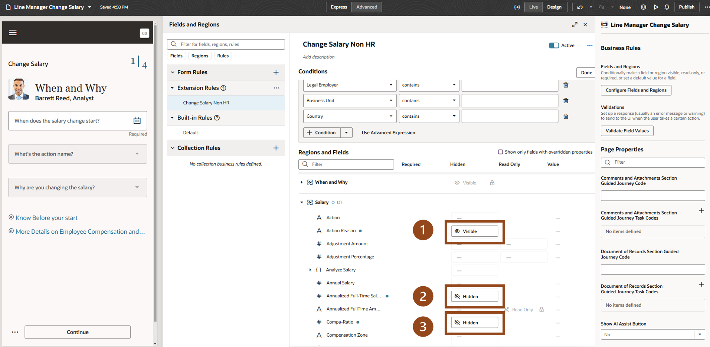

11. Now you will add a validation step for the Adjustment Percentage.  You do not want users to enter in a Salary Percentage Greater than 15%

    > Click on **Validate Field Values**

    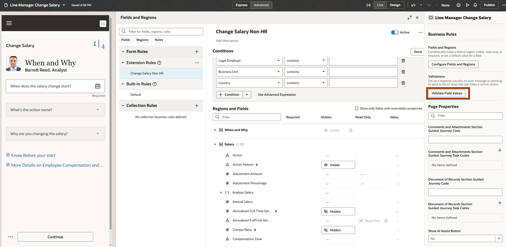

    > Click on **+ Validation**

    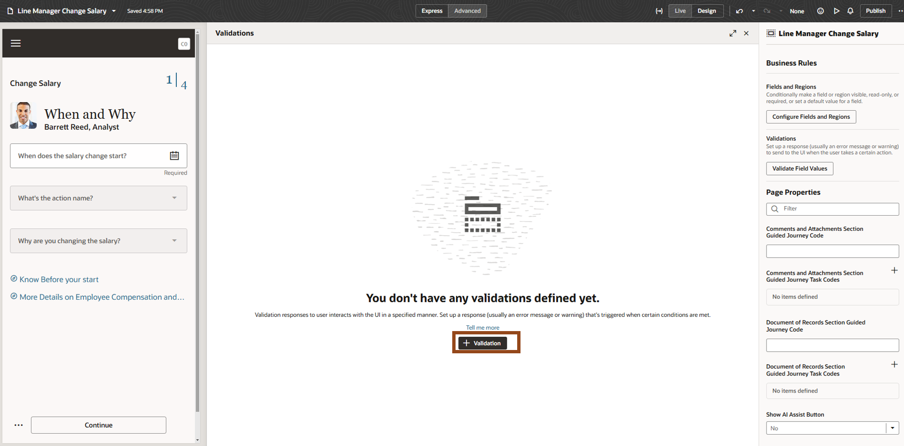

    > (1) Label: type **Adjustment Percentage**.     

    > (2) Click **Create**.

    

12.  Now you will set the conditions for this rule so that the form will not accept any adjustment percentage greater than 15%.

     > Click on **Edit**.

     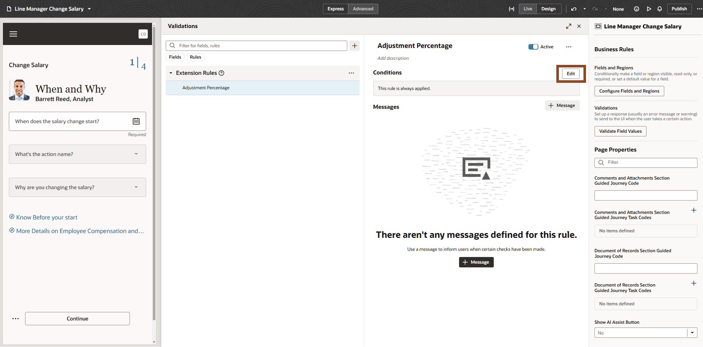
  
     > Click on **+ Condition**.

     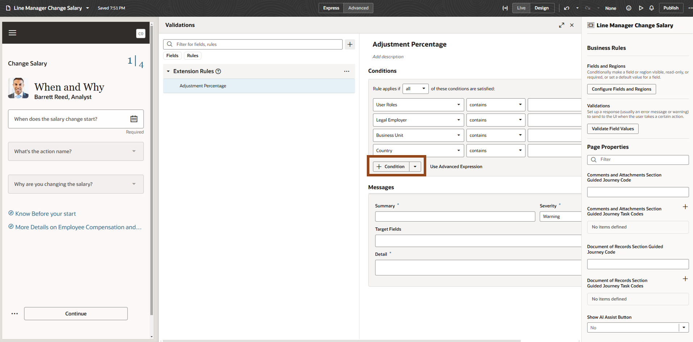

     > (1) Type **Adjustment Percentage** in the box and select the 1st **# Adjustment Percentage** under **Salary Details**      

     > (2) Select **greater than**     

     > (3) Type **15**   

     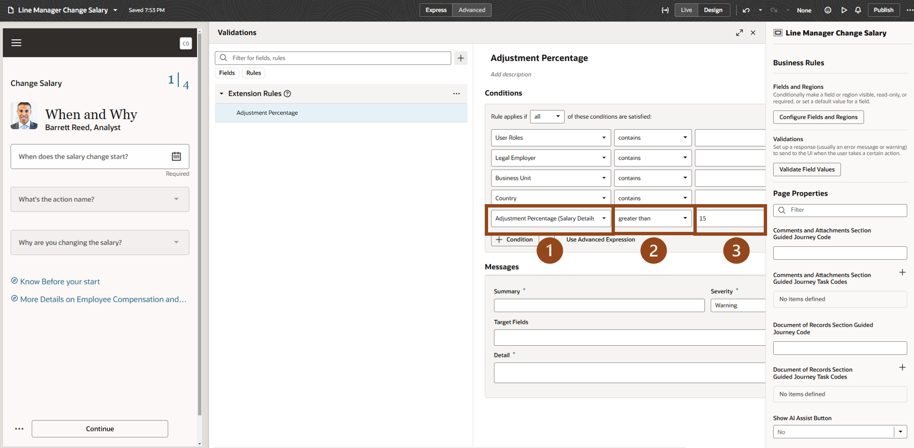

      The form will not allow any user to enter an adjustment percentage greater than 15%.

13.  Now you will configure the error message users will see if they enter in an Adjustment Percentage greater than 15%.

     > (1) Summary: type **Adjustment Percentage is too high**.     

     > (2) Detail:  **The Adjustment Percentage must be lower than 15%** in **Detail**.  

     > (3) Detail:  type **The Adjustment Percentage must be lower than 15%**.

     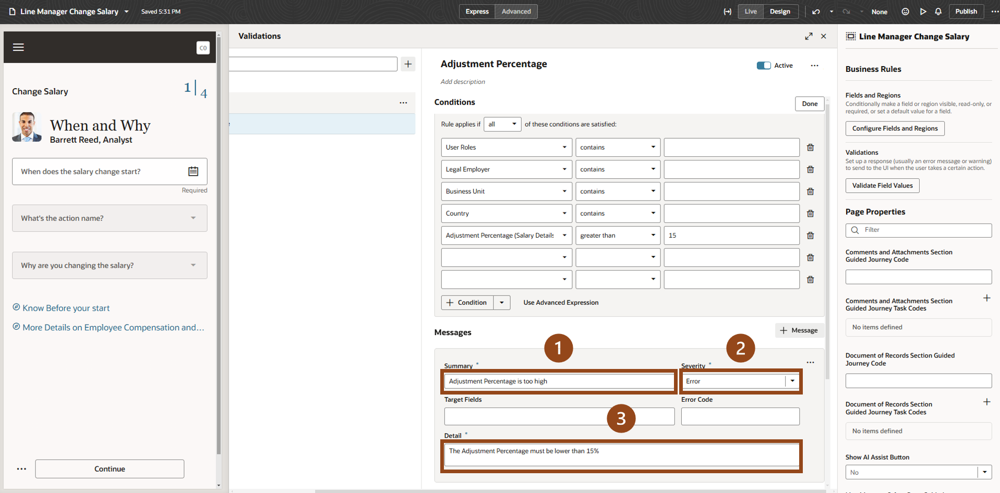

14.  Well done.  You have configured a new rule for Non-HR personnel.

  Redwood offers a quick way to review your changes as they appear in the application.

    > (1) Click on the **Preview**   icon in the top right of the screen.    

    > (2) A new window will pop up.

    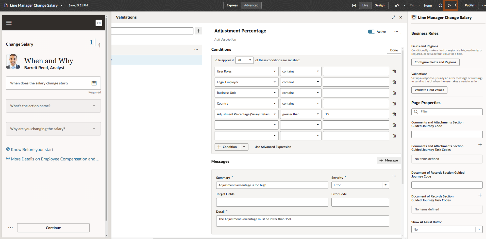

15.  You have reentered the Change Salary Form.  Let’s review the changes.  You need to enter the required information before you can move to the next screen.

    > (1) When does the salary will start?: Type a **future date**  

    > (2) What is the action name?: Select **Change Salary**.  

    > (3) Why you are changing the salary?: Select **Career Progression**.  

    > (4) Click **Continue** once complete.

    

16.  Note that Annualized Full-Time Salary and Compa-Ratio are no longer visible while Action Reason is now Visible.

    Now we will test the validation for the Adjustment Amount Percentage.

    > Enter an Adjustment Percentage that is greater than 15%.

    

17.  The system gives us a warning that the increase in salary is outside the worker’s salary range.  You will ignore this warning.

    > Click **Continue.**

    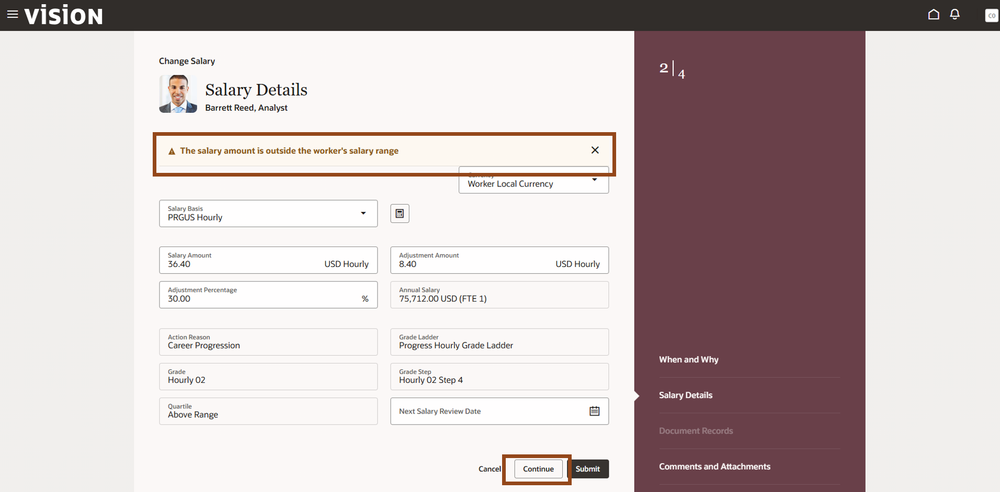

18.  The system will not allow the user to continue because the Adjustment Percentage exceeds 15% due to the field validation we configured.

    

    > Click on the **Home**   Icon.

19. Adventure awaits, click on the image, show what you know and rise to the top of the leader board!!!

    

## ERP & SCM: Update Suppliers (New) Listing Page

1. You will use Redwood, Oracle’s next-generation design system, to quickly and efficiently update the Suppliers (New) listing page providing more visibility to Procurement Managers. Suppliers (New) is a dynamic listing page that allows you to create role-based layouts based on configurable criteria.

    

2. You will first navigate to the Suppliers (New) Listing Page.

    > From the application home page, click on the **Procurement** tab.

    .

    > Click on **Suppliers (New)** under **Quick Actions**.

    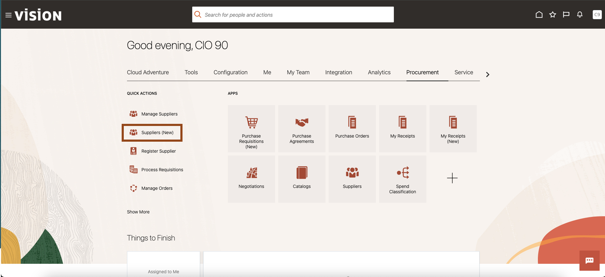

    > Click on the **Supplier Type** to display the Filter and click into the Search box **Supplier Type**.

    

    > Click and select **Supplier (187)** to display list of suppliers.

    

    > Click anywhere in the page away from the search filter **Supplier (187)**

    

3. Now you will enter the Suppliers (New) Page that displays lists of suppliers.

    > (1) Click on drop-down icon to expand a specific supplier row.

    

4.  You can see the supplier information displayed is limited. We will update the page to display more fields for procurement managers.   Now you will leverage Visual Builder Studio to update the Suppliers (New) page.

    > (1) Click on the  **Image** in the top right corner of the screen.   

    > (2) Then select Edit Page in Visual Builder Studio from the drop down options.

    

5. The following image appears as Visual Builder Studio is loading.

    

6. Welcome to Oracle Visual Builder Studio (VB Studio), a robust application development platform that helps your team effectively plan and manage your work throughout all stages of the application development lifecycle: design, build, test, and deploy.    Now we will use VB Studio to make the required changes to the Suppliers (New) page.

    > Click on **Configure Fields and Regions**.  

       

7.  First we will create a new role-based form rule for Suppliers (New) page

    > Click on the  **Icon** to add a new form rule.

    

    > (1) Enter **procurementManagerLayout** in label.  

    > (2) Click on **Create**.

    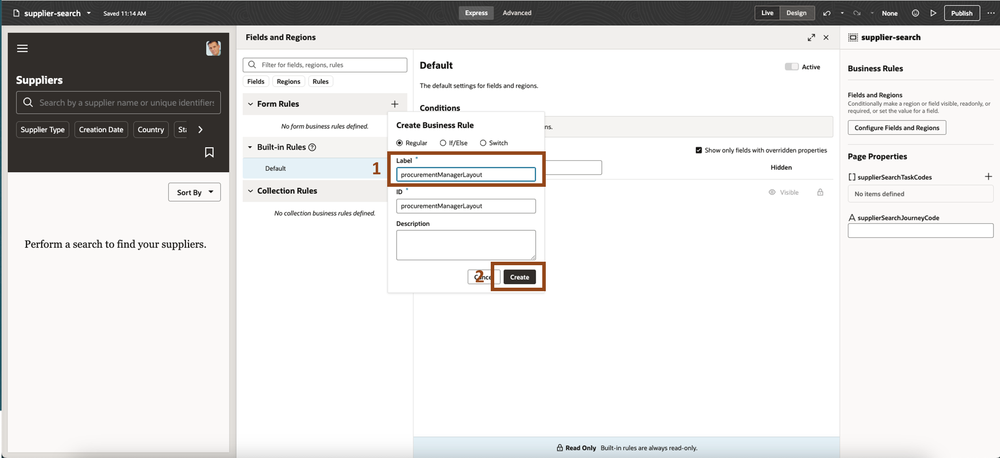

8.  Note that rules are based on a hierarchy.  The rules on top supersede the rules below .

    > Click on the **Edit button.**

    

9.  Now we will add the conditions that applies this rule to all Procurement Managers.

    > Click on the **Condition button**.

    

  In the first box, enter **Roles** and select **Roles** from the drop-down.

    

    > (1) Enter **Procurement Manager** in the right most box of the **User Roles** row.        

    > (2) Select the first **Procurement Manager** role from the drop-down list.

    

10. Now you want to add and hide fields.

    > Click on the   Icon to the left of Supplier Details to expand the section.

    

11. First you want to the configure the page  to display the **Creation Source**.

    > (1) Click in the Box in the **Hidden Column** for **Creation Source Field** row.     

    > (2) Then select **Visble** from the options that appear.

    

12.  Now repeat the above steps for fields Creation Date, Parent Supplier Number and Tax Payer Country to make them visible.

    > (1) Click the Box in the **Hidden Column** for **each of these** rows.     

    > (2) Then select **Visible** from the options that appear.

13. Well done. You have configured a new role-based page layout for Procurement Managers. Redwood offers a quick way to review your changes as they appear in the application.

    > (1) Click on the **Preview**  icon in the upper right of the screen 

    > (2) A new windows will pop up in a new browser tab.

    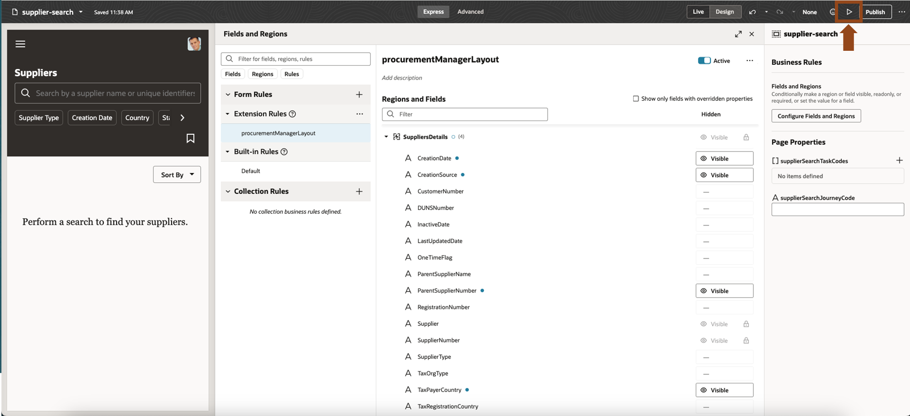

14. You have reentered the Suppliers (New) page. Let’s review the changes.

    Click on the **Supplier Type** to display the Filter and click into the Search box **Supplier Type**.

15.  You need to select the search filter Supplier (187) again.

> Click and select **Supplier (187)** to display list of suppliers.

>  Click anywhere in the page away from the search filter **Supplier (187)**

 

16.  Now you will enter the Suppliers (New) Page that displays lists of suppliers.

    > Click on **drop-down icon** to expand a specific supplier row

    

17.  You can see all the changes we just configured for displaying additional fields to Procurement Managers.

    > Click on the **Home**  Icon.

18. Adventure awaits, click on the image, show what you know and rise to the top of the leader board!!!

    

## Summary

Oracle Redwood is Oracle Fusion’s new design system that enhances the user experience through a visually stimulating, easy-to-use interface. By uniting customer-inspired design philosophies with industry-leading technology solutions, Oracle Redwood helps companies reduce costs, foster efficiency, revitalize the customer journey, and evolve continuously toward the future.

**You have successfully completed the Activity!**

## Learn More

* [Overview of Redwood Application Extension](https://docs.oracle.com/en/cloud/saas/human-resources/24d/fauvb/overview-of-redwood-application-extensions.html)
* [Configuring and Extending Applications](https://docs.oracle.com/en/cloud/saas/applications-common/24d/oaext/overview-of-using-visual-builder-studio.html#s20072861)
* [Oracle Documentation](http://docs.oracle.com)

## Acknowledgements
* **Author** - Charlie Moff, Distinguished Cloud Technologist, Advanced Technology Services; Casey Doody, Cloud Technologist , Advanced Technology Services
* **Contributors** -  Sajid Saleem, Master Principal Cloud Technologist, Advanced Technology Services
* **Last Updated By/Date** - Casey Doody, April 2025

