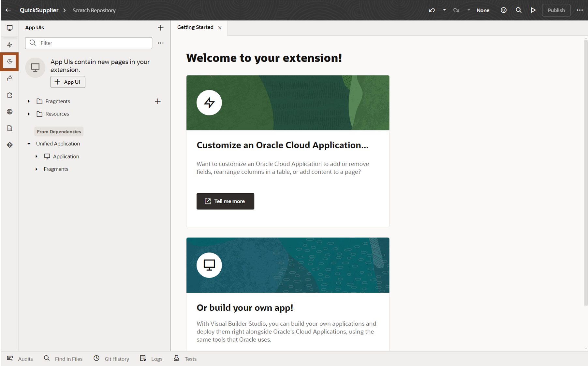
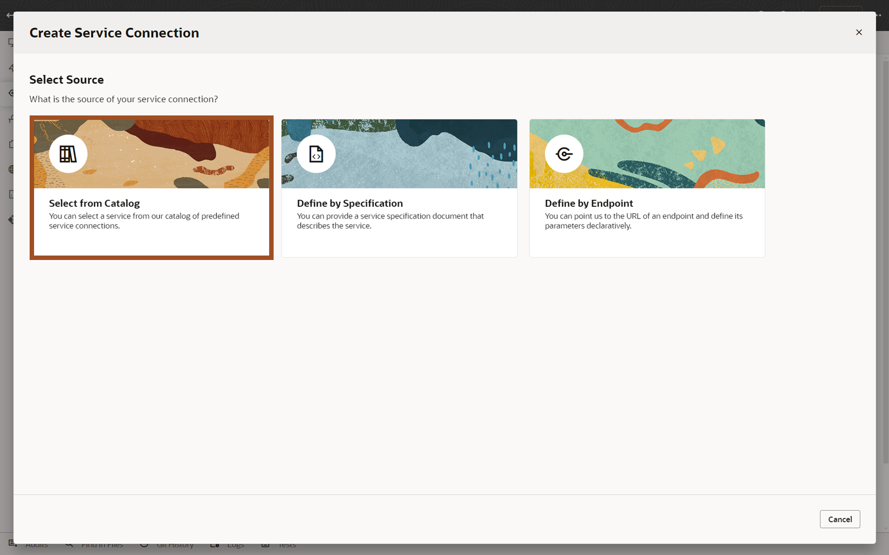
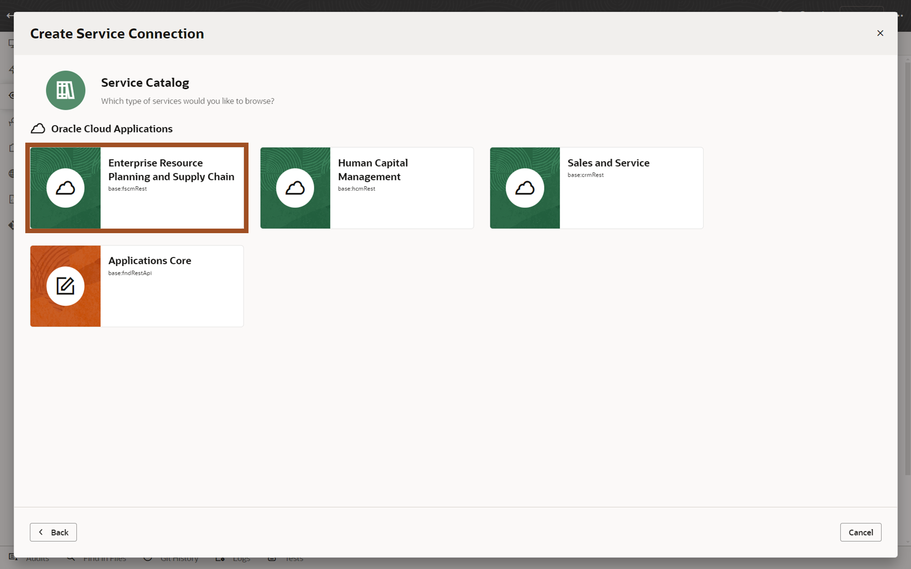
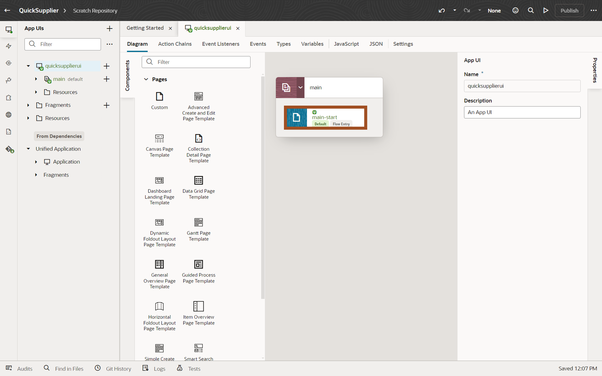
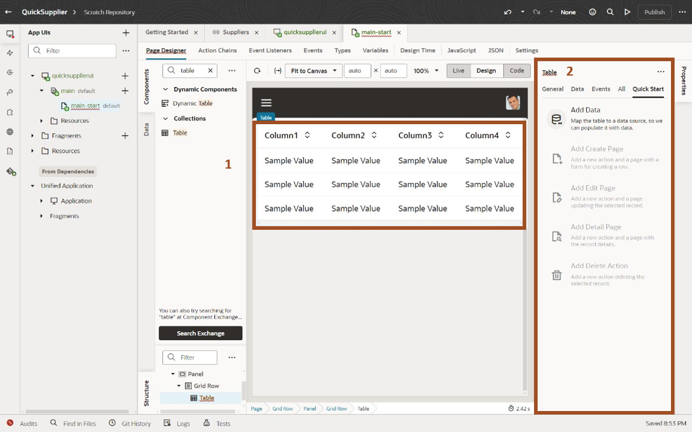

# Extend your SaaS Applications

## Introduction

In these activities, you will learn how to (1) easily extend for Fusion SaaS application to include external content to guide users to better decisions and (2) build a new simplified user interface for specific user populations

Estimated Time: 15 minutes

### Objectives

In this lab, you will:
* Create a Guided Journey that leverages an external LLM
* Use the embedded Visual Builder capabilities to build a new, simplified Supplier Screen.

## Task 1: Guided Journeys with User Defined Content

1. To see how you can create Guided Journeys to provide additional information, including external information, to your users..

    > Go to **Home Page**, then click on top right corner before the bell icon

    

2. Here’s where you can visualize all the Watchlist items based on your role. The list shows all the saved searches like unapproved journals, journals requiring attention etc	

    > Click on **‘Cloud Adventure JE Link’**

    

3. Here you can see the Accrual Journal to review

    > Click on the journal link ‘**XX CA-1121-ACCRUAL-01 Accrual’** to review the journal

      

4. This opens the journal that was posted for rent accrual. Notice the Attachment which is the audit backup for the accrual. 
   
    > **Click** on the attachments **‘Accrual JE Support Nvov-21’**.
    **Click** on the file downloaded to the PC if it doesn’t open automatically

      

5. Here you can view the backup for the accrual and the associated calculation. This is important and will remain as an attachment to the journal for any future audit.

      

## Task 2: Create a simplified user interface using Redwood Design Patterns and Oracle Visual Builder.

1. We will now create a new application screen to allow editing of specific supplier information.  Oracle Cloud Applications include an embedded tool called Visual Builder.  Visual Builder is the same tool that Oracle uses to develop application screens and it's available for you to create additional screens.  These screens can leverage both Oracle Cloud Application data and, if necessary, data from external systems.

    > (1) **Click** on the **‘Configuration’** tab  

    > (2) **Click** on the **‘Visual Builder’** tab

    

2. We have pre-defined a Project.  A project collects all the people, tools, and processes you need to complete a unit of work.  You can use a project to host source code files, track issues, collaborate on code, and build and deploy your applications. If your team is extending Oracle Cloud Applications, you’ll probably want to set things up so that you have a single project dedicated to work with a single repository for each Application. 

    > **Click** on the **‘SupplierModelExtension’** project

    

3. Workspaces allow you to segregate units of work within a Project.

    > **Click** on the **‘Go to Workspaces’** button

    

4. We'll create a new workspace for our simplified supplier screen

    > (1) **Click** on the **‘New’** dropdown  

    > (2) **Select** **‘New Application Extension’** from the resulting dropdown

    

5. We'll name our new Extension.

    > (1) **Enter** **‘QuickSupplier#’** in the "'Extension Name'" field. 

    > (2) **Click** the **‘Create’** button

    

6. We're now at the Visual Builder homepage.  We can configure existing screens, create new ones, or build whole new applications.  We can also leverage REST APIs to access Fusion SaaS Data.  Supplier data from Oracle ERP/SCM Cloud, so we'll leverage the embedded integration via REST APIs.

    > (1) **Click** the **‘Services’** icon on the left menu.

    

7. We can add services from Oracle Cloud Applications or other accessible data sources.

    > (1) **Click** on the **‘+ Service Connection’** button.

    

8. There are multiple ways to reference a service.  We'll use the included catalog of Oracle Cloud Application services.

    > **Click** on the **‘Select from Catalog’** tile.

    

9. Services are available for functionality across the Oracle Cloud Applications.

    > **Click** on the **‘‘Enterprise Resource Planning and Supply Chain’** tile.

    

10. We'll use the Supplier Service from the ERP/SCM Catalog. 

    > (1) **Enter** ‘Suppliers’ in the 'Supplier Name' field.  
    > (2) Enter ‘Suppliers’ in the ‘Filter Objects/Endpoints’ field.  
    > (3) Click the ‘Checkbox’ next to ‘Suppliers’.  
    > (4) Click the ‘Create’ button.  

    

11. The resulting screen shows additional configuration options for our supplier service, but we'll just use the default settings.  Now we want to start creating our new screen.  

    > **Click** on the **‘App UIs’** icon in the left toolbar

    

12. We're now at the Visual Builder APP UI Screen.  We can configure existing screens, create new ones, or build whole new applications.  We want to create a new UI screen.

    > **Click** on the **‘+ App UI’** button.

    

13. 

    > (1) **Enter** **‘QuickSupplierUI’** in the "'App UI Name'" field. 

    > (2) **Click** the **‘Create’** button.

    

14. Visual Builder has automatically created a default UI leveraging the Oracle provided Redwood template.  Redwood is Oracle's design methodology and pre-defined templates, and design patterns are included in Visual Builder to allow you to create applications that look and function just like Oracle delivered applications.

    > **Double-Click** the **‘main-start’** object.

    

15. Here we see our blank template and a list of some of the provided Redwood design components.  We want to start by adding some components to the screen to hold our data.  We’ll first add a Panel component.

    > (1) Confirm you’re in the **Components** tab.  

    > (2) Type **Panel** in the **‘filter’** field.  

    > (3) Drag **Panel** to first blue section (4) of the page as shown.

    

16. We’ll now add a Table component to our new Panel.

    > (1) Type **Table** in the **‘filter’** field.  
    > (2) Drag **Table** to first blue section (3) of the page as shown.

    

17. We now have a table to hold our data. Next, we’ll add the Supplier data from our REST API. We can use the Quick Start feature to help with this task.

    > (1) Click the newly created **Table** region. 

    > (2) You should now see the Table Properties region appear on the right.

    

18. The Quick Start features simply common tasks.We can use the Add Data Quick Start feature to show data from our Supplier REST API.

    > (1) Click the **'Quick Start'** table in the Table Properties area.  

    > (2) Click the **'Add Data'** tile.

    

19. We can see the various Supplier related data available from the Supplier REST API.  We’ll just use the Suppliers data for this scenario.

    > (1)  Click **'Suppliers'** to expand the Suppliers region.  

    > (2)  Click **'Suppliers'** tile.  

    > (3) Click the **Next** button.

    

20. We’ll select a few fields to display on our new screen.  We want to use this to allow for quick update of a few pieces of Supplier Data, including Taxpayer ID, Alternate Name and Alias.  We’ll select those fields in additional to Supplier and Supplier Number..

    > (1)  Click **'Checkbox'** next to the following fields.  You’ll need to scroll the Endpoint Structure for the last 3 fields:  
           - Alias  
           - AlternateName 
           - Supplier 
           - SupplierNumber 
           - TaxpayerId  

    > (2)  Confirm the list of selected fields.  

    > (3) Click the **Next** button.

    

21. We can optionally add additional filter criteria.

    > (1) Note the ability to add additional criteria.  

    > (2) Click the **Finish** button.

    

22. Notice that the screen auto-queried Supplier Information.  We can easily move between Design, Live and Code views of our application.  But next, we want the ability to edit data.  So, we’ll use the Quick Start again to add an edit page.  

    > (1) Confirm that you're on the **Quick Start** tab.  

    > (2) Click the **Add Edit Page" tile.

    

23. We can select the same or different fields for out Edit Page.  We’ll just select the same list..

     > (1)  Click **'Checkbox'** next to the following fields.  Note that you may need to scroll the list of fields:  
           - Alias  
           - AlternateName 
           - Supplier 
           - SupplierNumber 
           - TaxpayerId  

    > (2)  Confirm the list of selected fields.  

    > (3) Click the **Finish** button.

    

24. Now that we've created our screen, we can test it.

    > Click the **Preview** icon on the top right of the screen.

    

25. A new browser tab is launched showing our completed application.  We now have a fully functioning screen that supports query and update capabilities.

    > (1) Select a **Supplier** to highlight a row.      
    > (2) Click the **Edit Supplier** button.   

    

26. We'll update and save a field.  Out new screen leverages the security and business rules of the application via the standard REST API. .

    > (1) Enter a value in the **Alternate Name*** field. For example, enter "LeeSupp" as the Alternate Name for Lee Supplies.       
    > (2) Click the **Save** button.   

    

27. Our Supplier record update is now saved.

    > Note the message that the supplier record was successfully updated.

    	

28. Adventure awaits, click on the image, show what you know and rise to the top of the leader board!!!
    
     

## Summary (MISSING)

**You have successfully completed the Activity!**

 
## Learn More (Are we adding this to live labs?)

* [Oracle Documentation](http://docs.oracle.com)
* [Extending Oracle Cloud Applications with Visual Builder Studio](https://docs.oracle.com/en/cloud/paas/visual-builder/visualbuilder-building-appui)

## Acknowledgements
* **Author** - Charlie Moff, Distinguished Sales Consultant, Advanced Technology Services
* **Contributors** -  
* **Last Updated By/Date** - Charlie Moff, August 2024