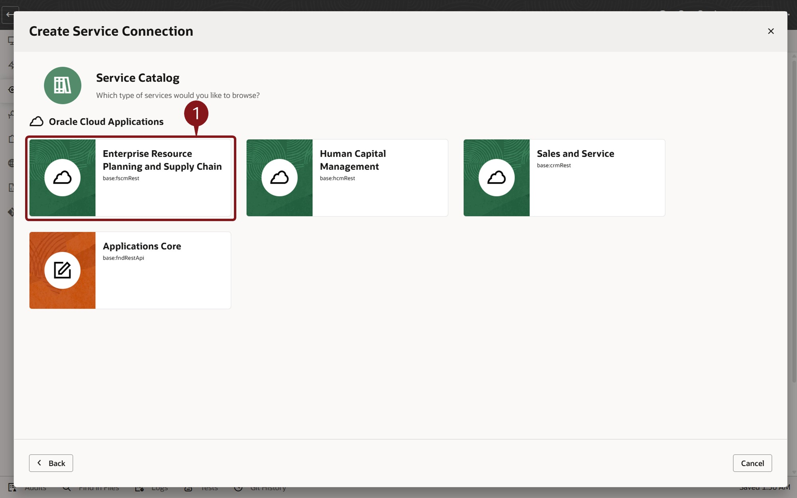
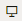
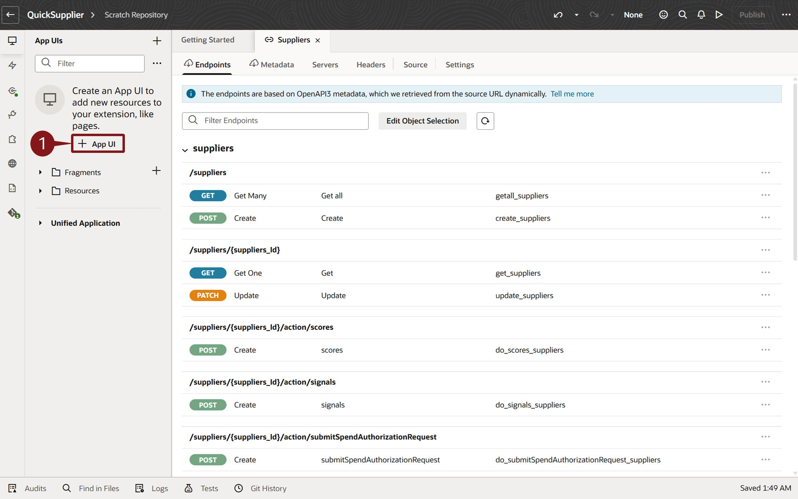

# Extend your SaaS Applications

## ERP & SCM: Create a simplified user interface using Redwood Design Patterns and Oracle Visual Builder

### Introduction

Oracle Cloud Applications include an embedded tool called Visual Builder.  Visual Builder is the same tool that Oracle uses to develop application screens and it's available for you to create additional screens.  These screens can leverage both Oracle Cloud Application data and, if necessary, data from external systems.

### Objectives

In this lab, you will use Visual Builder to create additional screens

Estimated Time: 15 minutes

Do not forget to answer the Adventure Check Point questions at the end of the exercise!

### Begin Exercise

1. In this lab, you will Use Visual Builder to build a new Supplier Screen.

2. You will now create a new application screen to allow editing of specific supplier information.  Oracle Cloud Applications include an embedded tool called Visual Builder.  Visual Builder is the same tool that Oracle uses to develop application screens and it's available for you to create additional screens.  These screens can leverage both Oracle Cloud Application data and, if necessary, data from external systems.

    > (1) **Click** on the **Configuration** tab.  
    > (2) **Click** on the **Visual Builder** tile  

    

3. We have pre-defined a Project.  A project collects all the people, tools, and processes you need to complete a unit of work.  You can use a project to host source code files, track issues, collaborate on code, and build and deploy your applications. If your team is extending Oracle Cloud Applications, you’ll probably want to set things up so that you have a single project dedicated to work with a single repository for each Application.

    > **Click** on the **AIAdventure** project

    

4. Workspaces allow you to segregate units of work within a Project.

    > (1) **Click** on the **Manage Workspaces** link.    
     If your Project has no pre-existing workspaces, you'll be presented with a **Go to Workspaces** button to click instead. 

    

5. You will create a new workspace for our simplified supplier screen

    > (1) **Click** on the **New**  dropdown  
    > (2) **Select** **New Application Extension** from the resulting dropdown  

     If this is the first Workspace for your user, the screen will look different and the **New** button will be in the lower center of the screen. 

    

6. You'll name your new Extension.

    > (1) **Enter** **QuickSupplier** in the "'Extension Name'" field. 
    > (2) **Click** the **Create** button

    

7. You're now at the Visual Builder homepage.  You can configure existing screens, create new ones, or build whole new applications. You can also leverage REST APIs to access Fusion SaaS Data (e.g. Supplier data from Oracle ERP/SCM Cloud).

    > (1) **Click** the **Services**  icon on the left menu.

    

8. You can add services from Oracle Cloud Applications or other accessible data sources.  It only takes a few clicks.

    > (1) **Click** on the **+ Service Connection** button.

    

9. There are multiple ways to reference a service.  You'll use the included catalog of Oracle Cloud Application services.

    > **Click** on the **‘Select from Catalog’** tile.

    

10. Services are available for functionality across the Oracle Cloud Applications.

    > **Click** on the **Enterprise Resource Planning and Supply Chain** tile.

    

11. You'll use the Supplier Service from the ERP/SCM Catalog.

    > (1) **Enter** ‘Suppliers’ in the 'Supplier Name' field.  
    > (2) **Enter** ‘Suppliers’ in the ‘Filter Objects/Endpoints’ field.  
    > (3) **Click** the ‘Checkbox’ next to ‘suppliers’.  
    > (4) **Click** the ‘Create’ button.  

    

12. Here you see the various operations and data objects available. This includes Get, Post and Patch operations allowing for query, create and update actions. Scrolling this window, we can see that other related information is also available, including addresses, attachments, contacts, descriptive flexfields and more. Now you want to start creating our new screen.

    > (1) **Click** on the **App UIs**  icon in the left toolbar

    

13. You can now see the App UI panel on the left hand side.  This allows you to create you new page.

    > (1) **Click** on the **+ App UI** button.

    

14. A popup windows allows you to name your new App UI.

    > (1) **Enter** **QuickSupplierUI** in the "App UI Name" field. 
    > (2) **Click** the **Create** button.

    

15. Visual Builder has automatically created a default UI leveraging the Oracle provided Redwood template.  Redwood is Oracle's design methodology and pre-defined templates, and design patterns are included in Visual Builder to allow you to create applications that look and function just like Oracle delivered applications.  You'll open the main-start page that was auto-created.

    > (1)  **Double-Click** the **main-start** object.

    

16. Here you see your blank template and a list of some of the provided Redwood design components.  You want to start by adding some components to the screen.

    > (1) Type **Panel** in the **filter** field as shown in the screen image below.  
    > (2) Select **Panel** in the Layouts  
    > (3) Drag **Panel** to the dashed rectangle object and drop it in the blue columns that appears (3) as shown in the screen image below.

    

17. Next, you'll add a component to the panel.  The first component we add will be an Input Text field to allow for searching.

    > (1) Type **text** in the **filter** field.  
    > (2) Drag **Input Text** to your panel and drop in the blue section that appears (3).

    

18. Now you'll use the Properties panel on the right side of the screen to set some properties for your new Input Text field.  You'll add a label to your search field and create a page variable.  You can start with the label.

    > (1) Type **Enter Supplier Name Search** in the **Label Hint** field on the **General** tab of the **Properties** panel on the right.  
    > (2) Next, you'll get ready to create a page variable.  So, click the **Data** tab in the **Properties** panel.  

    

19. Create a page variable to save the contents of your new Input Text field.

    > (1) Click the (x) icon on the top right of the Value field. 
     If the (x) is not showing, move your cursor to the Value field and it will appear.  
    > (2) The **Variables** pop-up window will appear.  Click **Create** next to the **Page** option.

    

20. Name your page variable.

    > (1) Type **SupplierSearchString** in the ID Field. 
    > (2) Click the **Create** button.

    

21. You’ll now add a Table component to the Panel.

    > (1) Enter  **Table** in the **filter** field.  
    > (2) Use **Table** that appears int the list under the Collections section of the results. 
    > (3) Drag **Table** to the white space below your text field.  

     Be sure that you drop it in the white space just below the text field and not in the brown section further down.

    

22. You now have a table to hold the data. Next, you’ll add the Supplier data from our REST API. You can use the Quick Start feature to help with this task.  Quick Start is available from the Properties tab on the right side of the screen.

    > (1) Click the **Add Data** tile in the Quick Start area on the right side of the screen.

    

23. The Add Data screen shows any services you have made available to Visual Builder.  You can see the Supplier related data available from the Supplier REST API.  You’ll just use the Suppliers data for this scenario.

    > (1) Click **Right Arrow** of the  icon to expand the Suppliers region.  
    > (2) Click and highlight the  row.  
    > (3) Click the **Next** button.

    

24. This screen you are creating will be used to search for Suppliers and allow for quick update of Supplier Data.  You’ll select a few fields to display on the new screen.

    > (1)  Click **Checkbox** next to the following fields.  You’ll need to scroll the Endpoint Structure to see the Supplier field:  
           - Alias  
           - AlternateName 
           - Supplier 
    > (2) Confirm the list of selected fields.  
    > (3) Click the **Next** button.

    

25. Here you can configure the search filter criteria.

    > (1) Click on the **filterCriterion** field in the Target section of the screen on the right.  This will cause a **Click to add condition** option to appear at the bottom of the screen.  
    > (2) Click the **Click to add condition** link.

    

26. The next 3 steps will configure the Condition for the filterCriterion on the bottom of the screen.

    > (1) Type **Supplier** in the first field and pick **Supplier** from the resulting pop-up list (2).

    

27. Next you'll select the Operator

    > (1) Click in the **Operator** field and select **contains ($co)** from the resulting pop-up list (2).

    

28. And now you'll reference the page variable that you  created earlier.

    > (1) Click in the **Attribute** field. 
    > (2) Select **$variables.SupplierSearchString** from the resulting pop-up list.  
    > (3) Click in the **Finish** button.

    

29. Notice that the screen auto-queried Supplier Information.  You can easily move between Design, Live and Code views of our application.  But next, you want the ability to edit data.  So, you’ll use the Quick Start properties panel again to add an edit page.

    > (1) Click the **Add Edit Page** tile in the Quick Start area of the Properties panel on the right of the screen..

    

30. You can select the same or different fields for your Edit Page.  Since the request was to create a simple page, you'll just add a few fields.

     > (1)  Click **'Checkbox'** next to the following fields.  Note that you will likely need to scroll the list of fields:  
      * Supplier 
      * SupplierNumber 
      * TaxpayerId 

    > (2)  Confirm the list of selected fields.  
    > (3) Click the **Finish** button.

    

31. You're ready to try your new application.

    > Click the **Preview**  icon on the top right of the screen.

    

32. A new browser tab is launched showing your completed application.  You now have a fully functioning screen that supports query and update capabilities.

    > (1) Enter your search criteria by entering a string in the **Enter Supplier Name Search** field.  You can use **Corp** like shown in the screenshot or enter your **user number (##)** to find the Supplier with your number included as part of the name.   
    > (2) **Select** a Supplier record by **clicking** on it (the row will highlight)  
    > (3) Click the **Edit Supplier** button.

    

33. Your Edit Supplier screen allows you to update the information and save. The new screen leverages the security and business rules of the application via the standard REST API.

    > (1) Note that the Supplier Number field is read-only.  That field is non-updateable and that constraint automatically carries through to our new screen.   
    > (2) The Taxpayer ID is editable, but we’ll end here without doing the update.

    

34. Adventure awaits, click on the image and show what you know, and rise to the top of the leader board!!!

    

### Summary

The two tasks of this Extension adventure introduced you to a few of the capabilities that customers can leverage to extend Oracle Fusion Cloud applications.  These features allow you to fine tune your Oracle Fusion Cloud Applications for peak performance, business processes tailored to your requirements, and fast, efficient usage.

You learned how to extend the applications using Oracle Visual Builder Studio to create new screens that can leverage both Oracle and non-Oracle data.

**You have successfully completed the Activity!**

### Learn More

- [Extending Oracle Cloud Applications with Visual Builder Studio](https://docs.oracle.com/en/cloud/paas/visual-builder/visualbuilder-building-appui)
- [Oracle Documentation](http://docs.oracle.com)

## Acknowledgements

- **Author** - Charlie Moff, Distinguished Cloud Technologist; Stephen Chung, Principal SaaS Cloud Technologist; Sajid Saleem, Master Principal SaaS Cloud Technologist
- **Contributors** - The AI Adventure Team (Gus, Kris, Sajid, Casey, Stephen, Jamil, Sohel, Xavier, Nate, Charlie)
- **Last Updated By/Date** - Charlie Moff; Sajid Saleem, January 2025