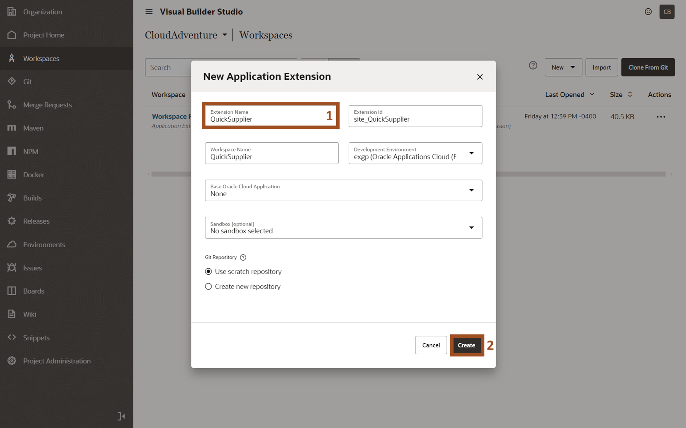
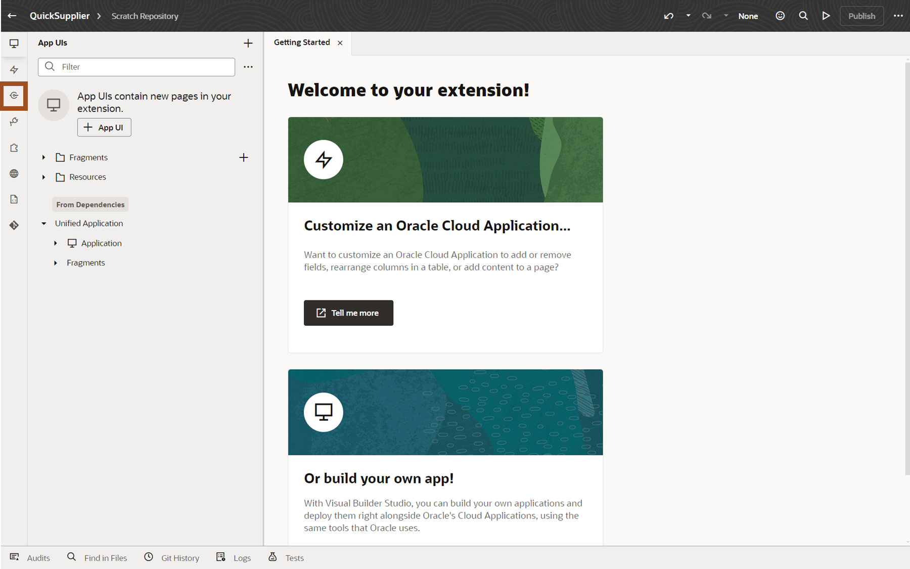
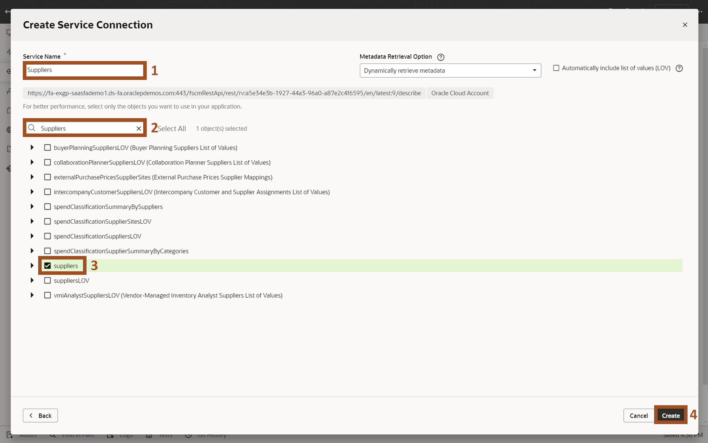
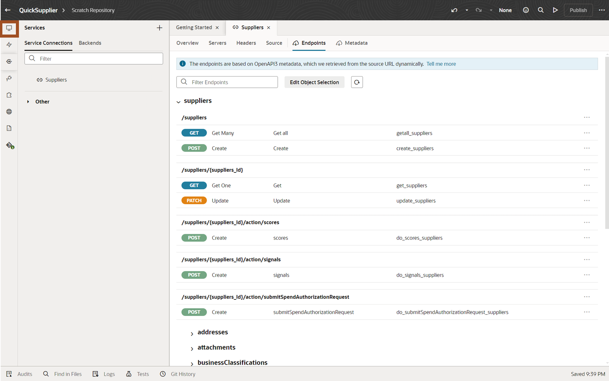
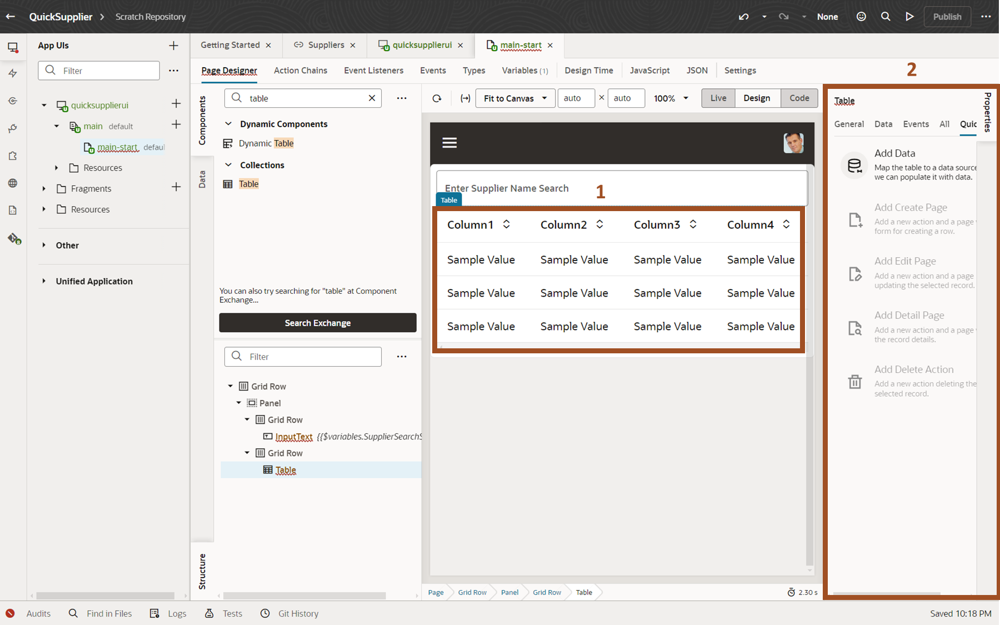

# Extend your SaaS Applications

## Introduction

Oracle Cloud Applications include an embedded tool called Visual Builder.  Visual Builder is the same tool that Oracle uses to develop application screens and it's available for you to create additional screens.  These screens can leverage both Oracle Cloud Application data and, if necessary, data from external systems.

### Objectives

In this lab, you will use Visual Builder to create additional screens

Estimated Time: 15 minutes

Do not forget to answer the Adventure Check Point questions at the end of the exercise!

## ERP & SCM: Create a simplified user interface using Redwood Design Patterns and Oracle Visual Builder

1. In this lab, you will Use Visual Builder to build a new Supplier Screen.

2. We will now create a new application screen to allow editing of specific supplier information.  Oracle Cloud Applications include an embedded tool called Visual Builder.  Visual Builder is the same tool that Oracle uses to develop application screens and it's available for you to create additional screens.  These screens can leverage both Oracle Cloud Application data and, if necessary, data from external systems.

    > (1) **Click** on the **‘Configuration’** tab.  
    > (2) **Click** on the **‘Visual Builder’** tile  

    

3. We have pre-defined a Project.  A project collects all the people, tools, and processes you need to complete a unit of work.  You can use a project to host source code files, track issues, collaborate on code, and build and deploy your applications. If your team is extending Oracle Cloud Applications, you’ll probably want to set things up so that you have a single project dedicated to work with a single repository for each Application.

    > **Click** on the **‘CloudAdventure’** project

    

4. Workspaces allow you to segregate units of work within a Project.

    > **Click** on the **‘Manage Workspaces’** link.  If your Project has no pre-existing workspaces, you'll be presented with a **‘Go to Workspaces’** button to click instead.  The following screenshots show both potential screens.

    
    

5. We'll create a new workspace for our simplified supplier screen

    > (1) **Click** on the **‘New’**  dropdown  
    > (2) **Select** **‘New Application Extension’** from the resulting dropdown

    

6. We'll name our new Extension.

    > (1) **Enter** **‘QuickSupplier#’** in the "'Extension Name'" field. 
    > (2) **Click** the **‘Create’** button

    

7. We're now at the Visual Builder homepage.  We can configure existing screens, create new ones, or build whole new applications.  We can also leverage REST APIs to access Fusion SaaS Data.  Supplier data from Oracle ERP/SCM Cloud, so we'll leverage the embedded integration via REST APIs.

    > (1) **Click** the **‘Services’**  icon on the left menu.

    

8. We can add services from Oracle Cloud Applications or other accessible data sources.

    > (1) **Click** on the **‘+ Service Connection’** button.

    

9. There are multiple ways to reference a service.  We'll use the included catalog of Oracle Cloud Application services.

    > **Click** on the **‘Select from Catalog’** tile.

    

10. Services are available for functionality across the Oracle Cloud Applications.

    > **Click** on the **‘‘Enterprise Resource Planning and Supply Chain’** tile.

    

11. We'll use the Supplier Service from the ERP/SCM Catalog.

    > (1) **Enter** ‘Suppliers’ in the 'Supplier Name' field.  
    > (2) Enter ‘Suppliers’ in the ‘Filter Objects/Endpoints’ field.  
    > (3) Click the ‘Checkbox’ next to ‘Suppliers’.  
    > (4) Click the ‘Create’ button.  

    

12. The resulting screen shows additional configuration options for our supplier service, but we'll just use the default settings.  We can also see the Endpoints details related to our Suppliers service.

    > **Click** on the **‘Endpoints’** tab as shown.

    

13. Here we see the various operations and data objects available.  This includes Get, Post and Patch operations allowing for query, create and update actions  Scrolling this window we can see that other related information is also available, including addresses, attachments, contacts, descriptive flexfields and more. Now we want to start creating our new screen.

    > **Click** on the **‘App UIs’**  icon in the left toolbar

    

14. You can now see the App UI panel on the left hand side.  This allows you to create you new page.

    > **Click** on the **‘+ App UI’** button.

    

15. You can name your App UI.

    > (1) **Enter** **‘QuickSupplierUI’** in the "'App UI Name'" field. 
    > (2) **Click** the **‘Create’** button.

    

16. Visual Builder has automatically created a default UI leveraging the Oracle provided Redwood template.  Redwood is Oracle's design methodology and pre-defined templates, and design patterns are included in Visual Builder to allow you to create applications that look and function just like Oracle delivered applications.

    > **Double-Click** the **‘main-start’** object.

    

17. Here we see our blank template and a list of some of the provided Redwood design components.  We want to start by adding some components to the screen to hold our data.

    > (1) Confirm you’re in the **Components** tab.  
    > (2) Type **Panel** in the **‘filter’** field.  
    > (3) Drag **Panel** to the dashed rectangle object and drop it in the blue columns that appear (4) shown.

    

18. Next, you'll add a component to the panel.  The first component we add with be an Input Text field to allow for searching.

    > (1) Confirm you’re in the **Components** tab.  
    > (2) Type **text** in the **‘filter’** field.  
    > (3) Drag **Input Text**  and drop in the blue section that appears when you drop into the Panel (4).

    

19. In the next 2 steps, you'll add label to your search field and create a page variable.  You can start with the label.

    > (1) Type **Enter Supplier Name Search** in the **Label Hint** field on the **General** tab of the **Properties** panel on the right.  
    > (2) Click the **Data** tab in the **Properties** panel.  

    

20. Create a page variable to save the contents of your new Input Text field

    > (1) Click the (x) icon on the top right of the Value field.  If the (x) is not showing, move your cursor to the Value field and it will appear.  
    > (2) The **Variables** pop-up window will appear.  Click **Create** next to the **Page** option.

    

21. Name your page variable.

    > (1) Type **SupplierSearchString** in the ID Field. 
    > (2) Click the **Create** button.

    

22. You’ll now add a Table component to the Panel.

    > (1) Enter  **Table** in the **‘filter’** field.  
    > (2) Drag **Table** Table to the white space below your text field.  Be sure that it’s in the white space just below the text field and not in the brown section further down.

    

23. You now have a table to hold the data. Next, you’ll add the Supplier data from our REST API. You can use the Quick Start feature to help with this task.

    > (1) Click in the newly created **Table** region. 
    > (2) You should now see the Table Properties region appear on the right.

    

24. The Quick Start features simply common tasks.  You can use the Add Data Quick Start feature to show data from the Supplier REST API.

    > (1) Click the **'Quick Start'** table in the Table Properties area.  
    > (2) Click the **'Add Data'** tile.

    

25. You can see the various Supplier related data available from the Supplier REST API.  You’ll just use the Suppliers data for this scenario.

    > (1)  Click **'Suppliers'** to expand the Suppliers region.  
    > (2)  Click **'Suppliers'** tile.  
    > (3) Click the **Next** button.

    

26. You’ll select a few fields to display on the new screen.  This screen will be used to search for Suppliers and allow for quick update of a few pieces of Supplier Data.

    > (1)  Click **'Checkbox'** next to the following fields.  You’ll need to scroll the Endpoint Structure to see the Supplier field:  
           - Alias  
           - AlternateName 
           - Supplier 
    > (2) Confirm the list of selected fields.  
    > (3) Click the **Next** button.

    

27. Here you can configure the search field.

    > (1) Click on the **filterCriterion** field in the Target section of the screen.  This will cause a **Click to add condition** option to appear at the bottom of the screen.  
    > (2) Click the **Click to add condition** link.

    

28. The next 3 steps will configure the Condition for the filterCriterion.

    > (1) Type **Supplier** in the first field and pick **Supplier** from the resulting pop-up list (2).

    

29. Next you'll select the Operator

    > (1) Click in the **Operator** field and select **contains ($co)** from the resulting pop-up list (2).

    

30. And now you'll reference the page variable that we created earlier.

    > (1) Click in the **Attribute** field. 
    > (2) Select **$variables.SupplierSearchString** from the resulting pop-up list.  
    > (3) Click in the **Finish** button.

    

31. Notice that the screen auto-queried Supplier Information.  You can easily move between Design, Live and Code views of our application.  But next, you want the ability to edit data.  So, you’ll use the Quick Start again to add an edit page.

    > (1) Confirm that you're on the **Quick Start** tab.  
    > (2) Click the **Add Edit Page** tile.

    

32. You can select the same or different fields for out Edit Page.  Since the request was to create a simple page, you'll just add a few fields.

     > (1)  Click **'Checkbox'** next to the following fields.  Note that you will likely need to scroll the list of fields:  

      - Supplier 
      - SupplierNumber 
      - TaxpayerId 

    > (2)  Confirm the list of selected fields.  
    > (3) Click the **Finish** button.

    

33. You're ready to try your new page.

    > Click the **Preview**  icon on the top right of the screen.

    

34. A new browser tab is launched showing our completed application.  You now have a fully functioning screen that supports query and update capabilities.

    > (1) Enter your search criteria by entering a string in the **Enter Supplier Name Search** field.  You can use **Corp** like shown in the screenshot or enter your **user number (##)** to find the Supplier with your number included as part of the name.   
    > (2) Select a Supplier record by clicking on it (the row will highlight)  
    > (2) Click the **Edit Supplier** button.

    

35. You Edit Supplier screen allows you to update the information and save. The new screen leverages the security and business rules of the application via the standard REST API.

    > (1) Note that the Supplier Number field is non-enterable.  That field is non-updateable and that condition automatically carries through to our new screen.   
    > (2) The Taxpayer ID is enterable, but we’ll end here without doing the update.

    

36. Adventure awaits, click on the image and show what you know, and rise to the top of the leader board!!!

    

## Summary

The two tasks of this Extension adventure introduced you to a few of the capabilities that customers can leverage to extend Oracle Fusion Cloud applications.  These features allow you to fine tune your Oracle Fusion Cloud Applications for peak performance, business processes tailored to you requirements, and fast, efficient usage.

You learned how to extend the applications using Oracle Visual Builder Studio to create new screens that leverage both Oracle and non-Oracle data. You also learned how to setup and defined a Guided Journey, which provides your users with the real-time, inline guidance and information required to complete their tasks.

You also learned how to leverage 3rd party Generative AI capabilities by leveraging external LLMs directly from the Guided Journey feature of Oracle Fusion Cloud Applications.
So, check your with you team, double-check your racing harness and get ready for our next Adventure.

## Learn More

- [Extending Oracle Cloud Applications with Visual Builder Studio](https://docs.oracle.com/en/cloud/paas/visual-builder/visualbuilder-building-appui)
- [Overview of Guided Journeys](https://docs.oracle.com/en/cloud/saas/human-resources/24c/faijh/overview-of-guided-journeys.html)
- [Configure User Defined Content Task Type for a Journey](https://docs.oracle.com/en/cloud/saas/human-resources/24c/faijh/configure-user-defined-content-task-type-for-a-journey.html)
- [Oracle Documentation](http://docs.oracle.com)

## Acknowledgements

- **Author** - Charlie Moff, Distinguished Cloud Technologist, Advanced Technology Services; Stephen Chung, Principal SaaS Cloud Technologist, Advanced Technology Services

- **Contributors** - Sajid Saleem, Master Principal SaaS Cloud Technologist, Advanced Technology Services
- **Last Updated By/Date** - Charlie Moff, April 2025
