# Extend your SaaS Applications

## Introduction

In this activity you will learn how easily extend Fusion SaaS application to include external content to guide users to better decisions.

Estimated Time: 15 minutes

### Objectives

In this lab, you will:

* Create a Guided Journey that leverages an external LLM

 
  
  
 
## Task 1: Guided Journeys with User Defined Content

Guided Journeys allow you to configure business processes to support user tasks by providing guidance, such as additional information, tutorials, company policies, best practices and more. The User Defined Content feature of a Guided Journey Task allows users to define guided journey tasks and connect to a user defined REST API. The user defined REST API can retrieve data from external sources based on the context information passed from the calling user interface.

As a Pit Crew member and the Oracle SaaS Business Process and Configuration expert for your organization, you’re up to the task.

**Objectives** 
In this activity you will use a Guided Journey Task with USer Defined Content and  and Visual Builder Studio.  You will:

   &emsp;  • Link the Guided Journey Task with User Defined Content with a pre-configured Generative AI endpoint  
   &emsp;  • Configure Self Service Procurement Shopping Cart to include the configured Checklist Template  
   &emsp;  • Preview your changes to see how you can now access real-time reviews from your cart.

As you follow along, do not forget to answer the Adventure Check Point questions! 

1. The first step to creating our Guided Journey is to setup a Checklist Template, which defines the tasks related to our Guided Journey.

    > (1) Enter **Checklist Templates** in the search field at the top of the home page.       
    > (2) Select **Checklist Templates** from the resulting dropdown search results.  

    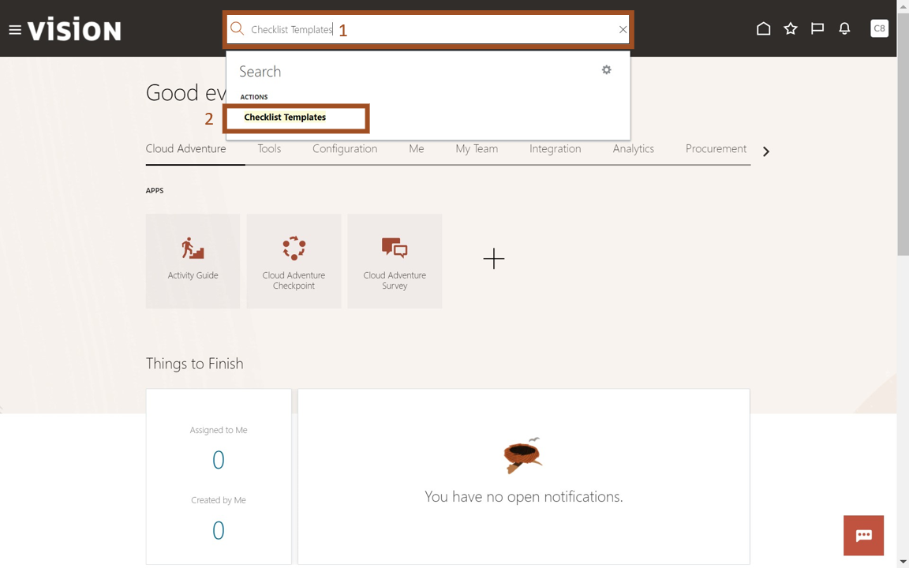
 

2. The first step is to configure a Checklist Template to include the Guided Journey Task. We’ve already setup Checklist Templates for each Cloud Adventure User, so you'll start by searching for your specific template.

    > (1) Enter **CA&#95;##** in the **search** field, **where ## is your assigned user number**.  
    

    > (2) Click the **Magnifying Glass**  icon or press the **Enter** key to execute the search.

    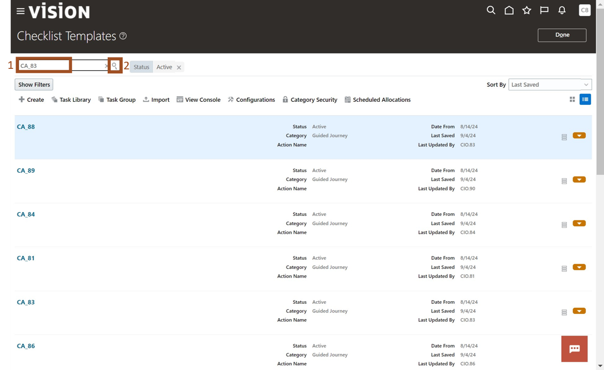  
 

3. 

    > Click your **Checklist Template name** (e.g. **CA&#95;##**) to open the checklist.

    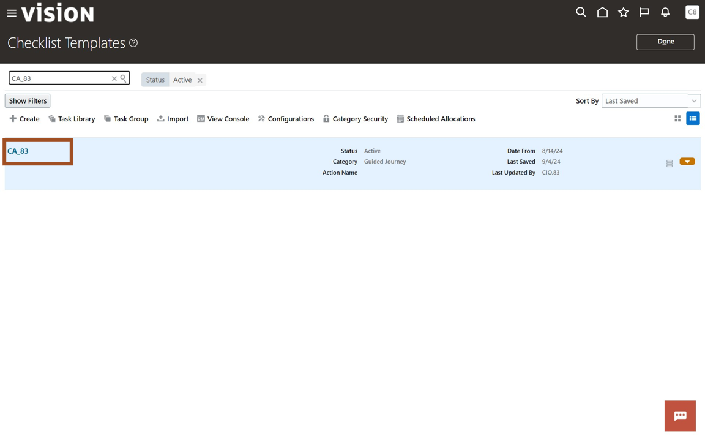  
 

4. You can see the general information for your Checklist.  You’re now ready to add a Task. 
   
    > **Click** on the **Tasks** tab.
  
    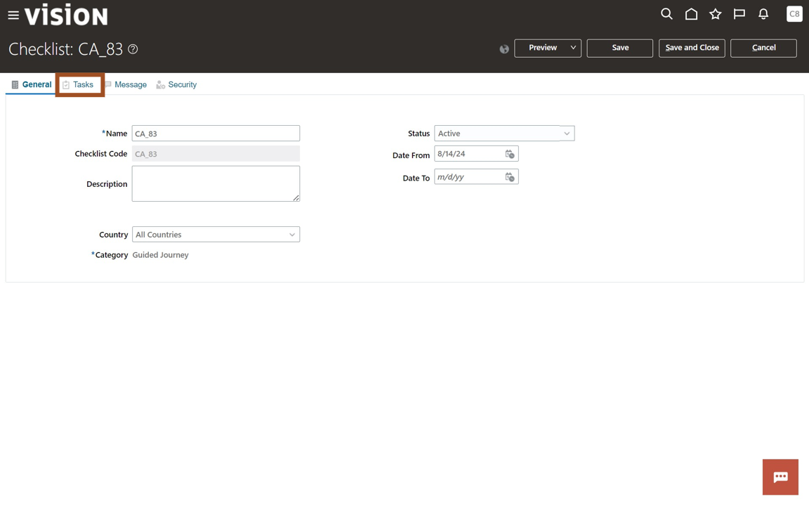  
 

5. You don’t have any tasks yet, so you can create one.  The task is where you will define the connection to the external LLM.

    > (1) Click the  icon.  

    > (2) Click **Create Task** from the resulting popup.  

    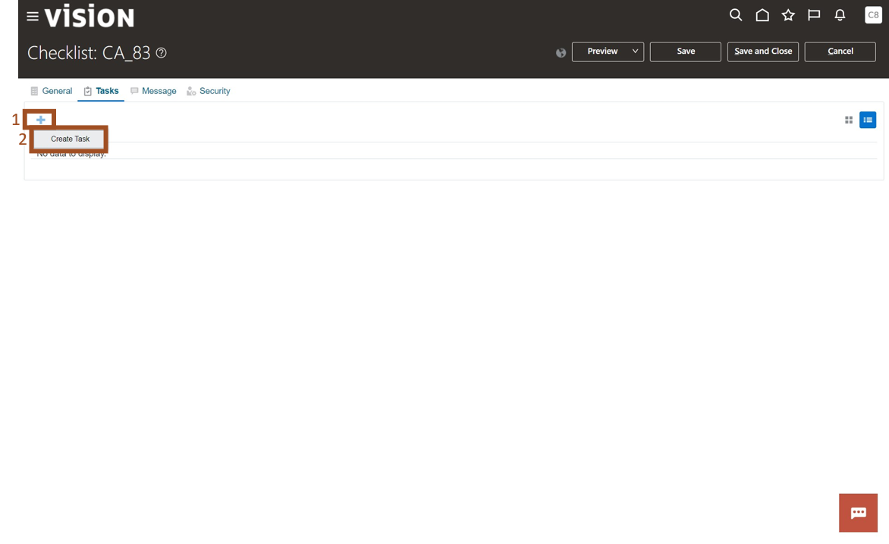  
 

6. You can now define your new task and leverage the task type User Defined Content. This will allow you to reference the REST Integration that was discussed at the beginning of the adventure.  It will link to a pre-configured Generative AI LLM endpoint.

   > Complete the following fields as shown:  
   > &emsp;&#8226;&emsp;Name(1): Type **Product Items Review** 
   > &emsp;&#8226;&emsp;Task Type(2): Select **User Defined Content** from the dropdown 
   > &emsp;&#8226;&emsp;Configuration(3): Select **SCM&#95;GJ&#95;GenAI&#95;OCILlama3&#95;Endpoint** from the dropdown  
   > &emsp;&#8226;&emsp;(4) Click the **Save and Close** button.

   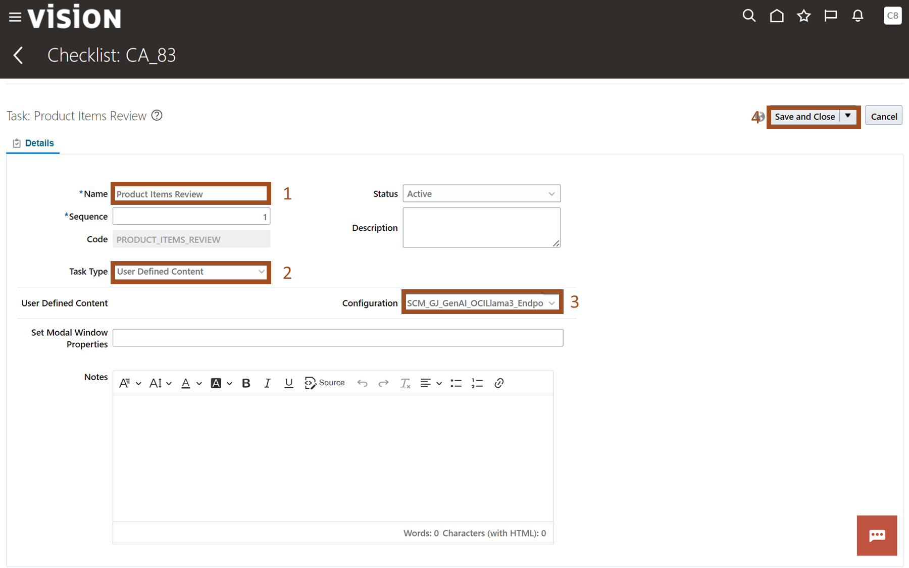  
 

7. You have successfully configured a new Guided Journey Task with User Defined Content. Now you are ready to include this new change in Self-Service Procurement.

   > Click on **Save and Close** button again to finalize our Task setup.

  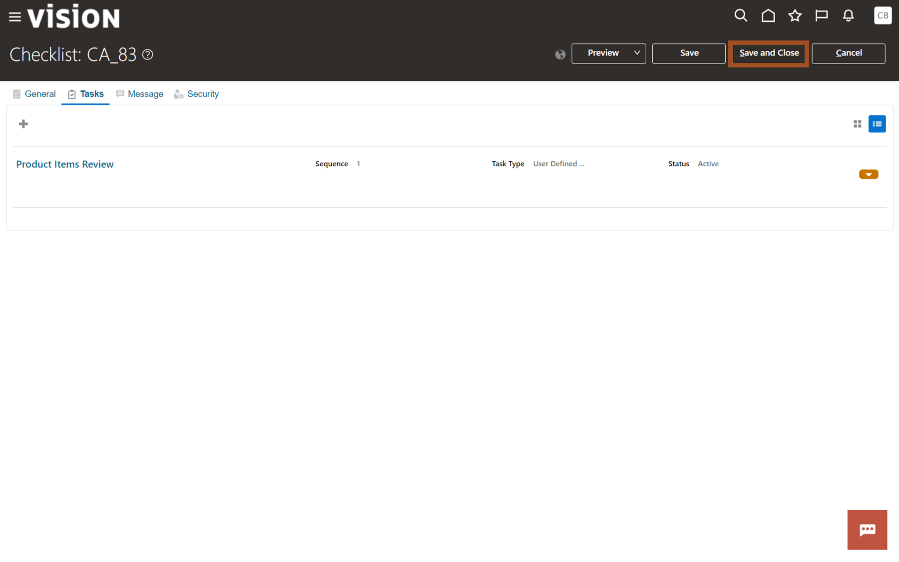  
 

8. The next step is to create a Requisition using Self-Service Procurement.  To start this you can head back to the home page.

   > Click on the **Home**   icon on the top icon bar.
    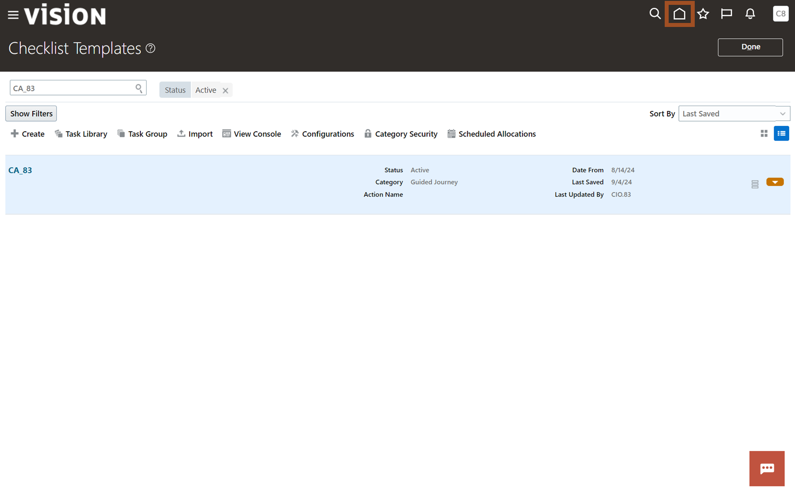  
 

9. To start creating a Purchase Requisition:

   > (1) Enter **Purchase Requisitions** into the **search** field at the top of the page.      
   > (2) Select **Purchase Requisitions** from the resulting **dropdown** list.

   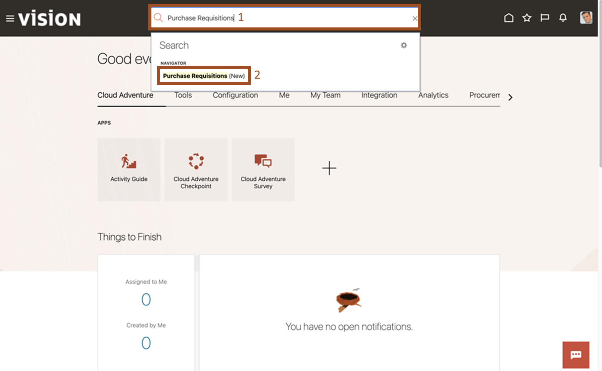  
 

10. You're going to purchase a couple of pieces of equipment for our office space.  You need a headset for phonecalls and a new printer.  So, let's see what's available.

   > Click the **OFfice Technology** tile on the bottom right.

   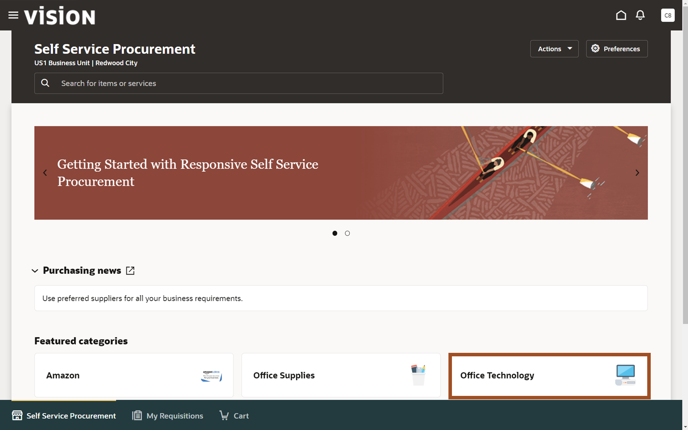  
 

11. You can see a variety of headsets available. Let's pick one.

   > Click the **Add to Cart** button for the **Logitech Zone Wireless Bluetooth Headset** tile.      

   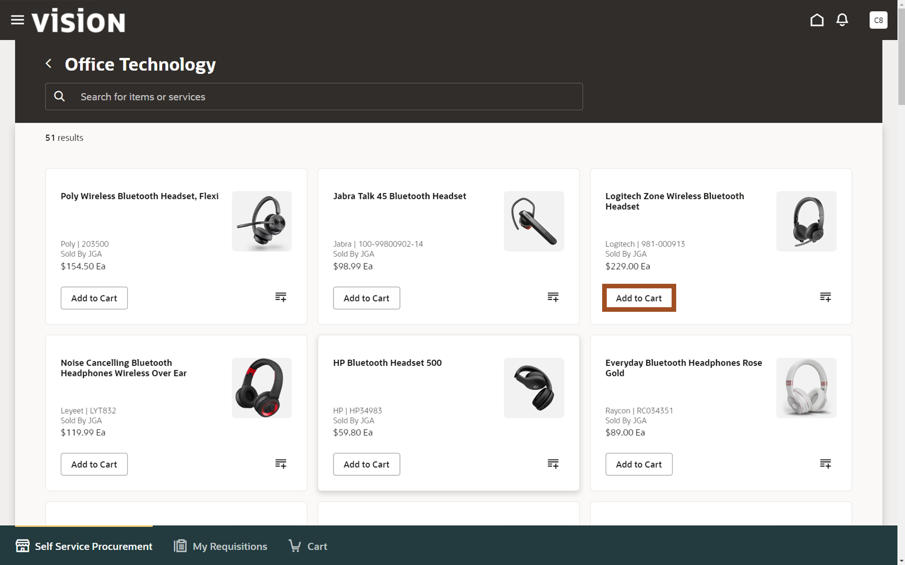  
 

12. You've now added that item to the cart.  You will receive a confirmation pop-up.  You have the option of waiting a few seconds for the confirmation pop-up to disappear or you can click the **X** icon on the **Confirmation** pop-up to close it.

   > Either wait for the pop-up to disappear or click the **X** icon on the **Confirmation** pop-up to close it. 

   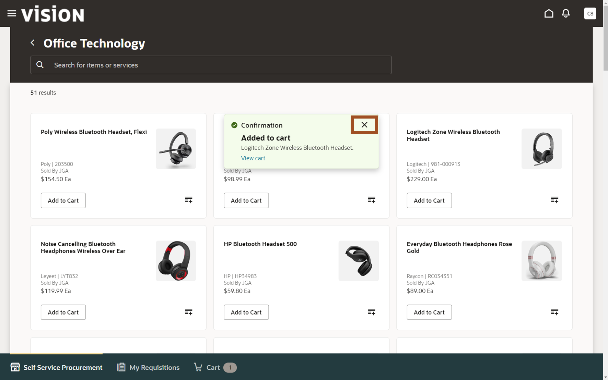  
 

13. You want to add one more thing to this requisition.  This time you'll use the search feature.

   > Enter **LasetJet** in the **Search for items or services** field 

   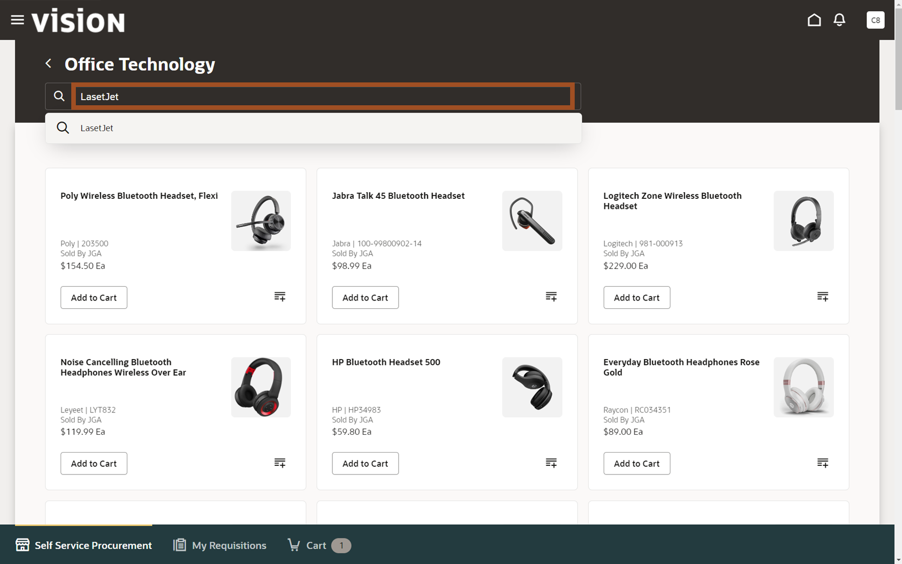  
 

14. You want to add one more thing to this requisition.  This time you'll use the search feature.

   > Click the **Add to Cart** button for the **LaserJet Pro 400 M401n Laser Printer** tile.     

   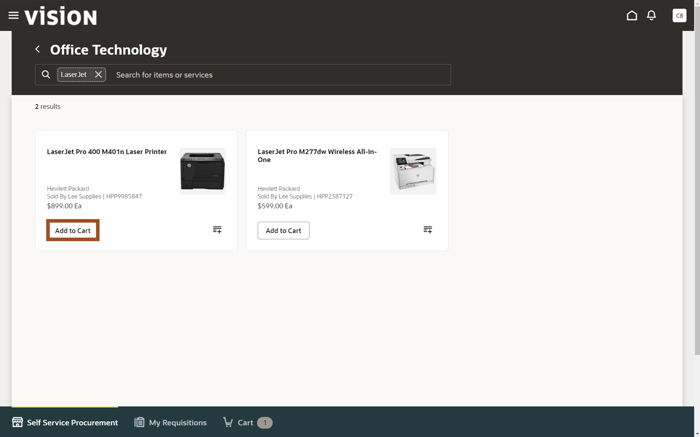  
 

15. You've now added that item to the cart.  You will receive a confirmation pop-up.  You have the option of waiting a few seconds for the confirmation pop-up to disappear or you can click the **X** icon on the **Confirmation** pop-up to close it.

   > Either wait for the pop-up to disappear or click the **X** icon on the **Confirmation** pop-up to close it. 

   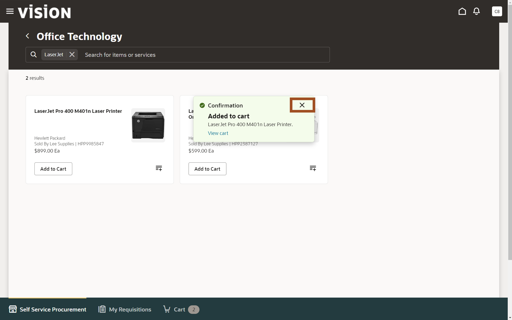  
 

16. You're now ready to view your cart.  

   > Click the **Cart** icon on the bottom of the screen. 

   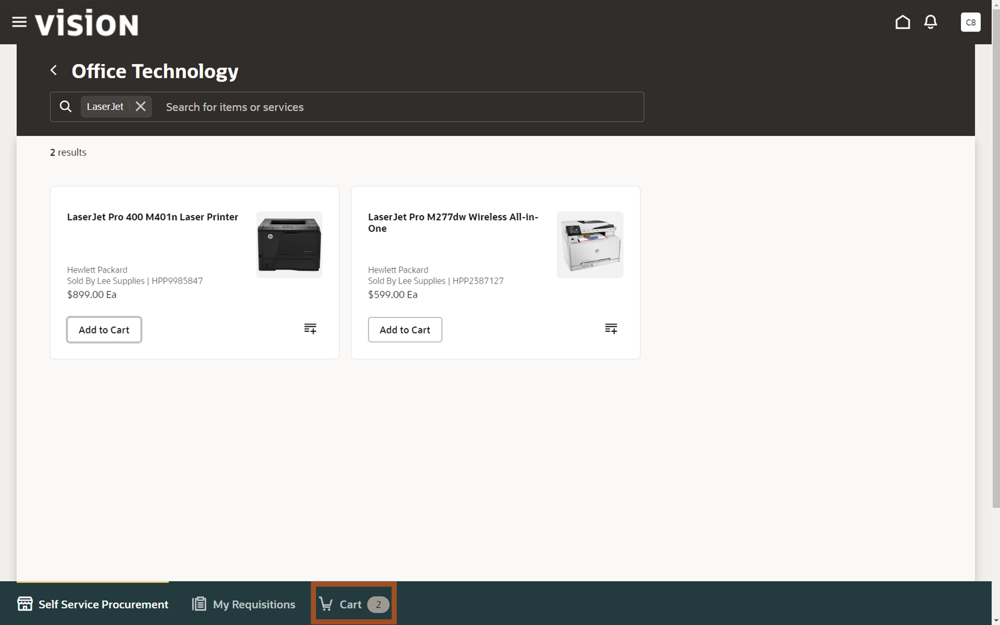  
 

17. You will now use the embedded Visual Builder Studio tool to configure this page. The configuration will allow you to reference your previously defined Guided Journey and Task. Visual Builder is the tool that Oracle uses to develop Fusion Cloud Application screens.  Customers can use these same tools to perform configurations or, as we saw in other adventures, create new screens using the same look and feel as the delivered applications.

   > (1) Click the **User Photo/User ID icon** on the top right corner of the screen.      
   > (2) Select **Edit Page in Visual Builder Studio** from the resulting dropdown list.

   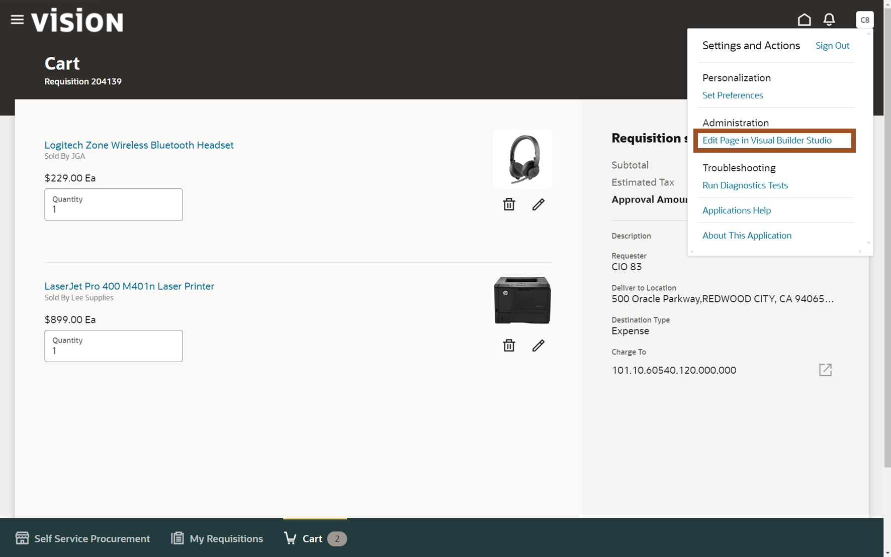  
 

198. You’re now in Visual Builder – Express Mode.  This allows you to easily configure application screens.  In this scenario, you’ll be referencing the Guided Journey/Task that you created earlier.

   > (1) Enter **Journey** in the **Page Properties Filter** field on the right.  This will narrow the list of Page Properties available.      
   > (2) Enter **CA&#95;##** in the **Shopping Cart Guided Journey Code** field and press the **Enter** key.  Be careful to enter this into the correct field as there are several similar fields available.  If you searched as described in Step 1, it’s likely the 1st field listed below the filter.

   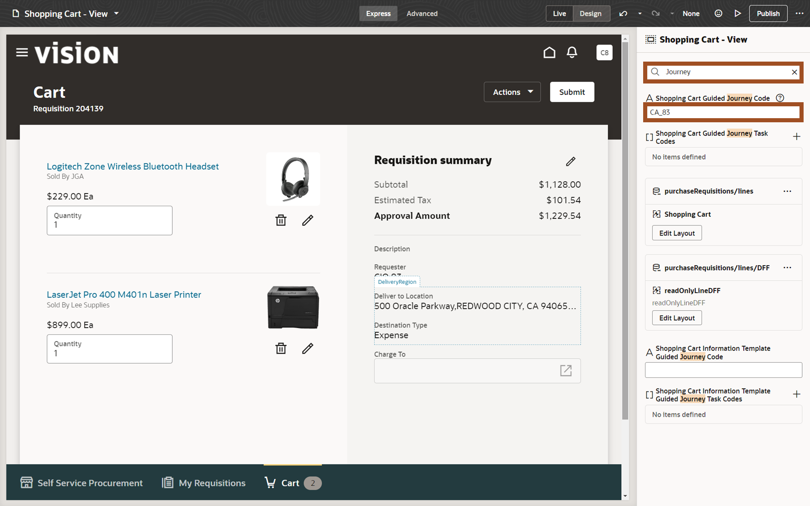  
 

19. You will now see the Product Items Review graphic on the screen.  This was defined in the Category Template at the beginning of this adventure.  You will now test this by running the screen in Preview mode.

   > Click the **Preview**  icon in the top right of the screen.

   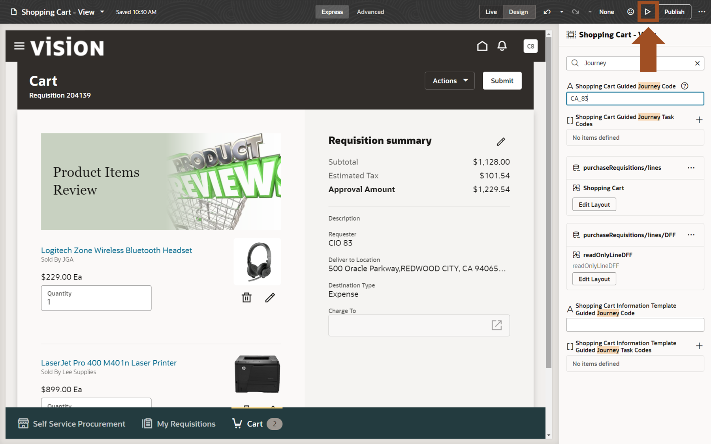  

20. You are now back in Self-Service Procurement and you can see that your 2 items are in the cart.  So, you will now open your cart.

   > Click the **Cart** icon on the bottom of the screen. 

   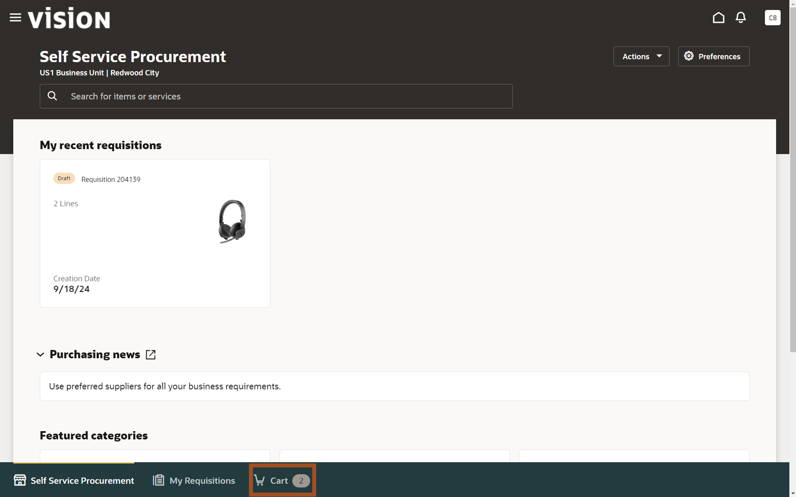  
 

21. The **Product Items Review** image is prominently displayed. Clicking it will call an external Gen AI Service to gather review information about the items in your cart.

   > Click the **Product Items Review** image. 

   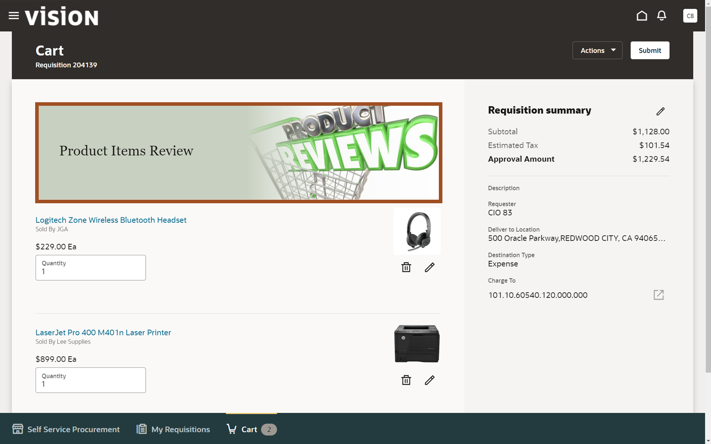  
 

22. The Guided Journey Task has called your User Defined Content integration.  As discussed in the introduction to this adventure, it calls Oracle Integration to gather additional prompt information, such as Position and New York, prior to our Generative AI call to the external LLM.  The results are then formatted and displayed as shown.

   > (1) When finished reviewing the result, you can close your browser tabs and exit the Oracle Cloud Application UI.

   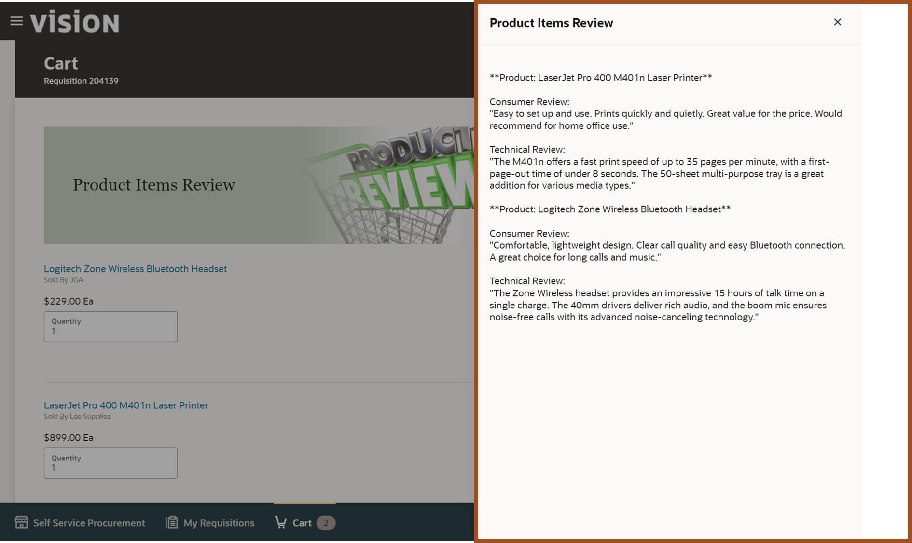

23. Adventure awaits, click on the image and show what you know, and rise to the top of the leader board!!!
    
     

## Summary

This Extension adventure introduced you to a few of the capabilities that customers can leverage to extend Oracle Fusion Cloud applications.  These features allow you to fine tune your Oracle Fusion Cloud Applications for peak performance, business processes tailored to you requirements, and fast, efficient usage.

 You learned how to setup and defined a Guided Journey, which provies your users with the real-time, inline guidance and information required to complete their tasks.  

You also learned how to leverage 3rd party Generative AI capabilities by leveraging external LLMs directly from the Guided Journey feature of Oracle Fusion Cloud Applications.  

So, check your with you team, double-check your racing harness and get ready for our next Adventure.

## Learn More

* [Oracle Documentation](http://docs.oracle.com)
* [Overview of Guided Journeys](https://docs.oracle.com/en/cloud/saas/human-resources/24c/faijh/overview-of-guided-journeys.html)
* [Configure User Defined Content Task Type for a Journey](https://docs.oracle.com/en/cloud/saas/human-resources/24c/faijh/configure-user-defined-content-task-type-for-a-journey.html)

## Acknowledgements
* **Author** - Charlie Moff, Distinguished Cloud Technologist, Advanced Technology Services; Stephen Chung, Principal Cloud Technologist, Advanced Technology Services
* **Contributors** - Sajid Saleem, Master Principal SaaS Cloud Technologist, Advanced Technology Services  
* **Last Updated By/Date** - Charlie Moff, September 2024 