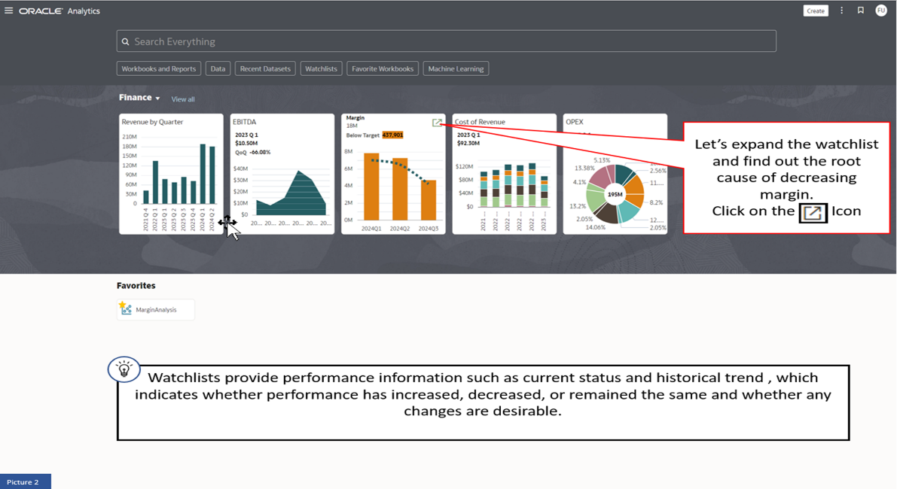
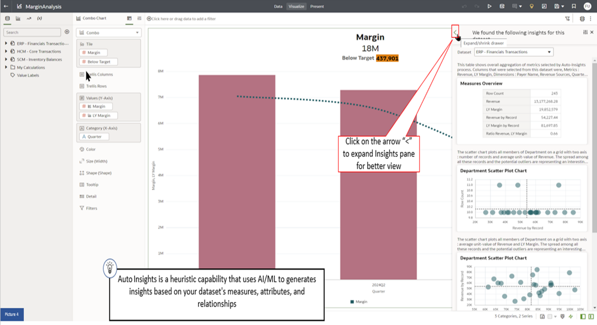
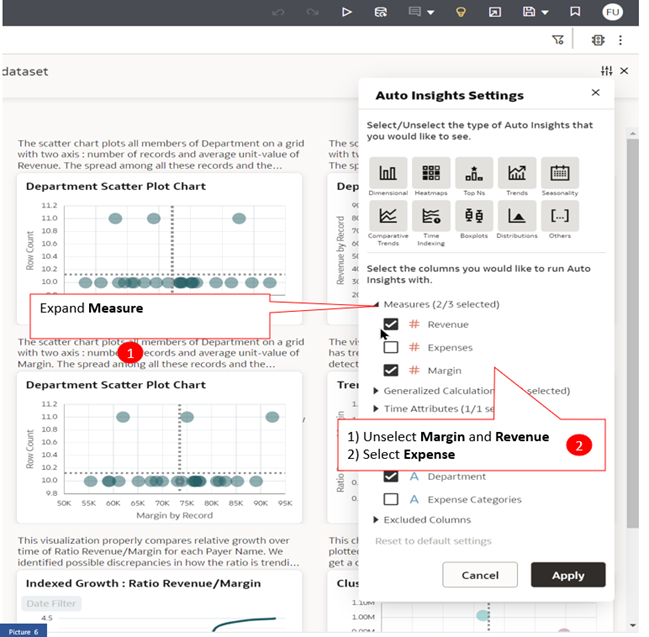
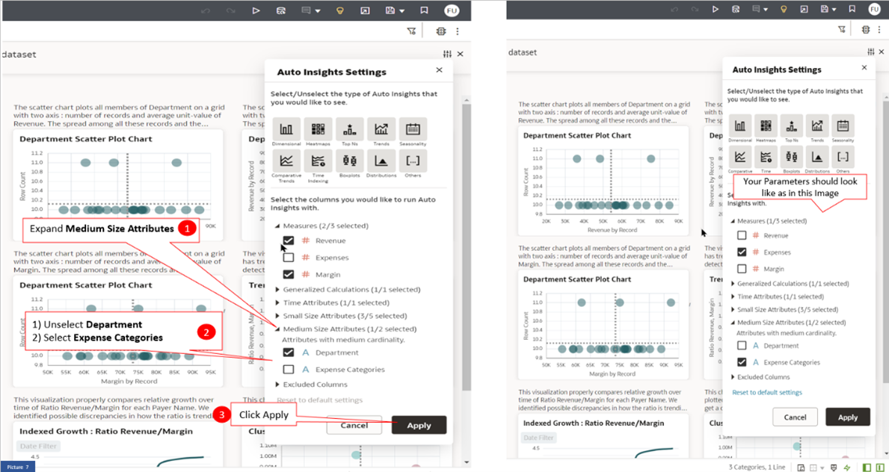
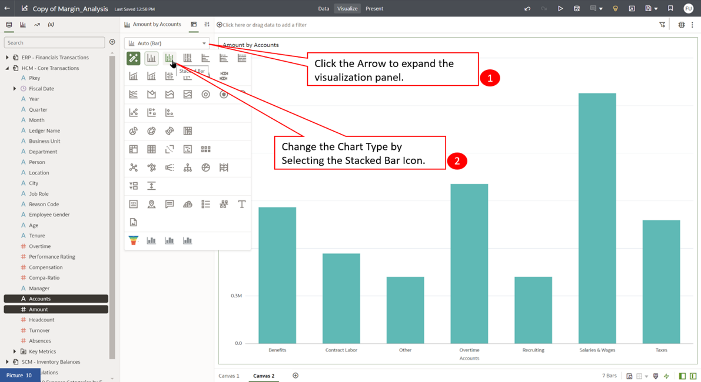
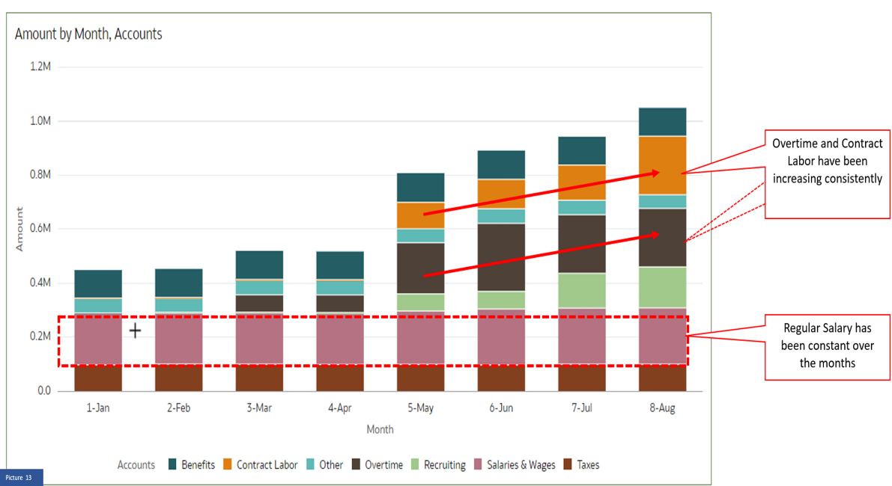
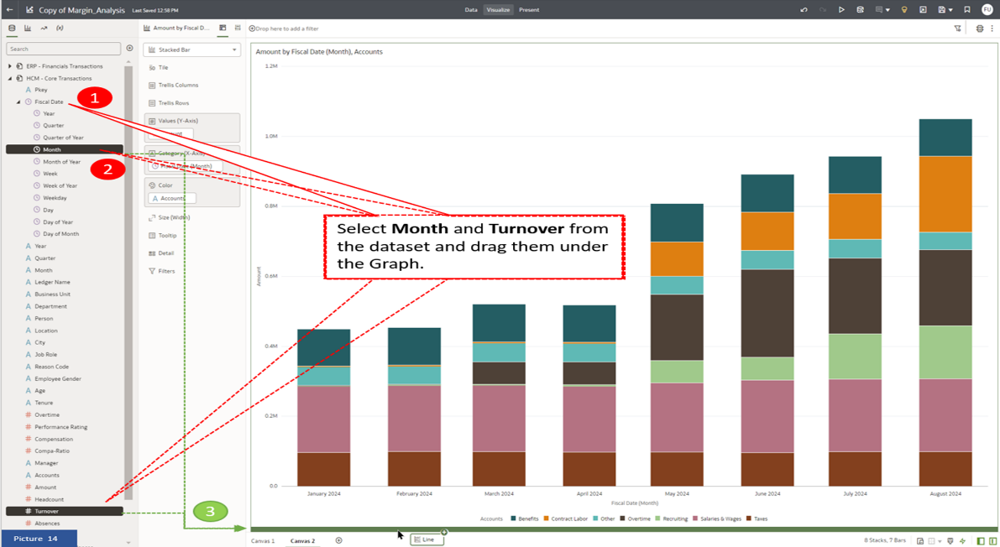

# Analytics
 
## Introduction

Oracle Fusion Data Intelligence Platform is a family of prebuilt, cloud native analytics applications for Oracle Cloud Applications that provides line-of-business users with ready-to-use insights to improve decision-making.

It is a Cloud application that delivers best-practice Key Performance Indicators (KPIs) and deep analyses to help decision-makers run their businesses and individual contributors to operate their businesses. Oracle Fusion Data Intelligence Platform is built on top of Oracle Analytics Cloud and Oracle Autonomous Data Warehouse. This packaged service starts with Oracle Fusion Cloud Applications which you can deploy rapidly, personalize, and extend. The \\
service extracts data from your Oracle Fusion Cloud Applications and and loads it into an instance of Oracle Autonomous Data Warehouse. Business users can then create and customize dashboards in Oracle Analytics Cloud. It empowers business users with industry-leading, AI-powered, self-service analytics capabilities for data preparation, visualization, enterprise reporting, augmented analysis, and natural language processing.

This activity guide helps business users to investigate and research data, ask relevant questions to understand Trends, Patterns and Outliers.
 

Estimated Time: 15 minutes

### Objectives

In this activity, you will Create analytics across different lines of business to derive better business insight
 

## Task 1: Create analytics across different lines of business to derive better business insight

1. Oracle Fusion Data Intelligence Platform is a family of prebuilt, cloud-native analytics applications for Oracle Cloud Applications that provide line-of-business users with ready-to-use insights to improve decision-making. 

    Login to your Fusion Data Intelligence Portal using the URL provided.

    > Open a web browser and enter the URL provided, then on the login screen, type in the Username and Password. Click Sign In.

    

    After a successful login, you will land on the Oracle Analytics home page. 

2. A finance Watchlist comprising several Tiles is available on the home page. 

    One metric that draws my attention is Margin, which is trending low. 

    Two attributes that influence Margin are Revenue and Cost. Since revenue seems to be increasing, let's investigate Cost.

    > On the Margin Tile locate the Open Workbook Icon    on the top right corner and click on it.

    

3.  This action expands the Tile and opens the workbook. 

    Let's now set the workbook to design mode so that we can add cost elements. 

    > Click on the Edit Icon    as shown in the image.   

    Instead of building manually, let's use the Auto Insights feature.

    > Click on the Auto Insights Icon    as shown in the image.

    

4.  Next, let’s expand the Auto Insights pane for better observability. 

    > Click on the Expand / Shrink Icon    as shown in the image.

    

5.  Auto insights can be tuned to provide information necessary for our analysis, for example, Cost Analysis

    > Click the Settings Icon    as shown in the image.

    

6.  On the Settings tab, we will choose the attributes that are important to the analysis, which is cost-related information. 

    > (1) Expand **Measure**   
    
    > (2) Unselect **Margin** and **Revenue**, then Select **Expense**

    

    > (1) Expand **Medium Size Attributes**   
    
    > (2) Unselect **Department**   

    > (3) Select **Expense** 

    > (4) Click **Apply**

    

7.  The Auto Insights function has crawled the data set and brought expense-related information critical to our analysis. Let’s use the Top 10 Expenses by expense categories. 

    > (1) Locate the “Top 10 Expense Categories by Expenses” insight and click the Add Icon    shown in the image. This will add the Insight to the Canvas.   

    > (2) Click on the **x** sign to close the Insights pane.

    

8.  Now, we can compare margin and cost side by side. 

    Payroll expenses emerge as the highest cost. We will delve deeper into payroll expenses to identify their components. 

    Our next step involves integrating Human Resources data into our analysis.

    

9.  Combining datasets from multiple “Lines of Business” allows an individual to conduct a deep dive into the actual problems.

    > (1) Expand the HCM Core transactions data set from the Data Panel on the left.   

    > (2) At the bottom of the Page, click the plus icon    to add another Canvas, **Canvas 2**.  

    > (3) While holding “Shift,” multi-select the Amount and Account columns and drag them onto Canvas 2.

    

    > (1) Change the chart to a “Stacked Bar” type to visualize the data better.   

    > (2) Follow steps 1 and 2 as shown in the picture 10.
    
    

10.  We need to perform trend analysis to understand when the expense anomaly started occurring and whether it is consistent across all expense types.

    > Drag the **Accounts** column from the Categories section into the Color section.

    

    > Next, expand the Fiscal Date folder in the Data Panel, locate the **Month** column, and drag and drop it into the Categories section.

    

11.  We can now see expense amounts displayed across time and expense categories.

    On analyzing the trend, it appears that while Base Salary and Wages have remained constant, overtime and contract labor have increased since May.

    Let's explore and find out why overtime and contract labor have increased.  

    

12. Overtime and Contract labor are typically associated with Turnover. Let's see if it had any impact.

    > (1) Expand the Fiscal Date folder in the Data Panel to locate the **Month** and **Turnover** columns.    

    > (2) While holding “Ctrl,” multi-select the **Month** and **Turnover** columns and drag them below the current visual. 
    
    

13.  Another factor that impacts Overtime and Contract labor is employee absences. 

    > Drag the **Absences** column from the data panel and drop it in the values section below the **Turnover** column.

    

14.  This brings all relevant columns onto the canvas. We can now co-relate several attributes and arrive at the correct conclusion. 

    

15.  Let's change the chart type to understand trends and patterns better. 

    > (1) Select the line chart as shown in the Picture.    

    > (2) Click on the inverted triangle    in the Properties panel and select Bar Chart.

    

16.  We can now see the pattern clearly. Beginning in March, absences and turnover started increasing, which led to an increase in overtime and the hiring of contract labor.  This is ultimately reflected in the books of accounts in Finance. 

    > (1) Now that we have understood the root cause of the margin decline let's share our findings with others.   

    > (2) Click on the Present button in the brown ribbon.

    

17.  Oracle Analytics provides the ability to share your findings and content in a PowerPoint presentation mode.

    > (1) In the Workbook > Canvas Navigation toolbar on the left, click 'Style' and change from 'Bottom Tabs' to 'Navigation Bar'.   

    > (2) Next, click on the  Play Icon    in the top right corner to activate Present Mode. 

    

18.  Once in Present mode, you can go forward or backward, add notes, filters, etc, to tell your story.

    

19. Adventure awaits, click on the image and show what you know, and rise to the top of the leader board!!!
    
     

## Summary

You discovered how effortlessly Fusion Analytics enables the creation of content and analysis of data. By integrating diverse data sources, you were able to delve deeper from summary information to detailed analysis, uncovering root causes. You then shared your discoveries with a broader audience, making the insights accessible and impactful.

**You have successfully completed the Activity!**

## Acknowledgements
* **Author** - Sohel Jeelani, Analytics Solution Engineer, Advanced Technology Services
* **Contributors** -  
* **Last Updated By/Date** - Sohel Jeelani, August 2024
