# Audit

## Introduction

As you have seen in the previous Cloud Adventures, Oracle delivers a fine grained security model which allows companies to enforce tight controls over who has access to both application features and data. While these controls provide administrators with powerful tools, good corporate governance requires that application auditing is used to back up the security controls you implement.

For this Cloud Adventure, we have already used audit profiles to enable auditing on select fields in the applications.
You will begin the adventure by accessing the native application screens to update a supplier address. Each participant is assigned a supplier based on your login ID.

Once you update the address, your Guide will display the results of the audit API so you can see how your actions were captured automatically, then accessed using a REST API.
Included in your adventure is a quick tour of the REST API documentation. While this exercise is specific to extracting audit data, similar REST APIs were used in the previous Extend Cloud Adventure, and are available in every Oracle SaaS application.

We've designed this journey to be interactive and engaging. Make sure to answer the Adventure Check Point questions at the end, ensuring you capture the full potential of this experience. These check points are your path to becoming a master auditor, so pay close attention!

With your adventure hat on and a curious mind, prepare for an exhilarating exploration of Fusion Cloud data audit and REST API integration features. Let's embark on this thrilling journey together!

### **Objectives**

In this activity you will learn the power and ease of integrating Fusion SaaS application with upstream and downstream systems

Estimated Time: 15 minutes

Do not forget to answer the Adventure Check Point questions at the end of the exercise!

## ERP & SCM: Use REST API to pull Fusion SaaS Application audit data for use in any external system

1. In this activity you will learn the power and ease of integrating Fusion SaaS application with upstream and downstream systems

    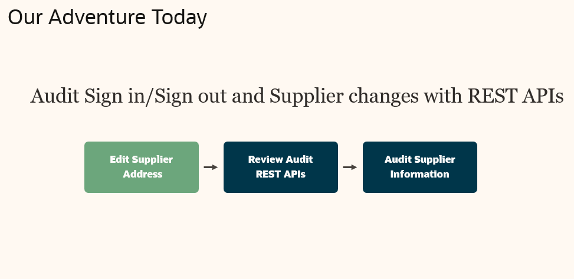

2. Let’s navigate to the Suppliers work area to modify a supplier’s address information

    > Click the **Procurement** tab

    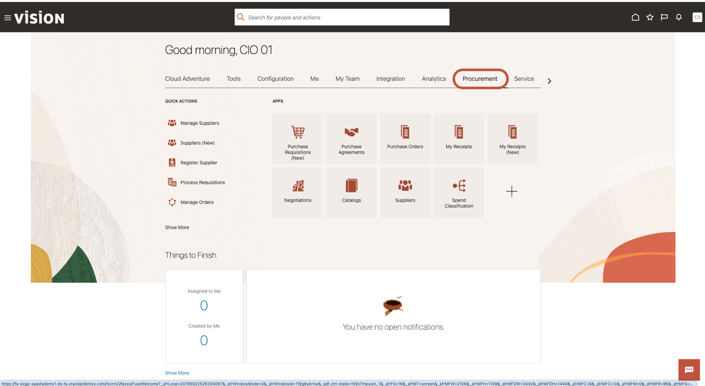

    > Click the **Manage Suppliers** button

    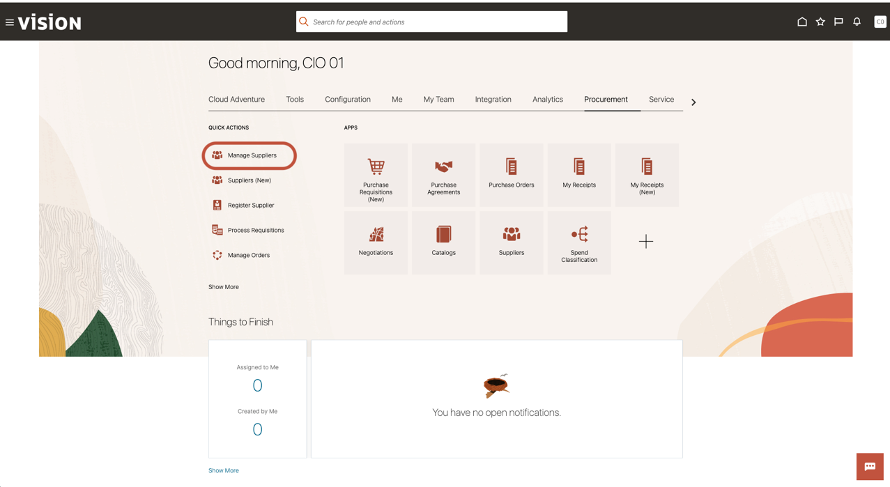

3. Next, we’re going to search for the Supplier you’ve been assigned, e.g. “01…”

    > Click in the **Keywords** search bar

    

    > (1) **Search** for a supplier using the user id number (e.g. 01, 02).   
    > (2) Click the **Search** button

    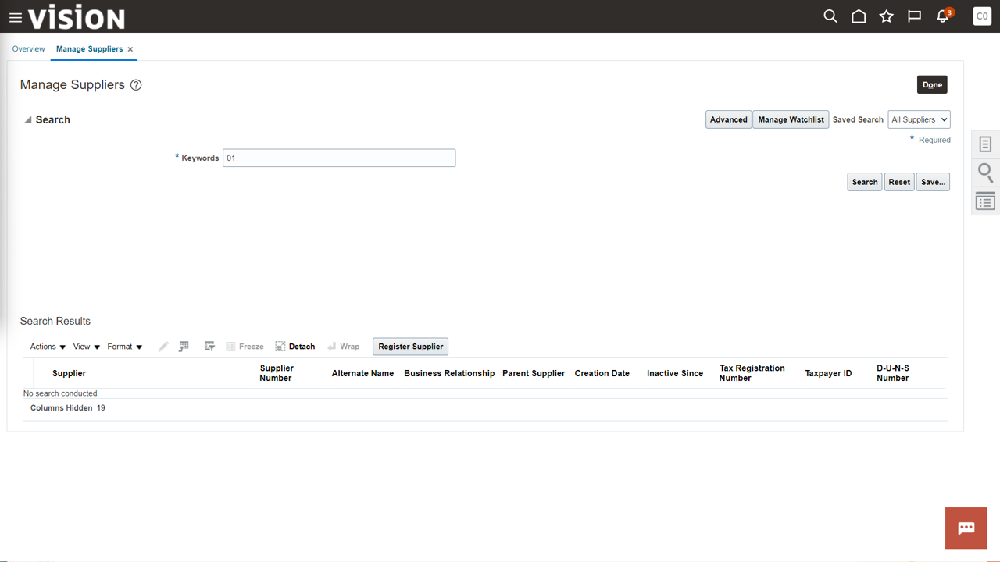

    > Click the **Edit**   button in the ‘Search Results’ area

    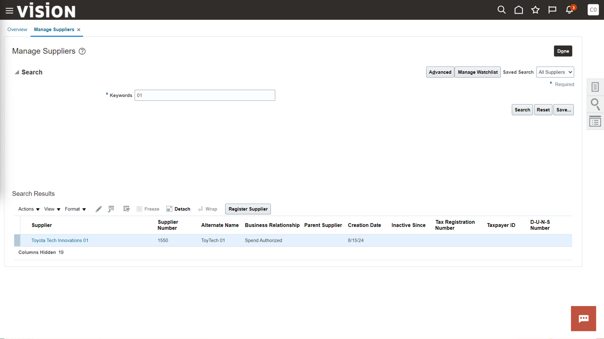

4. We’re going to navigate to the Supplier’s addresses tab.

    > Click the **Addresses** tab

    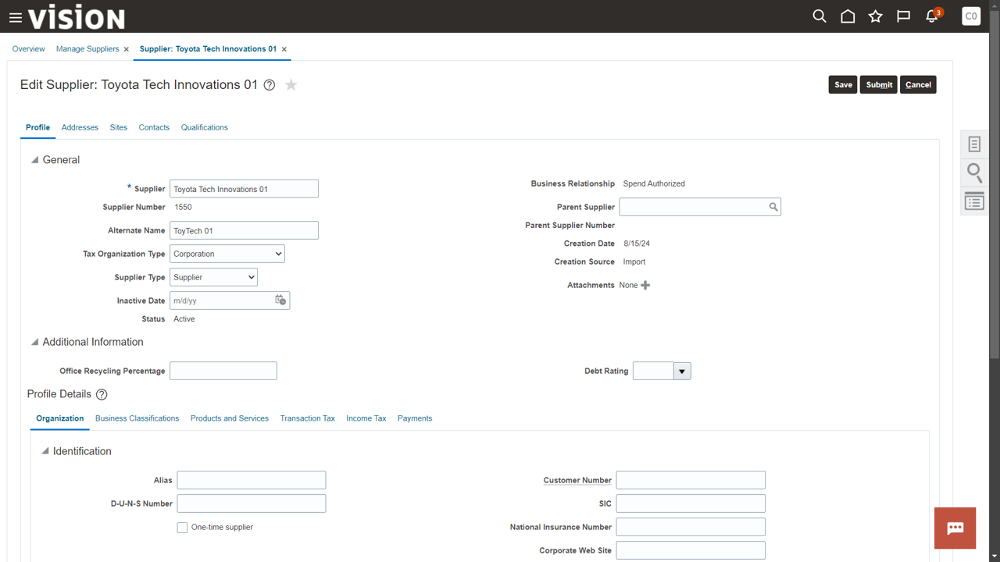

    > Click the **Edit**  icon to edit the Supplier’s address

    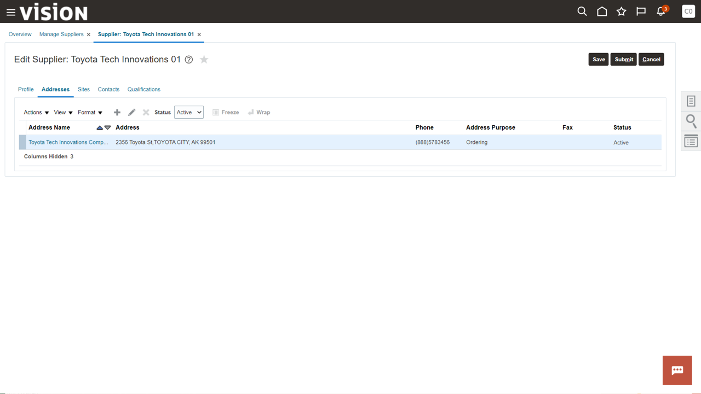

5. **Note:** We’ll only edit the Supplier’s second line of address information, i.e. ‘Address Line 2’ text entry field.

    We’re going to add a Suite (e.g. 123) to the Supplier’s address information that was missing before.

    > Click in the **Address Line 2** text entry field

    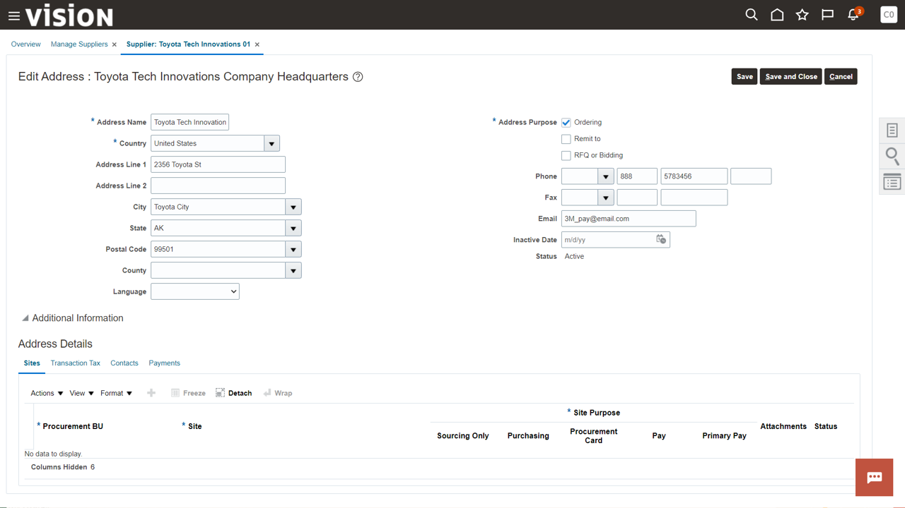

    > Type new address information into **Address Line 2**, e.g. ‘Suite 123’

    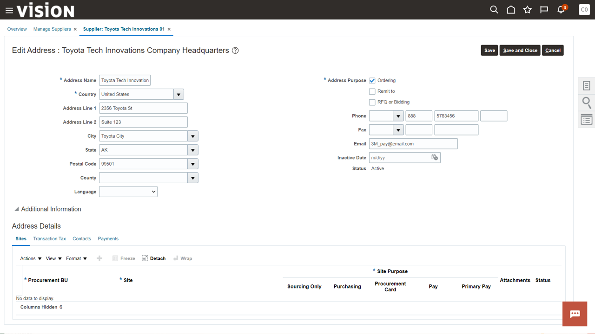

    > Click **Save and Close**

    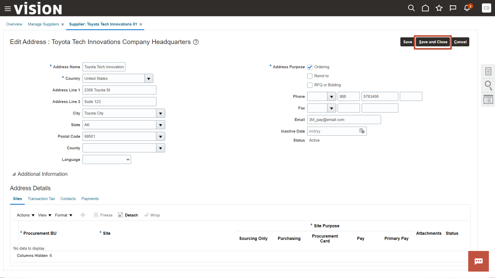

    > Click **Submit**

    

6. **Note:** We’ve modified our demo environment’s approval workflow for internal supplier profile changes to be automatically approved for demonstration purposes, however this can be configured based on each customer’s business requirements

    > Click **OK** on the resulting confirmation box.

    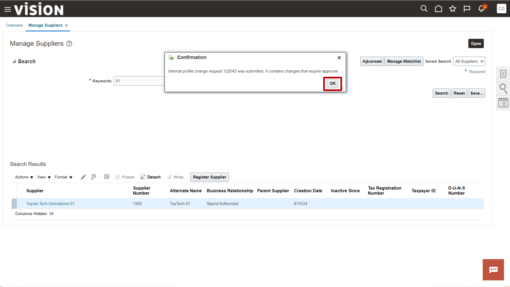

    > Click **Done**

    

7. Let’s navigate back to the Oracle Fusion Cloud home screen.

    > Click the **Home**  button

    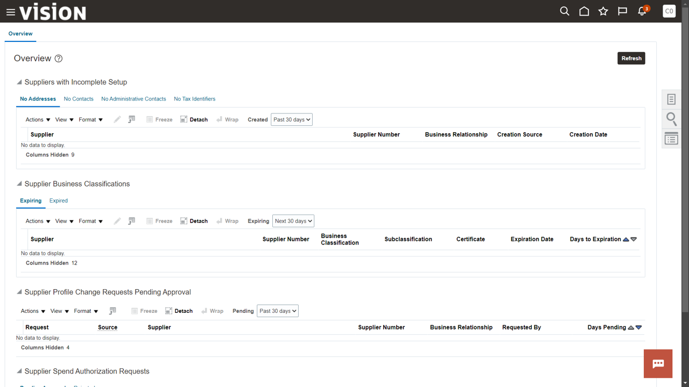

8. Now, we’re going to discover how we can audit several pieces of information that’s relevant to our cloud adventure today: user access (sign in / sign out) as well as supplier address information changes via REST API integrations.

    > At the home screen, Navigate to **Integration** tab

    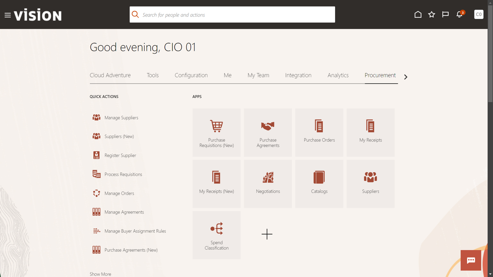

    > Click on **Audit Report REST Endpoints**

    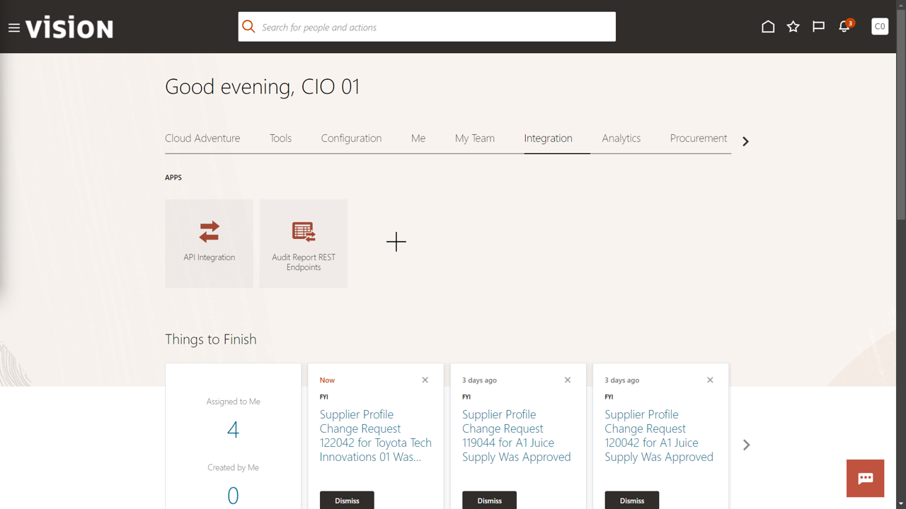

    **This is an example of a configuration. This tile links out to an external website.**

    **Take note of the detailed documentation. API endpoints, parameters, code examples, use cases, Oracle’s documentation is public and designed to be very useful.**

9. Let’s review the REST API endpoints that we can use to review Auditable data that can be extracted from Fusion Cloud.

    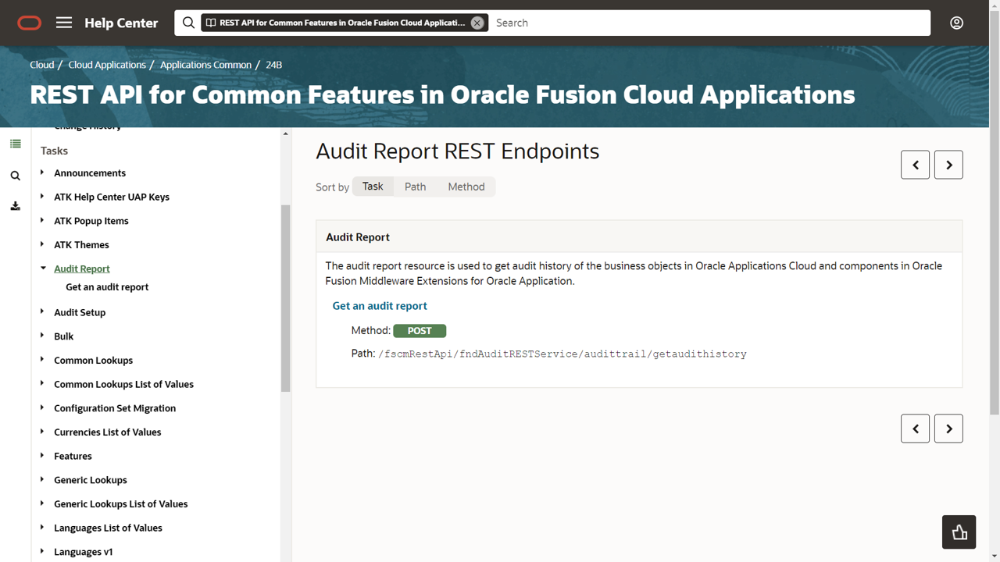

    > Click on **Get an audit report** under **Audit Report**

    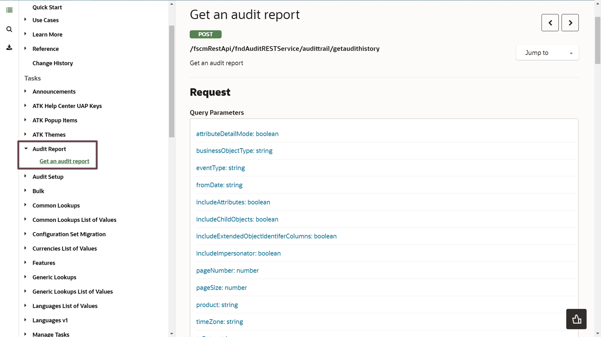

    > **Click** the drop-down menu icon [drop down icon](images/icon014_downarrow.png) **‘Jump to’** and select the **‘Examples’** menu option

    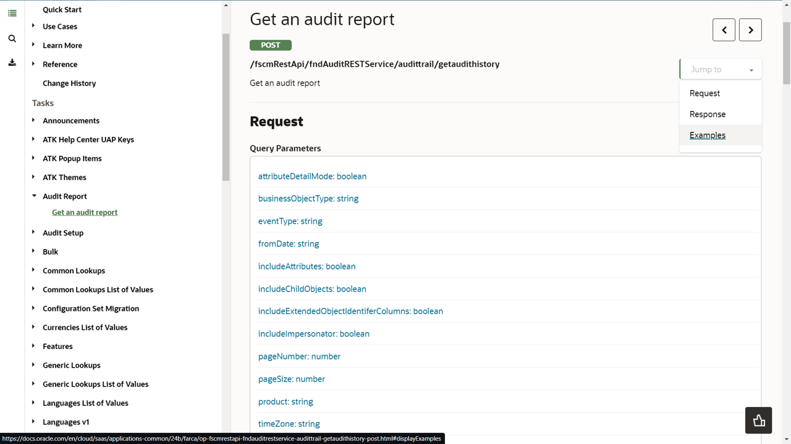

    > Scroll down the page, review the first **Example Request Payload** and **Example of Response Body**

    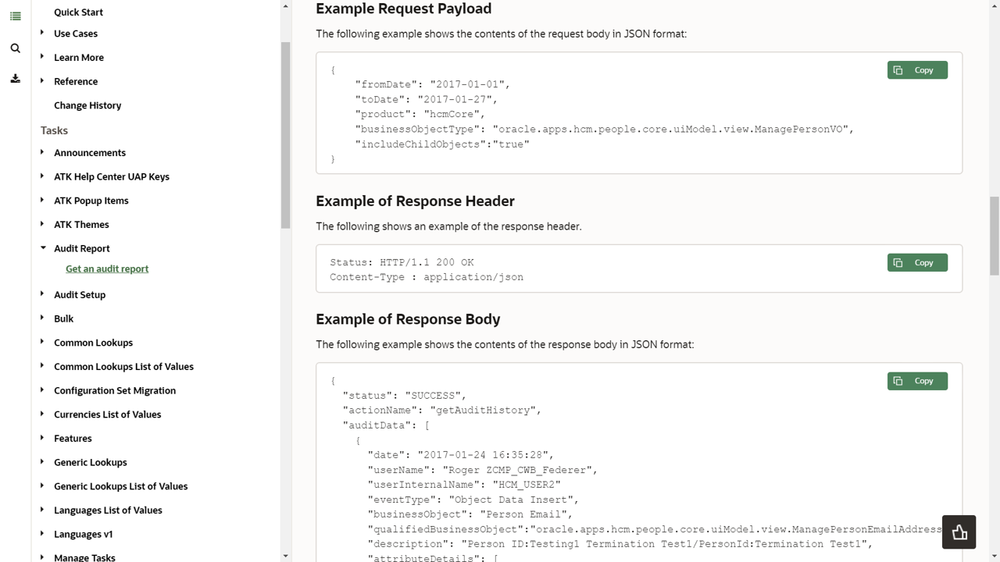

10. Adventure awaits, click on the image, show what you know and rise to the top of the leader board!!!

    

## Summary

As you have seen, the Oracle SaaS applications may be configured to capture who updates select fields, when the update was performed, the previous value and the updated value. Having this level of auditing serves a critical role in providing governance and controls over your enterprise applications. As an administrator, you will implement the controls your company chooses to enforce. The combination of fine grained applications security and application data audit provide the end to end controls you will need.

This Cloud Adventure also featured the importance of having open REST interfaces for accessing and sharing data with external systems. In the case of audit data, you may want to send this data to a SIEM or data warehouse for analysis.

**You have successfully completed the Activity!**

* [Oracle Supply Chain & Manufacturing - APIs & Schema](https://docs.oracle.com/en/cloud/saas/supply-chain-and-manufacturing/24b/api.html)
* [Set Up Auditing for Oracle Fusion Applications](https://docs.oracle.com/en/cloud/saas/applications-common/24d/facia/set-up-auditing-for-oracle-fusion-applications.html)
* [Oracle Documentation](http://docs.oracle.com)O

## Acknowledgements
* **Author** - Jamil Orfali, Senior Cloud Technologist, Advanced Technology Services; Kris Holmgren, Senior Cloud Technologist, Advanced Technology Services.
* **Contributors** -
* **Last Updated By/Date** - Jamil Orfali, April 2025
