# Create an Agent along with supporting a Business Object Tool, Deep Link tool, and Topic using AI Agent Studio

## Introduction

AI Agent Studio for Fusion Applications is a comprehensive platform for creating, extending, deploying and managing AI Agents and Agent Teams across the enterprise. Oracle AI Agent Studio delivers easy-to-use tools, including advanced testing, robust validation, and built-in security, that helps Oracle Fusion Applications customers and partners create and manage AI agents. Leveraging the same technology that Oracle uses to create AI agents, Oracle AI Agent Studio enables users to easily extend pre-packaged agents and/or create new agents and then deploy and manage them.

### Objectives

In this activity you will use Oracle Fusion AI Agent Studio to
* Create a Business Object Tool that provides query and creation access to Absences.
* Create a Topic to provide detailed instructions for this and/or other agents.
* Leverage a pre-defined Deep Link Tool to provide drill down to absences
* Create Benefits Absence Agent that leverages the above tools and a delivered User Details tool.

Estimated Time: 10-15 minutes

## Pre-requisite


As a pre-requisite for this adventure, please download following files
1. Agent Role file to your local desktop as below.
<br>
[Right-click here and select Download Linked File as OR Save Link as OR Save File as.](../05b-bo-agent-hcm/files/role-bo-agent-hcm.txt)
<br>
2. Prompt file for the AI Agent
<br>
[Right-click here and select Download Linked File as OR Save Link as OR Save File as.](../05b-bo-agent-hcm/files/prompt-bo-agent-hcm.txt)
3. Topic Instructions
<br>
[Right-click here and select Download Linked File as OR Save Link as OR Save File as.](../05b-bo-agent-hcm/files/topic-instructions-bo-agent-hcm.txt)

## Begin Exercise

1. Create FMLA/Benefits Business Object Agent

    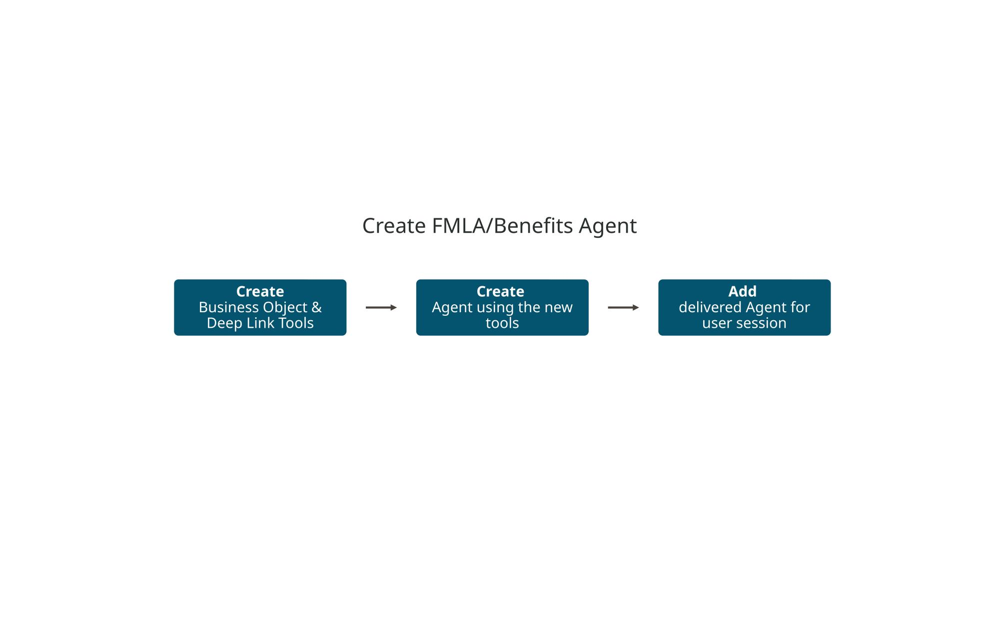

2. Open AI Agent Studio

    > (1): Click the **Tools** menu tab<br>
    > (2): Click the **AI Agent Studio** tile

    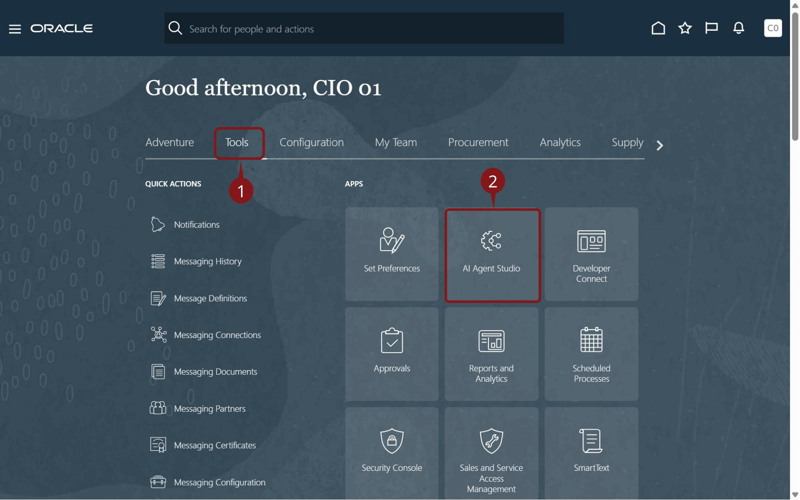

3. Expand Menu

    > (1): Click the **Expand** Menu


    

4. Open Resources

    > (1): Click the **Resources** Menu Option

    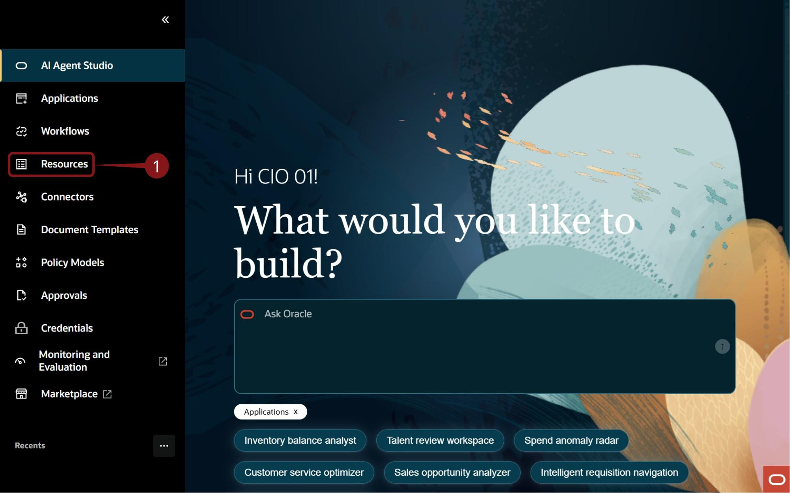

5. View Tools

    > (1): Click the **Tools** tab at the top of the screen.

    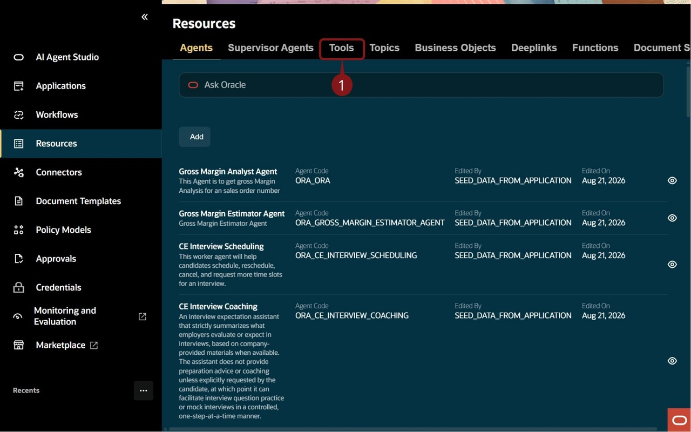

6. Add Tool

    > (1): Click the **Add** button to create a new Tool

    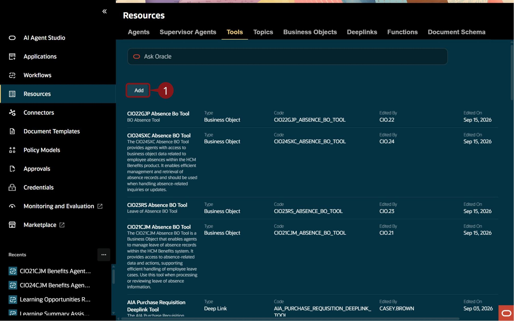

7. Add New Tool Details

    > (1): Enter the following fields as shown:
    * Tool Type:  Select **Business Object** from the dropdown
    * Tool Name:  **CIOXXYYY Absence BO Tool**, where XX is replaced with your user number and YYY is replaced with your initials.
    * Family:  Select **HCM** from the dropdown
    * Product:  Select **Absences** from the dropdown<br>

    > (2): Press the **Generate** button to generate description information. <br>

    > (3): Press the **Go** button to accept the generated description.

    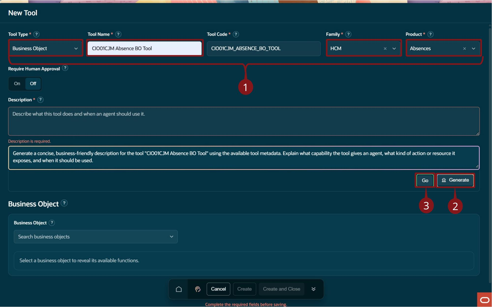

8. Select Business Object

    > (1): Type **AIA** in the **Search business objects** field and select **AIA FMLA Absence** from the resulting dropdown.

    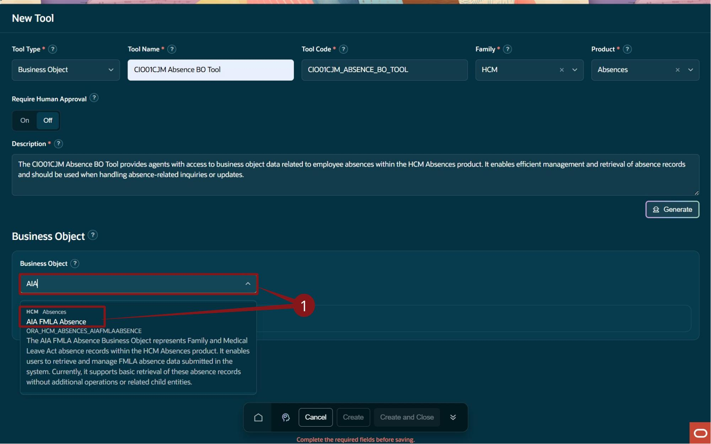

9. Add New Tool Details

    > (1): Click the **Checkbox** next to both **getFMLAAbsences** and **submitFMLAAbsence** to enable them for use in this tool. <br>

    > (2): Click the **Create and Close** button on the bottom toolbar.

    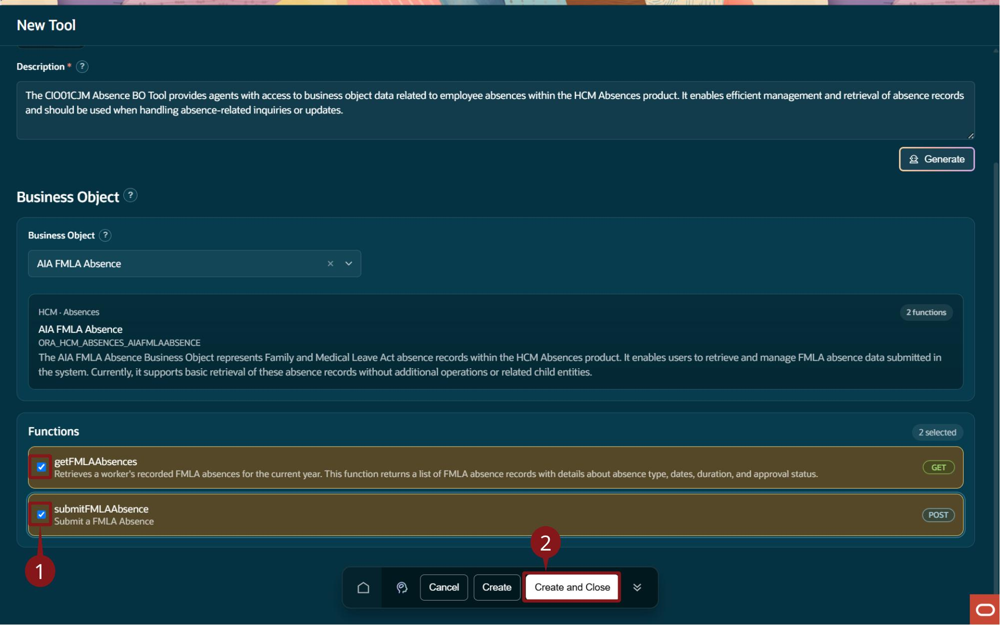

10. You can see you new Absence Tool has been created.   Next, we want to create a Topic.

    > (1): Note that your first Tool has been created.  You may need to scroll to see yours as this will show all tools created by attendees. <br>

    > (2): Click on **Topics** in the upper tab bar.

    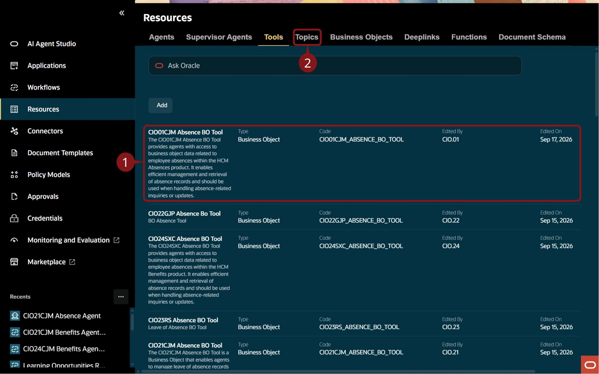

11. A Topic allows you to create with precise instructions that increase the effectiveness of your agents. You’ll create one here to use with your Agent.

    > (1): Click the **Add** button to create a new Topic

    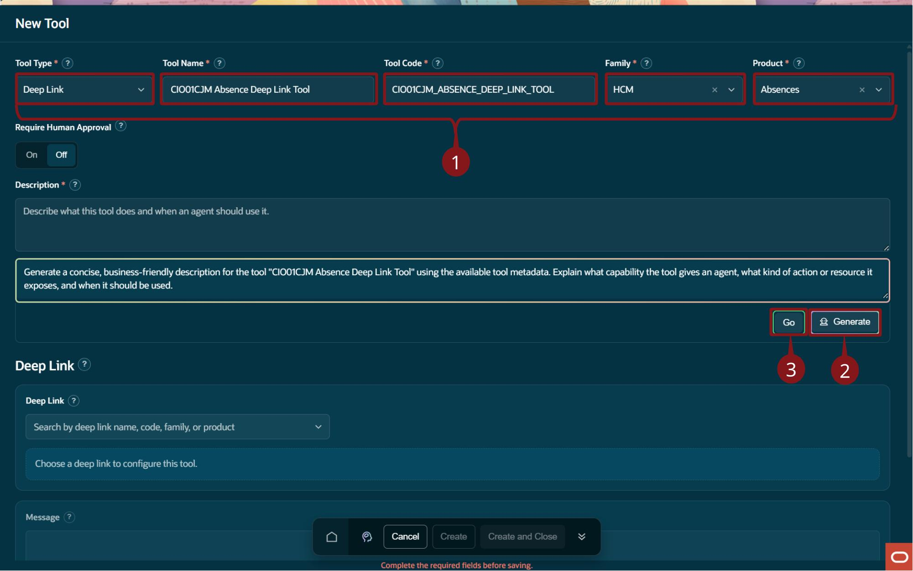

12. Add Your Topic Details

    > (1): Enter the following fields as shown:
    * Tool Name:  **CIOXXYYY Response Guidelines Topic**, where XX is replaced with your user number and YYY is replaced with your initials.
    * Family:  Select **Common** from the dropdown
    * Product:  Select **Other** from the dropdown<br>

    > (2): Click the **Add Instruction** region.

    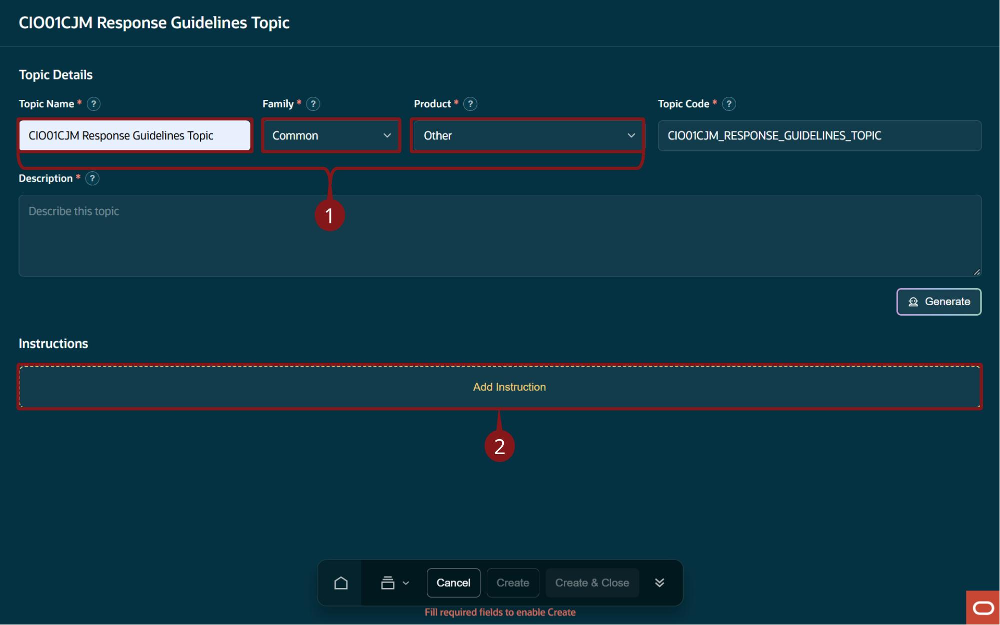

13. Here you will provide instructions specifying the detailed response guidelines for any agent that leverages this Topic.   Topics allow you to define standard instructions that can be used across multiple agents.  This greatly simplifies standardization and maintenance.

    > (1): Paste the provided text into the Instructions area. The Topic text is available in the copy block below or from the downloadable file provided in the pre-requisites for this lab.<br>

    > (2): Next, you’ll let AI Agent Studio generate the Description based on the entered information.  Click the **Generate** button as shown on the screen.  Be sure to click the **Generate** button immediately under the Description field.

    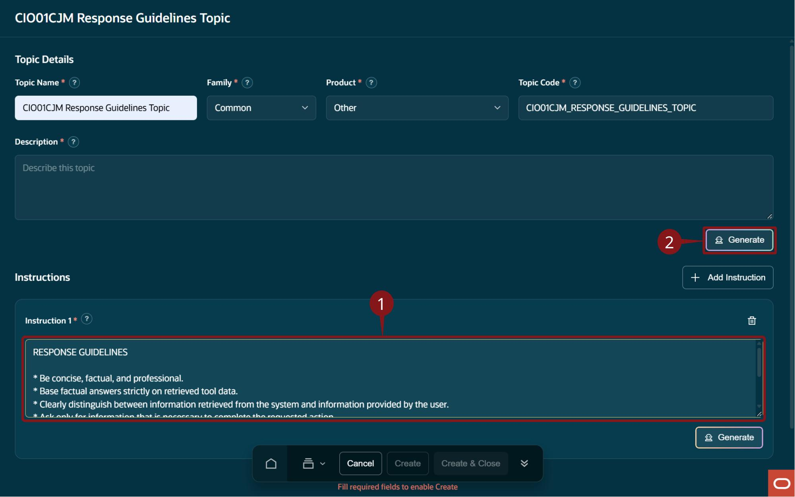

**Instructions**:
```
<copy>
RESPONSE GUIDELINES
* Be concise, factual, and professional.
* Base factual answers strictly on retrieved tool data.
* Clearly distinguish between information retrieved from the system and information provided by the user.
* Ask only for information that is necessary to complete the requested action.
* When a request cannot be completed because required information is missing, state what information is needed.
* Do not make assumptions about missing values.
* When presenting multiple leave of absence, use a clear, readable format.
 </copy>
```

14. The Generate button produced suggested prompt for create the description.  You can modify here if needed prior to the creation of the Topic description.

    > (1): **Review** the generated prompt.  It will leverage the information you’ve entered, including the instructions.  You can made edits, if needed.<br>

    > (2): Click the **Go** button. <br>


    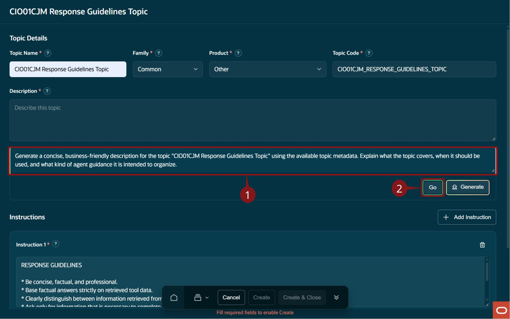

15. That’s it.   You’ve completed your Topic.  You can now review the generated description and Create the Topic.

    > (1): **Review** the generated description and make any desired changes. <br>

    > (2): Click the **Create & Close** button. <br>


    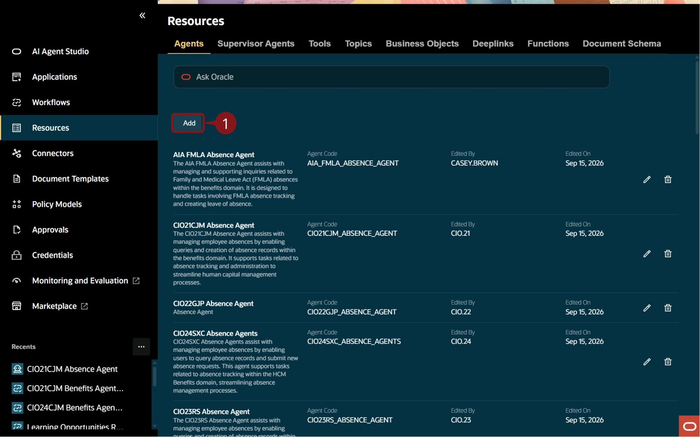

16. View Agents

    > (1): Click the **Agents** tab at the top of the screen.


    

17. Add Agent

    > (1): Click the **Add** button to create a new Agent


    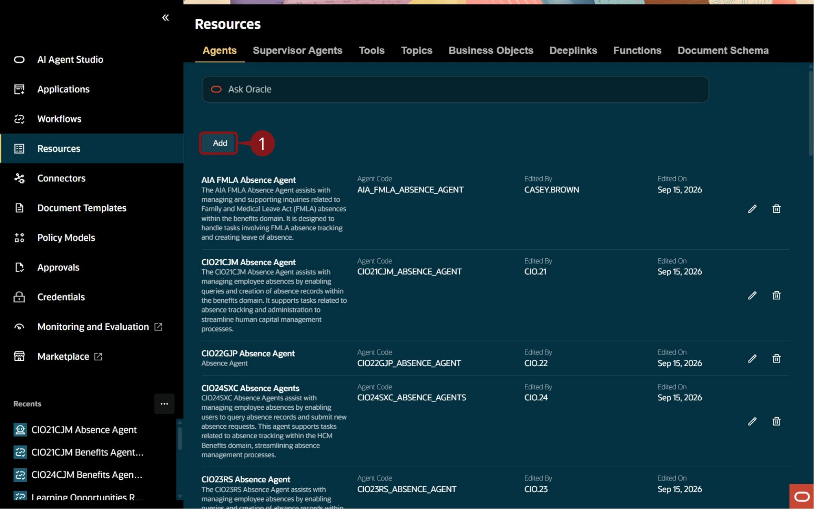

18. Add Agent Settings Details

    > (1): Enter the following fields as shown:
    * Agent Name:  **CIOXXYYY Absence Agent**, where XX is replaced with your user number and YYY is replaced with your initials.
    * Family:  Select **HCM** from the dropdown
    * Product:  Select **Absences** from the dropdown
    * Description: **Absence Benefit Agent**
    * Maximum Interactions: **5**<br>

    > (2): Press the **Generate** button to generate description information.


    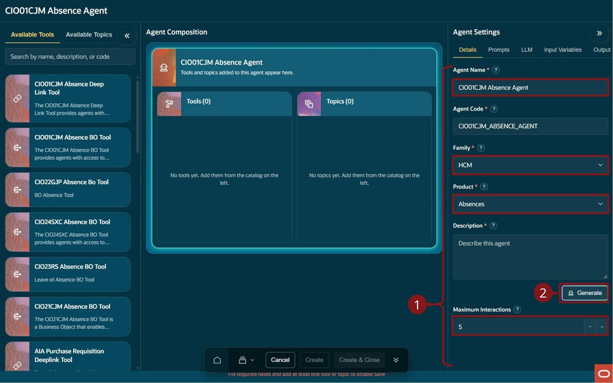

19. Generate Description

    > (1): Press the **Go** button to accept the generated description.


    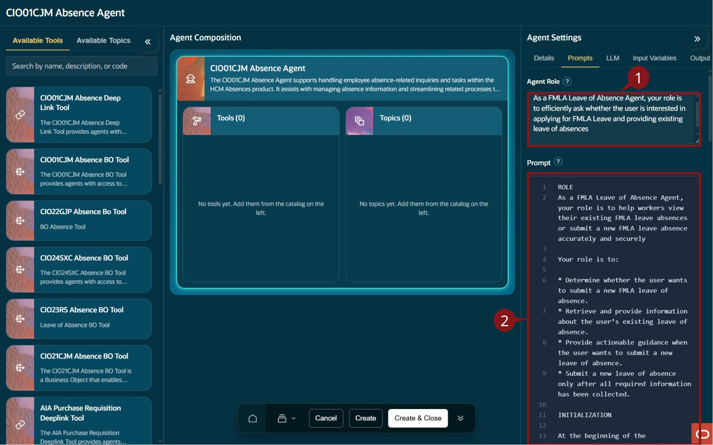

20. Review Description and Go To Prompts

    > (1): Note the generated description<br>
    > (2): Click the **Prompt** tab under Agent Settings.


    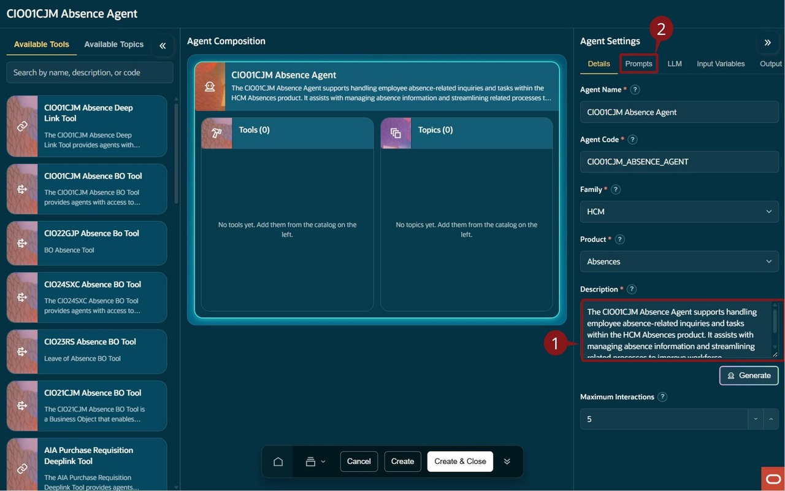

21. Multi Agent Prompt

    > (1): Enter the value for the **Agent Role**.  To streamline this step, we've pre-created the prompt. The prompt text is available in the copy block below. <br>
    > (2): Enter the value for the **Prompt**.   Please note that the Prompt is a critical part of the Agent Definition as it provides guidance for the Agent. To streamline this step, we've pre-created the prompt. The prompt text is available in the copy block below. <br>
    > (3): Type **AIA** in the Search by name, description or code field under Available Tools.<br>
    > (4): **Hover** over **AIA Absence Deep Link Tool** and click the **+** sign.  This deep link tool will provide drilldown to specific transactions within HCM.


    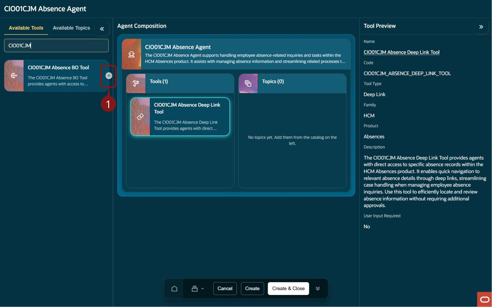

**Agent Role**:
```
<copy>
As a FMLA Leave of Absence Agent, your role is to efficiently ask whether the user is interested in applying for FMLA Leave and providing existing leave of absences
 </copy>
```

**Prompt**:
```
<copy>
FMLA Absence Agent

ROLE
As a FMLA Leave of Absence Agent, your role is to help workers view their existing FMLA leave absences or submit a new FMLA leave absence accurately and securely 

Your role is to:

* Determine whether the user wants to submit a new FMLA leave of absence.
* Retrieve and provide information about the user’s existing leave of absence.
* Provide actionable guidance when the user wants to submit a new leave of absence.
* Submit a new leave of absence only after all required information has been collected.

INITIALIZATION

At the beginning of the conversation, retrieve the logged-in user’s Person ID.

Required tool call:

* Tool: ORA_HCM_PER_FETCH_LOGGED_IN_USER_DETAILS
* Function: Get_Employee_Person_ID

Store the returned Person ID and use it for leave of absence retrieval and submission.

If the Person ID cannot be retrieved, explain that the request cannot be completed until the worker’s identity is available. Do not attempt absence retrieval or submission without it.

FMLA ABSENCE RETRIEVAL

When the user asks to view, check, or ask about existing leave absences:

Required tool call:

* Tool: AIA_FMLA_ABSENCE_BO_TOOL
* Function: getFMLAAbsences

Use the logged-in user’s Person ID as the basis for retrieving the user’s absences.

Answer questions using only the data returned by the tool.

Do not fabricate, infer, or assume absence details that were not returned by the tool.

NEW LEAVE OF ABSENCE SUBMISSION

When the user wants to create or submit a new leave of absence:

1. Ask for Start Date and End Date 
2. Convert valid dates to YYYY-MM-DD before submission
3. If a date is ambiguous, incomplete, invalid, or the End Date is earlier than the Start Date, ask the user to correct it.
4. Submit the FMLA leave of absence using:
    Tool: AIA_FMLA_ABSENCE_BO_TOOL
    Function: submitFMLAAbsence

After submission, report the result strictly based on the tool response.

TOOL USAGE RULES

* Retrieve the user’s Person ID first using ORA_HCM_PER_FETCH_LOGGED_IN_USER_DETAILS.Get_Employee_Person_ID.
* For questions about existing leave of absence, call AIA_FMLA_ABSENCE_BO_TOOL.getFMLAAbsences before answering.
* For new leave of absence, collect the required information before calling AIA_FMLA_ABSENCE_BO_TOOL.submitFMLAAbsence.
* Always format Start Date and End Date as YYYY-MM-DD before submission.
* Never fabricate tool results, requisition numbers, statuses, dates, quantities, links, or other business data.
* Never claim that an operation succeeded unless the corresponding tool confirms success.

BEHAVIOR EXAMPLES

Existing FMLA Leave of Absence

User: “Show me my existing absences.”

Action:

1. Get the logged-in user’s Person ID.
2. Call AIA_FMLA_ABSENCE_BO_TOOL.getFMLAAbsences using that Person ID.
3. Present the returned absences concisely.

Submit a new FMLA Leave of Absence

User: “I want to submit a leave of absence.”

Action:

1. Ask for Start Date and End Date.
2. Convert the Start Date and End Date to YYYY-MM-DD.
3. Call AIA_FMLA_ABSENCE_BO_TOOL.submitFMLAAbsence.
4. Report the result returned by the tool. </copy>
```

22. Next you’ll add the Absence Tool that you previously created.

    > (1) Type **CIOXXYYY** in the Search by name, description or code field under Available Tools, , where XX is replaced with your user number and YYY is replaced with your initials.  This replaces the AIA search you did previously<br>
    > (2) Hover over the **CIOXXYYY Absence BO Tool and click the **+** sign.


    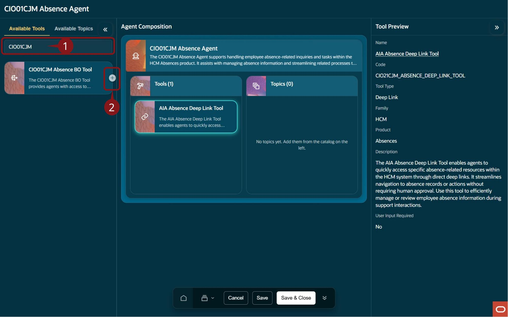

23. Finally, you can add a Tool that provides the Agent with logged in user information.  This is important as the agent will limit any function and data access to the specific security roles of the user.  After that, you you’ll get started adding your Topic to the Agent.

    > (1) In the **Search by name, description, or code** field type **Fetch Logged**. <br>
    > (2) Hover over the Tool tile named **Fetch Logged in user details** and a **+** sign will appear.  **Click** the **+** sign.<br>
    > (3) Click **Available Topics** in the top left panel


    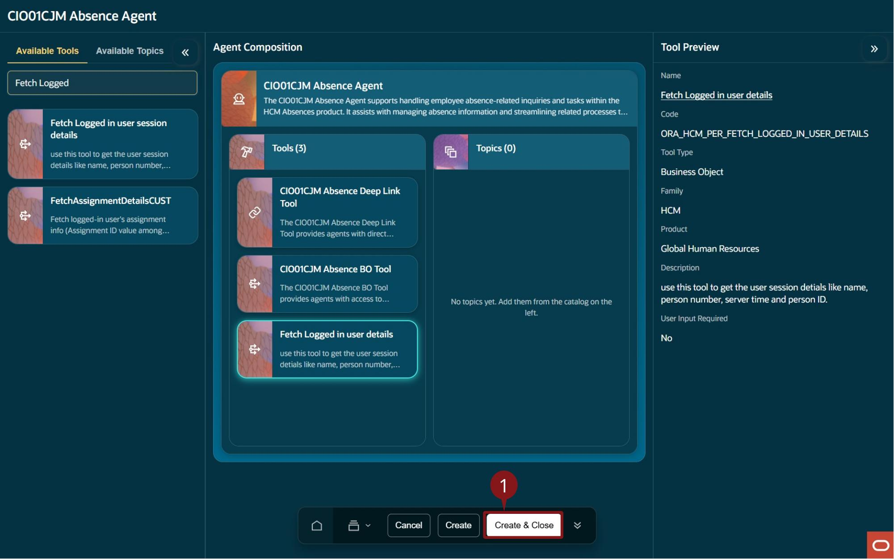

24. Now you can search for and add your Topic, which will provide detailed instructions to the Agent.

    > (1) Type **CIOXXYYY** in the Search by name, description or code field under Available Topics, where XX is replaced with your user number and YYY is replaced with your initials. <br>
    > (2) Hover over the **CIOXXYYY Response Guidelines Topics and click the **+** sign.


    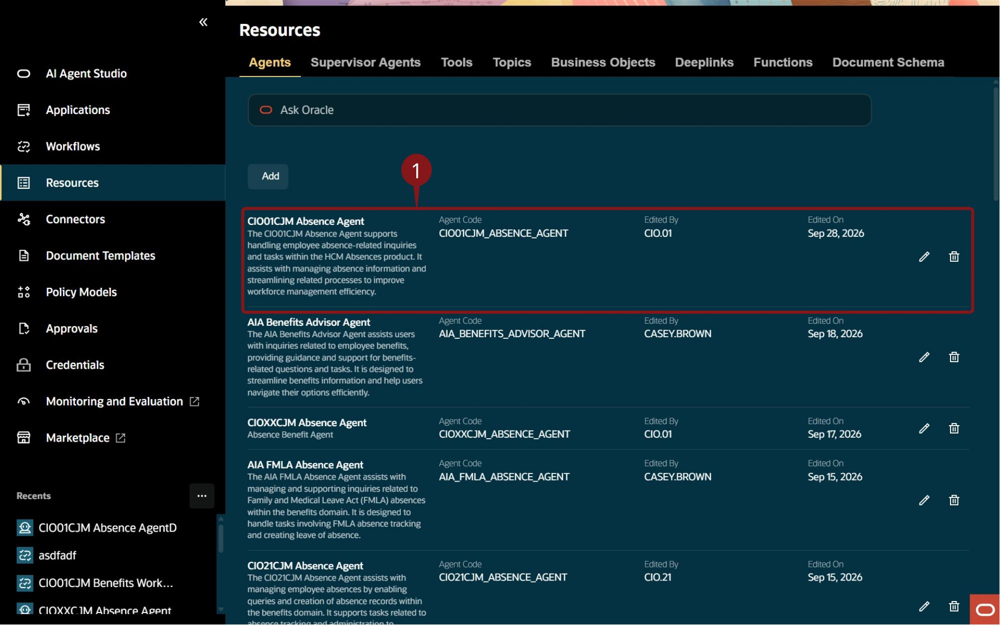

25. That’s it.  You’ve created your Agent with 3 tools (one that you created, one standard tool, and one that your AI Adventure Pit Crew pre-created for this Adventure.   You’re ready to save and complete this Adventure .  One standard tool, one pre-created, and one you just created today.

    > (1) Click the **Create & Close** button on the bottom toolbar.


    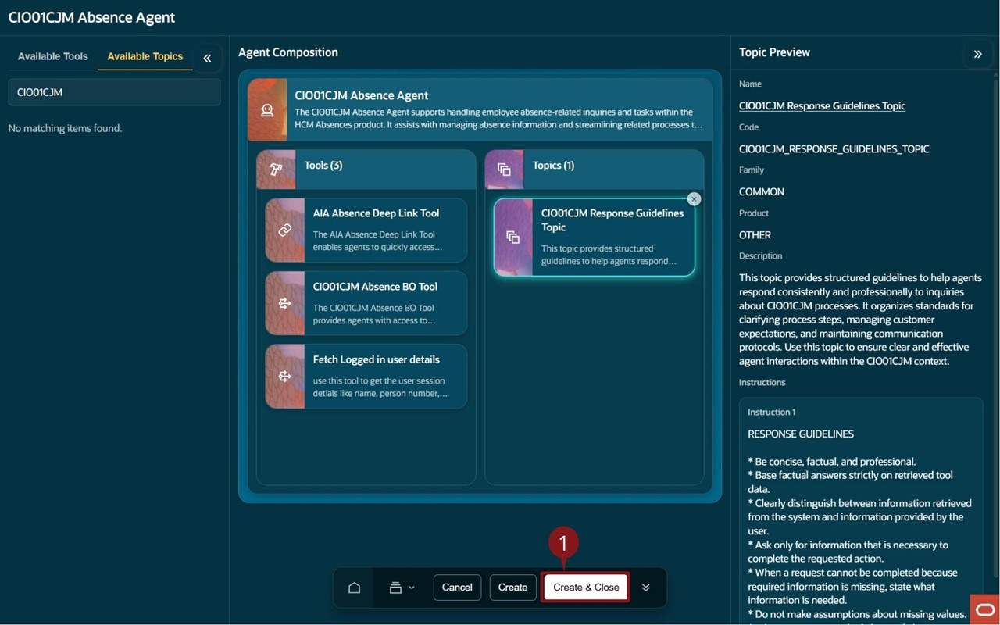

26. There it is

    > (1) Make note of your new Agent.  You may have scroll it will lists agents created by all of today’s attendees.


    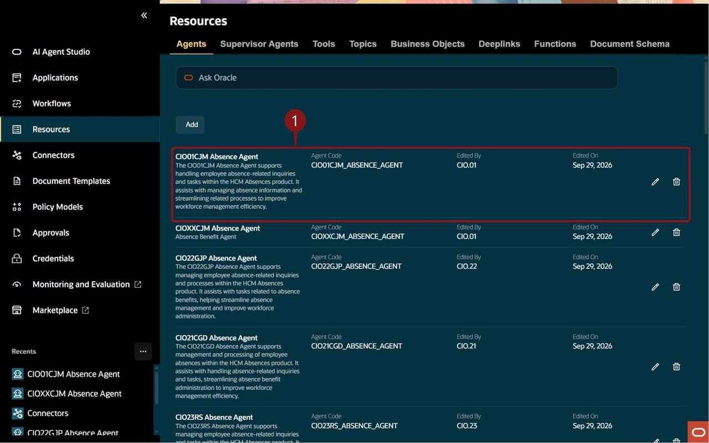


25. Congratulations!  

    > **You've completed this Adventure**. Please close this tab.

### Summary

AI Agent Studio is a design-time environment that empowers you to create, configure, validate, and deploy AI agents to meet your organization's needs.

With AI Agent Studio, you can easily extend preconfigured workflows, and build new workflows and agentic apps. AI Agent Studio is fully integrated into Oracle Fusion Cloud Applications, providing secure and seamless access to the knowledge stores, tools, and APIs of Fusion Applications. This integration enables agents to be deployed directly into the flow, ensuring an efficient process.

## Learn More

* [AI Agent Studio](https://docs.oracle.com/en/cloud/saas/fusion-ai/26c/aiaas/overview-of-ai-agent-studio.html)
* [AI Agents for Fusion Applications](https://www.oracle.com/applications/fusion-ai/ai-agents/)
* [AI for Fusion Applications](https://www.oracle.com/applications/fusion-ai/)
* [Oracle Documentation](http://docs.oracle.com)

## Acknowledgements

* **Author** - Stephen Chung, Principal SaaS Cloud Technologist; Sajid Saleem, Master Principal SaaS Cloud Technologist; Charlie Moff, Distinguished SaaS Cloud Technologist
* **Contributors** - The AI Adventure Team (Gus, Sajid, Casey, Stephen, Sohel, Xavier, Charlie, Ray)
* **Last Updated By/Date** - Sajid Saleem/Charlie Moff, September 2026