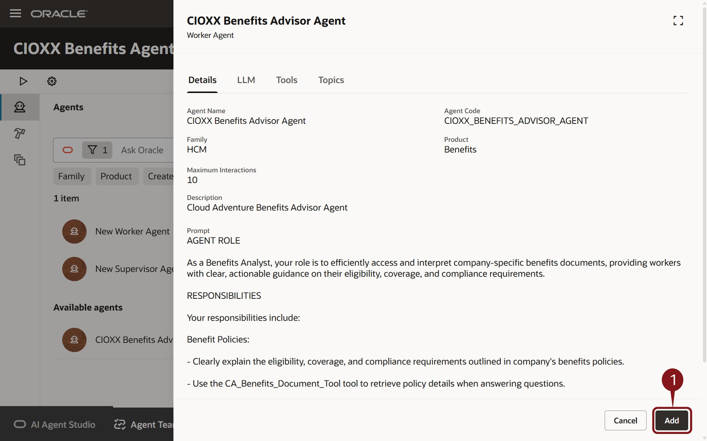

# Create AI Agents and Agent Teams for your enterprise

## Introduction

AI Agent Studio for Fusion Applications is a comprehensive platform for creating, extending, deploying and managing AI Agents and Agent Teams across the enterprise. Oracle AI Agent Studio delivers easy-to-use tools, including advanced testing, robust validation, and built-in security, that helps Oracle Fusion Applications customers and partners create and manage AI agents. Leveraging the same technology that Oracle uses to create AI agents, Oracle AI Agent Studio enables users to easily extend pre-packaged agents and/or create new agents and then deploy and manage them.

### **Objectives**

In this activity you will use Oracle Fusion AI Agent Studio to
* Create a Benefits Advisor Agent that leverages an existing Document Tool and its related Benefit Policy documents.
* Create and assemble an Agent Team that includes the created Benefits Advisor Agent and an Absence Agent.
* Test the Agent team 

## Assemble and Test an Agent Team using AI Agent Studio

1. In this activity you will learn the power and ease building Agentic AI with the Oracle AI Agent Studio

    

2. The first step is to navigate to AI Agent Studio.

    > (1) Click on the **Tools** tab
    > (2) Select the **AI Agent Studio** tile

    

3. You’ve previously created your first Agent.  Now, you’ll create an Agent Team with a Supervisory Agent and assign some worker agents.

    > Click the  button/tab at the bottom of the page

    

4. Create an Agent Team.

    > Click the  button to create a new Agent

    

5. Define the Agent Team.

     > (1) Enter the fields as described below:
     * Agent Team Name: **CIOXX Benefits Agent Team** where XX is replaced with your user number.  
     * Family: Select **HCM** from the dropdown  
     * Product: Select  **Benefits** from the dropdown  
     * Maximum Interactions: **10**  
     * Description: **This Agent Team leverages the Benefits Advisor Agent to respond to questions and the FMLA Absence Agent to view existing absences and submit a new FMLA absence request**  

     > (2) Click the **Create** button  on the bottom right.
     
     

6. You’ve defined your Agent Team, so it’s time to add a Supervisor agent.

     > (1) Click the   

     > (2) Click the **+** icon  next to **New Supervisor Agent**.
     
     

7. Define Supervisor Agent Details.

     > (1) Enter the fields as described below:
    * Agent Team Name: **CIOXX Benefits Supervisor Agent** where XX is replaced with your user number. 
    * Family: Select **HCM** from the dropdown 
    * Product: Select  **Benefits** from the dropdown 
    * Maximum Interactions: **10**  
    * Description: **This agent supervises the Benefits Advisor and FMLA Absence agents**  

     > (2) Click the **Create** button  on the bottom right.

       

8. Next you'll add some worker agents.  You can scroll through the list of available tools, or use the Ask Oracle field to filter the results.  You'll do the latter.

    >  (1)  Enter **XX**, where XX is replaced with your user number, in the Ask Oracle field and press the **<enter>** key or select **XX** from the resulting dropdown.  
    >   Note that Steps 2 and 3 are the same.  The first click activates that region and the second actually adds the agent.  
    >  (2)  Click the **+** icon  next to **CIOXX Benefits Advisor Agent**, where XX is replaced with your user number.  
    >  (3)  Click the **+** icon  next to **CIOXX Benefits Advisor Agent**, where XX is replaced with your user number.

    

9. You can review the details of the agent before saving.

    > Click the Add button  on the bottom right of the screen.

      

10. You'll add one more worker agent.  First, you'll filter on something different.

 >  (1) Delete your previous Ask Oracle filter and enter **FMLA** in the Ask Oracle Filter and press the <enter> key or select **FMLA** from the resulting dropdown.  

 >   Note that Steps 2 and 3 are the same.  The first click activates that region and the second actually adds the agent.  

 >  (2) Click the **+** icon  next to **CA FMLA Absence Agent.**, where XX is replaced with your user number. 

 >  (3) Click the **+** icon  next to **CA FMLA Absence Agent.**, where XX is replaced with your user number. 

11. You can review the details of the agent.

    > Click the **Add** button .

      

12. Your Agent Team, with a Supervisory Agent and two Worker Agents is complete.  We can now hide the left Agents panel to see our full Agent Team..

    > Click the **Agents** icon  on the top left of the screen.  You can see that the left panel is now hidden and you can see the entire Agent Team

      

13. Feel free to admire your newly created Agent Team. Time to test it and see how it responds to your requests.

    > Click the **Debug** icon  on the top left of the screen.  It's the one that looks like the Play arrow.

      

14. You can now begin a dialog with the Agent.  The Agent is now ready for your questions.

    > 1. In the **Ask Oracle** dialog box at the bottom of the screen, type **Please summarize benefits available to me**and hit the return key or click the **Up Arrow** icon  

      

15. The Agent will respond with information.  In this Debug mode, the Agent will also show you source and processing information (yellow boxes).  These will not be available to end-users once deployed.

    > The Agent responds with information, so we’ll ask an additional question.

    > 1. In the **Ask Oracle** dialog box on the bottom right of the screen, enter **What about FMLA benefits** and hit the return key or click the **Up Arrow** icon 

      

16. The Agent  checks with HCM Cloud and confirms existing leave requests, if any.  It also offers to create a new request for you if you provide the requested start and end dates.

    You decide to tell the Agent that you’re interested in creating an FMLA absence, but you do with without provided the requested dates.

    > 1. In the **Ask Oracle** dialog box on the bottom right of the screen, enter **I would like to create FMLA absence** and hit the return key or click the **Up Arrow** icon 

      

17. The Agent reminds you that you need to provide start and end dates before the Agent can create the absence request.

    > In the **Ask Oracle** dialog box on the bottom right of the screen, enter **Start Date is 2025-08-28 End Date is 2025-08-29** and hit the return key or click the **Up Arrow** icon 

      

18. The agent confirms that your request has been created.

    > 1. Review Agent Response
    > 2. Click the x icon in the upper right to close the debug screenIn the **Ask Oracle** dialog box on the bottom right of the screen, enter **Proceed with ordering a laptop** and hit the return key or click the **Up Arrow** icon 

      

19. Let’s go back to the homepage so we can confirm the creation of our absence.

    > Click the Home  **Ask Oracle** icon  on the top right.

      

20. The agent has created your requisition and now we want to find it.

    > In the Search field, type **existing absence** and select **Existing Absences - Me** from the resulting dropdown.

      

35. There it is!  

    >   

36. Adventure awaits, click on the image, show what you know and rise to the top of the leader board!!!

    

## Summary

As you have seen here, AI Agent Studio puts customers in the driver’s seat, helping empower you to design the future of AI in your organizations on top of a bedrock of trust and safety. AI Agent Studio includes a built-in testing environment, validation, and traceability tools to confirm accuracy. Oracle maintains the same data controls at a user level, which means no individual sees data or AI recommendations that they’re not permissioned to see.

AI Agent Studio empowers enterprises to configure and build AI agents that extend their workforce and help achieve new levels of productivity. It allows you to harness the full potential of AI agents and transform the way work gets done in your organization.
AI Agent Studio is a design-time environment that provides a set of tools to create, customize, validate, and deploy GenAI features and AI agents to meet the specific needs of the organization. It is the same unified environment Oracle uses to internally build agents, made available now to customers and partners to customize and extend agents from Oracle-provided preconfigured templates or to create new agents and multi-agent workflows.

Like our AI capabilities, Oracle AI Agent Studio was built natively into Fusion Cloud Applications on our trusted, high performance Oracle Cloud Infrastructure (OCI), which means it can easily and securely access Fusion knowledge stores, tools, and APIs and allows agents to be deployed directly into the flow of work. This approach means maximum flexibility and customization without sacrificing reliability or performance.

**You have successfully completed the Activity!

## Learn More

* [AI Agent Studio Solution Brief](https://www.oracle.com/a/ocom/docs/applications/fusion-apps-ai-agent-studio-solution-brochure.pdf)
* [AI Agents for Fusion Applications](https://www.oracle.com/applications/fusion-ai/ai-agents/)
* [AI for Fusion Applications](https://www.oracle.com/applications/fusion-ai/)
* [Oracle Documentation](http://docs.oracle.com)

## Acknowledgements

* **Author** - Stephen Chung, Principal SaaS Cloud Technologist, Sajid Saleem, Master Principal SaaS Cloud Technologist, Charlie Moff, Distinguished SaaS Cloud Technologist, and the rest of the Cloud Adventure Team
* **Contributors** - The Cloud Adventure Team (Gus, Kris, Sajid, Casey, Stephen, Jamil, Sohel, Xavier, Nate, Charlie)
* **Last Updated By/Date** - Charlie Moff, August 2025
