# Assemble and Embed an AI Agent Team

## **Assemble and Embed an AI Agent Team in the Application UI**

### **Introduction**

AI Agent Studio for Fusion Applications is a comprehensive platform for creating, extending, deploying and managing AI Agents and Agent Teams across the enterprise. Oracle AI Agent Studio delivers easy-to-use tools, including advanced testing, robust validation, and built-in security, that helps Oracle Fusion Applications customers and partners create and manage AI agents. Leveraging the same technology that Oracle uses to create AI agents, Oracle AI Agent Studio enables users to easily extend pre-packaged agents and/or create new agents and then deploy and manage them.

### **Objectives**

In this activity you will use Oracle Fusion AI Agent Studio and Visual Builder to
* Create and assemble an Agent Team using your previously created Benefits Advisor Agent and seeded FMLA Absence Agent.
* Create a Guided Journey and Task that references the AI Agent Team.
* Use Visual Builder Studio to Configure New Absence page with the Guided Journey.
* Interact with your AI Agent

### **Begin Exercise**

1. In this activity you will learn the power and ease building Agentic AI with the Oracle AI Agent Studio

    

2. The first step is to navigate to AI Agent Studio.

    > (1) Click on the **Tools** tab  
    > (2) Select the **AI Agent Studio** tile

    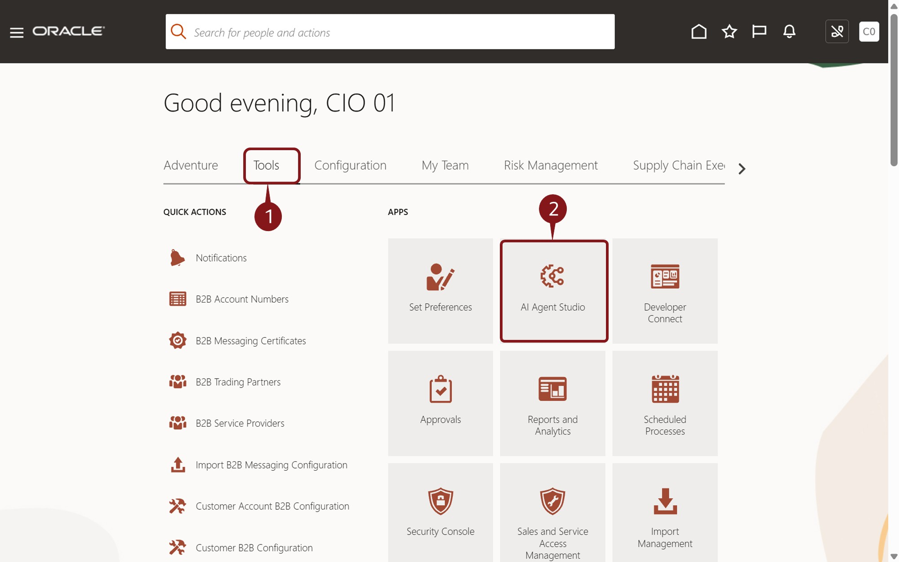

3. You’ve previously created your first Agent.  Now, you’ll create an Agent Team with a Supervisor Agent and assign some Worker Agents.

    > (1) Click the **Agent Teams** button/tab  at the bottom of the page

    

4. Create an Agent Team.

    > (1) Click the  button to create a new Agent Team

    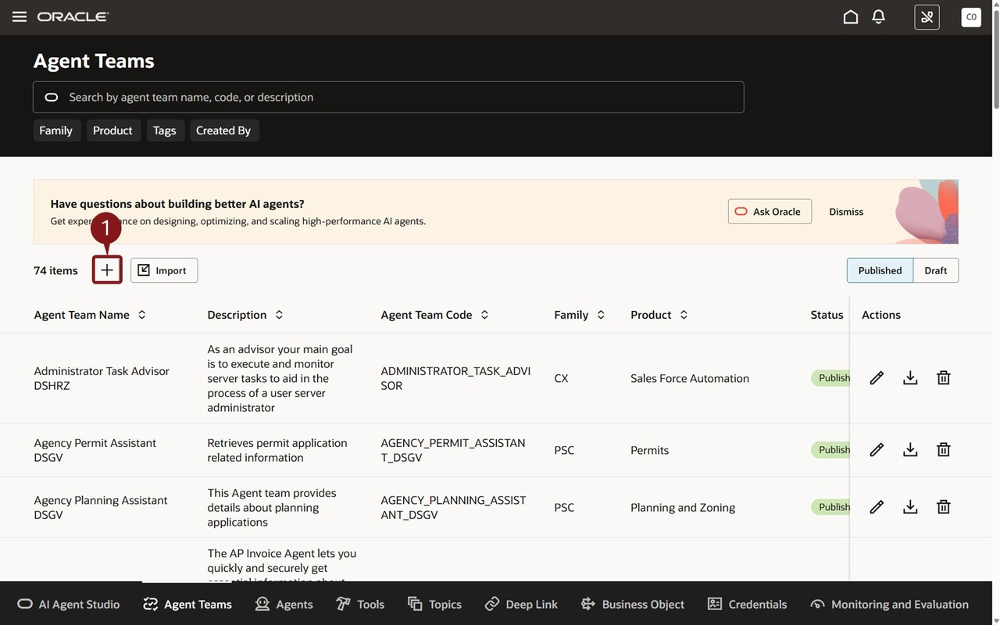

5. Define the Agent Team.

     > (1) Enter the fields as described below:
     * Agent Team Name: **CIOXX Benefits Agent Team** where **XX** is replaced with your user number.  
     * Family: Select **HCM** from the dropdown  
     * Product: Select  **Benefits** from the dropdown  
     * Type: Select **Supervisor** from the dropdown  
     * Maximum Interactions: **10**  
     * Description: **Agent Team for Benefits and FMLA**  

     > (2) Click the **Create** button  on the bottom right.

     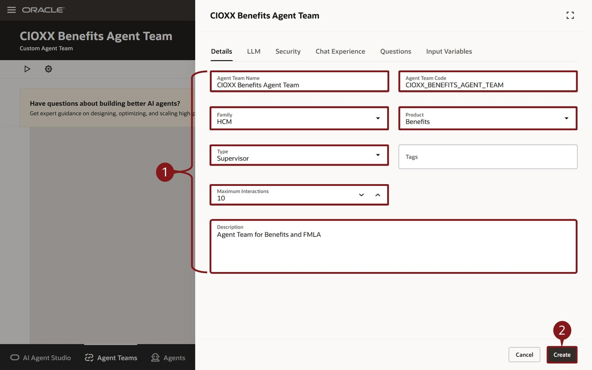

6. You’ve defined your Agent Team, so it’s time to add a Supervisor agent.

     > (1) Click the **Agents** icon  on the top of the left icon tool bar.  

     > (2) Click the **+** icon  next to **New Supervisor Agent**.

     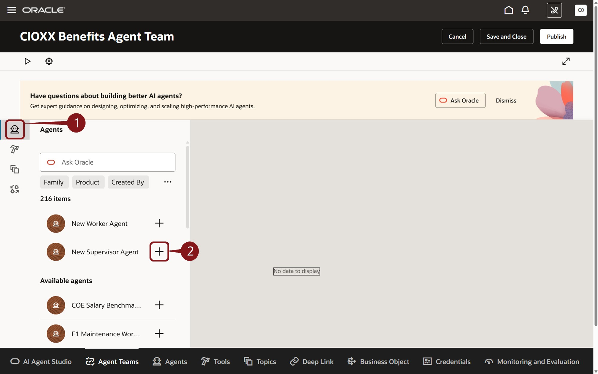

7. Define Supervisor Agent Details.

     > (1) Enter the fields as described below:
    * Agent Team Name: **CIOXX Benefits Supervisor Agent** where **XX** is replaced with your user number. 
    * Family: Select **HCM** from the dropdown 
    * Product: Select  **Benefits** from the dropdown 
    * Maximum Interactions: **10**  
    * Description: **Supervisor Agent for Benefits and FMLA**  

     > (2) Click the **Create** button  on the bottom right.

     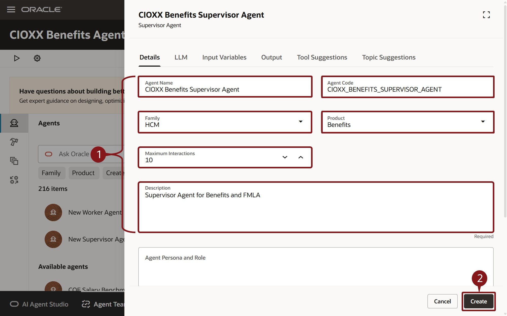

8. Next you'll add some worker agents.  You can scroll through the list of available agents, or use the Ask Oracle field to filter the results.  You'll do the latter.

    >  (1)  Enter **XX**, where XX is replaced with your user number, in the Ask Oracle field and press the **<****Enter****>** key or select **XX** from the resulting dropdown. 
    >  (2)  Click the  icon next to **CIOXX Benefits Advisor Agent**, where **XX** is replaced with your user number. 

    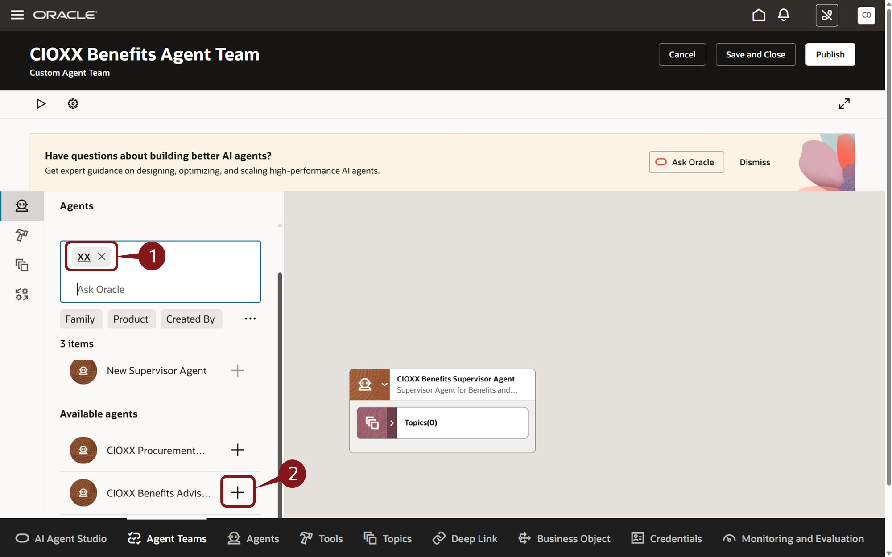

9. You can review the details of the agent before adding.

    > (1) Click the  button on the bottom right of the screen.

      

10. You'll add one more worker agent.  First, you'll change the search filter.

    >  (1) Delete your previous Ask Oracle filter and enter **F1** in the Ask Oracle Filter and press the **<****Enter****>** key or select **F1** from the resulting dropdown. 

    >  (2) Click the  icon next to **F1 FMLA Absence Agent.**, you may need to click it twice. 

    

11. You can review the details of the agent.

    > (1) Click the **Add** button .

    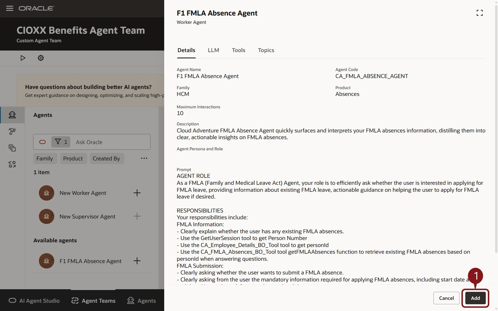  

12. Your Agent Team, with a Supervisor Agent and two Worker Agents is complete.  We can now hide the left Agents panel to see our full Agent Team.

    > (1) Click the **Agents** icon  on the top left of the screen.  You can see that the left panel is now hidden and you can see the entire Agent Team

    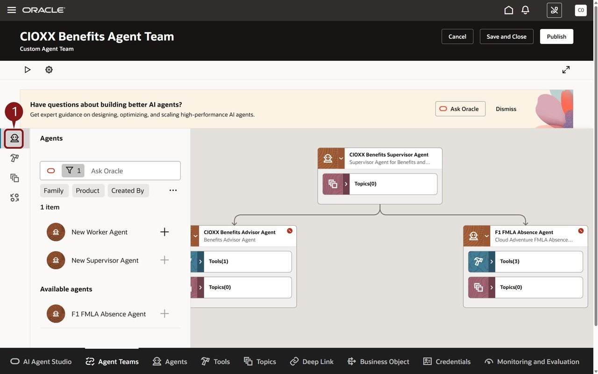  

13. Feel free to admire your newly created Agent Team. Before we embed it in the Application UI, you should test it.

    > (1) Click the **Debug** icon  on the top left of the screen.  It's the one that looks like the Play arrow.

    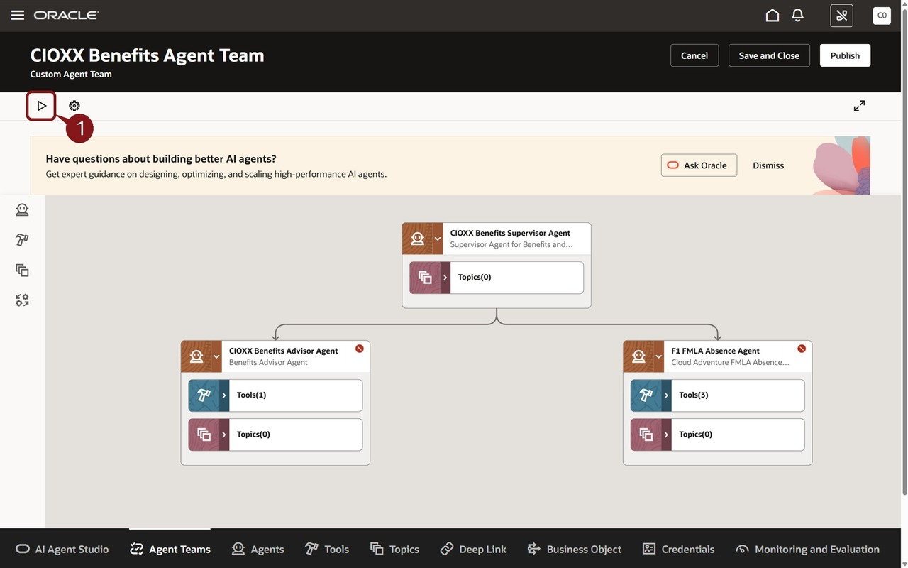  

14. The Agent is now ready for your questions.  Since we're just testing, you'll ask it for Help to confirm it's responding.

    > (1) In the **Ask Oracle** dialog box at the bottom of the screen, type **Help** and hit the **<****Enter****>** return key or click the **Up Arrow** icon 

    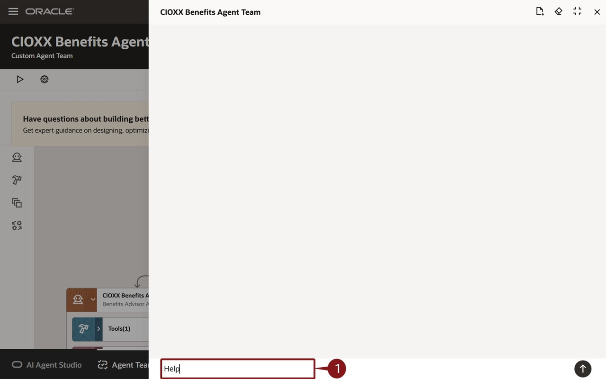  

15. The Agent will respond with information.  In this Debug mode, the Agent will also show you source and processing information (yellow boxes).  These will not be available to end-users once deployed.  Once the Agent responds, you are ready to move to the next step.

    > (1) Click the  icon in the upper right of the screen to close the Agent interaction 
    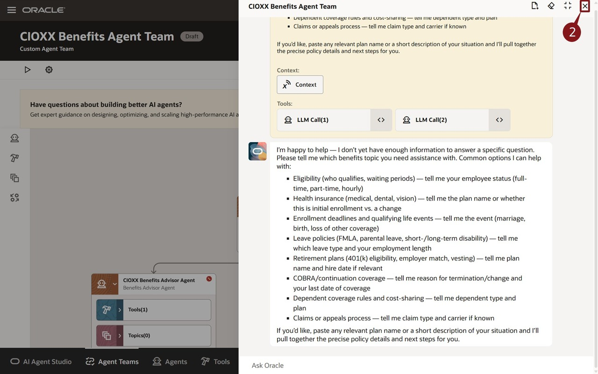  

16. Your Agent Team is ready, so let's Publish it.

    > (1) Click the **Publish** button on the top right.

    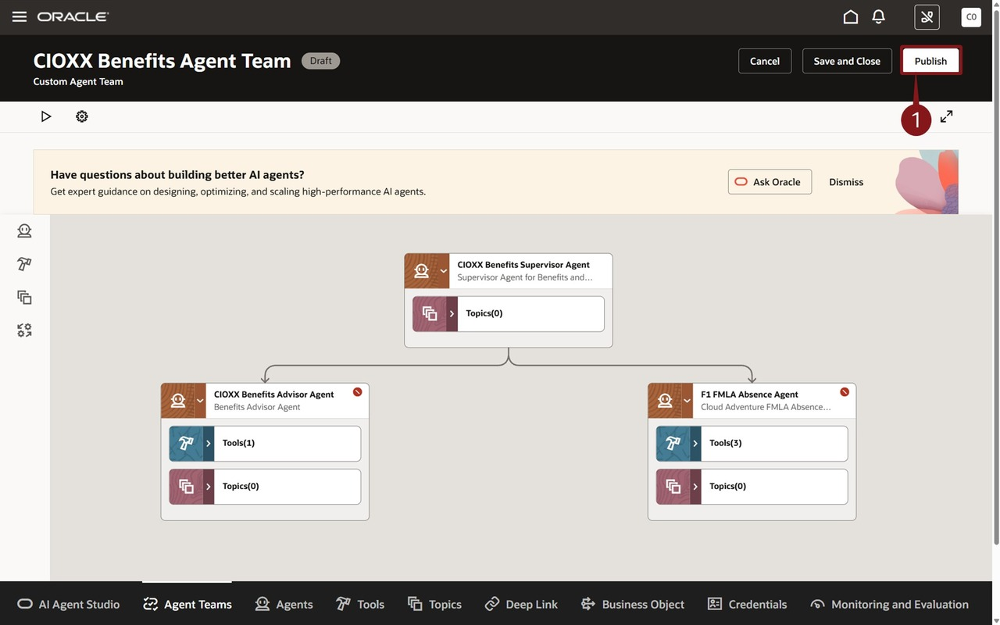  

17. The pop-up message is highlighting that you're creating a custom agent, which requires you to have the appropriate subscription before publishing to your production environment.  For this lab you can go ahead and Publish.

    > (1) Click the **Publish** button.

    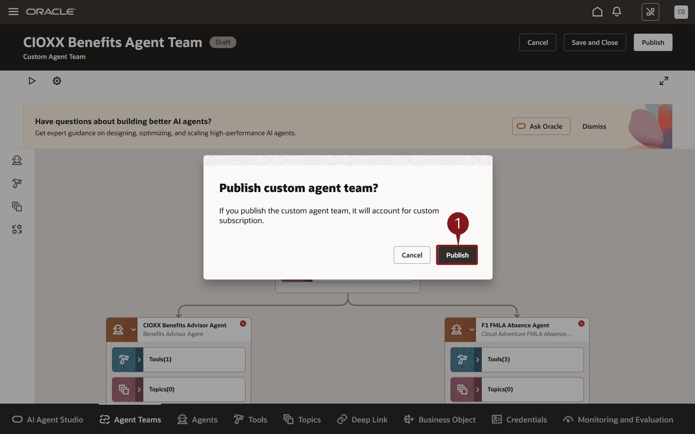  

18. You can confirm that the Agent team is published. Now you will go to the home page to begin the next part of this Adventure.

    > (1) Note that the application confirms that the Agent team was published.  This message only appears temporarily, so if it has already disappeared just continue with the next step.  
    > (2) Click the Home icon  in the top toolbar to return to the application home page and get ready for the next step.

    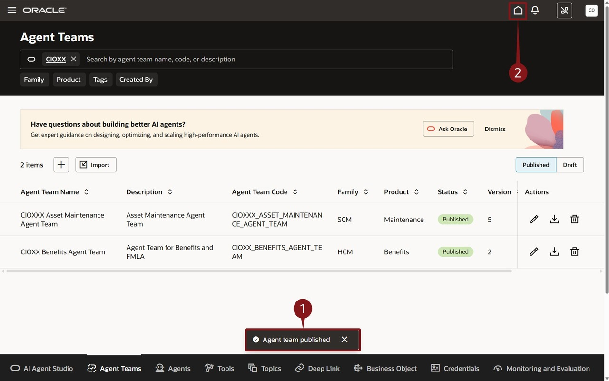  

19. The AI Agent is deployed to the Application UI via a Guided Journey.   
A Guided Journey allows you to embed specific information in standard application screens.  In addition to using a Guided Journey to embed an AI Agent (today's example), Guided Journeys can also be used to embed documents, analytics, URLs, Learning, Videos and more.  And like all configurations, Guided Journey configurations are automatically maintained during the release update process.  So, here you will create a Guided Journey.

    > (1) Enter **Guided Journey** in the search field and select the **Guided Journey** from the resulting dropdown.

    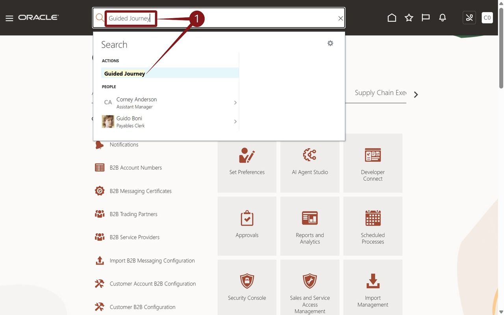  

20. You'll create your Guided Journey here.  It's quite simple.

    > (1) Click the 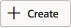 button.

      

21. Name your Guided Journey

    > (1) Enter Name:  **CIOXX Benefits Guided Journey** where **XX** is replaced with your user number. 
    > (2) Click the  button.

    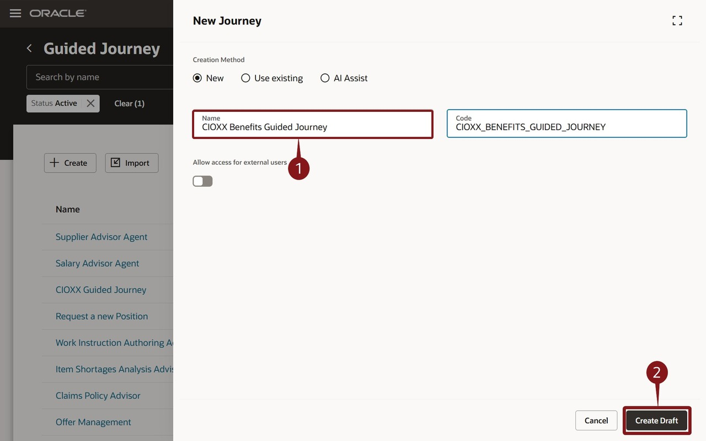  

22. Next, you'll add a Task to this Guided Journey.  This is where we specify a Task Type of Agent and reference the Benefits Agent Team you've assembled.

     > (1) Click the  button under the **Tasks** section.  This will open the New Task panel from the right.  

     > (2) Enter the fields as described below:
     * Task Name: **Benefits Guided Journey Task**  
     * Task Description: **Benefits Agent**  
     * Status:  **Active**
     * Sequence:  **1**
     * Add Instructions: **Enables Benefits Agent Team in Application UI** 
     * Task Type:  **Agent** from the dropdown  
     * Agent Type: **Workflow Agent** from the dropdown 
     * Workflow Agent: **CIOXX Benefits Agent Team** where **XX** is your user number from the drop-down. 

    > (3) Click the **Save** button  on the bottom right.

     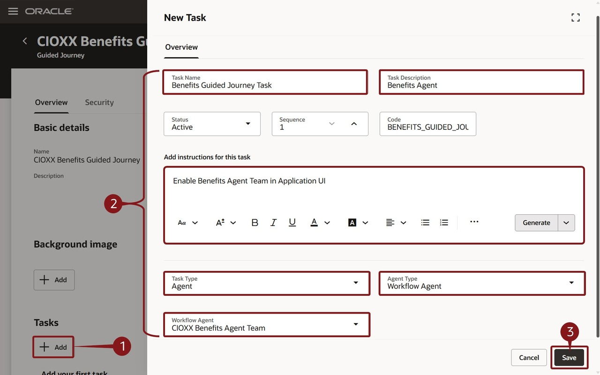

23. You’re almost done with the Guided Journey creation.  The last step is to Activate it to make it available for use.

     > (1) Click the Activate button 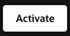 on the top right 

     > (2) Click the Home icon  in the top toolbar to return to the application home page and get ready for the next step.

    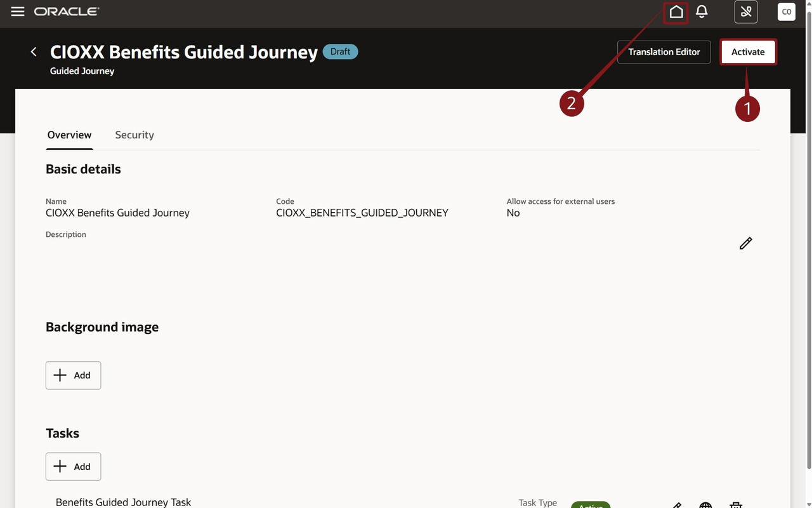  

24. Now, you'll go to the screen, where you will embed the AI Agent Team using the Guided Journey you created.

     > (1) Enter **Add Absence - Me** in the search field and select **Add Absence - Me** from the resulting dropdown.

    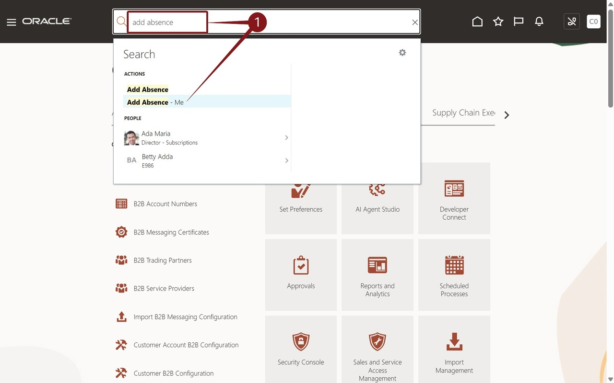  

25. Here, you see multiple Journey options.  A journey is a collection of tasks to facilitate a business process and are different from the **Guided Journey** we created.  A Guided Journey is designed to add content to an existing application screen.  So, you'll continue without using a Journey.

     > (1) Click the  **Continue Without Journey** button on the upper right portion of the screen.

    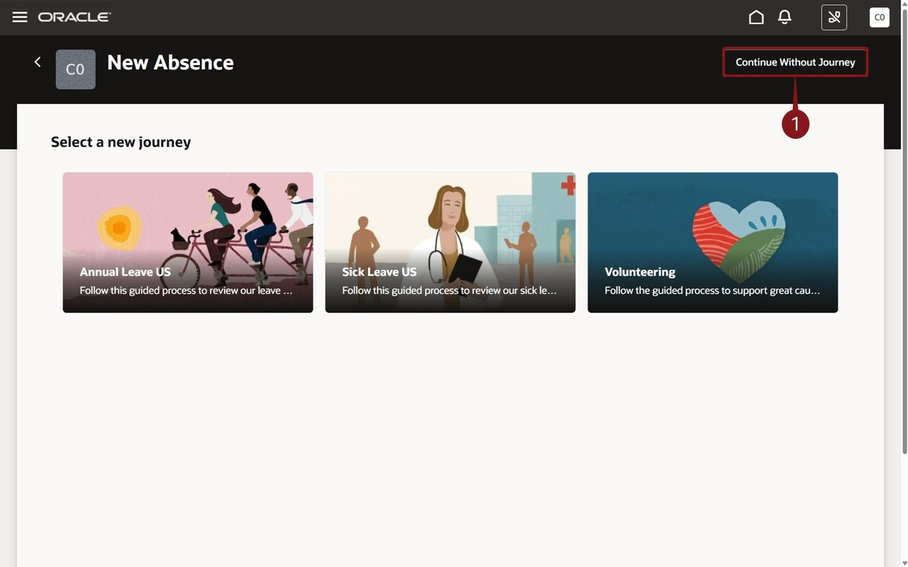  

26. You are now in the New Absence screen, where you could manually create an absence request.  But you want to make this easy for your users via an AI Agent by allowing them to ask questions related to Absence benefits and have the AI Agent assist with the creation of an Absence.  You'll use Visual Builder to configure the page and display the Guided Journey you created.

     > (1) Click the **logged in user icon** icon next to the bell icon in the top right corner and then select **Edit Page in Visual Builder Studio** from the resulting dropdown. 

    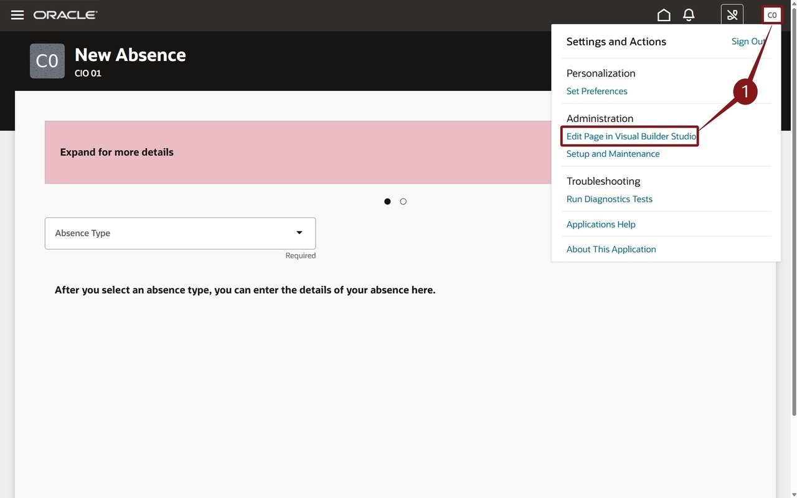  

27. You've opened the screen in Visual Builder Studio Express Mode, which allows you to make page configurations, including rules for field displays, validations, and page properties.  You'll do the latter.

     > (1) Click the **Configure Page Properties** button in the Business Rules panel on the right side of the screen. 

    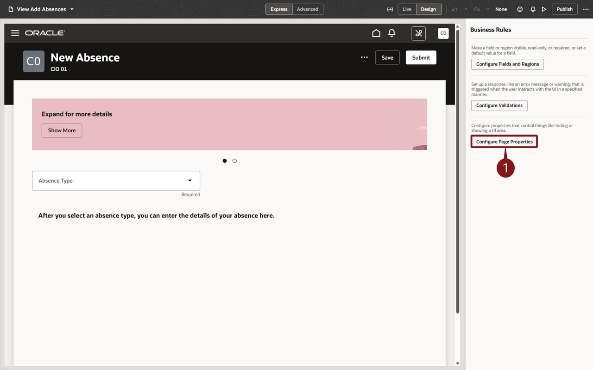  

28. If no properties have been configured on your screen, you'll be asked to starting preparing your Page Properties Configurations.

     > (1) Click the **Start Preparing** button 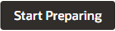. 

    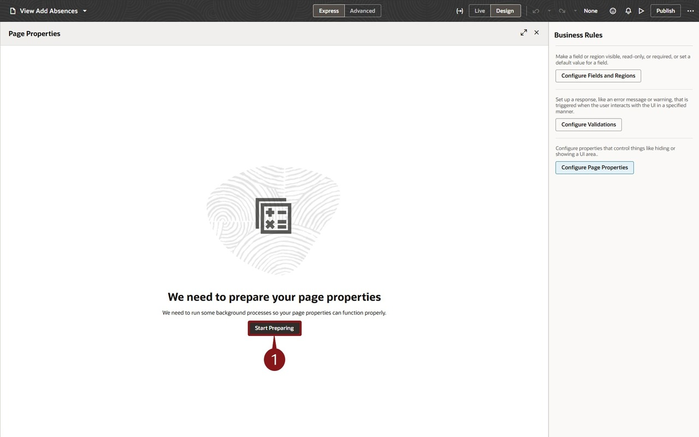  

29. Now, you can simply specify the Guided Journey you'd like to display on this screen by performing the following steps.

     > (1) Common Properties: **Click** the **Common Properties** object in the middle of the screen to expand the properties area. 
     > (2) Set Guided Journeys Code at the Page Level:  Select **CIOXX Benefits Guided Journey** from the dropdown where **XX** is replaced with your user number. 
     > (3) Click the **Preview** icon  on the toolbar on the top right of the page.  This will launch a new tab showing your newly configured screen in a full-functioning preview mode. 

    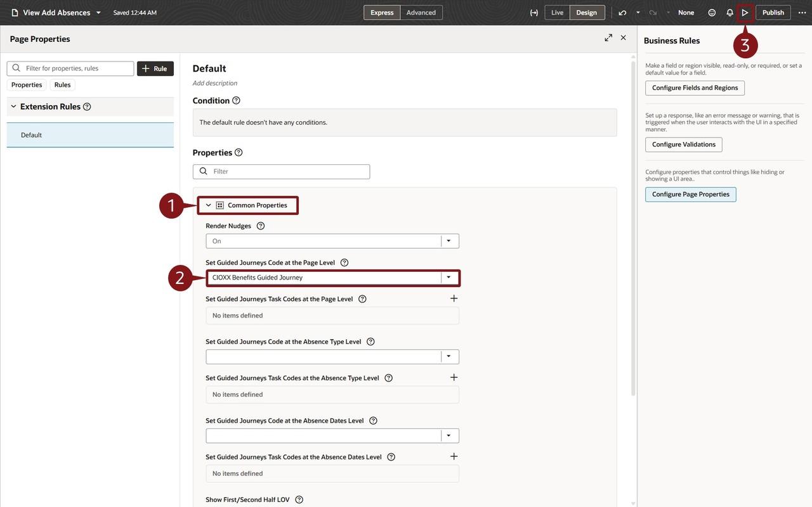  

30. The New Absence screen displays a new banner containing Benefits Agent Guided Journey.

     > (1) Click the **Ask Oracle** button  on the banner to launch the AI Agent. 

    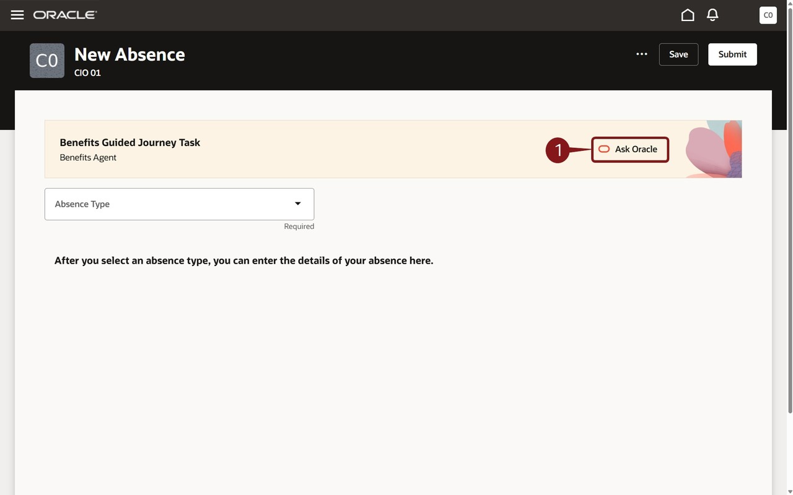  

31. The Agent appears in a sliding panel from the right.  You can interact with your agent via the Ask Oracle field at the bottom of the panel.  Based on your defined agent, you can ask about your Benefits information and even have the Agent create an absence request for you.

     > (1) In the **Ask Oracle** dialog box at the bottom of the screen, type **Please summarize health benefits** and hit the **<****Enter****>** key or click the **Up Arrow** icon 

    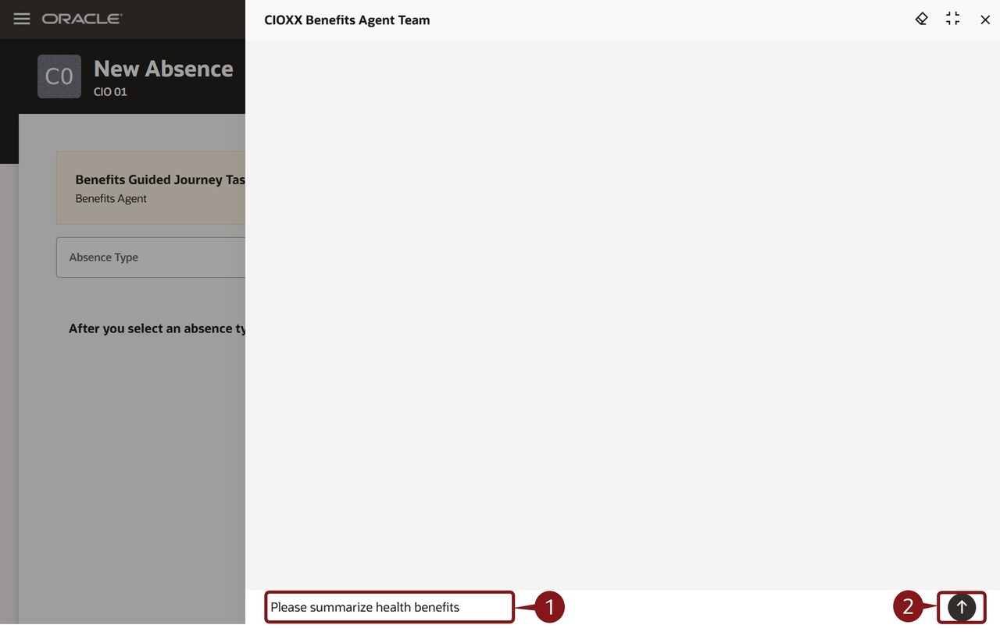  

32. The Agent will respond with information, so you'll ask an additional question.

    > (1) In the **Ask Oracle** dialog box on the bottom right of the screen, enter **Tell me more about FMLA benefits** and hit the **<****Enter****>** key or click the **Up Arrow** icon 

    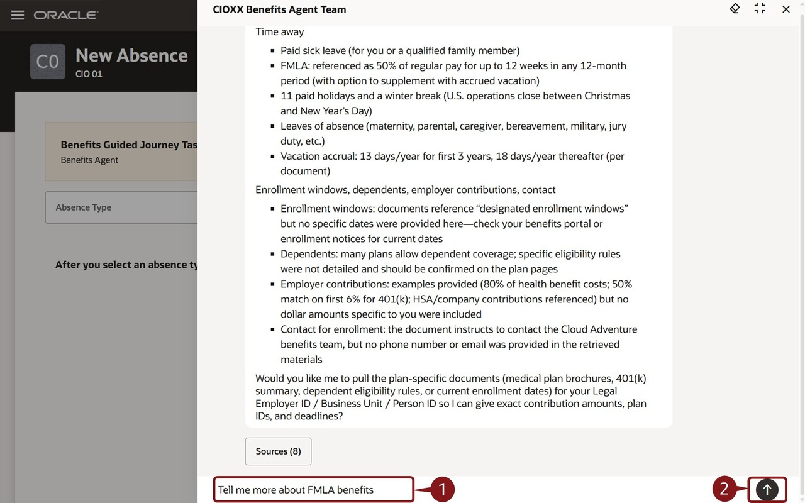  

33. The Agent checks with HCM Cloud and confirms existing leave requests, if any.  It also offers to create a new request for you if you provide the requested start and end dates.

    You decide to tell the Agent that you’re interested in creating an FMLA absence, but you do so without initially providing the requested dates.

    > (1) In the **Ask Oracle** dialog box on the bottom right of the screen, enter **Yes, please submit a new FMLA absence with a start date of 2026-05-18 and an end date of 2026-05-22** and hit the return key or click the **Up Arrow** icon 

    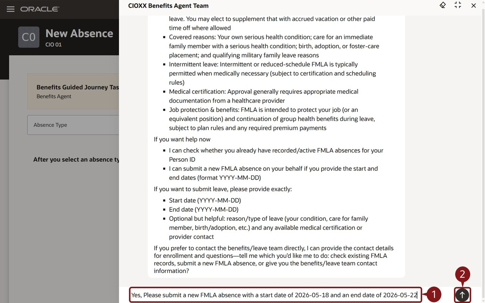  

34. The agent confirms that your request has been created.

    > (1) Review AI Agent Response 
    > (2) Click the x icon in the upper right to close the debug screen.

    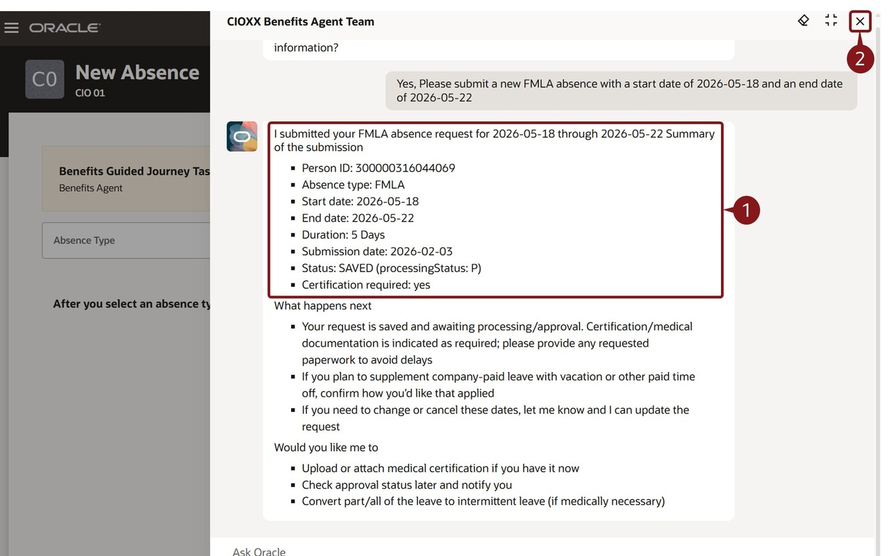  

35. Let’s go back to the homepage so we can confirm the creation of our absence.

    > (1) Click the Home  **Ask Oracle** icon  on the top right.

    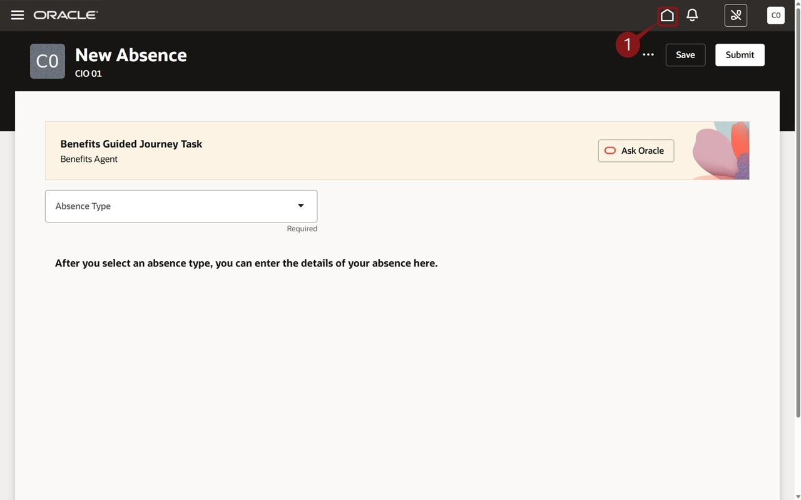  

36. The AI Agent has created your absence request and now you want to find it.

    > (1) In the Search field, type **existing absences** and select **Existing Absences - Me** from the resulting dropdown.

    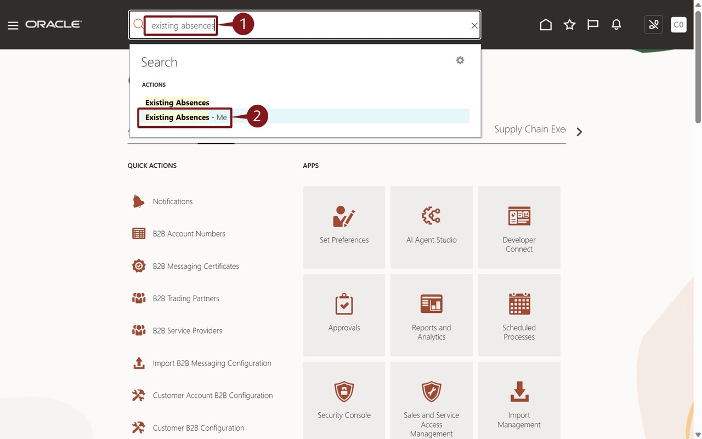  

37. There it is!  

    > 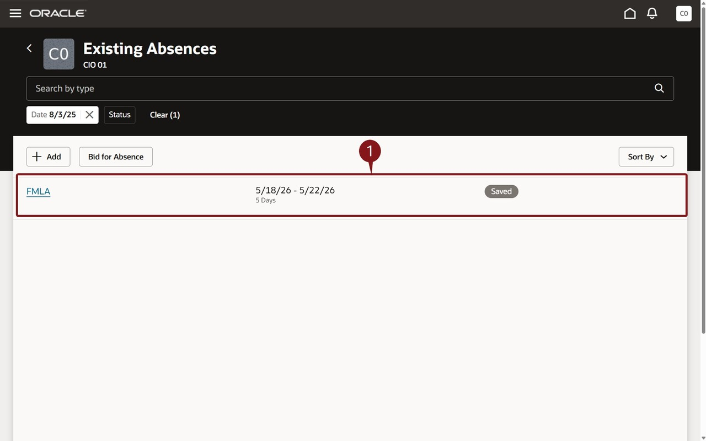  

38. Adventure awaits, click on the image, show what you know and rise to the top of the leader board!!!

    

### Summary

As you have seen here, AI Agent Studio puts customers in the driver’s seat, helping empower you to design the future of AI in your organizations on top of a bedrock of trust and safety. AI Agent Studio includes a built-in testing environment, validation, and traceability tools to confirm accuracy. Oracle maintains the same data controls at a user level, which means no individual sees data or AI recommendations that they’re not permitted to see.

AI Agent Studio empowers enterprises to configure and build AI agents that extend their workforce and help achieve new levels of productivity. It allows you to harness the full potential of AI agents and transform the way work gets done in your organization.

AI Agent Studio is a design-time environment that provides a set of tools to create, customize, validate, and deploy GenAI features and AI agents to meet the specific needs of the organization. It is the same unified environment Oracle uses to internally build agents, made available now to customers and partners to customize and extend agents from Oracle-provided pre-configured templates or to create new agents and multi-agent workflows.

Like our AI capabilities, Oracle AI Agent Studio was built natively into Fusion Cloud Applications on our trusted, high performance Oracle Cloud Infrastructure (OCI), which means it can easily and securely access Fusion knowledge stores, tools, and APIs and allows agents to be deployed directly into the flow of work. This approach means maximum flexibility and customization without sacrificing reliability or performance.

**You have successfully completed the Activity!**

### Learn More

* [AI Agent Studio Solution Brief](https://www.oracle.com/a/ocom/docs/applications/fusion-apps-ai-agent-studio-solution-brochure.pdf)
* [AI Agents for Fusion Applications](https://www.oracle.com/applications/fusion-ai/ai-agents/)
* [AI for Fusion Applications](https://www.oracle.com/applications/fusion-ai/)
* [Oracle Documentation](http://docs.oracle.com)

## Acknowledgements

* **Author** - Stephen Chung, Principal SaaS Cloud Technologist; Sajid Saleem, Master Principal SaaS Cloud Technologist; Charlie Moff, Distinguished SaaS Cloud Technologist
* **Contributors** - The AI Adventure Team (Gus, Kris, Sajid, Casey, Stephen, Jamil, Sohel, Xavier, Nate, Charlie)
* **Last Updated By/Date** - Charlie Moff; Sajid Saleem; February 2026