# Assemble and Test an AI Workflow using AI Agent Studio

### Introduction

AI Agent Studio for Fusion Applications is a comprehensive platform for creating, extending, deploying and managing AI Agents and Agent Teams across the enterprise. Oracle AI Agent Studio delivers easy-to-use tools, including advanced testing, robust validation, and built-in security, that helps Oracle Fusion Applications customers and partners create and manage AI agents. Leveraging the same technology that Oracle uses to create AI agents, Oracle AI Agent Studio enables users to easily extend pre-packaged agents and/or create new agents and then deploy and manage them.

### Objectives

In this activity you will use Oracle Fusion AI Agent Studio to
* Assemble a Workflow Agent using LLM, Switch and Agent Nodes.
* The Workflow will determine user intent and use the appropriate agent to provide a response.
* It will utilized a predefined Benefits Policy Agent (RAG) to answer questions about available benefits.
* It will also use the FMLA Absence Agent created in the preceding lab.
* You will then test the Agent Workflow using the included Debug feature of AI Agent Studio by inquiring about benefits, checking for existing of existing absences, and having the agent create an absence request.

Estimated Time: 15 minutes

## Pre-requisite


As a pre-requisite for this adventure, please download following file
1. User Prompt file for the Get User Intent node of your Workflow Agent 
<br>
[Right-click here and select Download Linked File as OR Save Link as OR Save File as.](../05d-workflow-agent-hcm/files/user-prompt-workflow-agent-hcm.txt)
2. Output Specification file for the Get User Intent node of your Workflow Agent 
<br>
[Right-click here and select Download Linked File as OR Save Link as OR Save File as.](../05d-workflow-agent-hcm/files/output-specification-workflow-agent-hcm.txt)


## Begin Exercise

1. Assemble an AI Agent Team, Debug and Test

    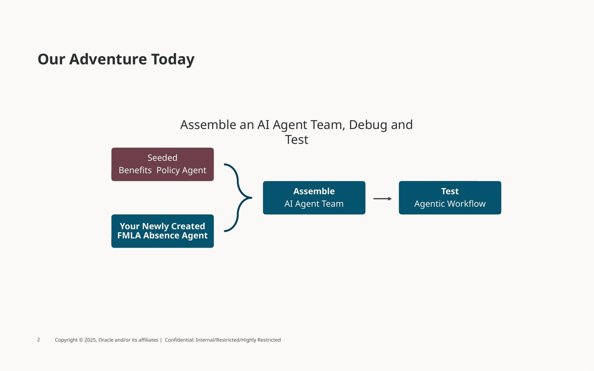

2. Open AI Agent Studio

    > (1) Click the **Tools** menu tab<br>
    > (2) Click the **AI Agent Studio** tile

    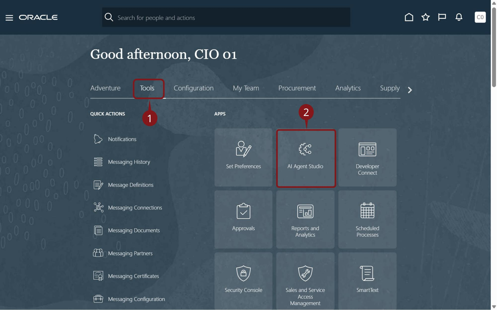

3. Expand Menu

    > (1) Click the **Expand** Menu


    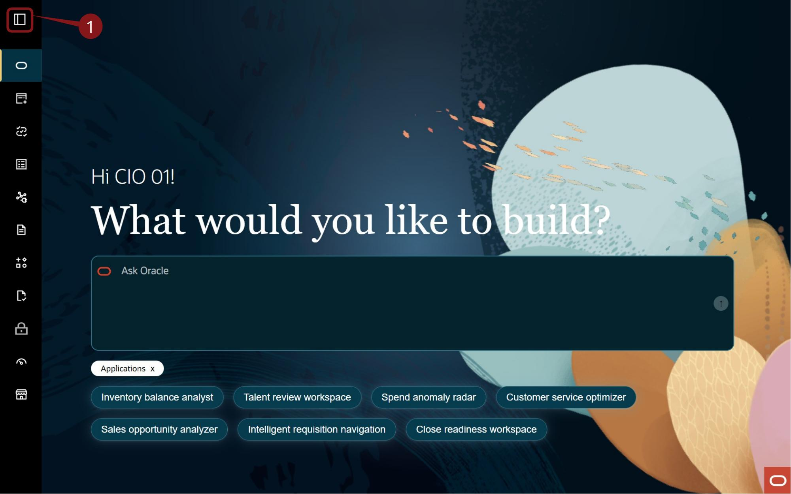

4. Open Workflows

    > (1) Click the **Workflows** Menu Option


    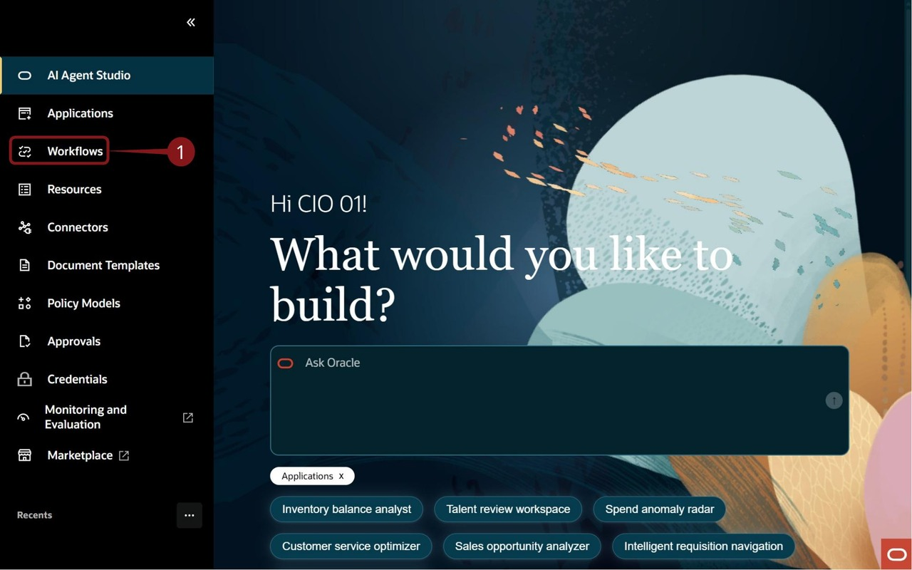

5. You’ll now create a workflow that leverages the Agent that you previously created.

    > (1) Click the **Add** button to create a new Workflow


    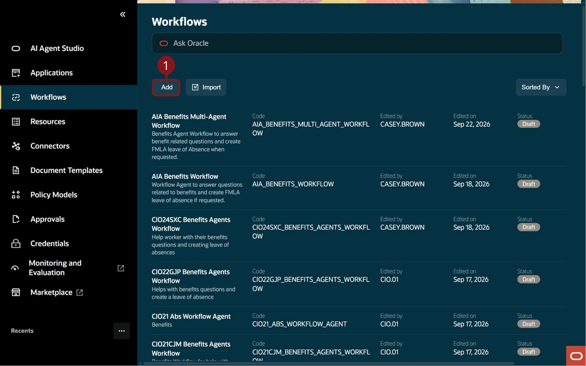

6. Workflow Settings: Details

    > (1) Enter the following fields as shown:
    * Agent Team Name:  **CIOXXYYY Benefits Workflow**
    * Family:  **HCM**
    * Benefits:  **Benefits**<br>

    > (2) Scroll Down


    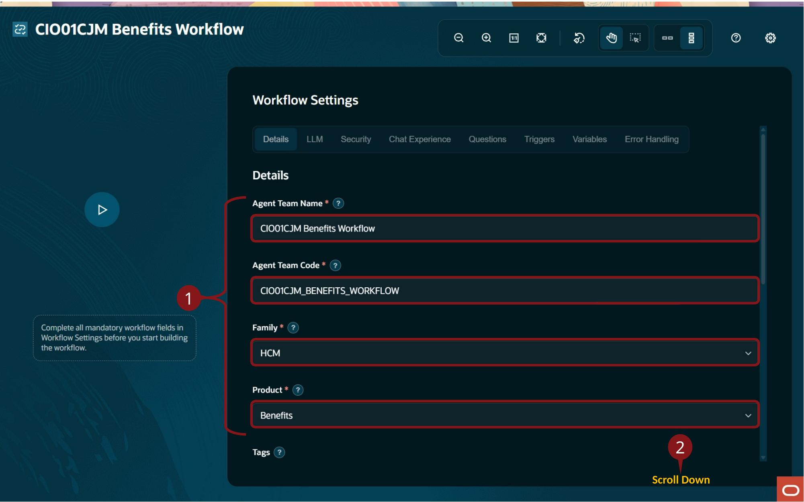

7. Slide 7:  Workflow Settings: Description

    > (1) Enter **Benefits and FMLA Workflow** in the **Description** field. <br>
    > (2) Click in the blank space to the left (the Workflow Settings panel will be hidden)


    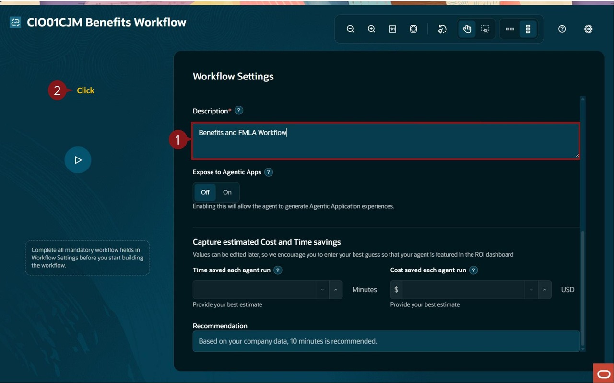

8. Workflows can include a lot of components including data components, logic, workflow controls, human approval, loops, switches, code nodes and much more.  You can see these in the Component Palette

    > (1) Click the  **Show Component Palette** in the bottom toolbar

    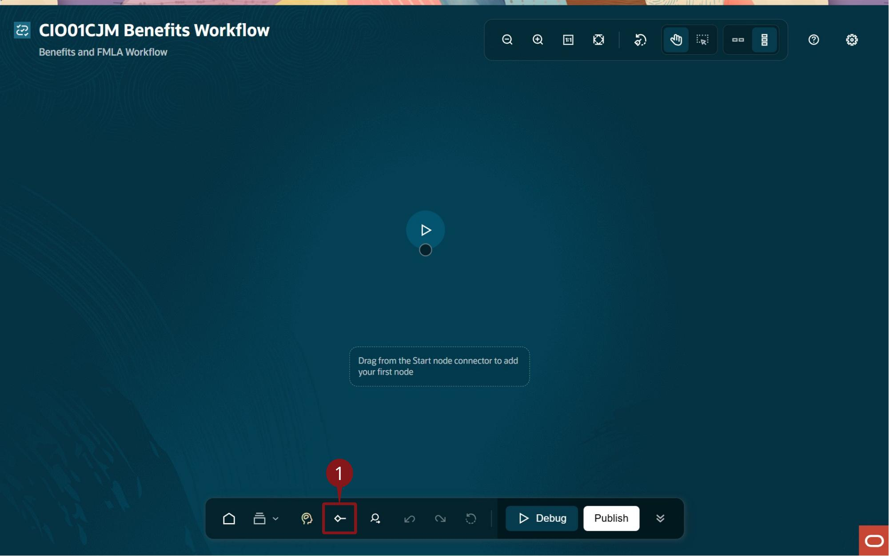

9. You can Click and Drag to add nodes to your workflow. 
    > (1) Click the  **Black Circle Icon** under the play icon and drag to the **Dotted Rectangle** region below it.<br>

    > (2) Release the mouse once in the drag is complete.

    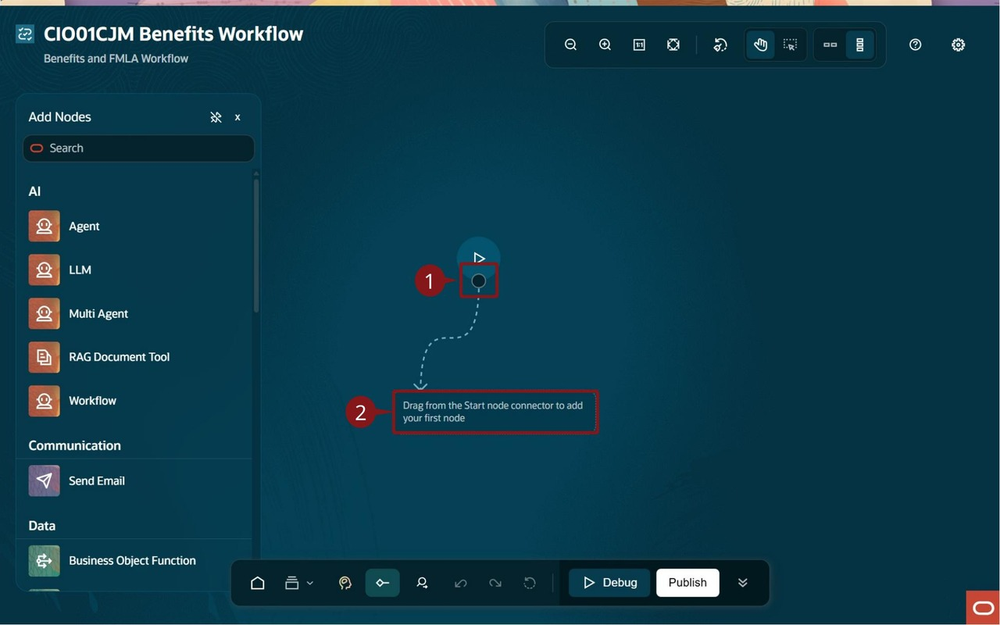

10. Your first step will call an LLM to get User Intent

    > (1) Select  **LLM** from the dropdown list


    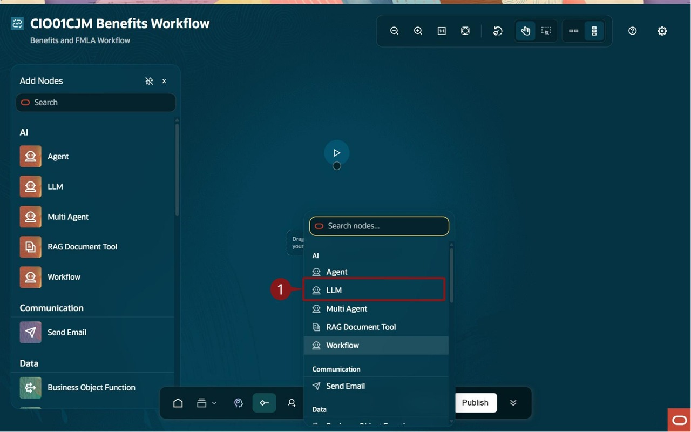

11. Enter Basic Information about this node.

    > (1) Type **Get User Intent** in the Name field<br>
    > (2) Scroll Down


    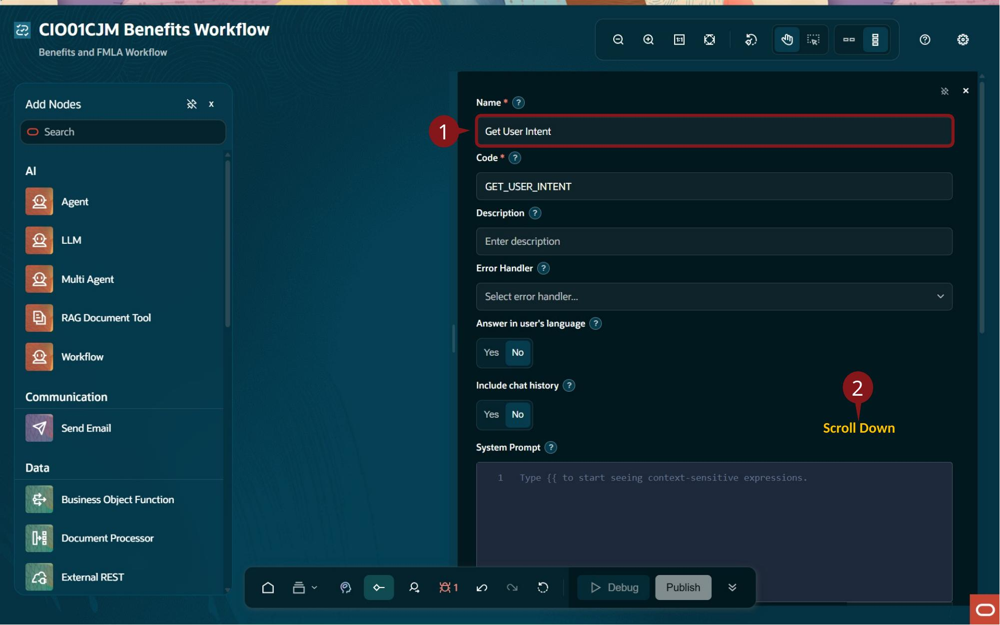

12. Here you’ll enter the prompt information for this node.  You want the workflow to determine whether the user is asking a query about benefit policies or trying to work with absences and leaves.

    > (1) Enter the **User Prompt**.  To streamline this step, we've pre-created the prompt. The prompt text is available in the copy block below or from the downloadable file provided in the pre-requisites for this lab.<br>
    > (2) Enter the **Output Specification**.  To streamline this step, we've pre-created the prompt. The prompt text is available in the copy block below or from the downloadable file provided in the pre-requisites for this lab.<br>
    > (3) Click the **x** icon in the top right corner of the Agent panel to close the panel.  Your work is always auto-saving.

**User Prompt**:
```
<copy>
Based on {{$context.$system.$inputMessage}}, determine the user intent. 

If the user intent is to ask information about benefits available, set varialbe "userIntent" as "QueryBenefits"

If the user intent is to ask information about any existing FMLA absence or to submit new FMLA absence, set variable "userIntent" as "CheckandSubmitFMLAAbsence".
</copy>
```
**Output Specification**:
```
<copy>
{
  "$schema": "http://json-schema.org/draft-04/schema#",
  "type": "object",
  "properties": {
    "userIntent": {
      "type": "string"
    }
  }
}</copy>
```

    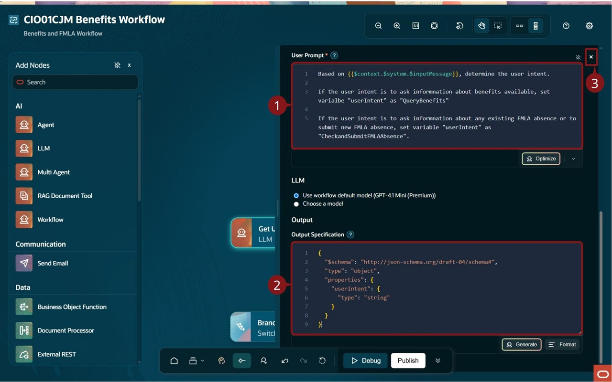

13. Your next node will be a Switch.  This will enable the workflow to determine to appropriate route for this request.

    > (1) Click the  **Black Circle Icon** at the bottom of your newly created Get User Intent node and drag to the **open space** in the box below.<br>
    > (2) Release the mouse once in the drag is complete.

    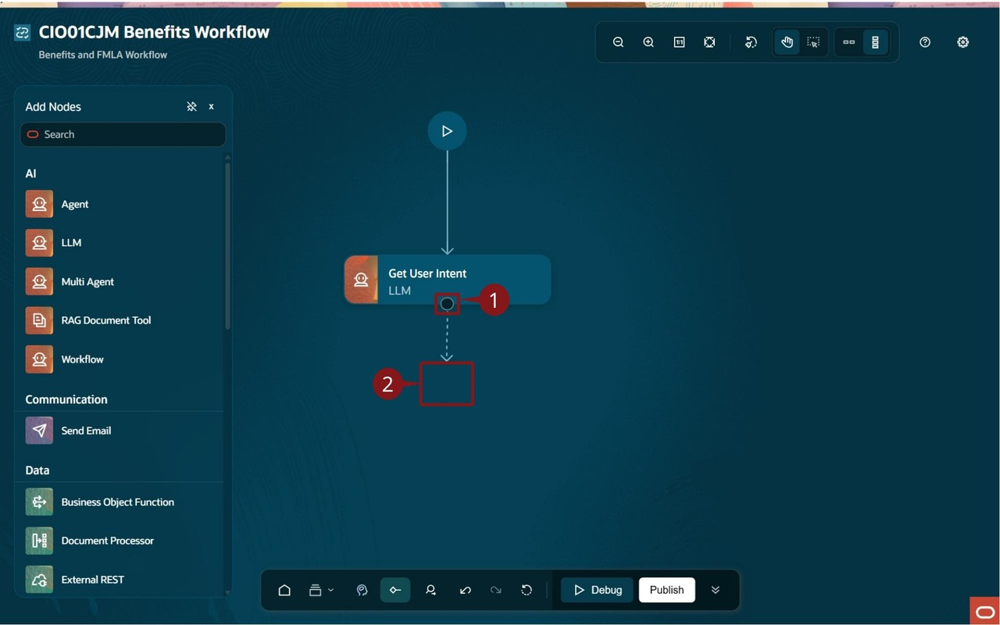

14. You will select the Switch node.

    > (1) Select  **Switch** from the list of available nodes.  You can scroll to find it or use the Search nodes filter at the top of the list.


    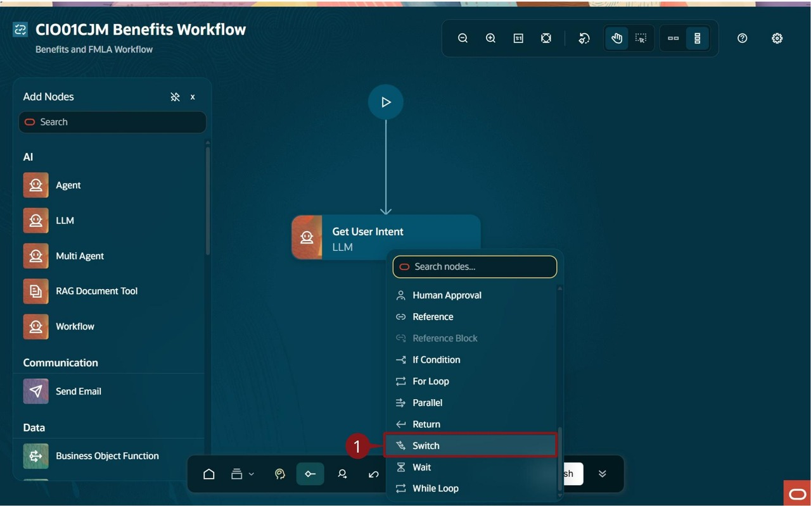

15. The Switch node allows you to define the criteria for routing this request.  After naming the node, you will use the dropdown (popup) box to enter the desired Case Expression.

    > (1) Enter **Branch based on user intent** in the Name field. <br>
    > (2) Click the **dropdown** icon on the end of the Case Expression field<br>
    > (3) Select **Nodes** from the list of available options


    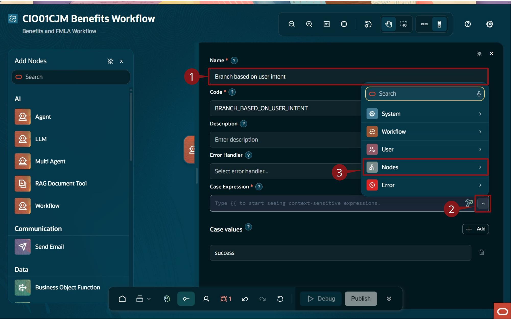

16. Slide 16:  There’s only one option here, so you can select it.

    > (1) Select **Get User Intent** from the list.  There’s only a few more clicks to go.

    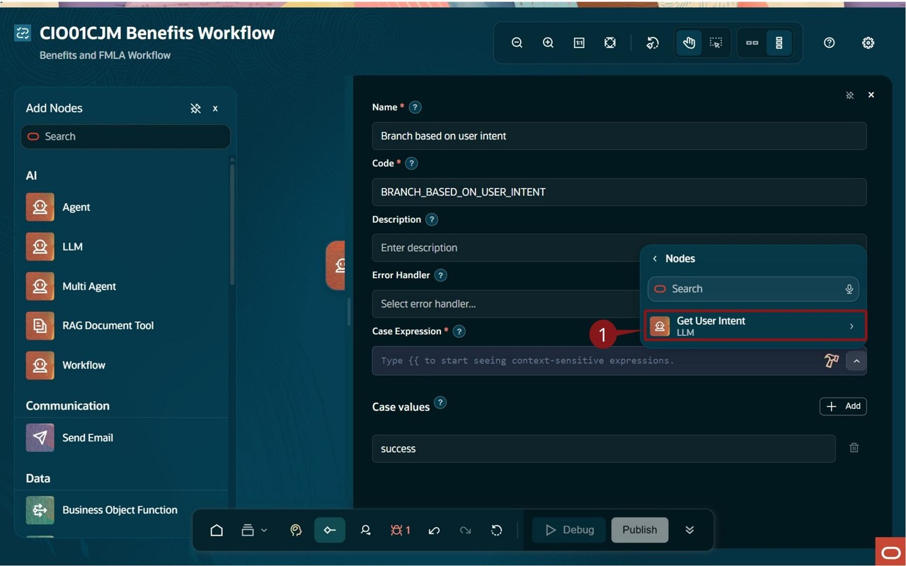

17. There are a few options here.  We want to use the Output from the Get User Intent node.  Notice that there are other options as well, including Error handling.

    > (1) Select **Output** from the list.  One more click to go after this.

    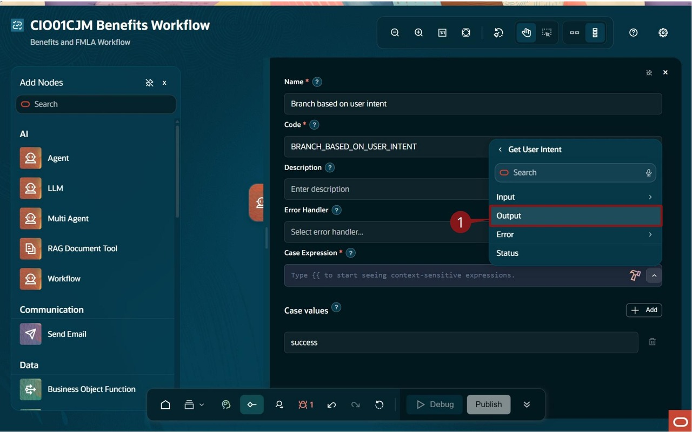

18. userIntent is the only option and it’s what you want.  That will allow the workflow to route properly based on the logic in the following steps.

    > (1) Select **userIntent** from the list.

    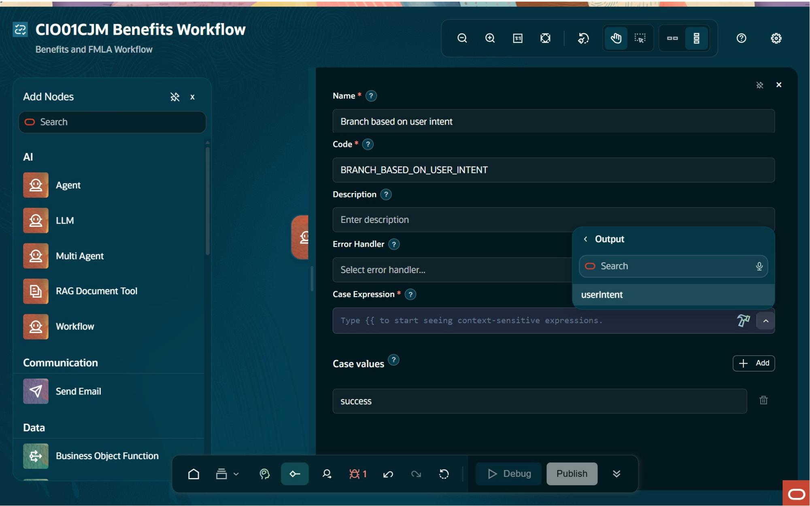

19. You’ve defined the Case Expression.  Now, you’ll review it and enter the case values.

    > (1) Note that you now have a value in the **Case Expression** field.  Alternatively, you could have entered this expression directly.  But, where’s the fun in that.  Plus, the dropdowns help you understand your options and get the syntax correct. <br>
    > (2) **Scroll down** to see the Case values.


    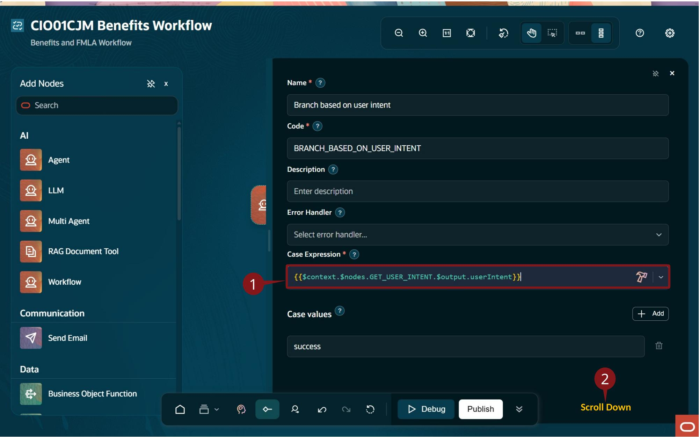

20. You want to Case values based on the possible outcomes from your User Intent Node

    > (1) **Replace** the word Success in the Case value field with **QueryBenefits**<br>
    > (2) Click the **+ Add** button to allow you to enter another value.


    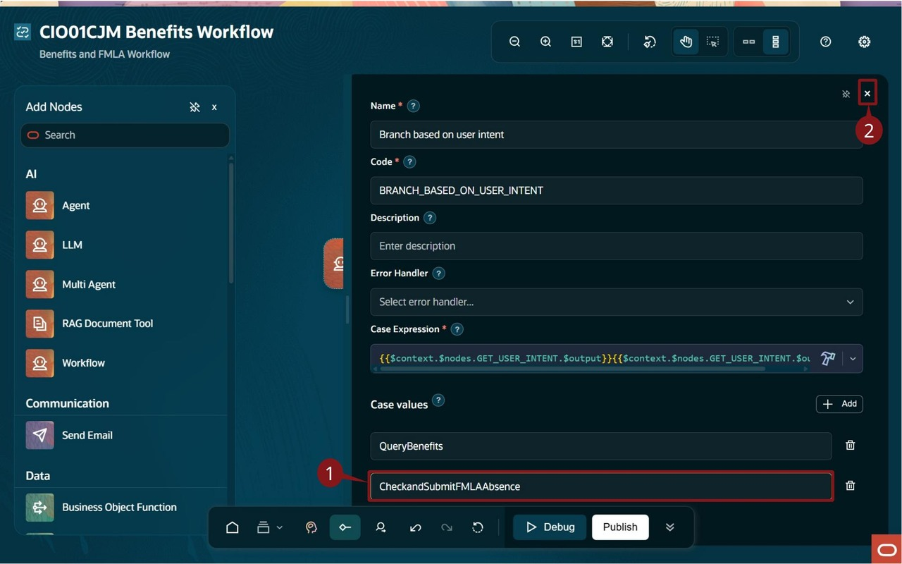

21. Next, you’ll add Agents for the two possible Switch Outcomes (QueryBenefits and CheckandSubmitFMLAAbsence).  If you’re finding your Workflow layout a little unwieldy, you can also Click-and-Drag to rearrange the nodes.

    > (1) **Hover** over **Branch based on user intent** switch node to see the optional routes.<br>
    > (2) Click and Drag from the **QueryBenefits** black circle icon to the **open space** below.<br>
    > (3) Release the mouse once in the drag is complete.

    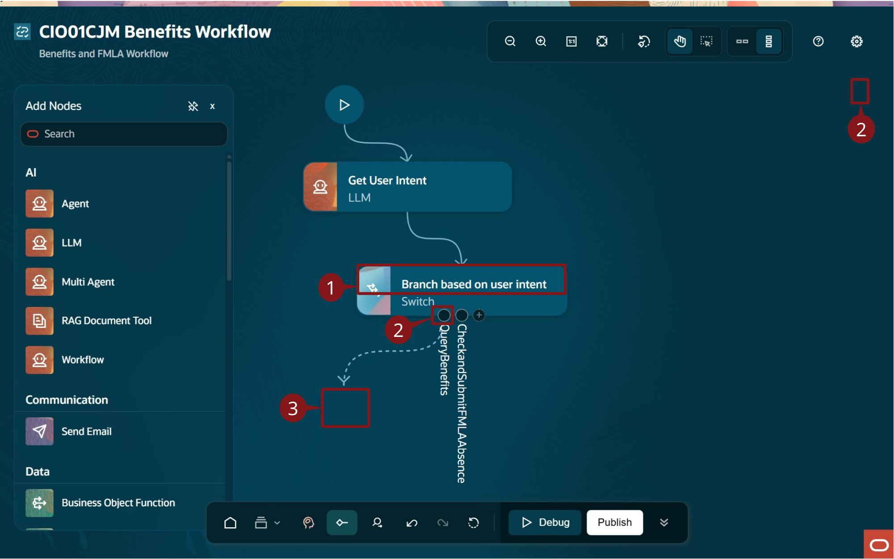

22. For the QueryBenefit route, you’ll want the Workflow to call the seeded AIA Benefits Agent.  So, this route will call an Agent.

    > (1) Select **Agent** from the resulting dropdown.

    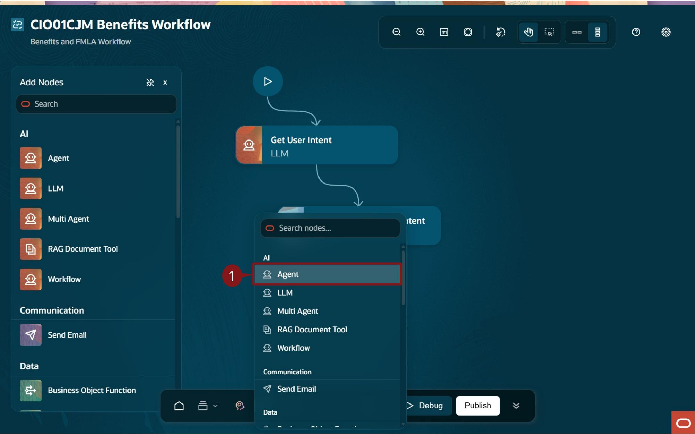

23. You can name this node and specify the Agent that it calls.

    > (1) Enter **Benefits Advisor Agent** in the Name field. <br>
    > (2) **Scroll down** to specify the Agent.

    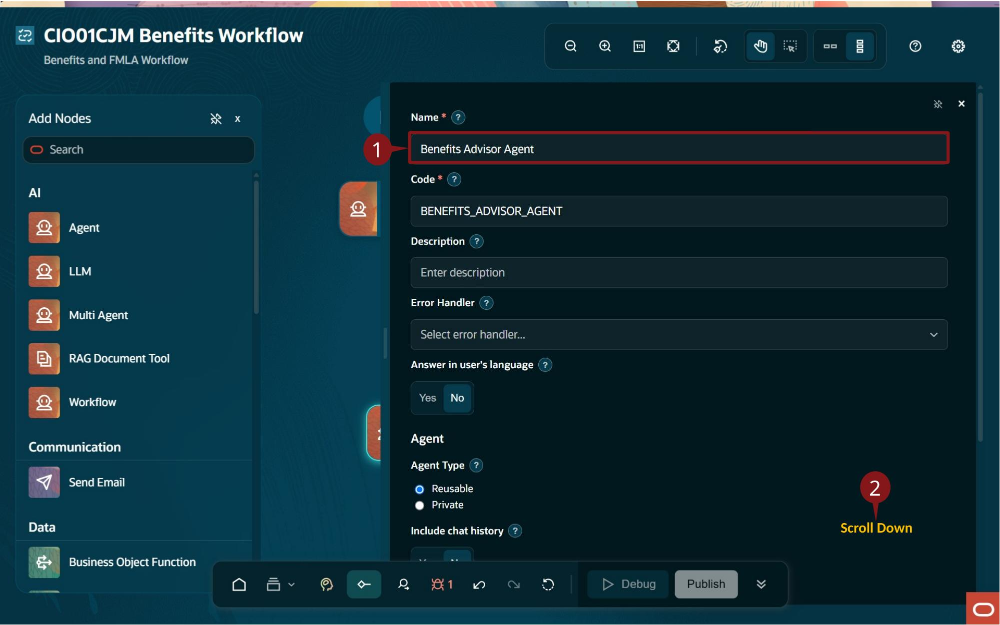

24. Specify that this node will use the AIA Benefits Advisor Agent.


    > (1) Enter the following fields as shown:
    * Family:  **HCM*** Product:  **Benefits**
    * Agent:  Type **AIA** and select **AIA Benefits Advisor Agent** from the resulting dropdown<br>

    > (2) Type **{{$context.$system.$inputMessage}}** in the Message field.<br>

    > (3) Click the **x** icon in the top right corner of the Agent panel.


    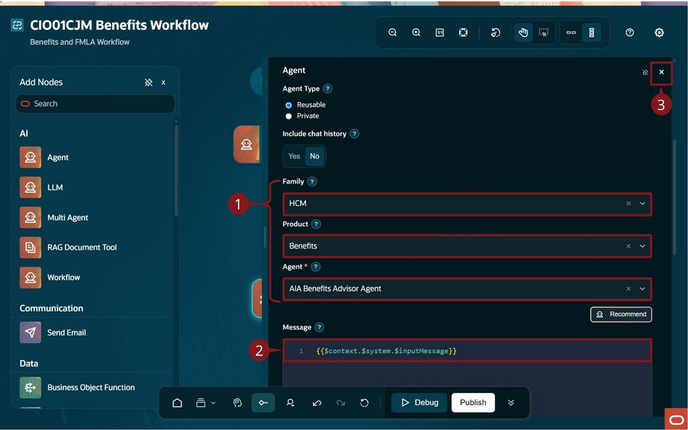

25. You’ve already specified the routing for one of the output options, so now it’s time for you to specify the routing for CheckandSubmitFMLAAbsence

    > (1) **Hover** over **Branch based on user intent** switch node to see the optional routes.<br>
    > (2) Click and Drag from the **CheckandSubmitFMLAAbsences** black circle icon to the **open space** below.<br>
    > (3) Release the mouse once in the drag is complete.

    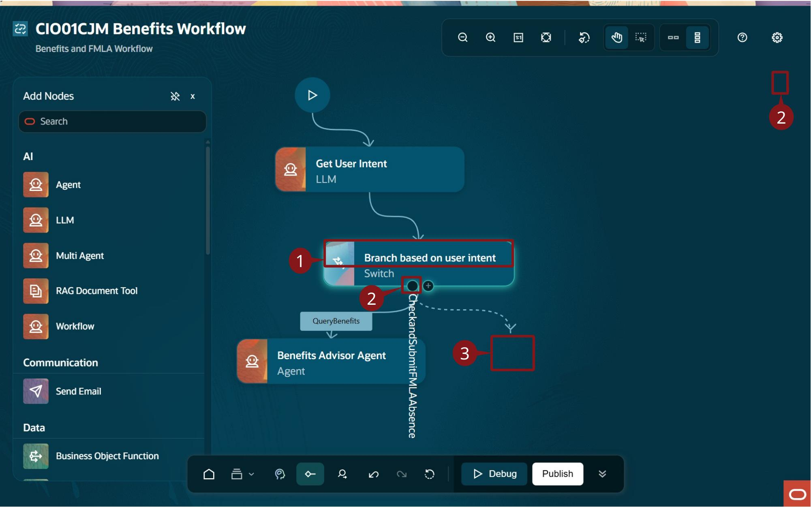

26. For the CheckandSubmitFMLAAbsences route, you’ll want the Workflow to call the Business Object agent that you created in Lab 1..  So, this route will also call an Agent.

    > (1) Select **Agent** from the resulting dropdown.

    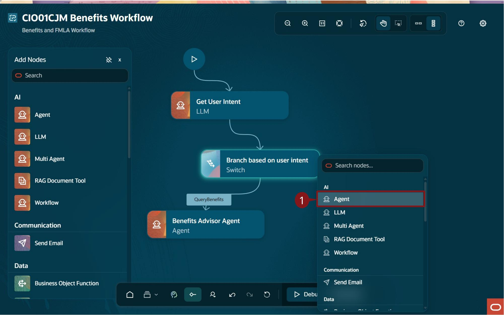

27. You can probably see where this is headed.  You now need to Node name and the Agent to be called for this route.

    > (1) Enter **Benefits Advisor Agent** in the Name field. <br>
    > (2) **Scroll down** to specify the Agent.

    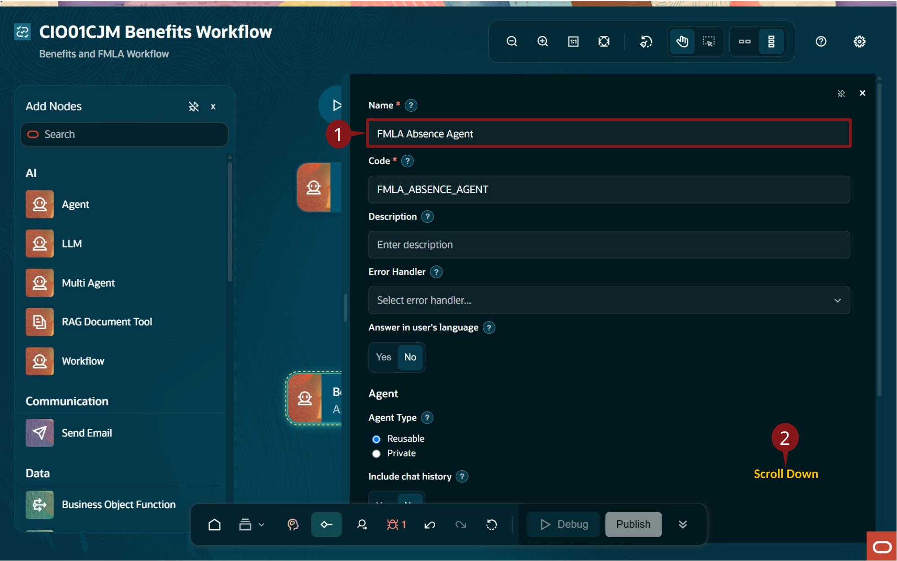

28. Specify that this node will use your CIOXXYYY Absence Agent from the previous lab.

    > (1) Enter the following fields as shown:
    * Family:  **HCM*** Product:  **Absences*** Agent:  Type **CIOXXYYY** and select **CIOXXYYY Absence Agent** from the resulting dropdown.  Remember, XX is your user number and YYY is your initials.  Seriously, you should be used to that by now.<br>

    > (2) Type **{{$context.$system.$inputMessage}}** in the Message field.<br>

    > (3) Click the **x** icon in the top right corner of the Agent panel.


    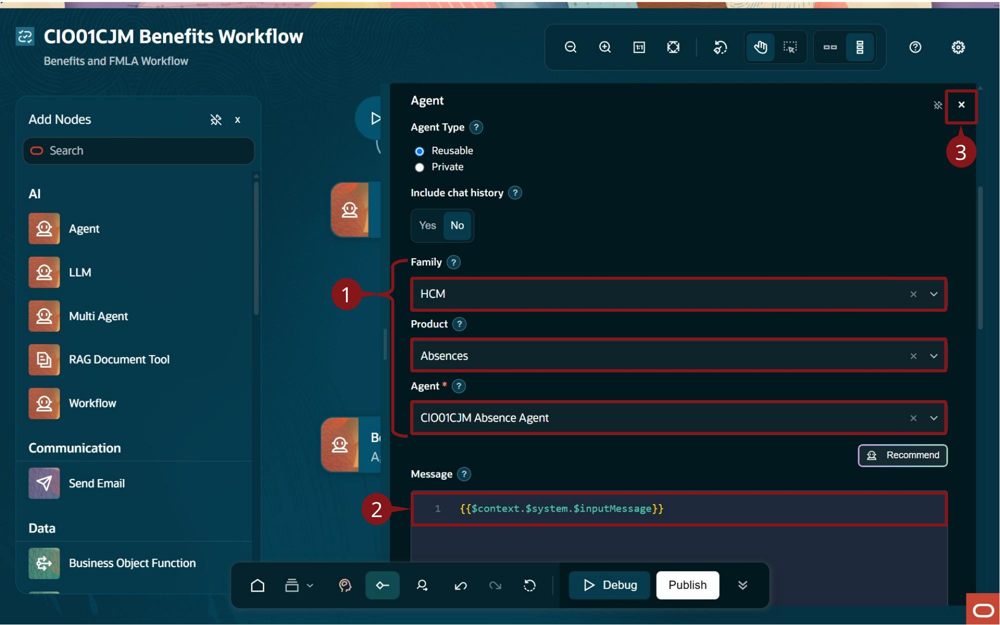

29. It’s time to test and see how things are working.  You can do this with the Debug feature that allows you to run the Workflow and view user responses and workflow execution information.

    > (1) Click the **Debug** button on the bottom toolbar to start testing.

    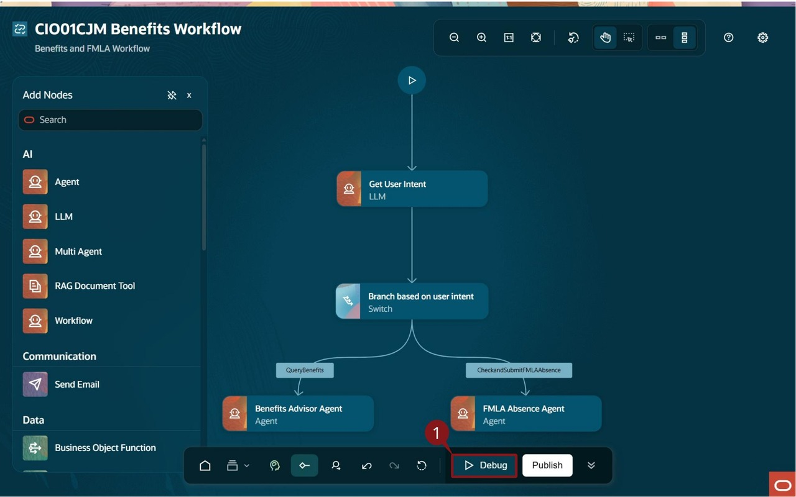

30. Before you start testing you can take a few seconds to pretty up your workflow layout.  We don’t need Pit Crew members tripping over things.

    > (1) Optionally click the **Prettify** icon on the top toolbar to clean-up and/or redd up the layout.<br>
    > (2) Optionally click the **Zoom to Fit** icon on the top toolbar to make sure everything fits on your screen.  I know, we should’ve told you this earlier.<br>
    > (3) Optionally click and drag to reposition your visualization.  You can click individual items or click near the top to drag the whole diagram.<br>
    > (4) Type **Please summarize my available benefits** in the **Ask me anything** box on the bottom left and press the **Enter** key.

    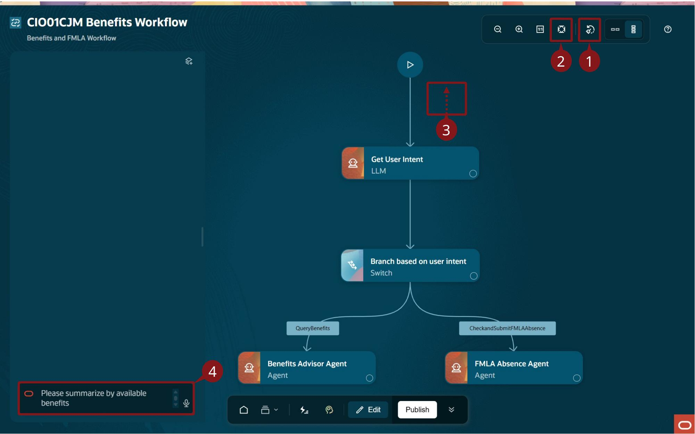

31. Explain Debug and Continue Conversation.

    > (1) Note the response to your question.  Scroll the response window, if necessary.<br>
    > (2) Note that the diagram has highlighted (in green) the path that the Agent Workflow used to resolve the question. <br>
    > (3) Click the **Benefits Advisor Agent** box to show the results information panel

    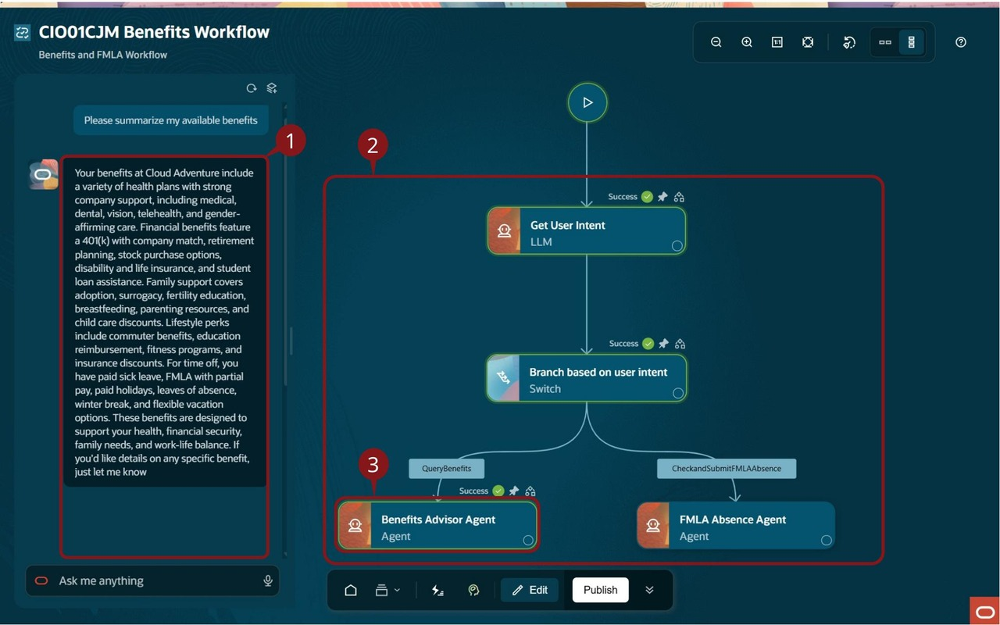

32. Explain Debug and Continue Conversation.

    > (1) Note the Results and Configuration tab on the pop-up panel.  This shows details about the agent execution. <br>
    > (2) Click the **x** icon on the top right of the pop-out panel<br>
    > (3) Type **do I have fmla benefits** in the **Ask me anything** box on the bottom left and press the **Enter** key.

    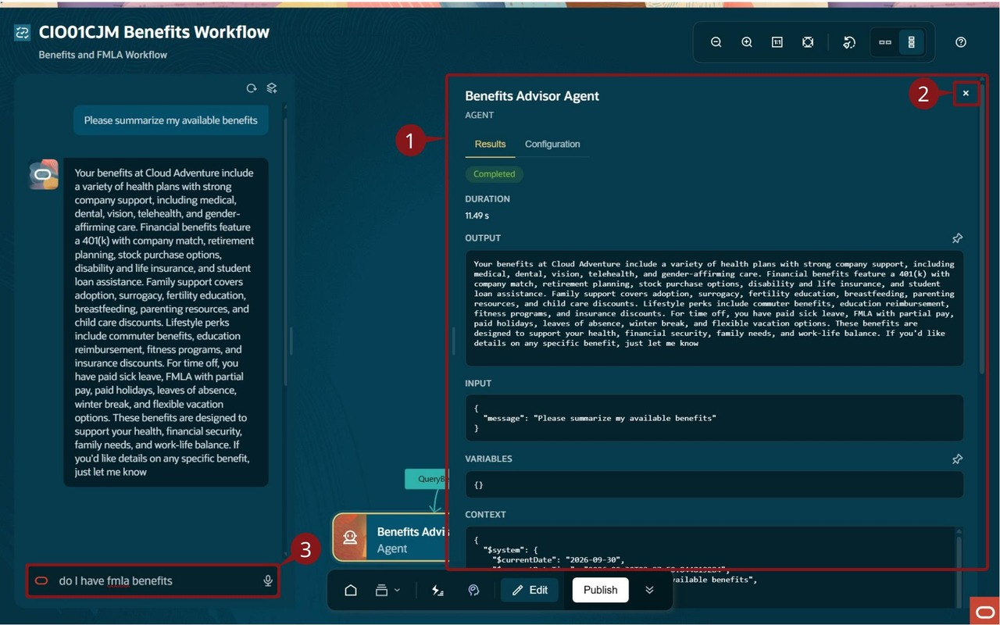

33. Continued Debug Discussion

    > (1) Note the response to your question.  Scroll the response window, if necessary. <br>
    > (2) Type **Do I have any existing FMLA absences** in the **Ask me anything** box on the bottom left and press the **Enter** key.

    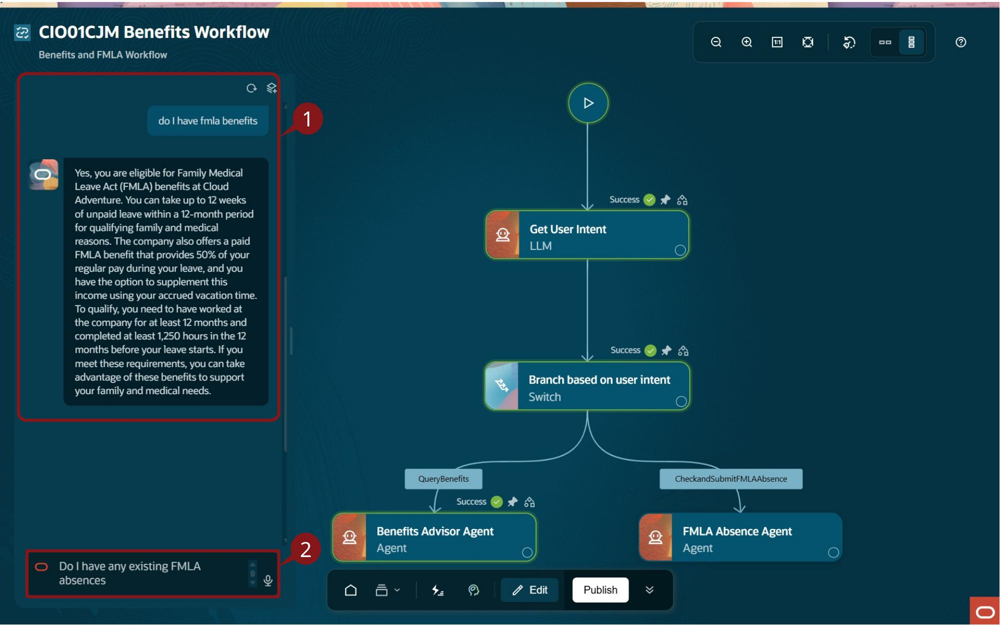

34. Get Absence Response and Ask to Create one.  Note that the Workflow took a different route since it needs to query HCM Cloud to determine the response instead of providing responses based on policy documents.

    > (1) Note the response to your question.  Scroll the response window, if necessary.  It will show you whether you have any existing absences.  Your individual response may vary.<br>
    > (2) Type **Please create a new FMLA leave** in the **Ask me anything** box on the bottom left and press the **Enter** key.

    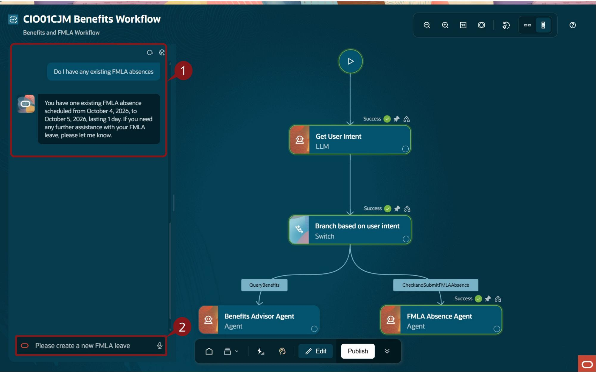

35. The Agent wants to create your FMLA absence requests, but requires additional information.  In this case, the date range of the leave.

    > (1) Note that the agent has asked for start and end dates for your requested FMLA leave<br>
    > (2) Type **Start Date of 11/2/26 and end date of 11/4/26** in the **Ask me anything** box on the bottom left and press the **Enter** key.  Feel free to select other dates for your start and end dates

    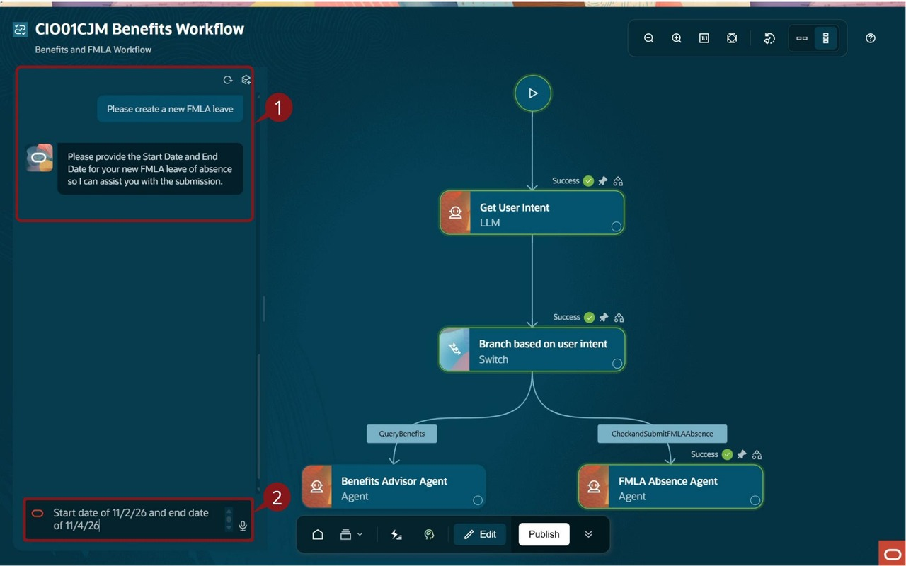

36. Success!  The agent has created my new FMLA leave request and confirms both the new request and the previously existing one.  Maybe you’d like to see it in HCM.

    > (1) Note the response about the newly created FMLA leave request.<br>
    > (2) Type **Can I have a URL link to my absences** in the **Ask me anything** box on the bottom left and press the **Enter** key.

    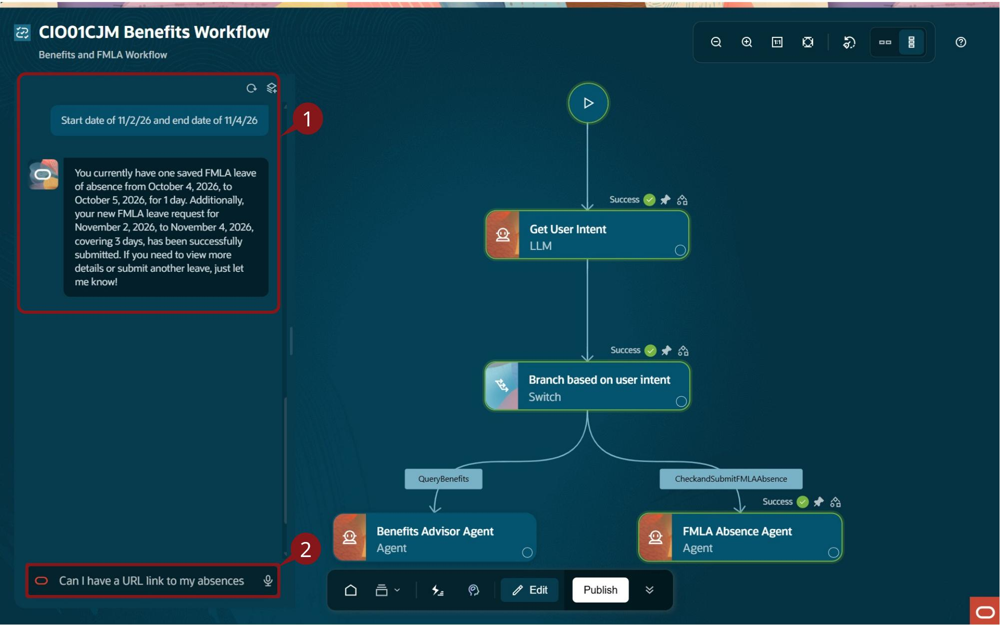

37. Here’s your absences

    > (1) Sad face.

    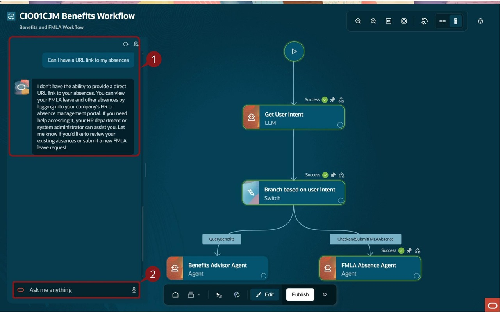


39. Success!  

    > (1): You have created a new absence and completed this Adventure.

    

### Summary

AI Agent Studio is a design-time environment that empowers you to create, configure, validate, and deploy AI agents to meet your organization's needs.

With AI Agent Studio, you can easily extend preconfigured workflows, and build new workflows and agentic apps. AI Agent Studio is fully integrated into Oracle Fusion Cloud Applications, providing secure and seamless access to the knowledge stores, tools, and APIs of Fusion Applications. This integration enables agents to be deployed directly into the flow, ensuring an efficient process.

## Learn More

* [AI Agent Studio](https://docs.oracle.com/en/cloud/saas/fusion-ai/26c/aiaas/overview-of-ai-agent-studio.html)
* [AI Agents for Fusion Applications](https://www.oracle.com/applications/fusion-ai/ai-agents/)
* [AI for Fusion Applications](https://www.oracle.com/applications/fusion-ai/)
* [Oracle Documentation](http://docs.oracle.com)

## Acknowledgements

* **Author** - Stephen Chung, Principal SaaS Cloud Technologist; Sajid Saleem, Master Principal SaaS Cloud Technologist; Charlie Moff, Distinguished SaaS Cloud Technologist
* **Contributors** - The AI Adventure Team (Gus, Sajid, Casey, Stephen, Sohel, Xavier, Charlie, Ray)
* **Last Updated By/Date** - Sajid Saleem/Charlie Moff, September 2026
