# Monitor and Evaluate AI Agents

## Evaluate AI Agents before you deploy them, to ensure they are ready for production

### **Introduction**

**Monitoring**: Monitor and gain insights into how your AI agents are performing, and also evaluate the agents for accuracy. You can also track the interactions with your agents, understand real-world usage patterns, identify common errors, and measure overall performance.
  
**Evaluation**: Evaluate agents before you deploy them, to ensure that they're ready for production. Test your agents for response correctness, response time, and token usage to meet your quality standards. You can also check the quality of answers generated through the document tool to assess how effectively agents utilize the retrieved context from the retrieval-augmented generation (RAG) metrics. After making any changes to your agent, or after a model update, rerun evaluations to confirm that your agent continues to perform as expected. This proactive approach helps you maintain high-quality experiences for your users.

### **Objectives**

In this activity you will use Oracle Fusion AI Agent Studio to evaluate agents before you deploy them
* Create Evaluation for AI Agent
* Run Evaluation to measure AI Agent's performance against key metrics

Estimated Time: 10 minutes

### **Pre-requisite**

As a pre-requisite for this adventure, please download the **Benefits-Evaluation.csv** file to your local desktop as below.
 
[Right-click here and select Download Linked File as OR Save Link as OR Save File as.](../05e-agent-evaluation-hcm/files/Benefits-Evaluation.csv)

### **Begin Exercise**

1. In this activity you will create Evaluations for AI Agents and view results of evaluation runs.

    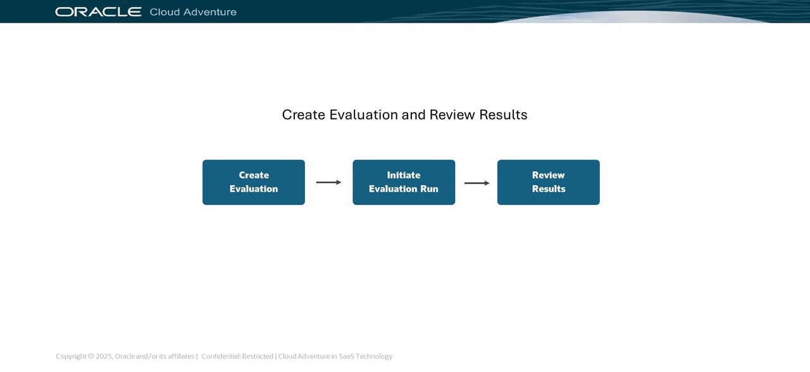

2. To begin, you will navigate to the Monitoring and Evaluation tab within the AI Agent Studio.

    > (1) Click on the **Monitoring and Evaluation** tab  

    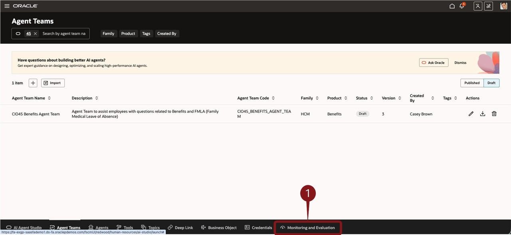

3. The Monitoring and Evaluation page shows existing runs.  You'll go to Manage Evaluations to setup a new one.

    > (1) Click on the **Manage Evaluations** button  

    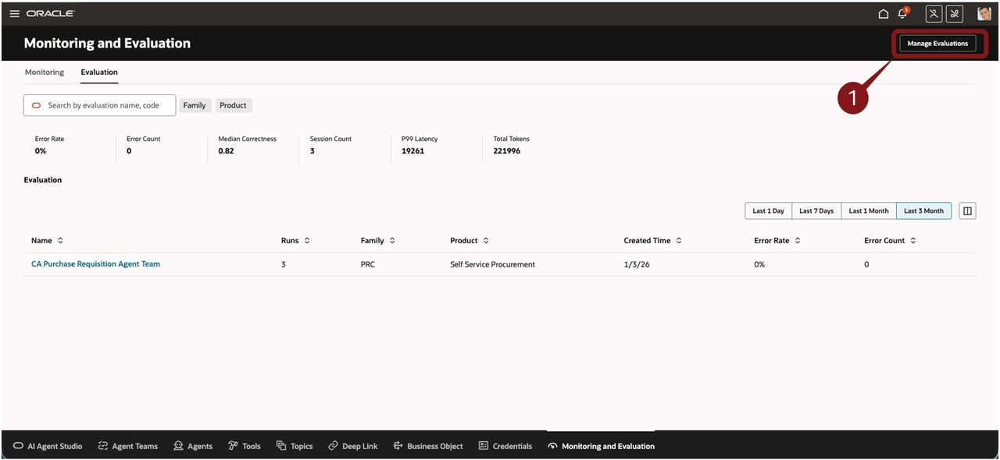

4. Create a new Evalution.

    > (1) Click the  icon to create a new Evaluation  

    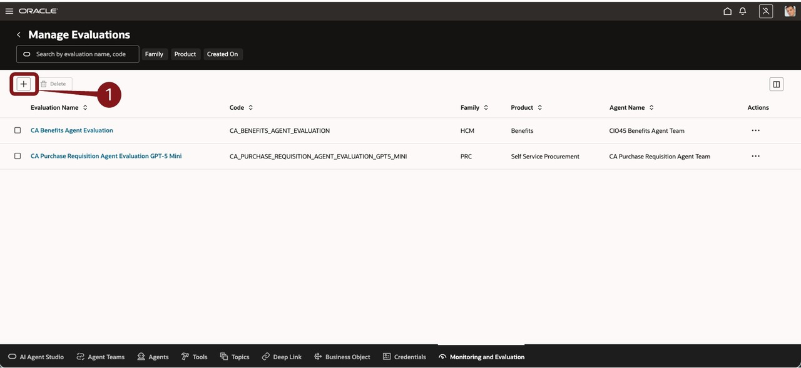

5. You can define the information, including questions.  To simplify the question creation, you can use the pre-defined list of questions (CSV file) that is available for download in the Pre-Requisites section at the top of the lab.

    > (1) Enter the fields as described below:
     * Name: **CIOXX Benefits Agent Evaluation** where **XX** is replaced with your user number. 
     * Agent Team: Select **CIOXX Benefits Agent Team** from the dropdown, where **XX** is replaced with your user number.  
     * Description:  **CIOXX Benefits Agent Evaluation** 

    > (2) Select **Random** radio button under Run Mode. 

    > (3) Click the **Add from File** button .

    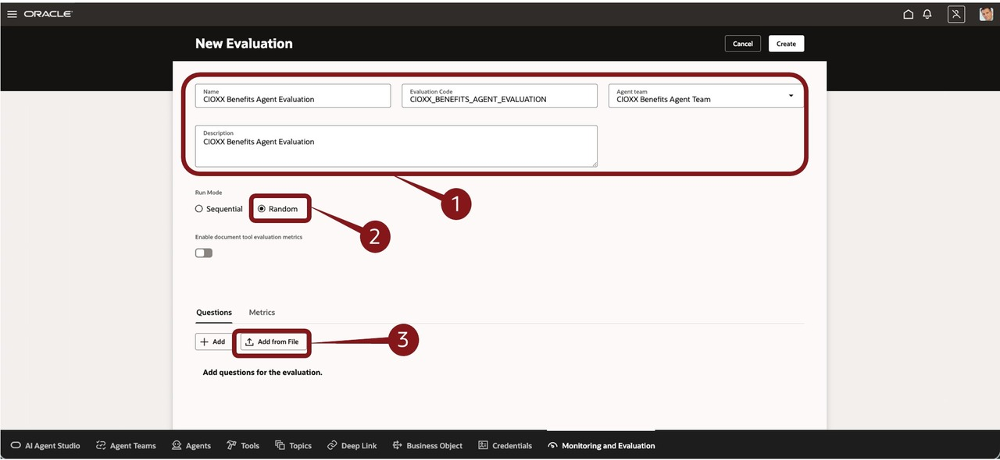

6. For this step, you'll upload the pre-defined file with the list of questions. 

     As a pre-requisite for this step, please download **Benefits-Evaluation.csv** file to your local desktop if you have not already done so as below. 

    [Right-click here and select Download Linked File as OR Save Link as OR Save File as.](../05e-agent-evaluation-hcm/files/Benefits-Evaluation.csv)

    > (1) then select the file (Benefits Evaluation.csv) from your **Downloads** folder on your PC/Mac and click the **Open** button. 

    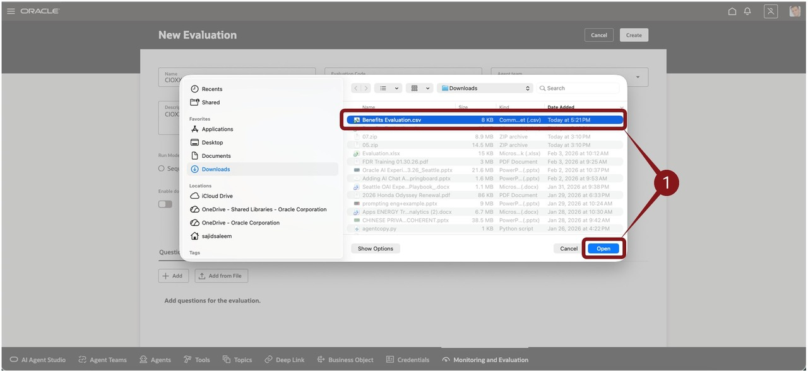

7. You can see that the questions are now visible. You can optionally scroll down to see all the questions. Next, you'll work on the Metrics.

    > (1) Click the **Metrics** tab.  

    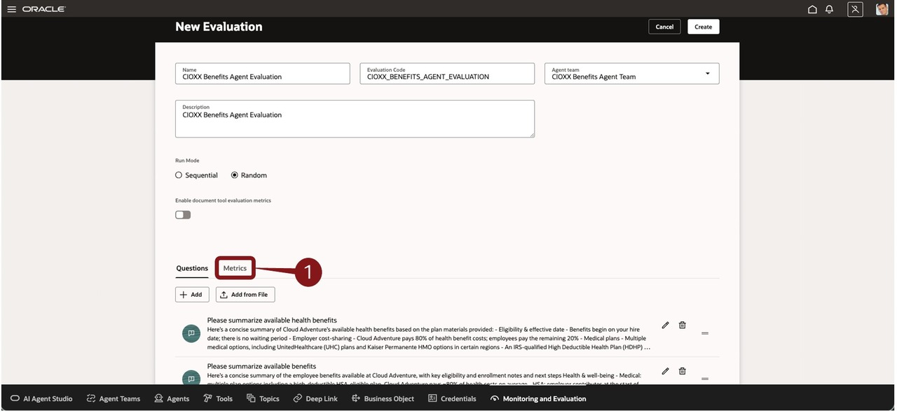

8. This shows the lists of Metrics available for this evaluation.

    > (1) **Review** the list of available metrics.  Note that you could use the Edit icon in the Actions column to make modifications.  This allows you to determine which metrics to include in the evaluation, whether threshold is enabled, and the condition of the threshold.  You'll use the defaults, so you won't make any edits.   
    > (2) Click the Create button.  

    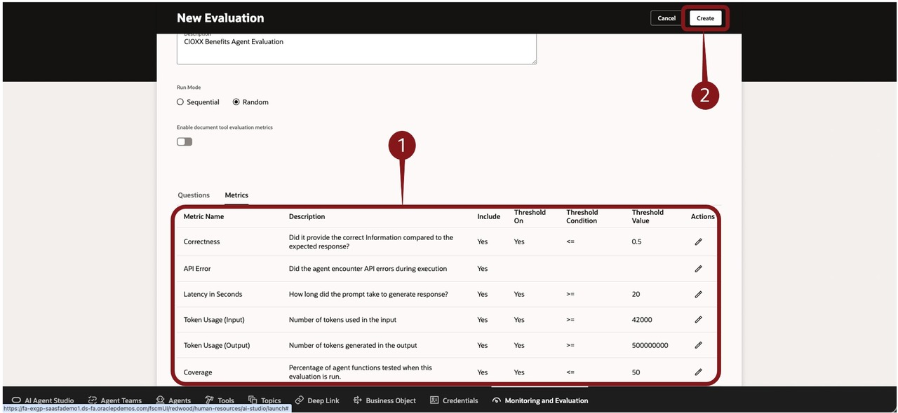

9. Now that the Evaluation is defined, it's time to initiate a run.

    > (1) Click the icon 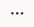 in the Actions column for the evaluation record you created (eg. **CIOXX Benefits Agent Evaluation** where **XX** is replaced with your user number) and select **Initiate Evaluation Run** from the resulting dropdown.

    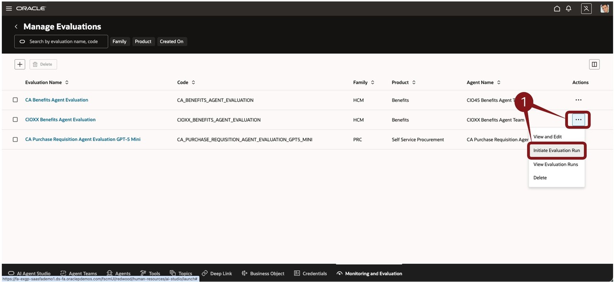

10. The panel on the right side of the screen displays details about your evaluation run.

    > (1) Click the **Run** button .

    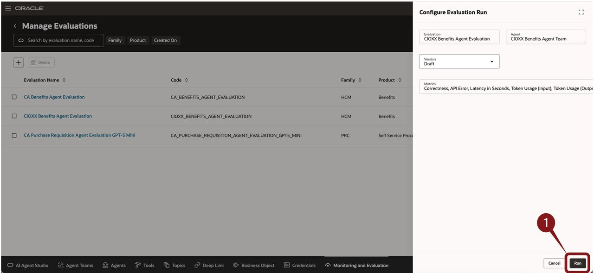

11. Now it's time to review the status and results of your evaluation run.

    > (1) Click the icon  in the Actions column for the evaluation record you created (eg. **CIOXX Benefits Agent Evaluation** where **XX** is replaced with your user number) and select **View Evaluation Runs** from the resulting dropdown.

    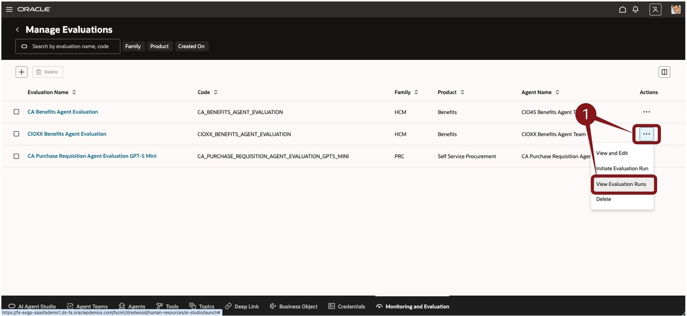

12. The Evaluation Run screen shows the current Status.

    > (1) Click the **Refresh** button .  If necessary, you can wait couple of minutes or repeat the refresh until the Status shows **Completed**.

    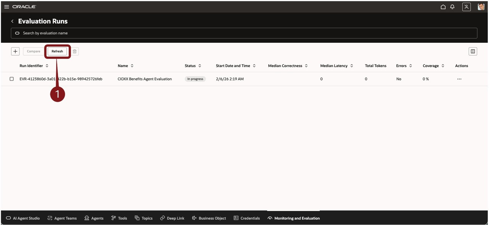

13. Now that the Evaluation Run is complete, it's time to view the results

    > (1) Click the icon  in the Actions column for the evaluation record you created (eg. **CIOXX Benefits Agent Evaluation** where **XX** is replaced with your user number) and select **View Run Results** from the resulting dropdown.

    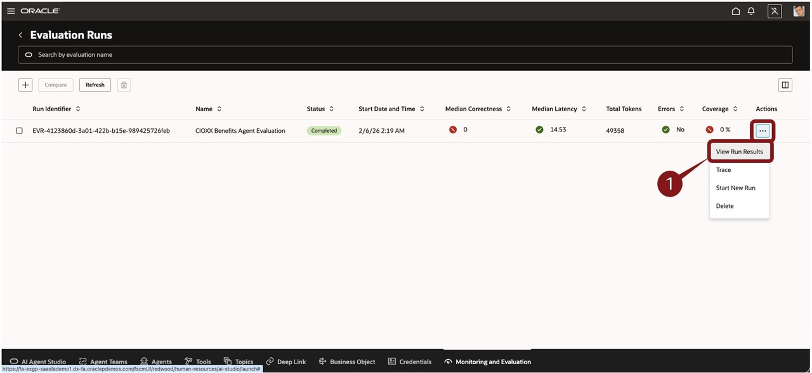

14. The Response performance screen can show a lot of information.  The first thing you'll do is resize the rows/columns to better show the data.

    > (1) **Right Click** on one of the row numbers and select **Resize to Fit** from the resulting dropdown.  You only need to do this for one row as it will resize the entire table. Repeat step if necessary.

    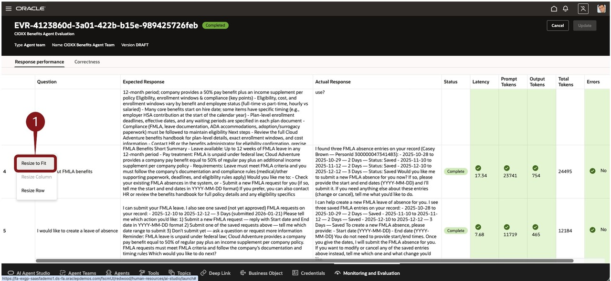

15. You can see the expected and actual response. In addition, you have metrics related to Latency, Token Usage and Errors. If metrics do not meet the thresholds, they will be highlighted in Red.  Let's drill into a specific result for more details.

    > (1) Click the **URL** in the **Trace** column for **Row 4 (Are there FMLA benefits)**.

    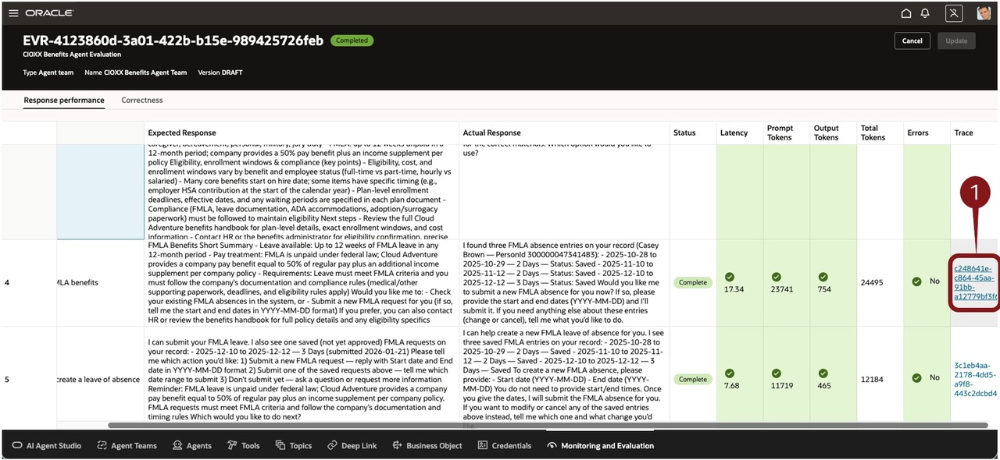

16. The Trace steps are color coded.  See the Legend above the table results.  Let's view the details of the F1 FMLA Absence Agent.

    > (1) Click the **Worker Agent** bar in the **F1 FMLA Absence Agent** row.

    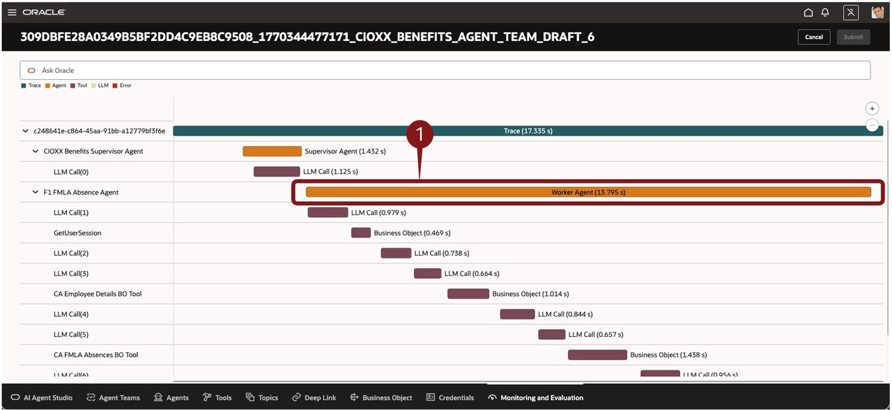

17. The right side panel appears and displays Trace details of the Agent.  You can review detailed metrics of this specific step, including inputs and outputs.

    > (1) You can review detailed metrics of this specific step, including inputs and outputs.  Note additional tabs for **Prompt** and **Memory**.  
    > (2) When finished with your review, you can close the panel by clicking the icon  and selecting **Close** from the resulting dropdown.

    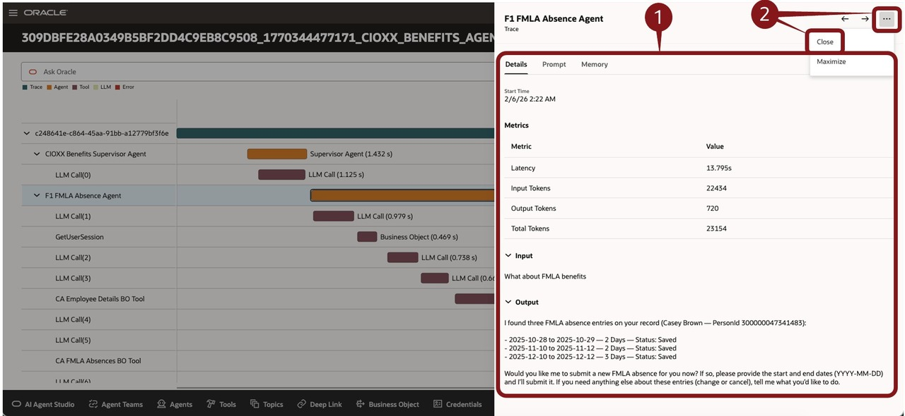

18. You can review similar details for other steps within the Evaluation Trace, including LLM calls, Business Object calls, and other Tools used by your agent.  Close this page so you can return to your Evaluation Run screen.

    > (1) Click the **Cancel** button .

    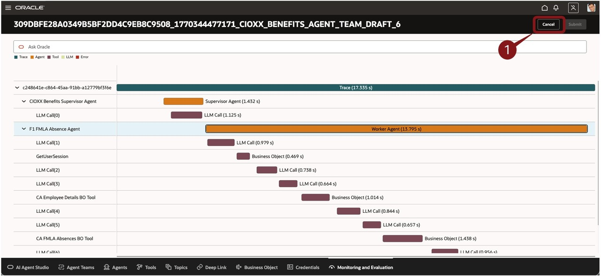

19. Next, you can review Correctness results and complete this Adventure.

    > (1) Click the **Correctness** tab.  This tab shows correctness scores and LLM feedback for your various evaluation run questions. 
    > (2) Click the **Cancel** button .

    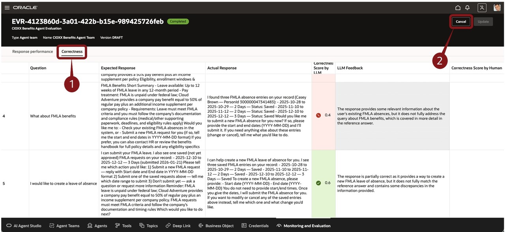

20. Adventure awaits, click on the image, show what you know and rise to the top of the leader board!!!

    [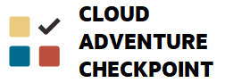](https://apex.oracle.com/pls/apex/f?p=159406:LOGIN_TEAM:::::CC:CIOADVENTURE)

### Summary

**You have successfully completed the Activity!**

### Learn More

* [AI Agent Studio Solution Brief](https://www.oracle.com/a/ocom/docs/applications/fusion-apps-ai-agent-studio-solution-brochure.pdf)
* [AI Agents for Fusion Applications](https://www.oracle.com/applications/fusion-ai/ai-agents/)
* [Monitor and Evaluate AI Agents](https://docs.oracle.com/en/cloud/saas/fusion-ai/aiaas/monitor-and-evaluate-ai-agents.html)
* [AI for Fusion Applications](https://www.oracle.com/applications/fusion-ai/)
* [Oracle Documentation](http://docs.oracle.com)

## Acknowledgements

* **Author** - Charlie Moff, Distinguished SaaS Cloud Technologist; Sajid Saleem, Master Principal SaaS Cloud Technologist
* **Contributors** - The AI Adventure Team (Gus, Kris, Sajid, Casey, Stephen, Jamil, Sohel, Xavier, Nate, Charlie)
* **Last Updated By/Date** - Charlie Moff; Sajid Saleem, March 2026