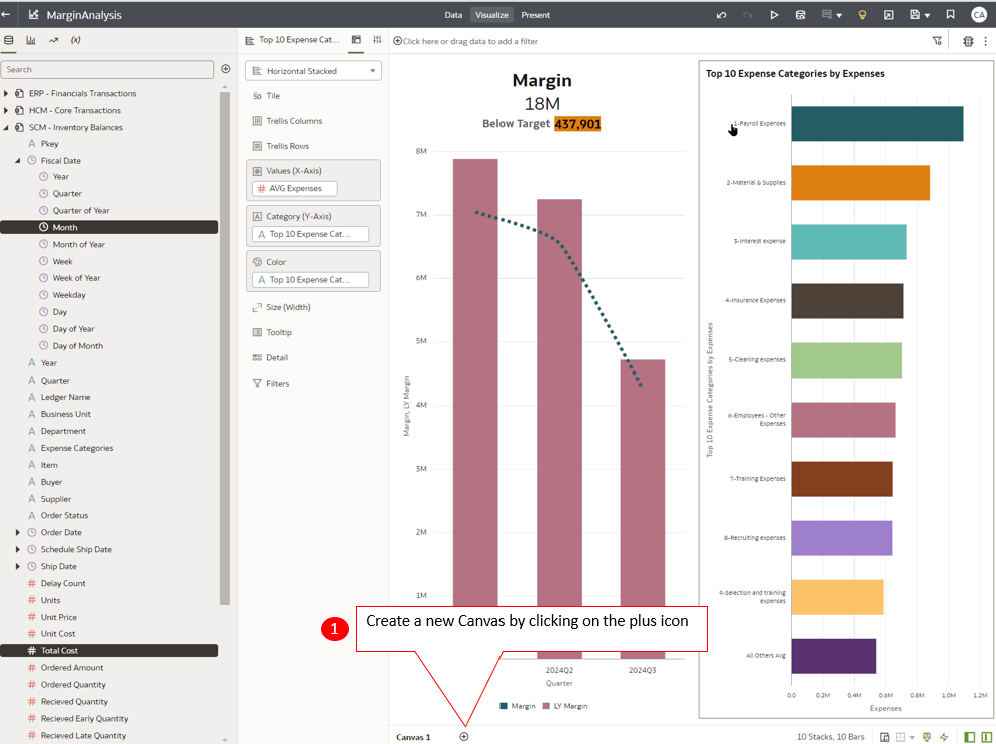
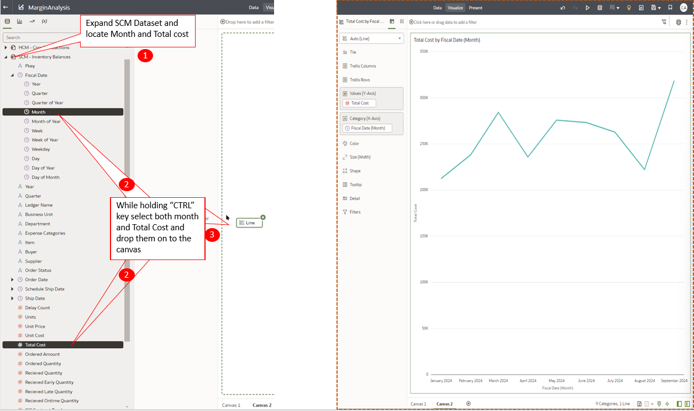
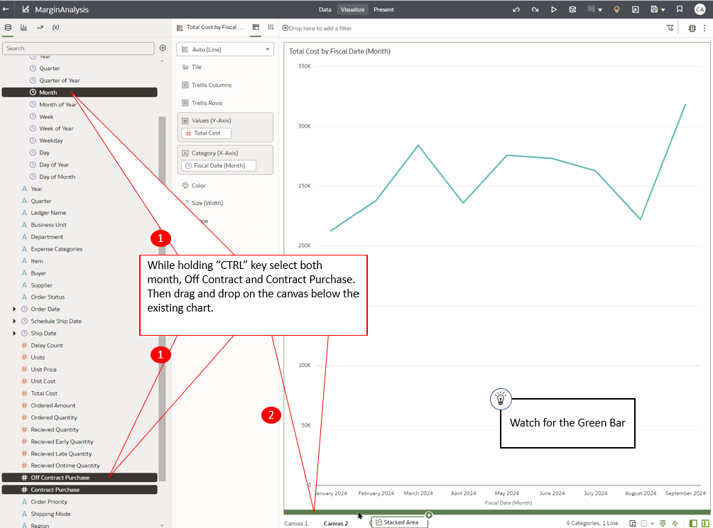
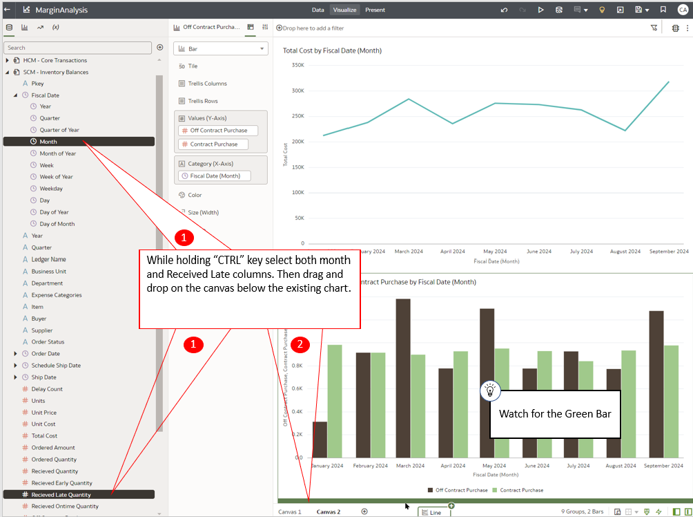
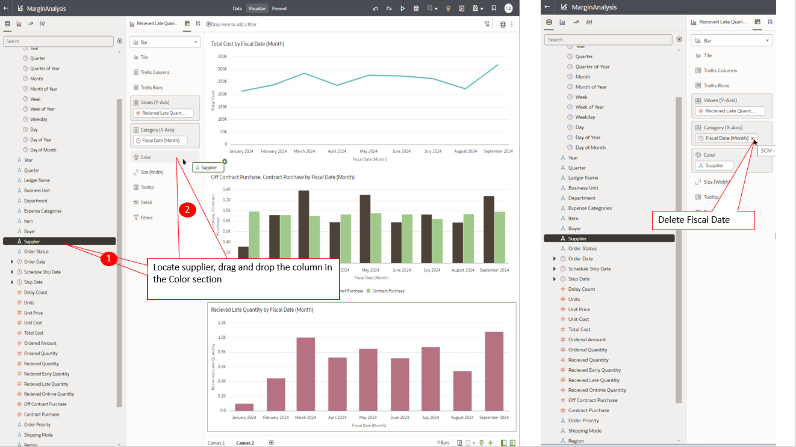

# Analytics
 
## Introduction

Oracle Fusion Data Intelligence Platform is a family of prebuilt, cloud native analytics applications for Oracle Cloud Applications that provides line-of-business users with ready-to-use insights to improve decision-making.

It is a Cloud application that delivers best-practice Key Performance Indicators (KPIs) and deep analyses to help decision-makers run their businesses and individual contributors to operate their businesses. Oracle Fusion Data Intelligence Platform is built on top of Oracle Analytics Cloud and Oracle Autonomous Data Warehouse. This packaged service starts with Oracle Fusion Cloud Applications which you can deploy rapidly, personalize, and extend. The service extracts data from your Oracle Fusion Cloud Applications and and loads it into an instance of Oracle Autonomous Data Warehouse. Business users can then create and customize dashboards in Oracle Analytics Cloud. It empowers business users with industry-leading, AI-powered, self-service analytics capabilities for data preparation, visualization, enterprise reporting, augmented analysis, and natural language processing.

This activity guide helps business users to investigate and research data, ask relevant questions to understand Trends, Patterns and Outliers.
 

Estimated Time: 15 minutes

### Objectives

In this activity, you will Create analytics across different lines of business to derive better business insight
 

## Task 1: Create analytics across different lines of business to derive better business insight

1. Oracle Fusion Data Intelligence Platform is a family of prebuilt, cloud-native analytics applications for Oracle Cloud Applications that provide line-of-business users with ready-to-use insights to improve decision-making. 

    Login to your Fusion Data Intelligence Portal using the URL provided.

    > Open a web browser and enter the URL provided, then on the login screen, type in the Username and Password. Click Sign In.

    

    After a successful login, you will land on the Oracle Analytics home page. 

2. A finance Watchlist comprising several Tiles is available on the home page. 

    One metric that draws my attention is Margin, which is trending low. 

    Two attributes that influence Margin are Revenue and Cost. Since revenue seems to be increasing, let's investigate Cost.

    > On the Margin Tile locate the **Open Workbook**  Icon on the top right corner and click on it.

    

3.  This action expands the Tile and opens the workbook. 

    Let's now set the workbook to design mode so that we can add cost elements. 

    > Click on the Edit Icon    as shown in the image.   

    Instead of building manually, let's use the Auto Insights feature.

    > Click on the Auto Insights Icon    as shown in the image.

    

4.  Next, let’s expand the Auto Insights pane for better observability. 

    > Click on the Expand / Shrink Icon    as shown in the image.

    

5.  The Auto Insights function has crawled the data set and brought expense-related information critical to our analysis. Let’s use the Top 10 Expenses by expense categories. 

    > (1) Locate the “Top 10 Expense Categories by Expenses” insight and click the Add Icon    shown in the image. This will add the Insight to the Canvas.   

    > (2) Click on the **x** sign to close the Insights pane.

    

6. Let’s create a new Canvas to under the SCM issue

     > Locate the plus  icon at the bottom of the page and click it to create a new canvas.  

7. We will add Supply Chain data to the canvas

     > Expand the SCM Dataset by clicking on the Triangle   icon.  Expand the Fiscal Data folder and locate Month Column.  

     > Next locate Total Cost. While keeping the “CTRL ” key pressed drag and drop them on to the canvas.   

     > Your canvas should look like the image on the right. 

    

8. Total cost has been varying over time. We need to understand what is causing the increase and decrease

     > Expand the Fiscal Data folder and locate Month Column.  

     > Scroll down to locate Off Contract and Contract purchase columns.  

     > While keeping the “CTRL ” key pressed drag and drop them on to the canvas under the existing chart.  

     > Watch for the Green bar before you drop the columns.  

    

9. Change the visualization type

     > In the Properties panel in the center. Click on the inverted triangle  to expand the Analytics Type panel and choose Bar Type. 

    

     > Move Contract Purchase from Color Section to Values section. 

    

10. We need to understand what is causing the off contract purchasing. 

     > Expand the Fiscal Data folder and locate Month Column.  

     > Scroll down to locate Received Late Quantity columns.  

     > While keeping the “CTRL ” key pressed drag and drop them on to the canvas under the existing chart.   

     > Watch for the Green bar before you drop the columns.   

    

     > In the Properties panel in the center. Click on the inverted triangle  to expand the Analytics Type panel and choose Bar Type. 

    

11. Lets find out which supplier is responsible for the issue.

     > Locate supplier and drop it into the color section.  

     > Next delete Fiscal Data (Month) column  

    

     > In the Properties panel in the center. Click on the inverted triangle   to expand the Analytics Type panel and choose Treemap Type.  

    

12. Two suppliers are the cause of the issue. 

    

13. Adventure awaits, click on the image and show what you know, and rise to the top of the leader board!!!
    
     

## Summary

You discovered how effortlessly Fusion Analytics enables the creation of content and analysis of data. By integrating diverse data sources, you were able to delve deeper from summary information to detailed analysis, uncovering root causes. You then shared your discoveries with a broader audience, making the insights accessible and impactful.

**You have successfully completed the Activity!**

## Acknowledgements
* **Author** - Sohel Jeelani, Analytics Solution Engineer, Advanced Technology Services
* **Contributors** -  
* **Last Updated By/Date** - Sohel Jeelani, September 2024
