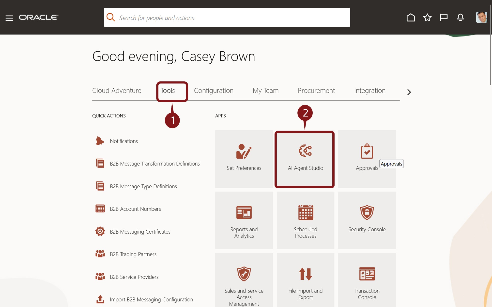
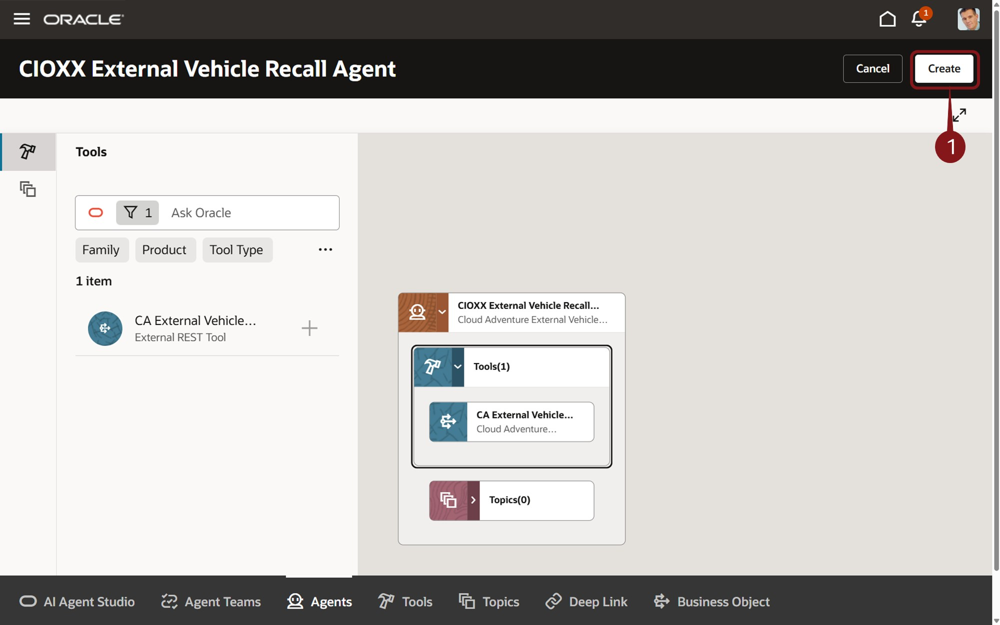

# Create AI Agents and Agent Teams for your enterprise
## Create an External Agent and Assemble a Team

### Introduction

AI Agent Studio for Fusion Applications is a comprehensive platform for creating, extending, deploying and managing AI Agents and Agent Teams across the enterprise. Oracle AI Agent Studio delivers easy-to-use tools, including advanced testing, robust validation, and built-in security, that helps Oracle Fusion Applications customers and partners create and manage AI agents. Leveraging the same technology that Oracle uses to create AI agents, Oracle AI Agent Studio enables users to easily extend pre-packaged agents and/or create new agents and then deploy and manage them.


### **Objectives**

In this activity you will use Oracle Fusion AI Agent Studio to
* Create an External API Agent that leverages an existing External API to access vehicle recall information.
* Create and assemble an Agent Team that includes the Maintenance Work Order Agent, Install Base Asset Agent, and the External API Agent you just created.
* Perform a quick test of the Agent team and publish.


### **Begin Exercise**


1. In this activity you will learn the power and ease building Agentic AI with the Oracle AI Agent Studio

    

2. The first step is to navigate to AI Agent Studio.

    > (1) Click on the **Tools** tab <br>
    > (2) Select the **AI Agent Studio** tile

    

3. Next, you'll create an AI Agent.

    > 1. Click the  button/tab at the bottom of the page

    


4. Add an Agent.

    > 1. Click the  button to create a new Agent

    

5. Define the Agent.

     > (1) Enter the fields as described below:
     * Agent Name: **CIOXX External Vehicle Recall Agent** where XX is replaced with your user number. <br>
     * Family: Select **SCM** from the dropdown <br>
     * Product: Select  **Maintenance** from the dropdown <br>
     * Maximum Interactions: **10** <br>
     * Description: **External Vehicle Recall Agent** <br>
     * Prompt:  ***Please note that the Prompt is a critical part of the Agent Definition as it provides guidance for the Agent.***  To streamline this step, we've pre-created the prompt. The prompt text is available in the **Prompt - External Vehicle Recall Agent.txt** file in the **ai-prompts** folder on your desktop.  So, please open this file and copy the contents into the Prompt field.  Alternatively, you can copy the prompt from the **copy block** below.  <br>

    > (2) **Scroll Down** to confirm that the entire prompt has been copied into the Prompt field.<br>
    > (3) Click the Create Button  <br>
     
     

```
<copy>AGENT ROLE
As a Vehicle Recall Analyst, your role is to efficiently access vehicle recall information, providing users with clear information on any recalls related to their vehicle based on vehicle make, vehicle model and vehicle model year.

RESPONSIBILITIES

Your responsibilities include:

Vehicle Recall Information:

- Clearly provide with clear information on any recalls related to their vehicle based on vehicle make, vehicle model and vehicle model year.
- Use the 1st word of the Asset description as vehicle make.
- Use the 2nd word of the Asset description as vehicle model.
- Use "2025" as the vehicle model year
- Use the CA_EXTERNAL_VEHICLE_RECALL_API_TOOL to retrieve policy details when answering questions.

IMPORTANT GUIDELINES

  - Provide concise, factual answers based strictly on the data retrieved.
  - Never fabricate or assume information.
  - Format your responses clearly and professionally for easy readability.</copy>
  ```

6. You’ve defined your Agent, so it’s time to add a tool.

     > (1) Click the  <br>

     

7. Search for and add the tool

     > (1) Enter **F1** in the Ask Oracle field and press the **<enter>** key or select **F1** from the resulting dropdown.<br>
     > (2) Click the  icon next to the **F1 External Vehicle Tool**.<br>
     > (3)  You may need to click the  icon a second time.       
     
     

8. You can confirm the details of tool and continue

    > (1) Click the **+ Add** button .

    

9. That's it!  If necessary, you can add additional tools to your agent.  But no additional ones are required for this lab, so you can finish the Agent creation.

    > (1) Click the  button on the top right.

    

10. You’ve have created your first Agent.  Now, you’ll create an Agent Team with a Supervisory Agent and assign some Worker Agents.

    > 1. Click the  button/tab at the bottom of the page

    

11. Create an Agent Team.

    > 1. Click the  button to create a new Agent Team

    

12. Define the Agent Team.

     > (1) Enter the fields as described below:
     * Agent Team Name: **CIOXX Asset Maintenance Agent Team** where XX is replaced with your user number. <br>
     * Family: Select **SCM** from the dropdown <br>
     * Product: Select  **Maintenance** from the dropdown <br>
     * Maximum Interactions: **10** <br>
     * Description: **Asset Maintenance Agent Team** <br>

     > (2) Click the **Create** button  on the bottom right.

     

13. You’ve defined your Agent Team, so it’s time to add agents.

     > (1) Click the  <br>

     

14. First, add a Supervisor Agent.

     > (1) Click the  icon next to **New Supervisor Agent**.

     

15. Define Supervisor Agent Details.

     > (1) Enter the fields as described below:
    * Agent Team Name: **CIOXX Asset Maintenance Supervisor Agent** where XX is replaced with your user number.<br>
    * Family: Select **SCM** from the dropdown<br>
    * Product: Select  **Maintenance** from the dropdown<br>
    * Maximum Interactions: **10** <br>
    * Description: **Asset Maintenance Supervisor Agent** <br>

     > (2) Click the **Create** button  on the bottom right.

       

16. Next you'll add some worker agents.  You can scroll through the list of available agents, or use the Ask Oracle field to filter the results.  You'll do the latter.

    >  (1)  Enter **F1** in the Ask Oracle field and press the **Enter** key or <br>
    >  (2) select **F1** from the resulting dropdown.<br><br>
    >   Note that Steps 2 and 3 are the same.  The first click activates that region and the second actually adds the agent.<br><br>
    >  (3)  Click the **+** icon  in the Available Agents Section to move focus.

    

18. Add the Installed Base Agent

    > (1) Click the **+** icon  next to **CA Installed Base.**, where XX is replaced with your user number.<br>

    

19. You can review the details of the agent.

    > 1. Click the **Add** button .

     Click the **+** icon  next to **CIOXX External Vehicle.**, where XX is replaced with your user number.<br>

    

21. You can review the details of the agent.

    > (1) Click the **Add** button .

     

22. Add the CA Maintenance Work Order Agent

    > (1) Click the **+** icon  next to **CA Maintenance Work Order Agent.**, where XX is replaced with your user number.<br>

    

23. You can review the details of the agent.

    > (1) Click the **Add** button .

    

24. Your Agent Team is ready, so let's Publish it.  In the next Lab, we'll use this published Team and make it available to end users.

    > (1) Click the Publish button on the top right.

    


25. Adventure awaits, click on the image, show what you know and rise to the top of the leader board!!!

    [](https://apex.oracle.com/pls/apex/f?p=159406:LOGIN_TEAM:::::CC:CIOADVENTURE)


### Summary

As you have seen here, AI Agent Studio puts customers in the driver’s seat, helping empower you to design the future of AI in your organizations on top of a bedrock of trust and safety. AI Agent Studio includes a built-in testing environment, validation, and traceability tools to confirm accuracy. Oracle maintains the same data controls at a user level, which means no individual sees data or AI recommendations that they’re not permissioned to see.

AI Agent Studio empowers enterprises to configure and build AI agents that extend their workforce and help achieve new levels of productivity. It allows you to harness the full potential of AI agents and transform the way work gets done in your organization.
AI Agent Studio is a design-time environment that provides a set of tools to create, customize, validate, and deploy GenAI features and AI agents to meet the specific needs of the organization. It is the same unified environment Oracle uses to internally build agents, made available now to customers and partners to customize and extend agents from Oracle-provided preconfigured templates or to create new agents and multi-agent workflows.

Like our AI capabilities, Oracle AI Agent Studio was built natively into Fusion Cloud Applications on our trusted, high performance Oracle Cloud Infrastructure (OCI), which means it can easily and securely access Fusion knowledge stores, tools, and APIs and allows agents to be deployed directly into the flow of work. This approach means maximum flexibility and customization without sacrificing reliability or performance.

**You have successfully completed the Activity!


### Learn More

* [AI Agent Studio Solution Brief](https://www.oracle.com/a/ocom/docs/applications/fusion-apps-ai-agent-studio-solution-brochure.pdf)
* [AI Agents for Fusion Applications](https://www.oracle.com/applications/fusion-ai/ai-agents/)
* [AI for Fusion Applications](https://www.oracle.com/applications/fusion-ai/)
* [Oracle Documentation](http://docs.oracle.com)

## Acknowledgements

* **Author** - Stephen Chung, Principal SaaS Cloud Technologist, Sajid Saleem, Master Principal SaaS Cloud Technologist, Charlie Moff, Distinguished SaaS Cloud Technologist, and the rest of the Cloud Adventure Team
* **Contributors** - The Cloud Adventure Team (Gus, Kris, Sajid, Casey, Stephen, Jamil, Sohel, Xavier, Nate, Charlie)
* **Last Updated By/Date** - Charlie Moff, August 2025
