# Embed AI Agents Teams in UI for End Users

## **Create a Guided Journey and Embed your AI Agent Team**

### **Introduction**

AI Agent Studio for Fusion Applications is a comprehensive platform for creating, extending, deploying and managing AI Agents and Agent Teams across the enterprise. Oracle AI Agent Studio delivers easy-to-use tools, including advanced testing, robust validation, and built-in security, that helps Oracle Fusion Applications customers and partners create and manage AI agents. Leveraging the same technology that Oracle uses to create AI agents, Oracle AI Agent Studio enables users to easily extend pre-packaged agents and/or create new agents and then deploy and manage them.

### **Objectives**

In this activity you will embed your AI Agent Team in the application for use by end users.
* Create a Guided Journey and Task that references the AI Agent Team.
* Use Visual Builder Studio to Configure the My Maintenance Work page with the Guided Journey.
* Interact with your AI Agent

### **Begin Exercise**

1.  In this activity, you will embed your AI Agent Team in the application for use by end users.

    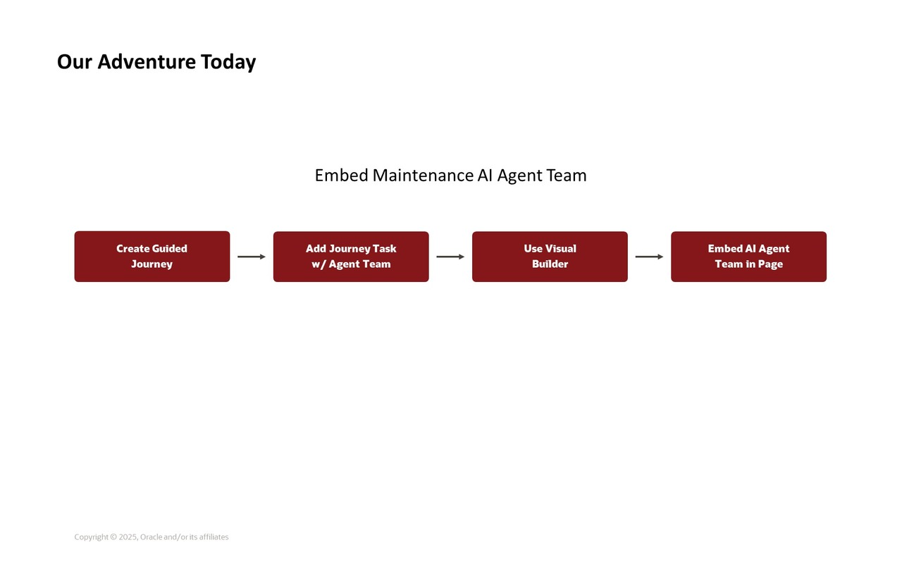

2. The first step will involve creating a Guided Journey.  A Guided Journey allows you to embed specific information in standard applications.  In addition to using a Guided Journey to embed an AI Agent (today's example), Guided Journeys can also embed documents, analytics, URLs, Learning, Videos and more.  And like all configurations, Guided Journey configurations are automatically maintained during the release update process.

    > (1) Enter **Guided Journey** in the search field 
    > (2) Select the **Guided Journey** from the resulting dropdown.

    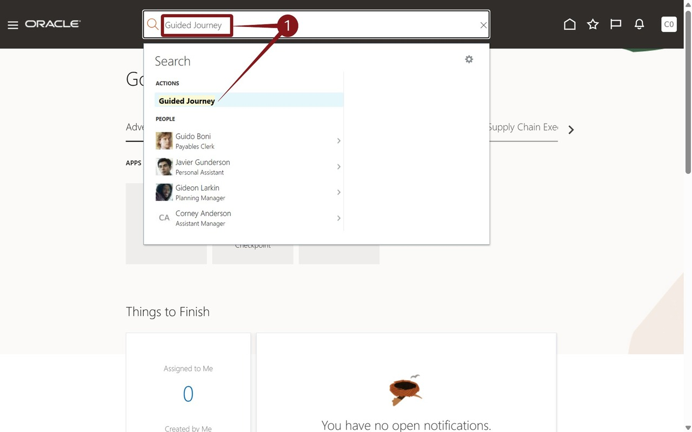

3. You'll create your Guided Journey here.  It's quite simple.

    > (1) Click the  button.

    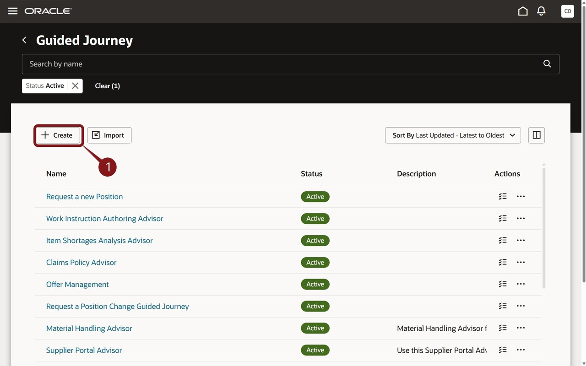

4. Name your Guided Journey.

    > (1) Enter Name:  **CIOXX Guided Journey** where **XX** is replaced with your user number. 
    > (2) Click the  button.

    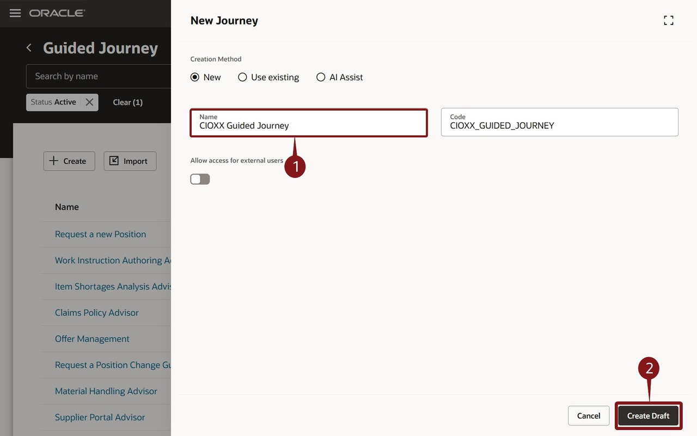

5. Next, you'll add a Task to this Guided Journey.  This is where we specify a Task Type of Agent and reference the Maintenance Agent Team you've assembled.

     > (1) Click the  button under the **Tasks** section.  This will pop out the New Task panel from the right.   

     > (2) Enter the fields as described below:
     * Task Name: **Maintenance Guided Journey Task**  
     * Task Description: **Maintenance Guided Journey Task**  
     * Add Instructions: **Enables Maintenance Agent Team in Application UI** 
     * Task Type:  **Agent** from the dropdown  
     * Agent Type: **Workflow Agent** from the dropdown 
     * Workflow Agent: **CIOXX Asset Maintenance Agent Team** where **XX** is your user number from the drop-down. 

    > (3) Click the **Save** button  on the bottom right.
     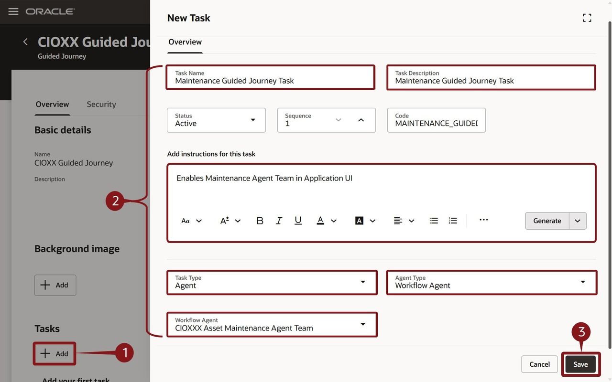

6. You’re almost done with the Guided Journey creation.  The last step is to Activate it to make it available for use.

     > (1) Click the Activate button  on the top right 

     > (2) Click the Home icon  in the top toolbar to return to the application home page and get ready for the next step.

     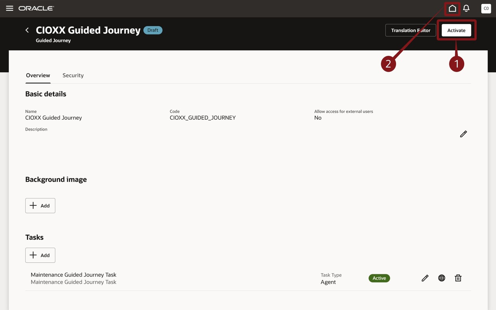

7. Now, you'll go to the screen where you will embed the AI Agent Team using the Guided Journey we created.

    > (1) Enter **My Maintenance Work** in the search field and select **My Maintenance Work** from the resulting dropdown.

    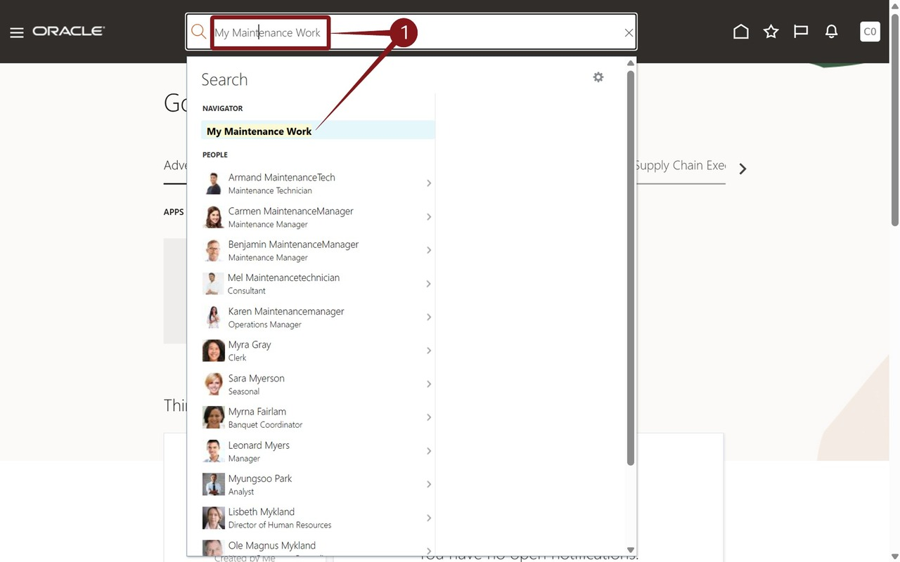

8. You'll use Visual Builder to configure the page with the Guided Journey.

    >  (1)  Confirm that **M001 - Seattle Maintenance** is the organization selected in the My Maintenance Work dropdown at the top of the screen.  If not, select **M001 - Seattle Maintenance** from the dropdown. 
    >  (2)  Click the **logged in user icon** icon next to the bell icon in the top right corner and then select **Edit Page in Visual Builder Studio** from the resulting dropdown. 

    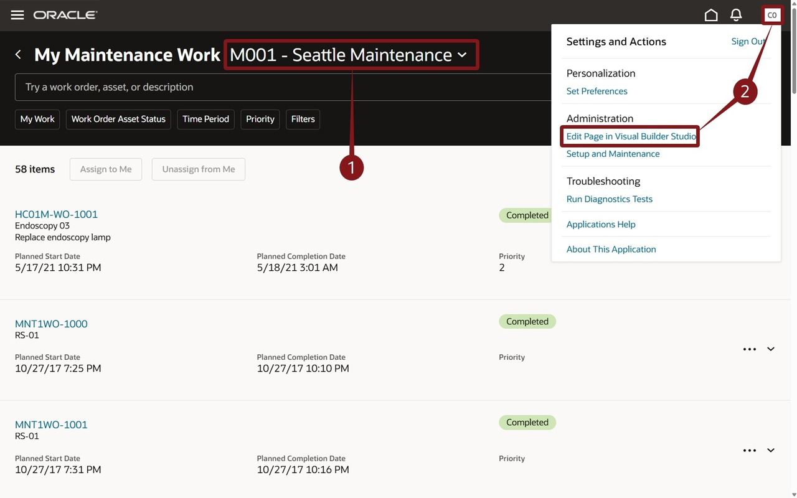

9. You may see multiple projects available.  This allows you to use Visual Builder for various projects, each with their own team and development lifecycle.

     This screen will only appear if multiple projects are available.  If you see this screen follow the instructions below, otherwise skip to Task 10.

    > (1) If multiple projects are displayed, highlight the **Application Extensions** project and then click the Select button  on the bottom right of the screen. 

      

10. Visual Builder Studio allows you to make a variety of configurations to standard application screens.  Here, you will configure the journeyCode to display the Guided Journey that you just created for your Agent. You'll do this by configuring the appropriate fields in the Page Properties section of the screen.

    >  (1) Enter **CIOXX\_GUIDED\_JOURNEY** in the **journeyCode** field on the right **Page Properties** panel and then press Enter, Tab, or click out of the field. 

    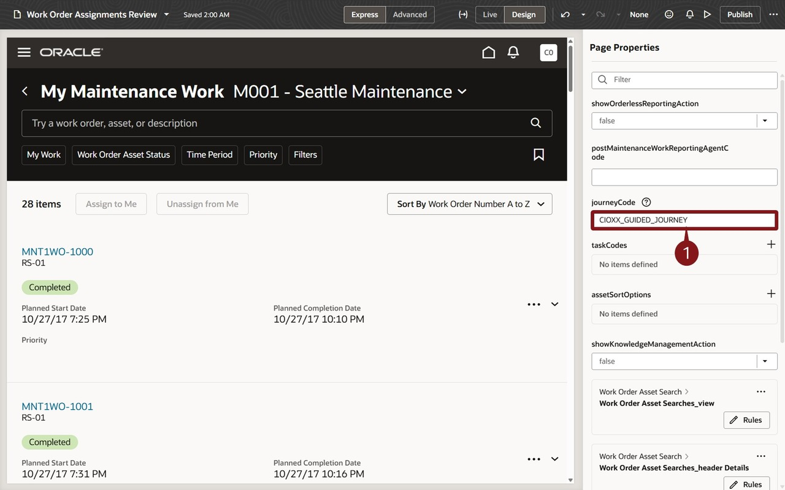

11. The Maintenance Guided Journey Task banner is now displayed along with the Ask Oracle button.  Note that the name, description and format of this banner can be defined iņ the Guided Journey and Task setup screens.

    >  (1) Click the **Preview** icon  on the toolbar on the top right of the page.  This will launch a new tab showing your newly configured screen in a full-functioning preview mode. 

    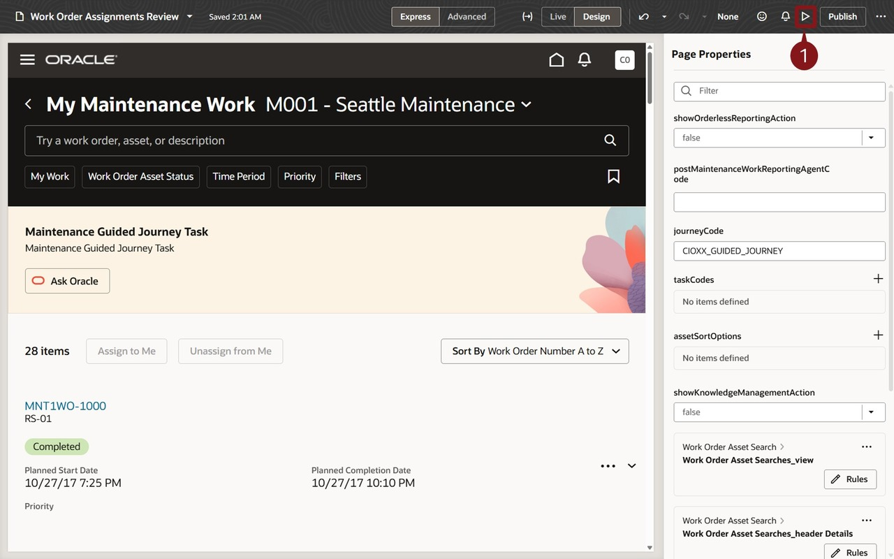

12. You can see that the Guided Journey is displayed as an **Ask Oracle** banner and the screen is ready to use.

    > (1) Click the **Ask Oracle** button .

    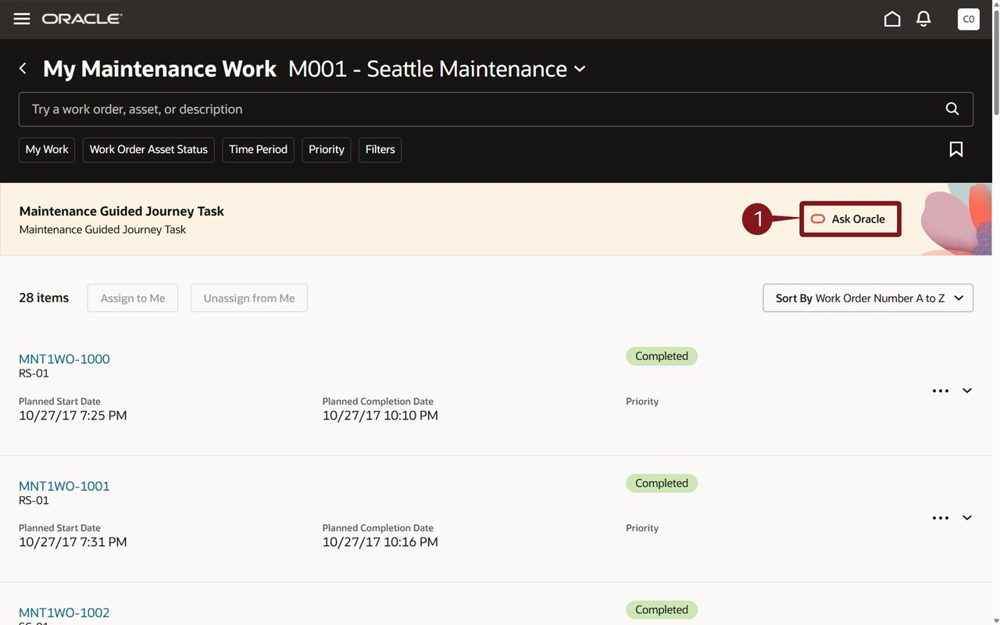  

13. The Agent appears in a panel pop-out from the right.  You can interact with your agent via the Ask Oracle field at the button of the pop-out panel.  Based on your defined agent, you can ask about Assets, Maintenance, Warranties and even have the Agent create a Maintenance Work Order for your asset.

    > (1) Interact with your agent via the **Ask Oracle** field at the bottom.  Type **What is the manufacturers maintenance schedule for asset CIOXX-RIDGELINE** where XX is the number in your user login and press enter or click the up arrow .

    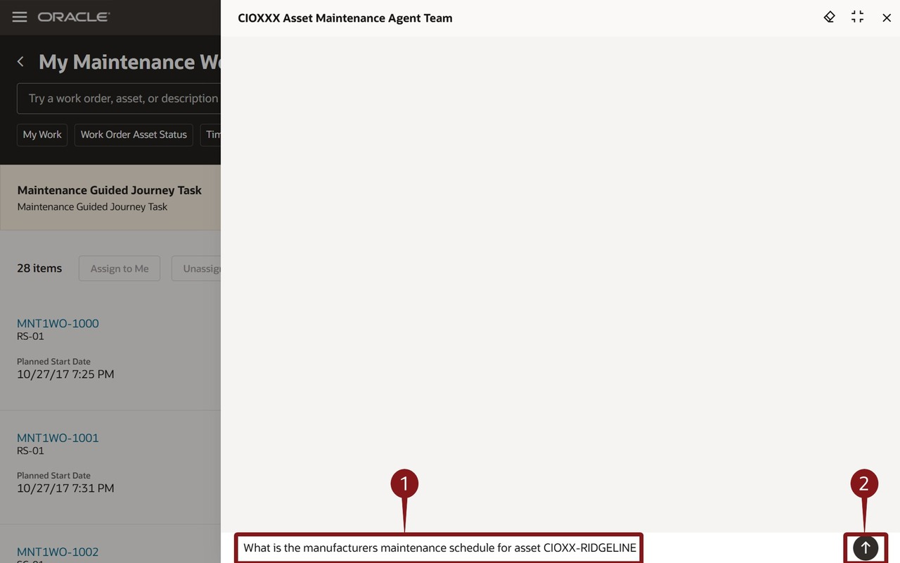  

14. You can check on warranty information.

    > (1) Type **Give me information on warranty** and press enter or click the up arrow .

    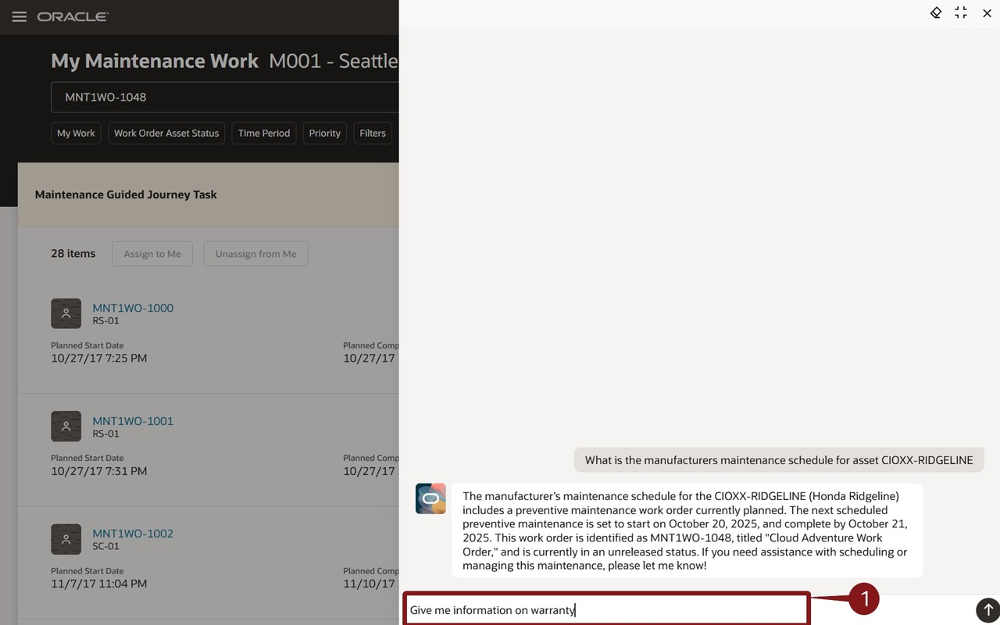  

15. You can check for recalls or any existing maintenance work orders.

    > (1) Type **Are there any outstanding recalls** and press enter or click the up arrow .

    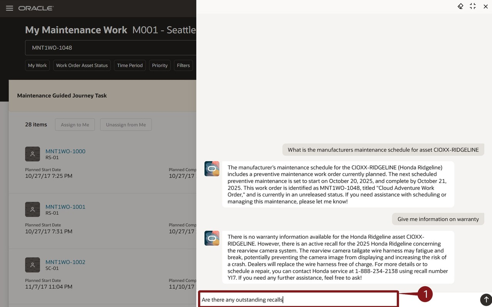  

16. If there are any recalls, you can create a Maintenance Work order to take care of it.  Fortunately, the AI Agent is going to help you!

    > (1) Type **Please create a maintenance work order for this recall** and press enter or click the up arrow .

    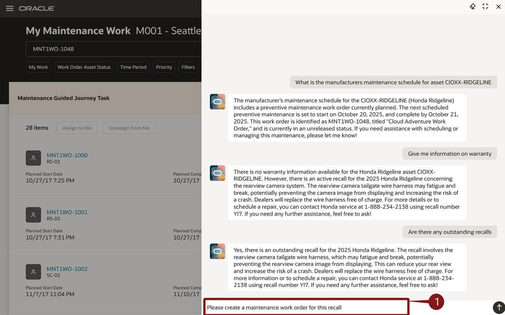  

17. The Agent queries for any existing Work Orders and confirm with you if you'd like to create a new work order.

    > (1) Type **Please create a new work order** and press enter or click the up arrow .

    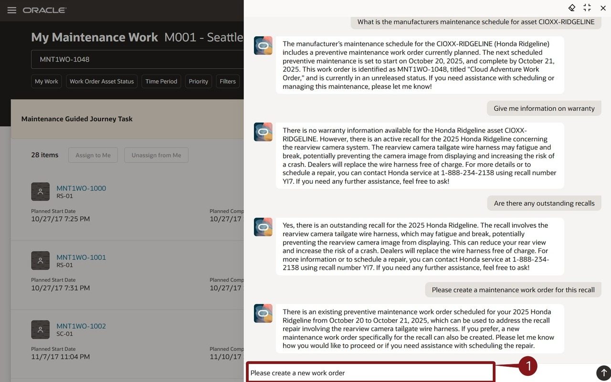  

18. The agent has created your Work Order.  You have successfully completed the Adventure here, but if you'd like to verify, you can close the Agent and query your new Work Order.  We have not provided instructions for the same, but believe you can find your new work order by leveraging the information you've gained during this Adventure.

    > (1) Click the  icon in the upper right.

    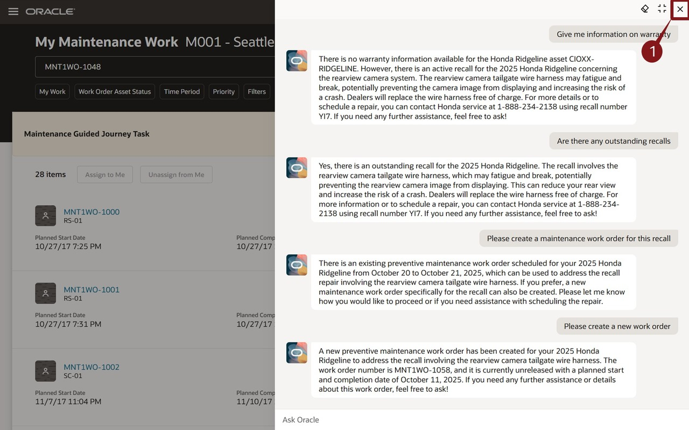  

19. Congratulations.   You've finished the creation and deployment of the AI Agent Team, making it easy for your users to leverage the power of Oracle AI.

20. Adventure awaits, click on the image, show what you know and rise to the top of the leader board!!!

    

### Summary

As you have seen here, AI Agent Studio puts customers in the driver’s seat, helping empower you to design the future of AI in your organizations on top of a bedrock of trust and safety. AI Agent Studio includes a built-in testing environment, validation, and traceability tools to confirm accuracy. Oracle maintains the same data controls at a user level, which means no individual sees data or AI recommendations that they’re not permitted to see.

AI Agent Studio empowers enterprises to configure and build AI agents that extend their workforce and help achieve new levels of productivity. It allows you to harness the full potential of AI agents and transform the way work gets done in your organization.
AI Agent Studio is a design-time environment that provides a set of tools to create, customize, validate, and deploy GenAI features and AI agents to meet the specific needs of the organization. It is the same unified environment Oracle uses to internally build agents, made available now to customers and partners to customize and extend agents from Oracle-provided preconfigured templates or to create new agents and multi-agent workflows.

Like our AI capabilities, Oracle AI Agent Studio was built natively into Fusion Cloud Applications on our trusted, high performance Oracle Cloud Infrastructure (OCI), which means it can easily and securely access Fusion knowledge stores, tools, and APIs and allows agents to be deployed directly into the flow of work. This approach means maximum flexibility and customization without sacrificing reliability or performance.

**You have successfully completed the Activity!**

### Learn More

* [AI Agent Studio Solution Brief](https://www.oracle.com/a/ocom/docs/applications/fusion-apps-ai-agent-studio-solution-brochure.pdf)
* [AI Agents for Fusion Applications](https://www.oracle.com/applications/fusion-ai/ai-agents/)
* [AI for Fusion Applications](https://www.oracle.com/applications/fusion-ai/)
* [Oracle Documentation](http://docs.oracle.com)

## Acknowledgements

* **Author** - Stephen Chung, Principal SaaS Cloud Technologist, Sajid Saleem, Master Principal SaaS Cloud Technologist, Charlie Moff, Distinguished SaaS Cloud Technologist, and the rest of the Cloud Adventure Team
* **Contributors** - The Cloud Adventure Team (Gus, Kris, Sajid, Casey, Stephen, Jamil, Sohel, Xavier, Nate, Charlie)
* **Last Updated By/Date** - Charlie Moff; Sajid Saleem, January 2026