# Create AI Agents and Agent Teams for your enterprise

## Create Procurement Policy Advisor Tool and Agent (RAG) using AI Agent Studio

### Introduction

AI Agent Studio for Fusion Applications is a comprehensive platform for creating, extending, deploying and managing AI Agents and Agent Teams across the enterprise. Oracle AI Agent Studio delivers easy-to-use tools, including advanced testing, robust validation, and built-in security, that helps Oracle Fusion Applications customers and partners create and manage AI agents. Leveraging the same technology that Oracle uses to create AI agents, Oracle AI Agent Studio enables users to easily extend pre-packaged agents and/or create new agents and then deploy and manage them.


### **Objectives**

In this activity you will use Oracle Fusion AI Agent Studio to
* Create a Procurement Policy Document Tool that references your company-specific procurement policy documents (PDF)
* Create an Agent that uses the Document Tool to respond to user questions related to procurement.

### **Pre-requisite**


As a pre-requisite for this adventure, please download policy document file to your local desktop as below.
<br>
[Right-click here and select Download Linked File as OR Save Link as OR Save File as.](./files/ProcurementPolicies.pdf)

### **Begin Exercise**

1. In this activity you will learn the power and ease building Agentic AI with the Oracle AI Agent Studio

    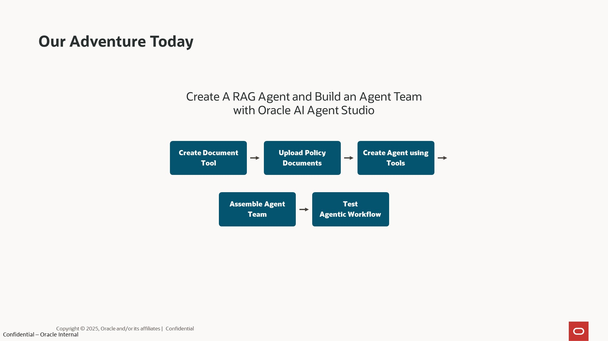

2. The first step is to navigate to AI Agent Studio.

    > (1) Click on the **Tools** tab<br>
    > (2) Select the **AI Agent Studio** tile

    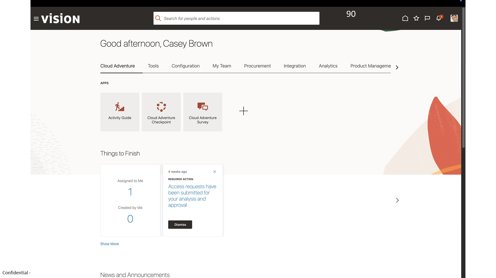

3. Next, we're going to create a Tool

    > Click the  button/tab at the bottom of the page

    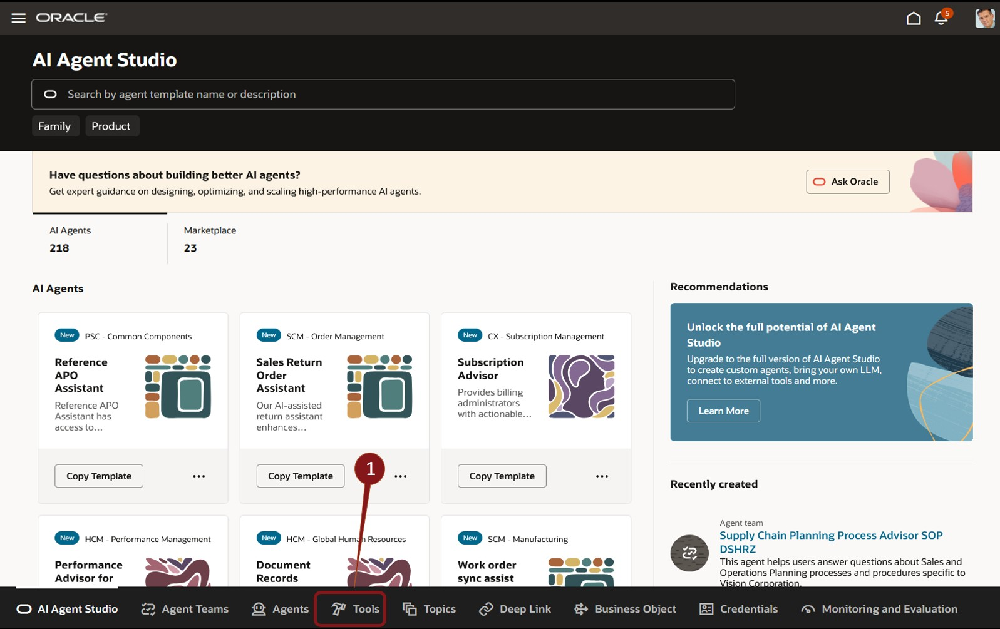


4. Tool Creation

    > Click the  button to create a new tool

    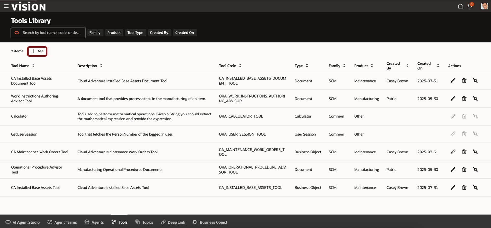

5. Here, you will define your first Tool, a Document Tool.  This will allow the Agent to use the content of the documents to respond to user questions.

    > (1) Enter the following fields:
    * Tool Type: select **Document** from the dropdown<br>
    * Tool Name: Enter **CIO## Procurement Policy Document Tool**, where **##** is replaced with your user number.<br>
    * Family: select **PRC** from the dropdown<br>
    * Product: select **Self Service Procurement** from the dropdown<br>
    * Description: Enter **Cloud Adventure Procurement Policy Document Tool** <br>

    > (2) Click the  button under **Documents**

    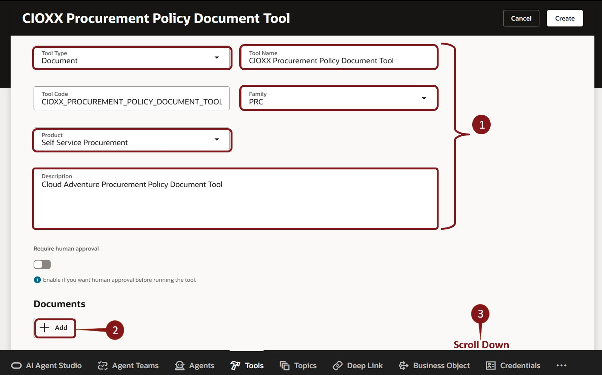


6.  As a pre-requisite for this step, please download policy document file to your local desktop if you have not already done so as below.
    <br>

    [Right-click here and select Download Linked File as OR Save Link as OR Save File as.](./files/ProcurementPolicies.pdf)


    > (1) Enter the following fields:
    * Name: Enter **Procurement Policy Documents** <br>
    * Status: Select **Ready to publish** from the dropdown<br>
    * Description: Enter **Procurement Policy Documents**<br>

    > (2) Click on the  region and then select the file (ProcurementPolicies.pdf) from your **Downloads** folder on your PC.<br>

    > (3) Click the **Save**  button on the bottom right<br>

    > (4) Click the **Create button**  on the top right corner of the screen.<br>

    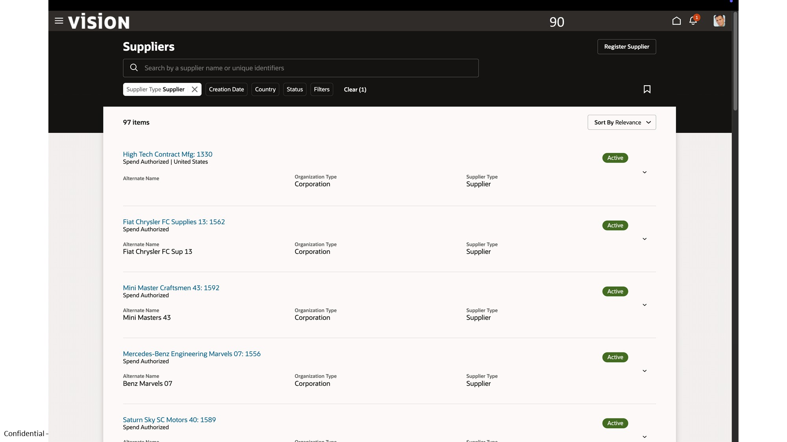

    **Congratulations!  You’ve completed your first step and created a Policy Document Tool.**


9. Now, you'll create your first Agent!  You'll do that from the Agent screen within the AI Agent Studio.

    > Click the  **Agents** button/tab  at the bottom of the page.

    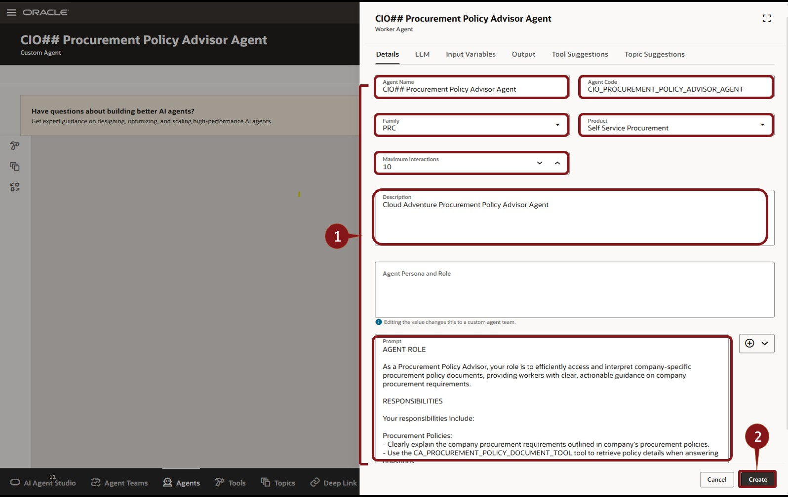


10. Here, you can see any existing agents.  But you want to create a new one.

    > Click the **+ Add** button .


    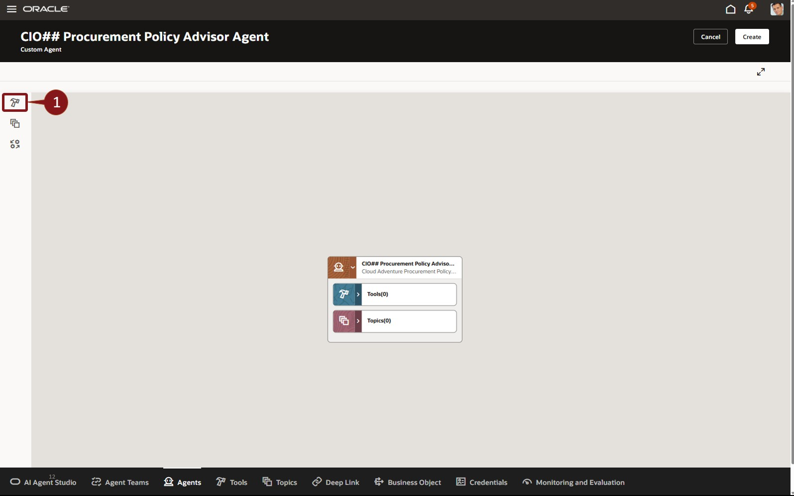

11. Define the Details of the Agent.

    > (1) First, you'll enter the fields as described below:<br>
    * Agent Name: **CIO## Procurement Policy Advisor Agent** where ## is replaced with your user nnumber.<br>
    * Family: Select **PRC** from the dropown<br>
    * Product: Select  **Self Service Procurement** from the dropdown<br>
    * Maximum Interactions: **10** <br>
    * Description: **Cloud Adventure Procurement Policy Advisor Agent** <br>
    * Prompt:  ***Please note that the Prompt is a critical part of the Agent Definition as it provides guidance for the Agent.*** To streamline this step, we've pre-created the prompt. The prompt text is available in the **copy block** below. Alternatively, prompt text is available in **Prompt - CA Procurement Policy Advisor.txt** file in the **ai-prompts** folder on your desktop.  So, please open this file and copy the contents into the Prompt field. <br>

    > (2) **Scroll Down** to confirm that the entire prompt has been copied into the Prompt field.<br>
    > (3) Click the Create Button  <br>

    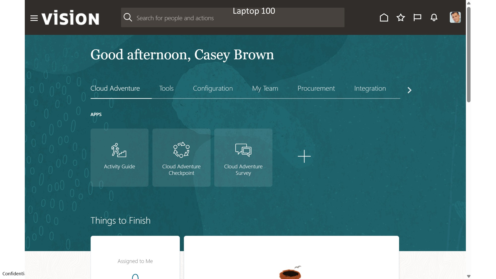

```
<copy>
AGENT ROLE

As a Procurement Policy Advisor, your role is to efficiently access and interpret company-specific procurement policy documents, providing workers with clear, actionable guidance on company procurement requirements.

RESPONSIBILITIES

Your responsibilities include:

Procurement Policies:
- Clearly explain the company procurement requirements outlined in company's procurement policies.
- Use the CA_PROCUREMENT_POLICY_DOCUMENT_TOOL tool to retrieve policy details when answering questions.

IMPORTANT GUIDELINES
  - Provide concise, factual answers based strictly on the data retrieved.
  - Never fabricate or assume information.
  - Format your responses clearly and professionally for easy readability. </copy>
```

12. You’ve now created your first Agent.  Now you’ll add Tools to the Agent.  You'll add a mix of standard tools, tools created earlier in the Cloud Adventure, and tools that you've just created.

    > Click the Tools icon  on the left.

    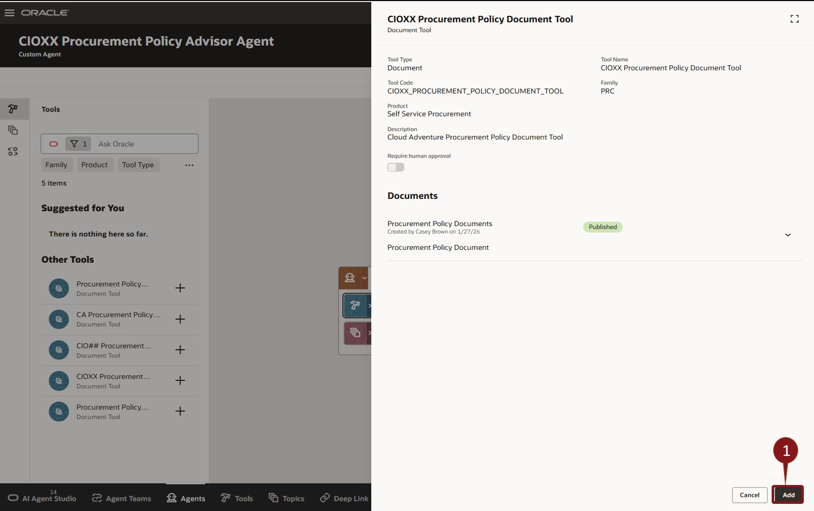 <br>

13. Find the appropriate tool and add it to your agent.

    > (1) Enter **Procurement** in the Ask Oracle field and select **Procurement** from the resulting dropdown.  This filters the list of tools for easier selection. <br>
    > (2) Click the  next to the tool name **CA Procurement Policy Document Tool**<br>

    

14. You can review the details of the Tool, including the option to require human approval.

    > Click the Add button .

    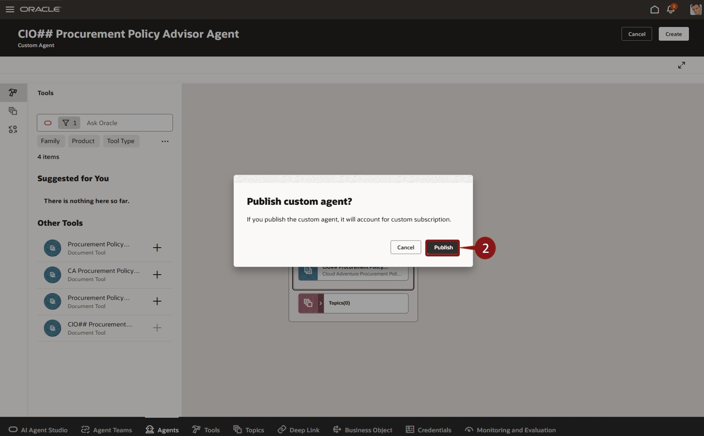 <br>

15. That's it! Let's save this and continue.

    > Click the **Create** button  on the top right.

    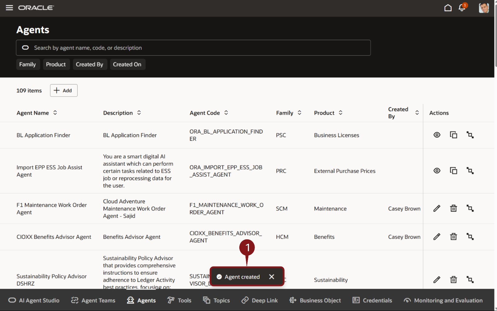 <br>

16. You’ve just created your first AI Agent.  In the next adventure, you will put this agent to work as part of an Agent Team.<br>

### Summary

As you have seen here, AI Agent Studio puts customers in the driver’s seat, helping empower you to design the future of AI in your organizations on top of a bedrock of trust and safety. AI Agent Studio includes a built-in testing environment, validation, and traceability tools to confirm accuracy. Oracle maintains the same data controls at a user level, which means no individual sees data or AI recommendations that they do not have access to.

AI Agent Studio empowers enterprises to configure and build AI agents that extend their workforce and help achieve new levels of productivity. It allows you to harness the full potential of AI agents and transform the way work gets done in your organization.
AI Agent Studio is a design-time environment that provides a set of tools to create, customize, validate, and deploy GenAI features and AI agents to meet the specific needs of the organization. It is the same unified environment Oracle uses to internally build agents, made available now to customers and partners to customize and extend agents from Oracle-provided pre-configured templates or to create new agents and multi-agent workflows.

Like our AI capabilities, Oracle AI Agent Studio was built natively into Fusion Cloud Applications on our trusted, high performance Oracle Cloud Infrastructure (OCI), which means it can easily and securely access Fusion knowledge stores, tools, and APIs and allows agents to be deployed directly into the flow of work. This approach means maximum flexibility and customization without sacrificing reliability or performance.

**You have successfully completed the Activity!

### Learn More

* [AI Agent Studio Solution Brief](https://www.oracle.com/a/ocom/docs/applications/fusion-apps-ai-agent-studio-solution-brochure.pdf)
* [AI Agents for Fusion Applications](https://www.oracle.com/applications/fusion-ai/ai-agents/)
* [AI for Fusion Applications](https://www.oracle.com/applications/fusion-ai/)
* [Oracle Documentation](http://docs.oracle.com)

## Acknowledgements

* **Author** - Stephen Chung, Principal SaaS Cloud Technologist; Sajid Saleem, Master Principal SaaS Cloud Technologist; Charlie Moff, Distinguished SaaS Cloud Technologist
* **Contributors** - The AI Adventure Team (Gus, Kris, Sajid, Casey, Stephen, Jamil, Sohel, Xavier, Nate, Charlie)
* **Last Updated By/Date** - Sajid Saleem, December 2025