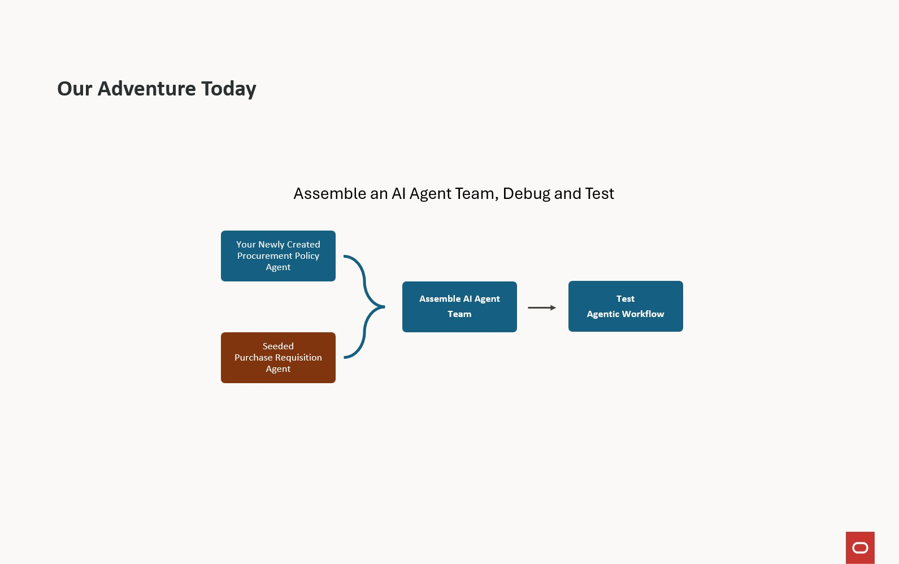
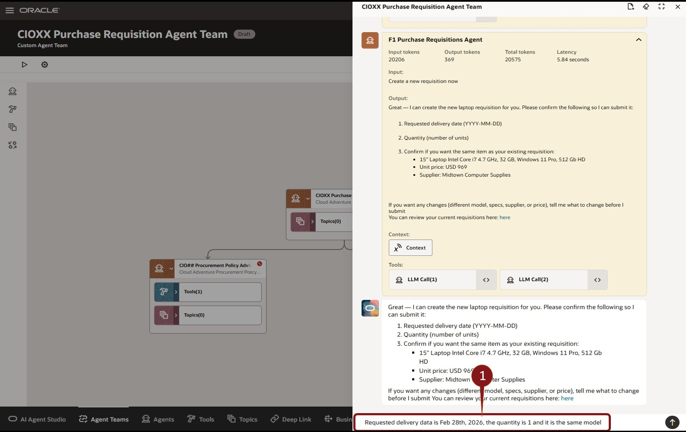
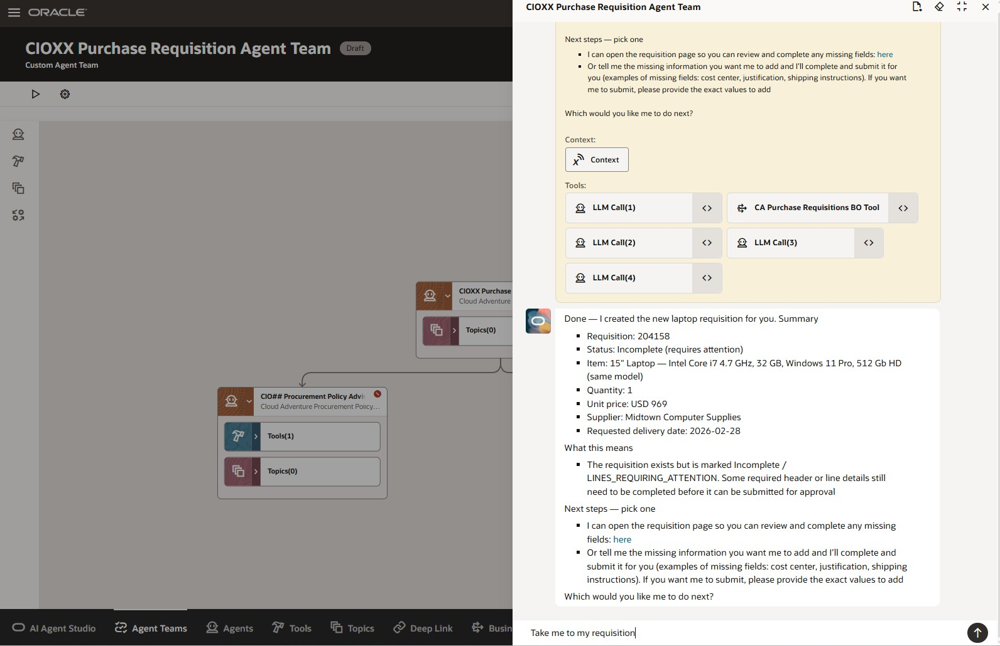
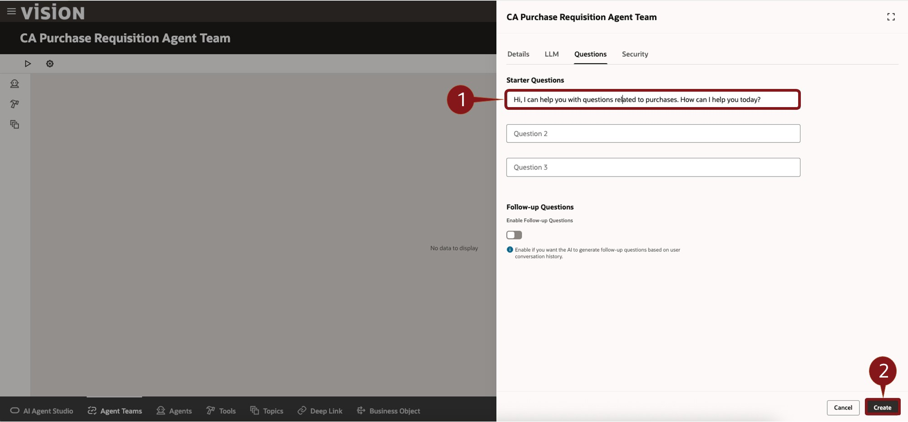
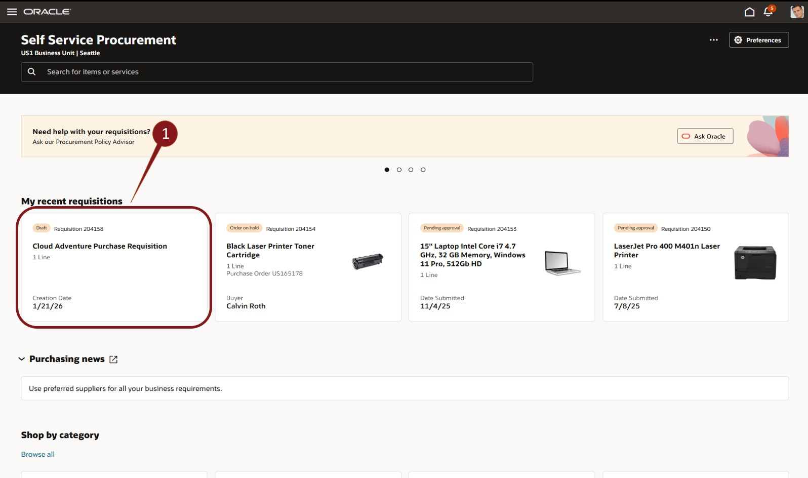
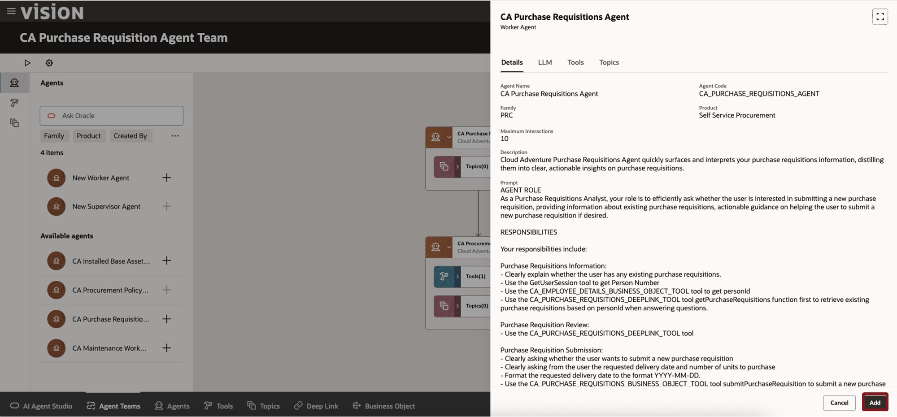
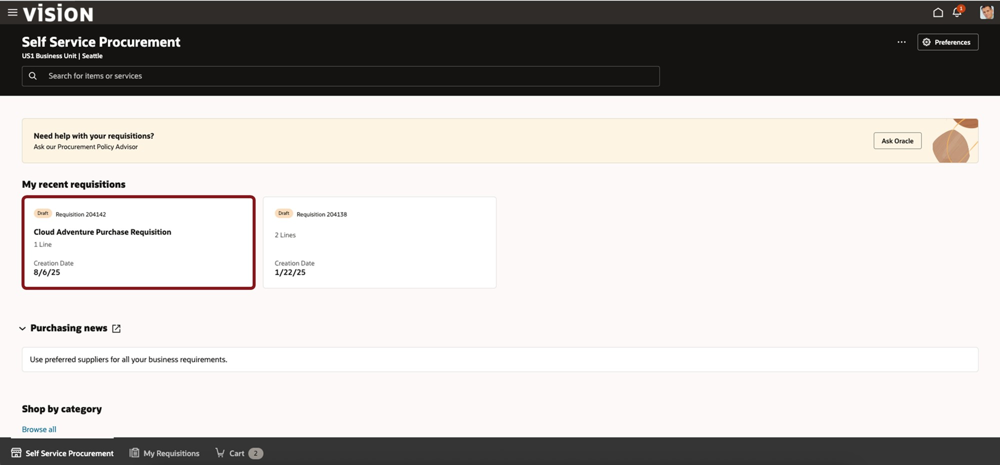

# Assemble and Test an AI Agent Team

## **Assemble and Test an AI Agent Team using AI Agent Studio**

### Introduction

AI Agent Studio for Fusion Applications is a comprehensive platform for creating, extending, deploying and managing AI Agents and Agent Teams across the enterprise. Oracle AI Agent Studio delivers easy-to-use tools, including advanced testing, robust validation, and built-in security, that helps Oracle Fusion Applications customers and partners create and manage AI agents. Leveraging the same technology that Oracle uses to create AI agents, Oracle AI Agent Studio enables users to easily extend pre-packaged agents and/or create new agents and then deploy and manage them.

### **Objectives**

In this activity you will use Oracle Fusion AI Agent Studio to
* Create and assemble an Agent Team that includes your previously created Procurement Policy Advisor Agent and Purchase Requisition Action Agent.
* Test the Agent Team

### **Begin Exercise**

1. In this activity you will learn the power and ease building Agentic AI with the Oracle AI Agent Studio

    

2. The first step is to navigate to AI Agent Studio.

    > (1) Click on the **Tools** tab  
    > (2) Select the **AI Agent Studio** tile

    

3. Create an Agent Team.

    > Click the **+ Add** button .
    > 

4. Define the Agent Team.

     > (1) Enter the fields as described below:
     * Agent Team Name: **CIO## Procurement Requisition Agent Team** where ## is replaced with your user number.  
     * Family: Select **PRC** from the dropdown  
     * Product: Select  **Self Service Procurement** from the dropdown  
     * Maximum Interactions: **20**  
     * Description: **Purchase Requisition Agent Team leverages worker agents Procurement Policy Advisory and Purchase Requisition Agent.**  

    > (2) Click the Questions tab  

    

5. You can provide one or more starter questions to assist users in interacting with the Agent Team.

    > (1) In the Question 1 field, enter: **Hi, I can help you with questions related to purchases.  How can I help you today?**  
    > (2) Click the **Create** button  on the bottom right.

    

6. You’ve defined your Agent Team, so it’s time to add a Supervisor agent.

    > (1) Click the **Agents** Icon   
    > (2) Click the **+** icon  next to **New Supervisor Agent**.

   

7. Define Supervisor Agent Details.

     > (1) Enter the fields as described below:
    * Agent Team Name: **CIO## Procurement Requisition Supervisor Agent** where ## is replaced with your user number. 
    * Family: Select **PRC** from the dropdown 
    * Product: Select  **Self Service Procurement** from the dropdown 
    * Maximum Interactions: **10**  
    * Description: **Cloud Adventure Purchase Requisitions Supervisor Agent**  

    > (2) Click the **Create** button  on the bottom right.

    

8. Next you'll add some worker agents.

    > Click the **+** icon  next to **CIO## Procurement Policy Advisor Agent**, where ## is replaced with your user number.

    

9. You can review the details of the agent.

    > Click the Add button .

      

10. You'll add one more worker agent.

    > Click the **+** icon  next to predefined **CA Purchase Requisitions Agent**.  Note that this is a shared Agent and not one that you created specifically with your user number.

    

11. You can review the details of the agent.

    > Click the **Add** button .

      

12. Your Agent Team, with a Supervisory Agent and two Worker Agents, is now ready to test.

    > Click the **Debug** icon  on the top left of the screen.  It's the one that looks like the Play arrow.

      

13. You can now begin a dialog with the Agent.

    > In the **Ask Oracle** dialog box on the bottom right of the screen, enter **What is the laptop policy** and hit the return key or click the **Up Arrow** icon 

      

14. The Agent will response with information.  In this Debug mode, the Agent will also show you source and processing information (yellow boxes).  These will not be available to end-users once deployed.

    > The agent provides a response. But we need more information, so we'll ask additional questions.
    > In the **Ask Oracle** dialog box on the bottom right of the screen, enter **What if I need to order a non-standard laptop** and hit the return key or click the **Up Arrow** icon 

      

15. You decide to not worry about requesting anything non-standard.

    > So, ask the agent to proceed with the laptop order by typing **I am ready to order a laptop** in the **Ask Oracle** dialog box on the bottom right of the screen and hit the return key or click the **Up Arrow** icon 

      

16. The Agent may notice that you have some incomplete PO Requisitions and will request your my input.

    > In the **Ask Oracle** dialog box on the bottom right of the screen, enter **Show my existing requisitions** and hit the return key or click the **Up Arrow** icon 

      

17. The agent will ask you to confirm.

    > In the **Ask Oracle** dialog box on the bottom right of the screen, enter **Proceed with ordering a laptop** and hit the return key or click the **Up Arrow** icon 

      

18. The agent needs a little more information.

    > In the **Ask Oracle** dialog box on the bottom right of the screen, enter **Requested delivery data is Jan 31st, 2026 and the quantity is 1** and hit the return key or click the **Up Arrow** icon 

      

19. The agent has created your requisition.

    > In the **Ask Oracle** dialog box on the bottom right of the screen, enter **Take me to my requisition** and hit the return key or click the **Up Arrow** icon 

      

20. The agent can link you directly to the Purchase Requisition screen.

    > Click the **here** link in the agent response.

      

21. You’re now in Self-Service Procurement and can see the new Requisition that the Agent created.

    > Congratulations on completing this Cloud Adventure!

      

22. Adventure awaits, click on the image, show what you know and rise to the top of the leader board!!!

    

### Summary

As you have seen here, AI Agent Studio puts customers in the driver’s seat, helping empower you to design the future of AI in your organizations on top of a bedrock of trust and safety. AI Agent Studio includes a built-in testing environment, validation, and traceability tools to confirm accuracy. Oracle maintains the same data controls at a user level, which means no individual sees data or AI recommendations that they’re not permissioned to see.

AI Agent Studio empowers enterprises to configure and build AI agents that extend their workforce and help achieve new levels of productivity. It allows you to harness the full potential of AI agents and transform the way work gets done in your organization.
AI Agent Studio is a design-time environment that provides a set of tools to create, customize, validate, and deploy GenAI features and AI agents to meet the specific needs of the organization. It is the same unified environment Oracle uses to internally build agents, made available now to customers and partners to customize and extend agents from Oracle-provided pre-configured templates or to create new agents and multi-agent workflows.

Like our AI capabilities, Oracle AI Agent Studio was built natively into Fusion Cloud Applications on our trusted, high performance Oracle Cloud Infrastructure (OCI), which means it can easily and securely access Fusion knowledge stores, tools, and APIs and allows agents to be deployed directly into the flow of work. This approach means maximum flexibility and customization without sacrificing reliability or performance.

**You have successfully completed the Activity!

### Learn More

* [AI Agent Studio Solution Brief](https://www.oracle.com/a/ocom/docs/applications/fusion-apps-ai-agent-studio-solution-brochure.pdf)
* [AI Agents for Fusion Applications](https://www.oracle.com/applications/fusion-ai/ai-agents/)
* [AI for Fusion Applications](https://www.oracle.com/applications/fusion-ai/)
* [Oracle Documentation](http://docs.oracle.com)

## Acknowledgements

* **Author** - Stephen Chung, Principal SaaS Cloud Technologist; Sajid Saleem, Master Principal SaaS Cloud Technologist; Charlie Moff, Distinguished SaaS Cloud Technologist
* **Contributors** - The AI Adventure Team (Gus, Kris, Sajid, Casey, Stephen, Jamil, Sohel, Xavier, Nate, Charlie)
* **Last Updated By/Date** - Sajid Saleem, November 2025