# Analytics

## **Use AI to derive better business insight**

### **Introduction**

Oracle Fusion Data Intelligence Platform (FDI) is a family of prebuilt, cloud native  applications for Oracle Cloud Applications that provides line-of-business users with ready-to-use insights to improve decision-making.

It is a Cloud application that delivers best-practice Key Performance Indicators (KPIs) and deep analyses to help decision-makers run their businesses and individual contributors to operate their businesses. Oracle Fusion Data Intelligence Platform is built on top of Oracle Analytics Cloud and Oracle Autonomous Data Warehouse. This packaged service starts with Oracle Fusion Cloud Applications which you can deploy rapidly, personalize, and extend. The service extracts data from your Oracle Fusion Cloud Applications and loads it into an instance of Oracle Autonomous Data Warehouse. Business users can then create and customize dashboards in Oracle Analytics Cloud. It empowers business users with industry-leading, AI-powered, self-service analytics capabilities for data preparation, visualization, enterprise reporting, augmented analysis, and natural language processing.

This activity guide helps business users to investigate and research data, ask relevant questions to understand Trends, Patterns and Outliers.

### **Objectives**

In this activity, you will Create analytics across different lines of business to derive better business insight

Estimated Time: 15 minutes

Do not forget to answer the Adventure Check Point questions at the end of the exercise!

### Begin Exercise**

1. In this activity, you will Create analytics across different lines of business to derive better business insights.

    Cross-functional reporting analysis between ERP & HCM involves integrating data from core business operations finance with workforce-related data (such as employee performance, payroll, and workforce planning) providing comprehensive insights for decision-making, enabling organizations to align their human resource strategies with broader business objectives.

    

At this point, you should be logged into your environment with a username CIO.xx where xx is a two number code assigned to your laptop.

2. Oracle Fusion Data Intelligence Platform is a family of prebuilt, cloud-native analytics applications for Oracle Cloud Applications that provide line-of-business users with ready-to-use insights to improve decision-making.

    > (1) Click on the **‘Analytics’** tab  

    > (2) (2) Click on **Fusion – Analytics Data Intelligence** icon  

    

3.  After a successful login, you will land on the Oracle Analytics home page.

    > (1) Enter your assigned username and Fusion Analytics Password   

    

4. From home menu, talk about how we are going to look at the results we had from Path 1. That being lowering margin with certain root cause attributing and that being attrition from the HCM world.

    > (1) To get to Margin Analysis workbook, click on **Hamburger Menu** on top left corner.   

    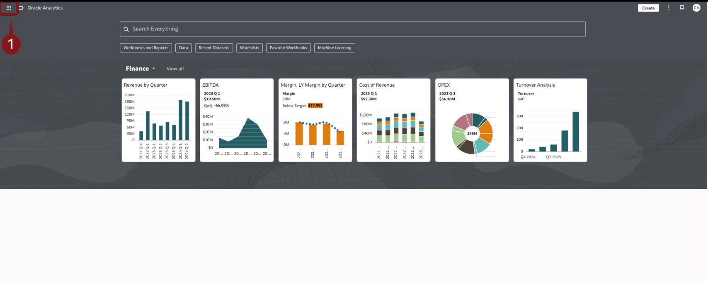

    > (1) Click on **Catalog**.  

    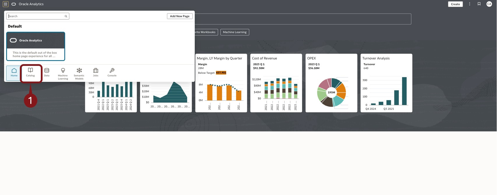

    > (1) Make sure have highlighted **My Folders** in left side pane window.  

    > (2) Then Double click into **Margin Analysis Complete**.  

    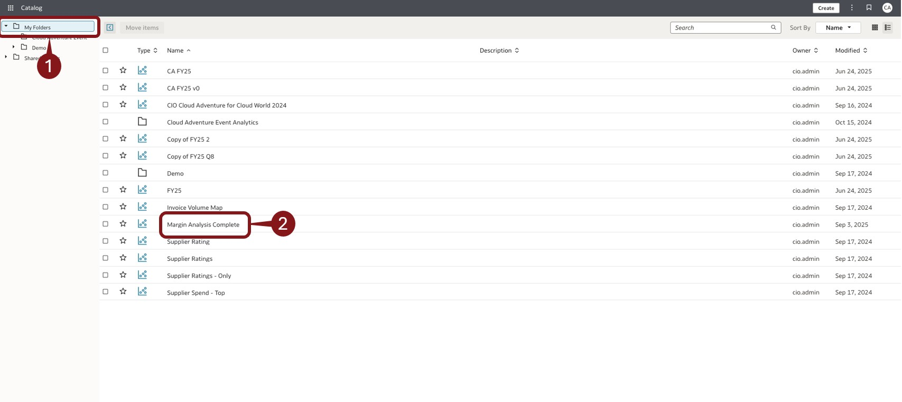

5.  Explain Canvas 1 as showing why Margins coming down and have top expenses to reflect what is contributing thus far. That being Payroll Expenses as top expense so now lets take a look closer at payroll expense in Canvas.

    > (1) Click on bottom left to **Canvas 2**.  

    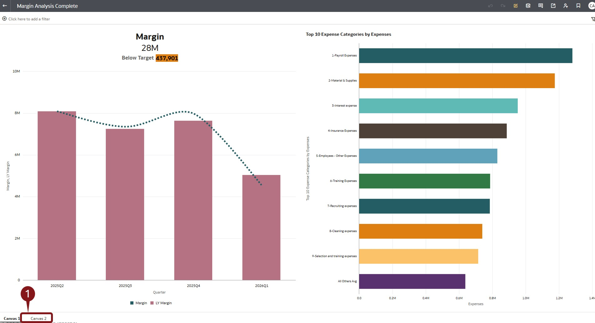

6.  Talk about how Contract Labor and Overtime were spiking up last several months and looking further into that, Attrition and turnover had a strong correlation as to why that was happening. So now we are going to look at why are people leaving the organization. We will use AI/ML model to look at the sentiment of the culture and reasons folks are leaving.  We will start with building a ML model with sample data we collected from outgoing terminated employees and 360 feedback from within the organizations.

    > (1) now hit the **back button** on the top left to start the modeling build out.  

    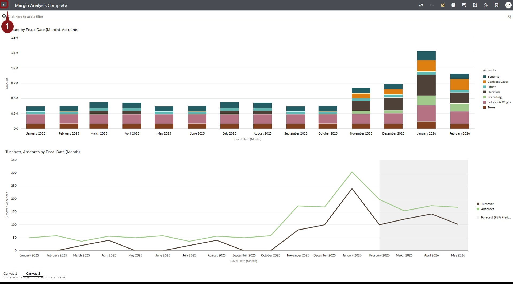

    > (1) Click on **Hamburger Menu**.  

    > (2) click on the **home** icon.  

    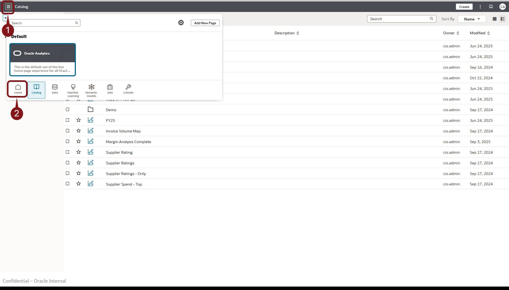

7.  Now you will start the data flow process for building the model out

    > (1) Click on the **Create Button**.  

    

    > (1) Click on **Data Flow**.  

    

8.  Data Flow page pops up but also a dialog box asking to Add Data.

    > (1) Within the Search box, type in **Survey** .  

    > (2) Select Data set named **Survey Data**.  

    > (3) CLick **Add**.  

    

9.  Now that we have our data, explain the different fields in the data. Everything from ID, headcount, departments, employee comments…. We can take advantage of the different out of the box ML models FDI offers. Can explain the left hand pane at this point with different models. But really we are going to focus on the **Analyze Sentiment**.

    > (1) Drag **Analyze Sentiment** on the left side until we get a blue box next to Survey Data.  

    

10.  Now that we have “Analyze Sentiment” we have to point the model as to what we want it to analyze, In this case we want to have a sentiment analysis on employees comments. The Sentiment Analysis will analyze the comments and assign a positive, neutral, or negative attribute to each comment.

    > (1) Click on **Select a Column** .  

    > (2) Scroll down until you see **EmployeeComment**.  

    > (3) CLick on **EmployeeComment**.  

    

11.  We are ready to save the model data.

    > (1) drag over “**Save Dataset** to our data flow.  

    

    > (1) Enter **Survey Sentiment CIOXX and your intials** in data set to name the data set.  

    > (2) Click the **Save** button.  

    

12. Dialog box pops up asking name to save Data Flow As.

    > (1) Enter **Sentiment Data Flow CIOXX and your intials**.  

    > (2) Click on **Ok**.  

    

13. Now you will run the data flow model.

    > (1) Click on the **Run** button.  

    

14. Will take about 30 seconds or so to run. Can start going back to build out a workbook with the data set generated.

    > (1) Click on the **back** button.  

    

    > (1) Click on the **Navigation Menu**.  

    > (2) Click on **Data**.  

    

    > (1) Click on  **Data Flows**.  

    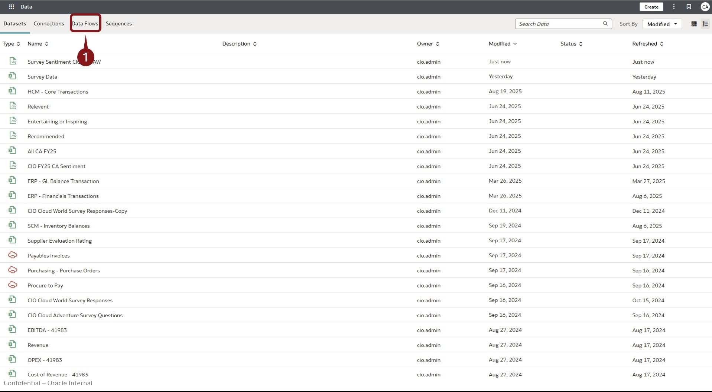

15. Now that we have Sentiment Data Flow created, lets build some analysis with the model.

    > (1) Click on **Workbook**.  

    > (2) Click on **Create**.  

    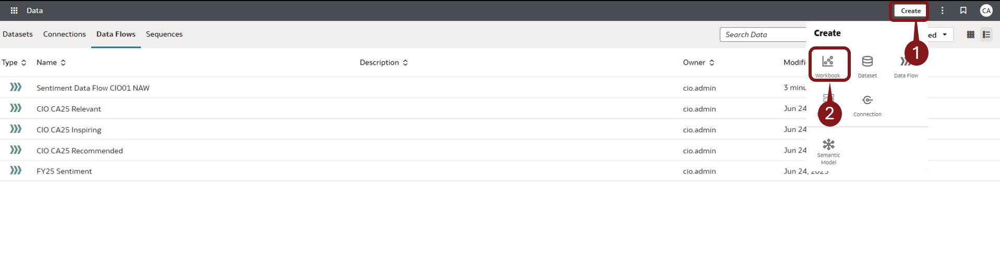

16. Dialog pop up asking for what data we would like to Add.

    > (1) Enter **Survey** in the search bar.  

    > (2) Select the model you named with your initials .  

    > (2) Click on **Add to Workbook**.  

    

17. Now that we have our data ready. Quickly talk how we have emotion attribute in the dataset as a result of the sentiment model.  We can start with some analysis and look at head count based on emotions given to employee comments by the model.

    > (1) Click and hold on ctrl, then select **emotion**.  

    > (2) Select **headcount** and drag both attributes into the canvas.  

    

    > (1) Click and drag **emotion** onto color.  

    

18.  Now lets add a tag cloud for reasons of leaving

    > (1) Click and hold on ctrl, then select **headcount**.  

    > (2) Select **Reason** and drag both attributes over to the right of the bar graph we have as such.  

    

    > (1) Click on **Auto (bar)**.  

    > (2) Then click on the **word cloud icon**. 

    

19.  From Category box bring “Reason” into Color box. We can add another analysis to deep dive sentiment by business unit. We can copy and paste the “Headcount by emotion” by clicking on the chart and hit Ctrl-C then Ctrl-V to copy and past the visualization again.

    

    > (2) Drag **business unit** over to **Trellis Columns**. 

    

20.  **THIS NEEDS TO BE REWORDED AND STEPS ADDED** Can move visualizations around grabbing visualization from title and get a blue line showing where would like to place it. I placed the Business unit breakdown below the other two visualization. Lastly we can bring in the comments and add some color emotion to them as well.

    

21.  **MISSING TEXT FOR STEPS**

    

22.  we can bring in the comments and add some color emotion to them as well. Bring down Color Attribute from Rows to Color

    

23.  **MISSING TEXT FOR STEPS**

    

24.  **MISSING TEXT FOR STEPS**

    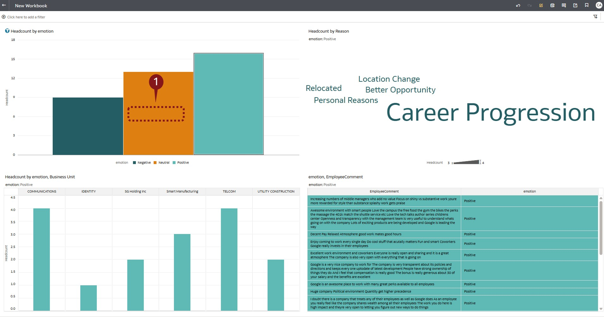

25.  **MISSING TEXT FOR STEPS**

    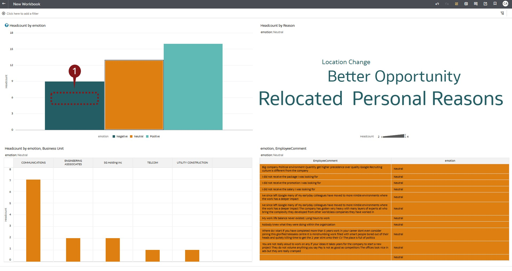

26.  **MISSING TEXT FOR STEPS**

    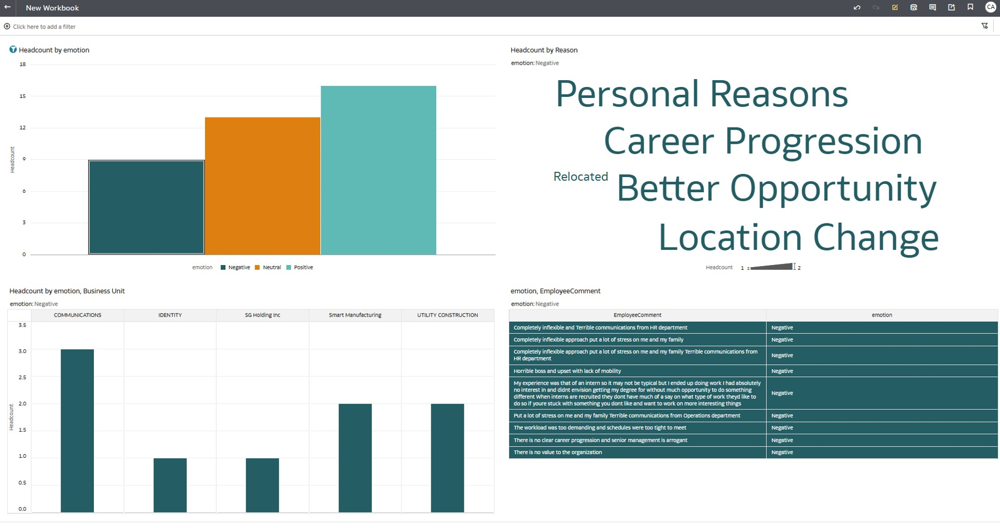

27. Adventure awaits, click on the image and show what you know, and rise to the top of the leader board!!!

    

## Summary

You discovered how effortlessly Fusion Analytics enables the creation of content and analysis of data. By integrating diverse data sources, you were able to delve deeper from summary information to detailed analysis, uncovering root causes. You then shared your discoveries with a broader audience, making the insights accessible and impactful.

**You have successfully completed the Activity!**

## Learn More

* [Get Started with Oracle Fusion Data Intelligence](https://docs.oracle.com/en/cloud/saas/analytics/24r3/index.html)
* [Oracle Documentation](http://docs.oracle.com)

## Acknowledgements
* **Author** - Sohel Jeelani, Analytics Solution Engineer, Advanced Technology Services
* **Contributors** -
* **Last Updated By/Date** - Xavier Ramirez, August 2025
