### 

## Path 1: Grant AI Access

### **Introduction**

  Welcome to Oracle’s AI Adventure for Security Administration.  This is a fresh and unique way to offer you a chance for hands-on experience of highly differentiated and specifically curated content of numerous vignettes related to Oracle SaaS Applications Configuration and Administration. We hope you will enjoy today’s adventure exploring a complete and unified solution for your business.

### **Objectives**

  During this adventure, you will perform a time sensitive task of granting permissions to a user.

  Estimated Time: 15 minutes

  Do not forget to answer the Adventure Check Point questions at the end of the exercise!

### **Begin Exercise**

1. During this adventure, you will perform a time sensitive task of granting permissions to a user.  These are the steps you will perform:

    

    > At this point, you should be logged into your environment with a username **CIO.xx** where **xx** is the two number code of your login ID.

2. To enable the ability to use AI to discover new suppliers, you will access the security console. This is the Springboard where you’ll access all features.

     > (1) Select the **Tools** tab menu.  
     > (2) Select **Security Console**.

    

3. While examining roles, begin by searching for the role we seeded for this adventure

    > (1) In the search field provided at the top, type **Adventure**.  

    > (2) Then click on the first entry as shown.

    

4.	Using the pull-down demo to copy the role as described below.  Modifications should always be done to copies.

    > (1) Click on the Pull-Down Menu.  

    > (2) Select **Copy Role**.

    

5. Continue with copying the role

    > (1) Select **Copy top role**.  

    > (2) Press the **Copy Role** button.

    

6.	Notice that you are provided with a list of ordered steps at the top.  For this example, we will only use steps 1, 2 and 7.

    > (1) Add **your initials and xx Code** to the beginning of the **Role Name**  
    > (2) Add **your initials and xx Code** to the beginning of the **Role Code** as shown.  
    > (3) Press the **Next** button.

    

7.	Using Function Security Policy, you will add the privilege the user needs

    > (1) Press the **+ Add Function Security Policy** button.

    

8.	You will now search for the required policy and add it.

    > (1) Type **Create Supplier Negotiation** in the search field 
    > (2) Select the **Create Supplier Negotiation** privilege from the resulting dropdown as shown.

    

9.	Continue adding

    > (1) Press the **Add Privilege to Role** button.

    

10.	Complete adding roles

    > (1) Press the **Cancel** button to continue.

    

11.	While there are other steps we can perform, we going to skip to Step 7 to add users to this role.
    > (1) Press the Step **7** **Users** from the list of steps at the top of the screen

    

12.	You should now assign a user to this new role and its associated privileges.

    > (1) Press the **+ Add User** button.

    

13.	Searching for a user

    > (1) Type **Pat.ProcurementManager** in the search form then Select then name from the resulting dropdown list.  

    > **Note:** Be sure to include the ‘.’ between the first and last name.

    

14.	Continue

    > (1) Press the **Add User to Role** button.

    

15.	Again, the search box remains in case you want to add additional users.

    > (1) Press the **Cancel** button.

    

16.	Pat.ProcurementManager has been added to this new role

    > (1) Press the **Next** button.

    

17.	Note confirmation that we have added a Security Policy and user.

    > (1) Press the **Submit and Close** button.

    

18.	Using the compare roles feature, you can quickly identify changes you’ve made compared to the out of the box roles provided by Oracle or other custom roles.  This section uses your newly created role to do exactly this.

    > (1) From the Security Console, press the **Compare Roles button** button.

    

19.	Begin search for the original role

    > (1) Press the **Search** icon for the First Role.

    

20.	Search for seeded role

    > (1) In the search field type **Adventure**. 

    > (2) **Select** the first entry.

    

21.	Continue

    > (1) Press the **Ok** button.

    

22.	Begin search for the custom role

    > (1) Press the **Search** icon for the Second Role.

    

23.	Search for custom role

    > (1) Type in your **Initials and XX Code** which you used to name your custom role .  

    > (2) **Select** your custom role.

    

24.	Continue

    > (1) Press the **Ok** button.

    

25.	Begin compare task

    > (1) Press the **Compare** button.

    

26.	Now you see the differences between the two roles.

    > (1) Press the **Only in second role** toggle.

    

27.	This view shows the change added to the custom role.  That completes this adventure.  Next, you'll return to the home page.

    > (1) Press the **Home** button.

    

28. Adventure awaits, click on the image, show what you know and rise to the top of the leader board!!!

    

## Path 2: Request Access with Risk Management
### **Request Access with Risk Management**

### **Introduction**

Welcome to Oracle’s AI Adventure for Risk Management.  This is a fresh and unique way to offer you a chance for hands-on experience of highly differentiated and specifically curated content of numerous vignettes related to Oracle SaaS Applications Configuration and Administration. We hope you will enjoy today’s adventure exploring a complete and unified solution for your business.

### **Objectives**

During this adventure, request role access via Risk Management and experience the review and approval process.

Estimated Time: 15 minutes

### **Begin Exercise**

1. During this adventure, request role access via Risk Management and experience the review and approval process.  These are the steps you will perform:

  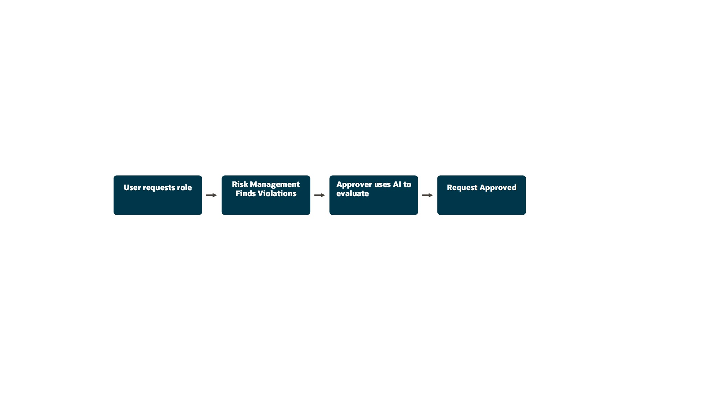

  At this point, you should be logged into your environment with a username CIO.xx where xx is a two number code assigned to your laptop

2. To begin the request for access, use the Risk Management application

   > (1) This is the Springboard where you’ll access all features.  Select the **Risk Management** tab menu.  

   > (2) Select **My Access Requests**.

   

3. This it the beginning of your user request

    > (1) Press the **Request Access** button.

    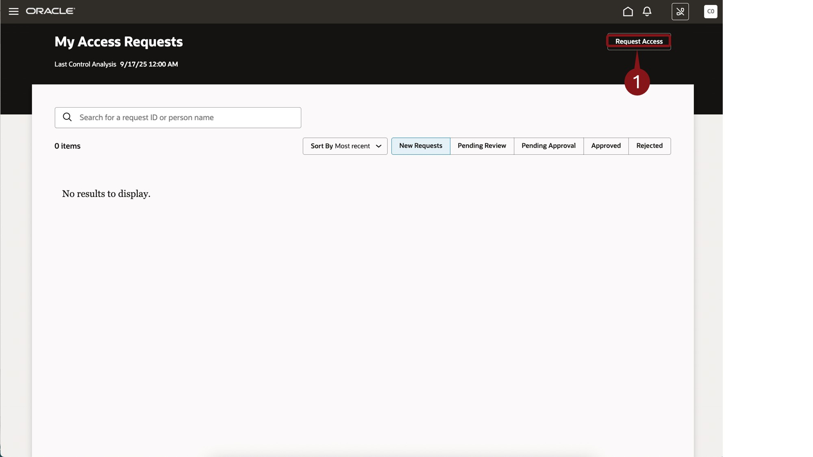

4. Use this screen to enter justification for granting the new role

    > (1) In the entry field, type,**Order Entry department is having a critical shortage of staff** in the text field as shown.  

    > (2) Press the **Add Role** button.

  

5. Use this screen to select the roles you would like to request

    > (1) In Role Name, type, **Vegas**.  

    > (2) Then select the **Vegas Order Entry Specialist** role.

  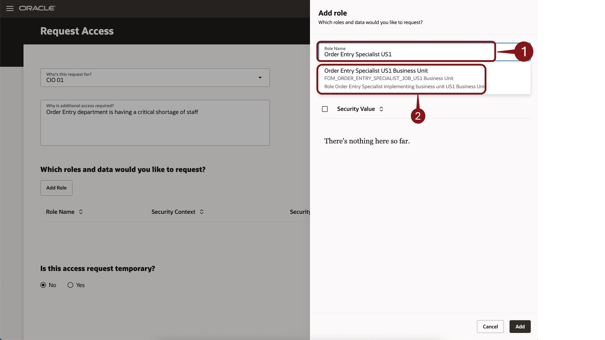

6. Selecting Security Context allow you refine the limits that will be placed on the requested role.

  > (1) Click on the down arrow  to view some available options for security context.

  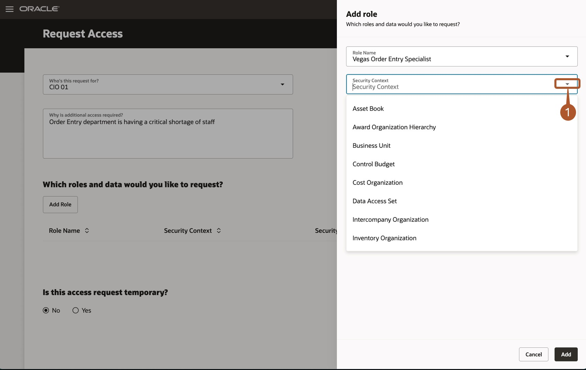

7. No security context will be chosen for this exercise.

  > (1) Click on the down arrow  again to hide the options  

  > (2) Press the **Add** button.

  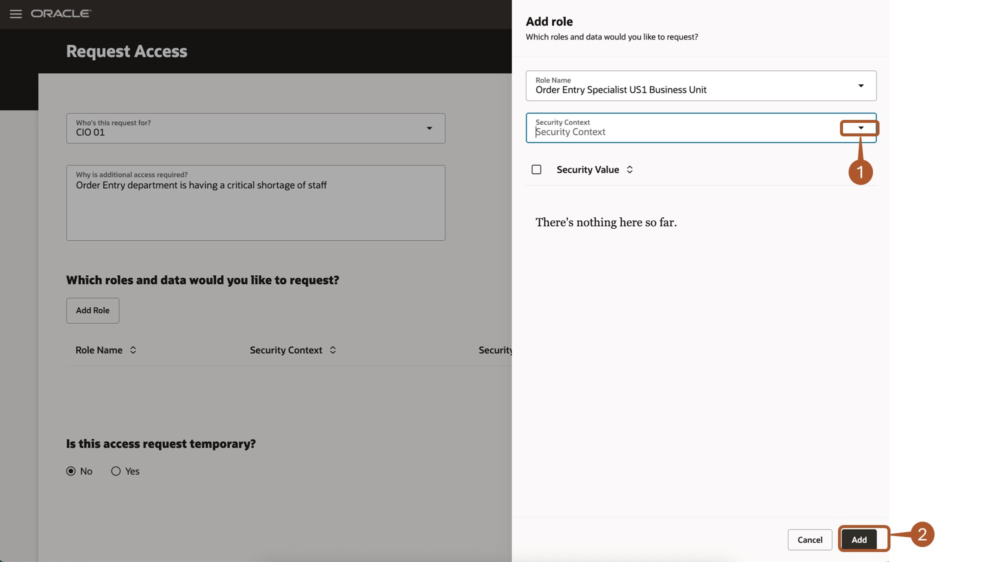

8. With all roles selected, the request is submitted.

  > (1) Press the **Submit** button.

  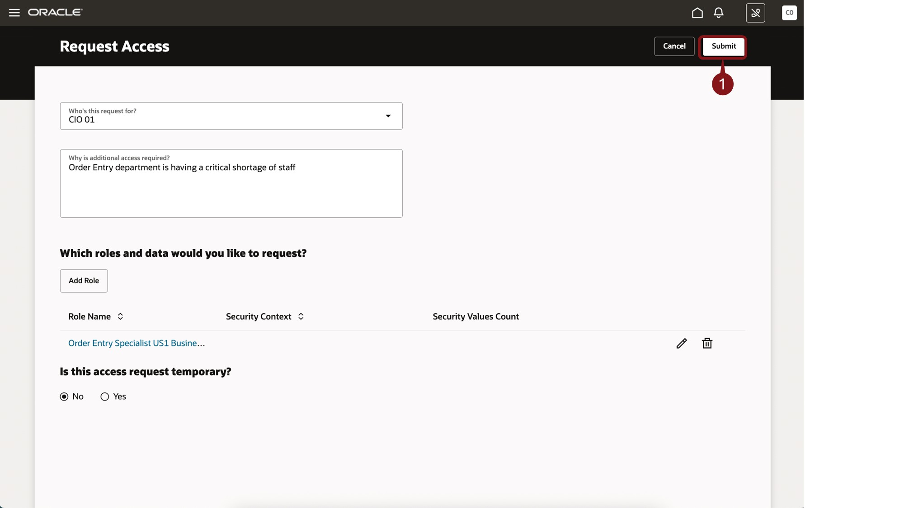

9. Note that your request has been placed in a queue for processing.

  > (1) Press the **home** button to continue.

  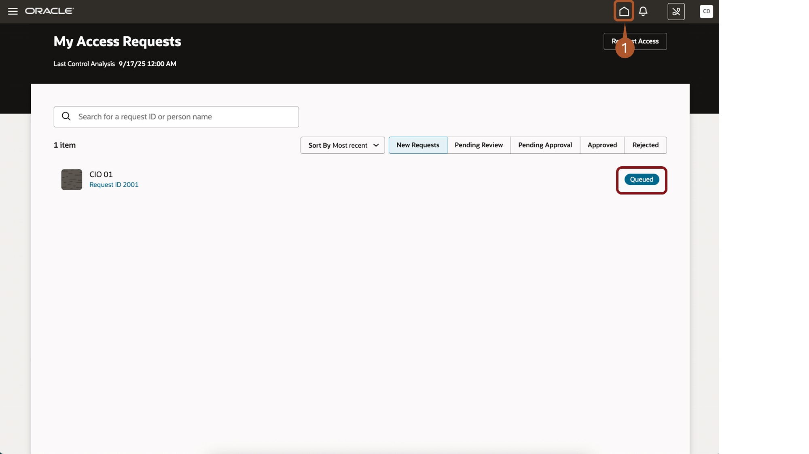

10. End of customer activity.  The remainder of this session will be performed by a participant with assistance from the presenter.

  

  > (1) From the navigator menu, select **Risk Management : Setup and Maintenance**.  

  

  > (1) Select the scheduler icon.

  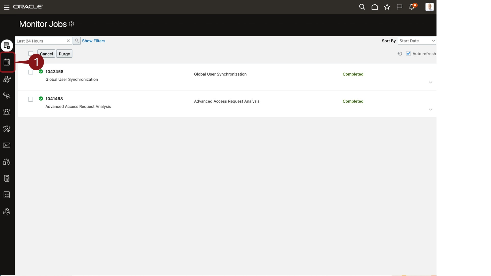

  > (1) Highlight the line for **Advanced Access Request Analysis**  

  > (2) Press the **Run Now Button**.  

  > (3) Press the **Monitor Jobs** icon on the top.

  

11. Job Queued

  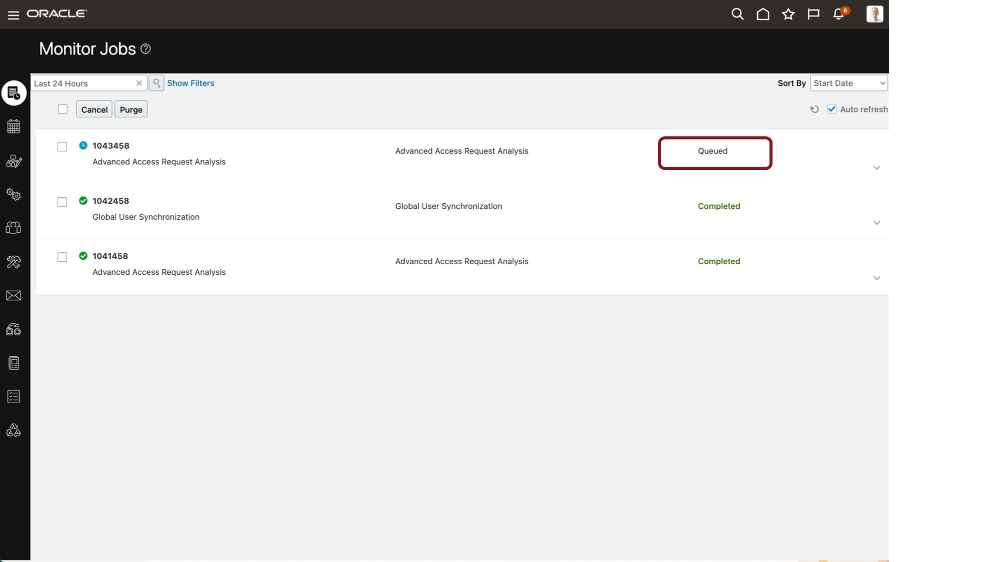

12. Job completed Approximately 4-5 minutes

  

13. Philip Kent is now able to see the result of the analysis performed by Risk Management

  > (1) Click on  **Risk Management**.  

  > (2) Select **Access Request Approvals**.  

  

  > (1) Select the Request ID for one of the participant’s requests.  

  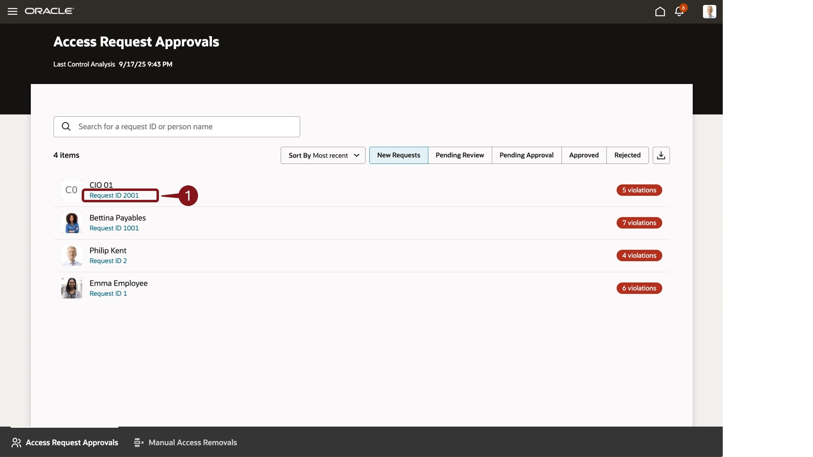

  > (1) Select the role requested to view details of the violations found.  

  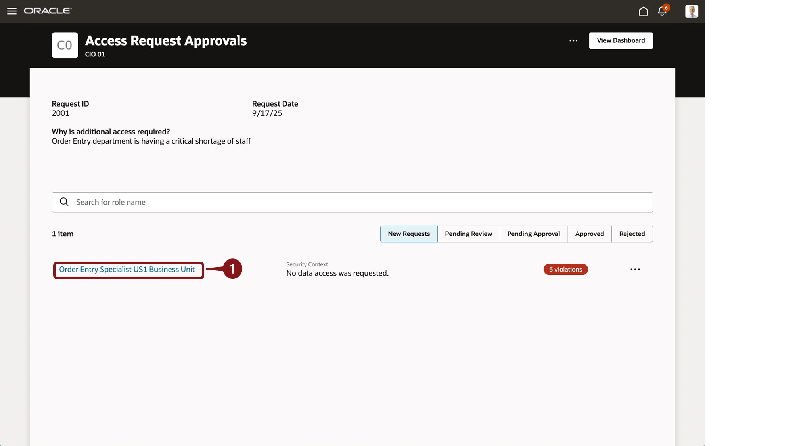

14. Presenter will step through the findings from Risk Management

  > (1) Click on **Control Violations**.  

  

  > (1) Click on **Conflicting Roles**.  

  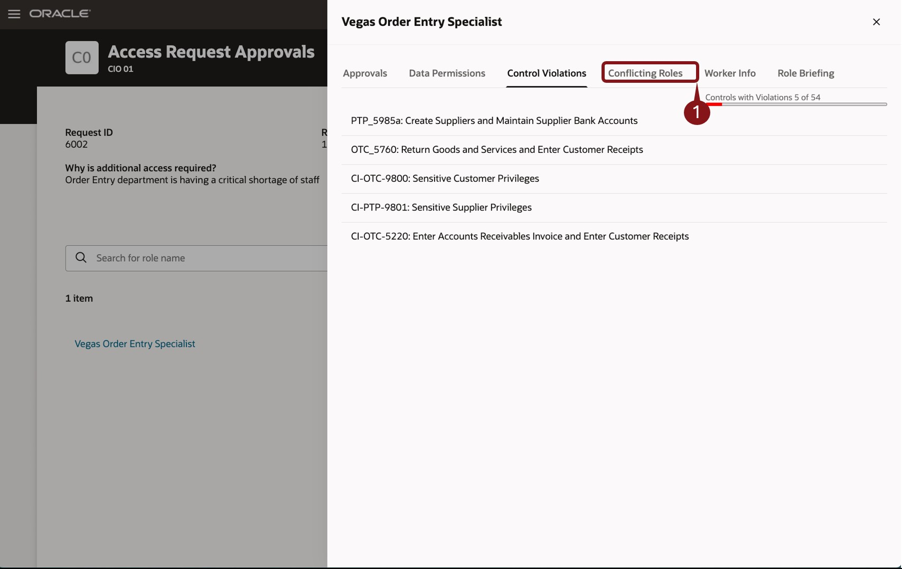

15. The role briefing takes the findings and using Generative AI to compose a complete summary of the findings.

  > (1) Click on **role briefing**.  

  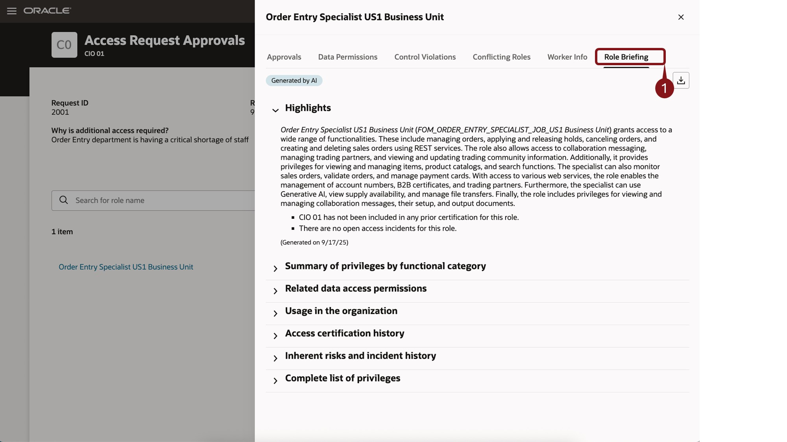

16. Expand the summary section to see how Gen AI helped deliver a narrative description of the violations.

  > (1) Click on the **down arrow**.  

  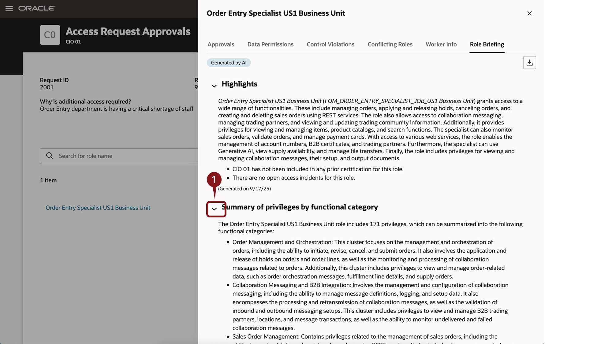

  > (1) Click on the **down arrow**.  

  > (1) Click on the **X Icon**.  

  

17. The final step is to decide if the request will be approved, rejected or assigned to another user for approval.

  > (1) Click on the **3 dots**.  

  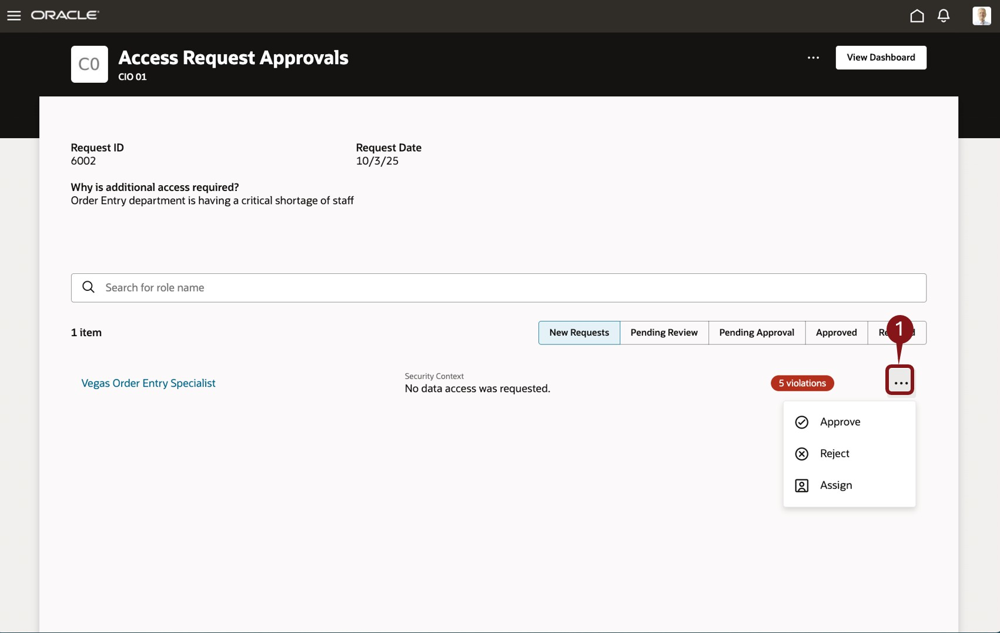

18. Adventure awaits, click on the image, show what you know and rise to the top of the leader board!!!

    

### Summary

Security Console is used to quickly manage user access to the entire Fusion applications suite.

### Learn More

* [Oracle Supply Chain & Manufacturing - Secure](https://docs.oracle.com/en/cloud/saas/supply-chain-and-manufacturing/24d/secure.html)
* [Oracle Human Resources - Secure](https://docs.oracle.com/en/cloud/saas/human-resources/24b/secure.html)
* [Oracle Documentation](http://docs.oracle.com)

**You have successfully completed the Activity!**

### Learn More

* [Oracle Supply Chain & Manufacturing - Secure](https://docs.oracle.com/en/cloud/saas/supply-chain-and-manufacturing/24d/secure.html)
* [Oracle Human Resources - Secure](https://docs.oracle.com/en/cloud/saas/human-resources/24b/secure.html)
* [Oracle Documentation](http://docs.oracle.com)

## Acknowledgements
* **Author** - Nate Weinsaft, Cloud Technologist, Advanced Technology Services
* **Contributors** -
* **Last Updated By/Date** - Nate Weinsaft, August 2025
