# Configure & Extend

<!-- rem ## Path 1: Configure -->
## **Path 1: Configure the Change Salary Experience**

### **Introduction**

Oracle offers hundreds of prebuilt pages, workflows and forms “out of the box” as part of the Oracle Fusion Cloud.  Many of our customers want to configure these pages and workflows to meet their specific business needs.  You can unify your experience in our applications by using Redwood.

Oracle Redwood is Oracle Fusion’s new design system that enhances the user experience through a visually stimulating, easy-to-use interface. By uniting customer-inspired design philosophies with industry-leading technology solutions, Oracle Redwood helps companies reduce costs, foster efficiency, revitalize the customer journey, and evolve continuously toward the future.

### **Objectives**

In this lab, you will use Redwood to quickly and efficiently improve the user experience in Oracle Fusion Cloud.

Estimated Time: 15 minutes

Do not forget to answer the Adventure Check Point questions at the end of the exercise!

### **Begin Exercise**

1. You will use Redwood, Oracle’s next-generation design system, and Visual Builder to quickly and efficiently update Change Salary Page for Non-HR managers.

    

2. You will first navigate to the Change Salary Page.

    > From the application home page, click on the **My Team** tab.

    .

    > Click on **Change Salary** under **Quick Actions**.

    

    > Click on the   **Icon** to remove the Direct Reports Filter because your user does not have any direct reports.  This action allows you to see other people.

    

3. Now you will enter the Change Salary Form so we can make the required changes using Visual Builder Studio.  Now you will select a person so you can enter the Change Salary form.

    > (1) Search for **Barrett Reed** in the search field.  

    > (2) Select **Barrett Reed** in the drop down.  

    

4.  You have entered the Change Salary Form.  Now you will quickly review the current configuration of the Change Salary Form.  You need to enter in some information to access the form

    > (1) When does the salary will start?: Type a **future date**  

    > (2) What is the action name?: Select **Change Salary**.  

    > (3) Why you are changing the salary?: Select **Career Progression**.  

    > (4) Click **Continue** once complete.

    

5. You will now create new rule that hides Annualized Full-Time Salary because it is repetitive.  You will also hide Compa-Raito since this is mainly used by HR.  You also want to show the action reason in this section of the Change Salary Form.

    

6. Now you will enter the Visual Builder Studio.

    > (1) Click on the   **Image** in the top right corner of the screen.   

    > (2) Then select **Edit Page in Visual Builder Studio** from the drop down options.

    

    The following image appears as Visual Builder Studio is loading.

    

7.  Welcome to Oracle Visual Builder Studio (VB Studio), a robust application development platform that helps your team effectively plan and manage your work throughout all stages of the app dev lifecycle: design, build, test, and deploy.

    Now we will use VB Studio to make the required changes to the Change Salary Form.

    > Click on **Configure Fields and Regions**.

    

8. First we will create a new form rule for change salary.

    > Click on the   **Icon** to add a new form rule.

    

    > (1) Label: Type **Change Salary Non-HR**.  

    > (2) Click on **Create**.

    

9.  Note that rules are based on a hierarchy.  The rules on top supersede the rules below .

    Now we will add the conditions that applies this rule to all non-HR personnel

    > Click on the **Edit button.**

    

    > (1) For **User Roles**, select **does not contain** from the drop down options.   

    > (2) For **User Roles**, type **Human Resource Manager** and select the first **Human Resource Manager**.

    

     **Note:** This configuration displays this version of the Change Salary Form to all people who are not assigned to the Human Resource Manager Role

10.  Now you want to add and hide fields.

     > Click on the **Drop Down**   Icon to the left of Salary to expand the salary section.

     

     > (1) Action Reason: select **Visible**      

     > (2) Annualized Full-Time Salary: select **Hidden**    

     > (3) Compa-Ratio: select **Hidden**

     

11. Now you will add a validation step for the Adjustment Percentage.  You do not want users to enter in a Salary Percentage Greater than 15%

    > Click on **Validate Field Values**

    

    > Click on **+ Validation**

    

    > (1) Label: type **Adjustment Percentage**.     

    > (2) Click **Create**.

    

12.  Now you will set the conditions for this rule so that the form will not accept any adjustment percentage greater than 15%.

     > Click on **Edit**.

     

     > Click on **+ Condition**.

     

     > (1) Type **Adjustment Percentage** in the box and select the 1st **# Adjustment Percentage** under **Salary Details**      

     > (2) Select **greater than**     

     > (3) Type **15**   

     

      The form will not allow any user to enter an adjustment percentage greater than 15%.

13.  Now you will configure the error message users will see if they enter in an Adjustment Percentage greater than 15%.

     > (1) Summary: **Adjustment Percentage is too high**.     

     > (2) Severity:  select **Error**.  

     > (3) Detail:  **The Adjustment Percentage must be lower than 15%** in **Detail**.  

     

14.  Well done. You have configured a new rule for Non-HR personnel.

Redwood offers a quick way to review your changes as they appear in the application.

> (1) Click on the **Preview**  icon in the top right of the screen.    

> (2) A new window will pop up.

15.  You have reentered the Change Salary Form.  Let’s review the changes.  You need to enter the required information before you can move to the next screen.

> (1) When does the salary will start?: Type a **future date**  

> (2) What is the action name?: Select **Change Salary**.  

> (3) Why you are changing the salary?: Select **Career Progression**.  

> (4) Click **Continue** once complete.

16.  Note that Annualized Full-Time Salary and Compa-Ratio are no longer visible while Action Reason is now Visible.

Now we will test the validation for the Adjustment Amount Percentage.

> Enter an Adjustment Percentage that is greater than 15%.

17.  The system gives us a warning that the increase in salary is outside the worker’s salary range.  You will ignore this warning.

> Click **Continue.**

18.  The system will not allow the user to continue because the Adjustment Percentage exceeds 15% due to the field validation we configured.

> Click on the **Home**   Icon.

19. Adventure awaits, click on the image, show what you know and rise to the top of the leader board!!!

    

<!-- rem ## Path 2: Extend -->

## **Path 2: Extend with new Supplier Screen**

### **Introduction**

Oracle Cloud Applications include an embedded tool called Visual Builder.  Visual Builder is the same tool that Oracle uses to develop application screens and it's available for you to create additional screens.  These screens can leverage both Oracle Cloud Application data and, if necessary, data from external systems.

### **Objectives**

In this lab, you will use Visual Builder to create an application screen.

Estimated Time: 15 minutes

Do not forget to answer the Adventure Check Point questions at the end of the exercise!

### **Begin Exercise**

1. In this lab, you will Use Visual Builder to build a new Supplier Screen.

    

2. We will now create a new application screen to allow editing of specific supplier information.  Oracle Cloud Applications include an embedded tool called Visual Builder.  Visual Builder is the same tool that Oracle uses to develop application screens and it's available for you to create additional screens.  These screens can leverage both Oracle Cloud Application data and, if necessary, data from external systems.

    > (1) **Click** on the **‘Configuration’** tab.  
    > (2) **Click** on the **‘Visual Builder’** tile  

    

3. We have pre-defined a Project.  A project collects all the people, tools, and processes you need to complete a unit of work.  You can use a project to host source code files, track issues, collaborate on code, and build and deploy your applications. If your team is extending Oracle Cloud Applications, you’ll probably want to set things up so that you have a single project dedicated to work with a single repository for each Application.

    > **Click** on the **‘CloudAdventure’** project

    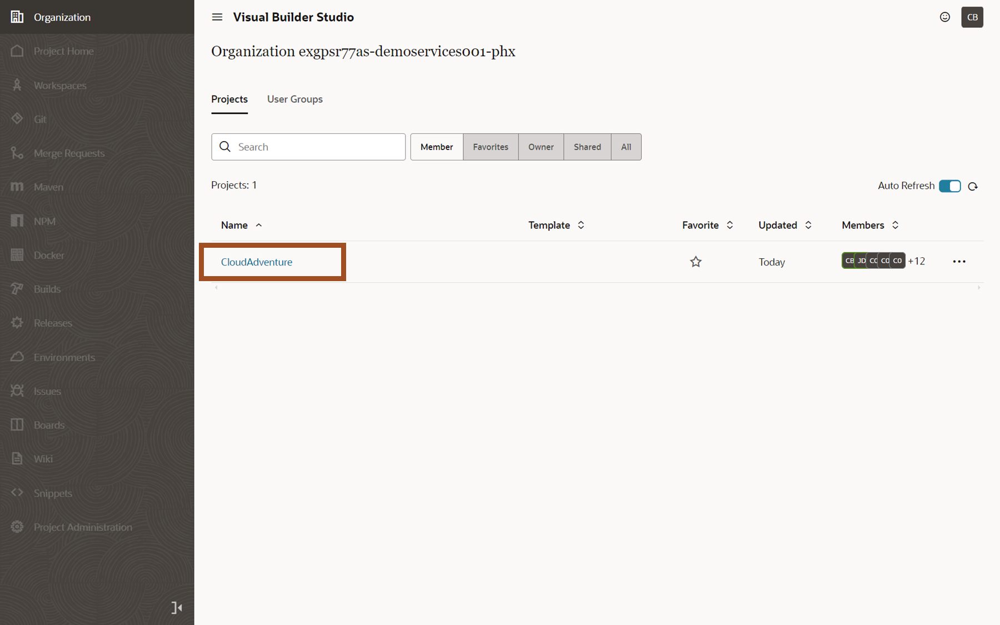

4. Workspaces allow you to segregate units of work within a Project.

    > **Click** on the **‘Manage Workspaces’** link.  If your Project has no pre-existing workspaces, you'll be presented with a **‘Go to Workspaces’** button to click instead.  The following screenshots show both potential screens.

    
    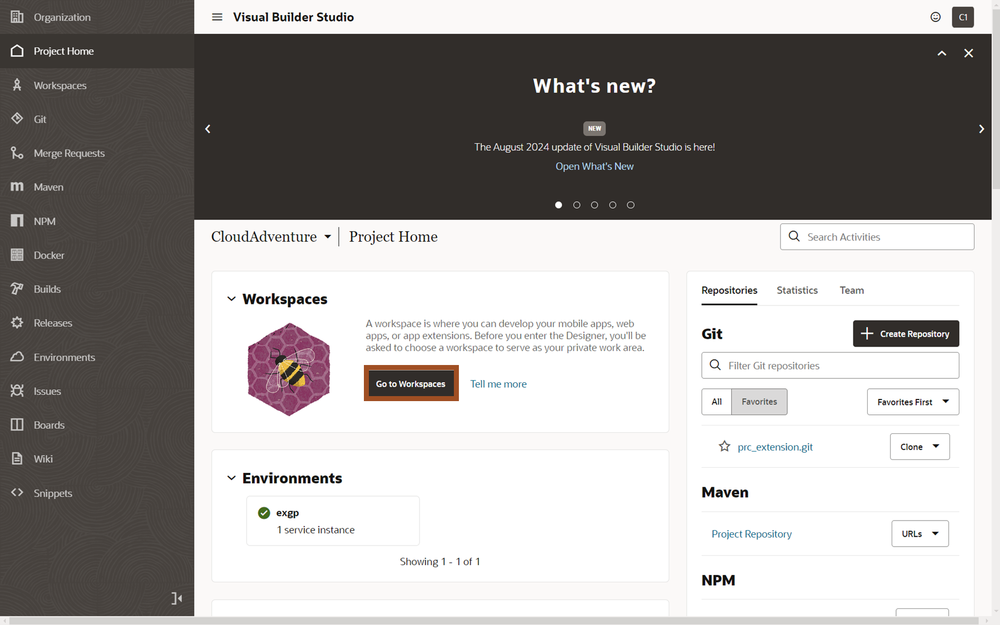

5. We'll create a new workspace for our simplified supplier screen

    > (1) **Click** on the **‘New’** 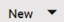 dropdown  
    > (2) **Select** **‘New Application Extension’** from the resulting dropdown

    

6. We'll name our new Extension.

    > (1) **Enter** **‘QuickSupplier#’** in the "'Extension Name'" field. 
    > (2) **Click** the **‘Create’** button

    

7. We're now at the Visual Builder homepage.  We can configure existing screens, create new ones, or build whole new applications.  We can also leverage REST APIs to access Fusion SaaS Data.  Supplier data from Oracle ERP/SCM Cloud, so we'll leverage the embedded integration via REST APIs.

    > (1) **Click** the **‘Services’**  icon on the left menu.

    

8. We can add services from Oracle Cloud Applications or other accessible data sources.

    > (1) **Click** on the **‘+ Service Connection’** button.

    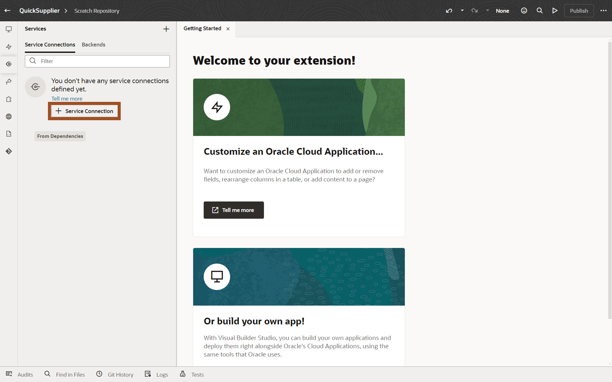

9. There are multiple ways to reference a service.  We'll use the included catalog of Oracle Cloud Application services.

    > **Click** on the **‘Select from Catalog’** tile.

    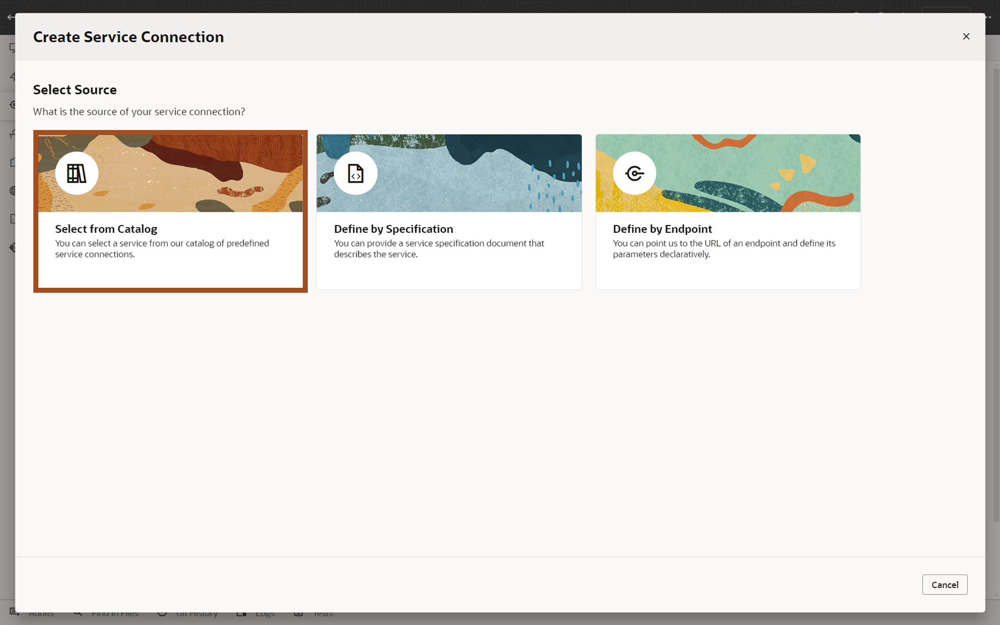

10. Services are available for functionality across the Oracle Cloud Applications.

    > **Click** on the **‘‘Enterprise Resource Planning and Supply Chain’** tile.

    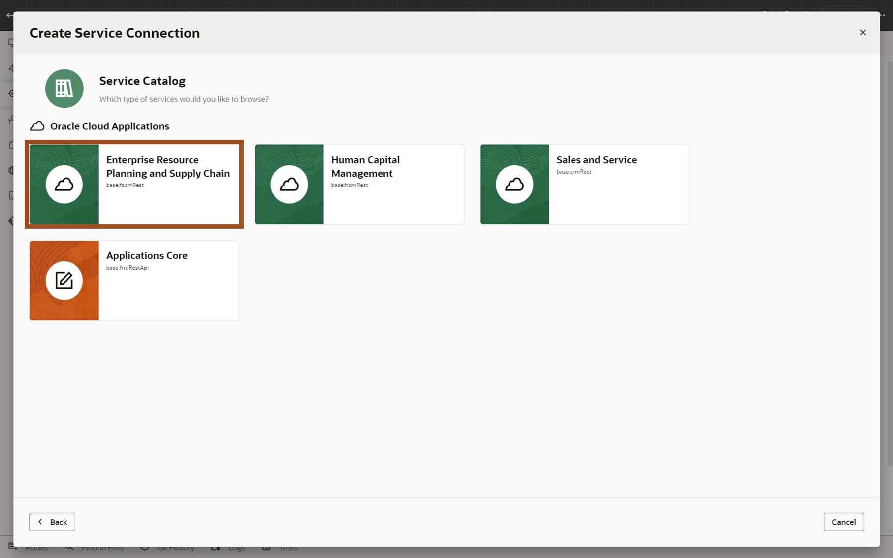

11. We'll use the Supplier Service from the ERP/SCM Catalog.

    > (1) **Enter** ‘Suppliers’ in the 'Supplier Name' field.  
    > (2) **Enter** ‘Suppliers’ in the ‘Filter Objects/Endpoints’ field.  
    > (3) **Click** the ‘Checkbox’ next to ‘Suppliers’.  
    > (4) **Click** the ‘Create’ button.  

    

12. The resulting screen shows additional configuration options for our supplier service, but we'll just use the default settings.  We can also see the Endpoints details related to our Suppliers service.

    > **Click** on the **‘Endpoints’** tab as shown.

    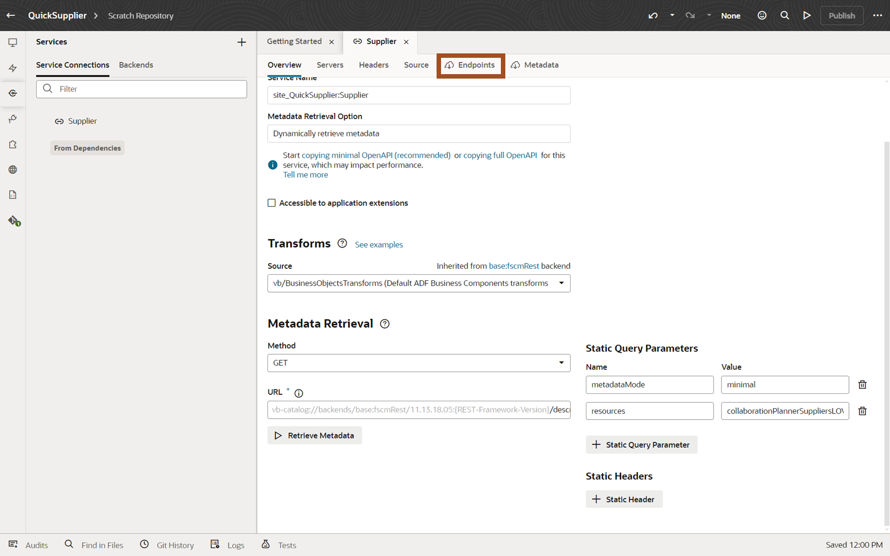

13. Here we see the various operations and data objects available.  This includes Get, Post and Patch operations allowing for query, create and update actions  Scrolling this window we can see that other related information is also available, including addresses, attachments, contacts, descriptive flexfields and more. Now we want to start creating our new screen.

    > **Click** on the **‘App UIs’**  icon in the left toolbar

    

14. You can now see the App UI panel on the left hand side.  This allows you to create you new page.

    > **Click** on the **‘+ App UI’** button.

    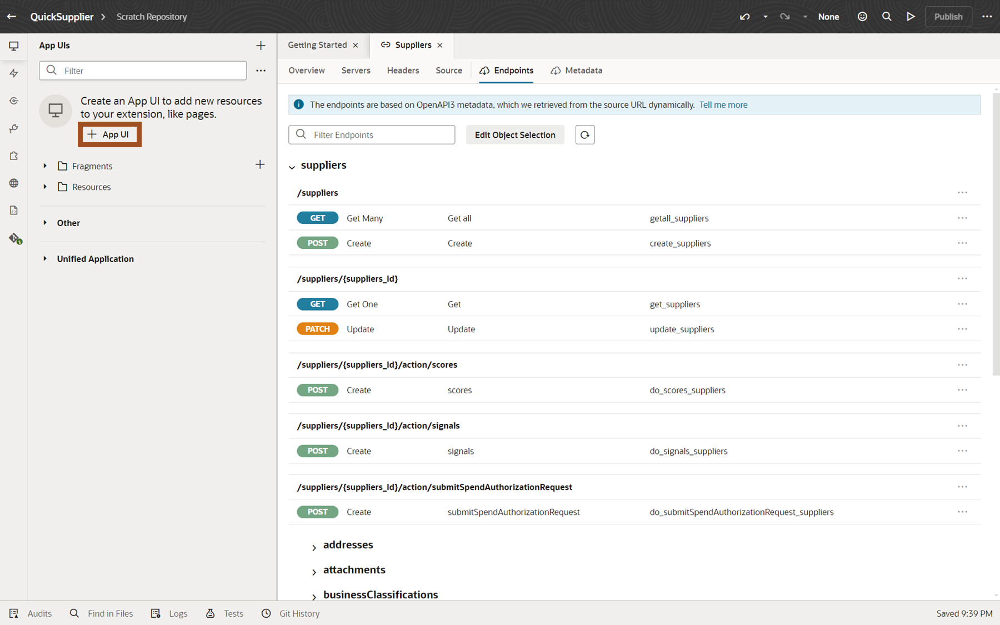

15. You can name your App UI.

    > (1) **Enter** **‘QuickSupplierUI’** in the "'App UI Name'" field. 
    > (2) **Click** the **‘Create’** button.

    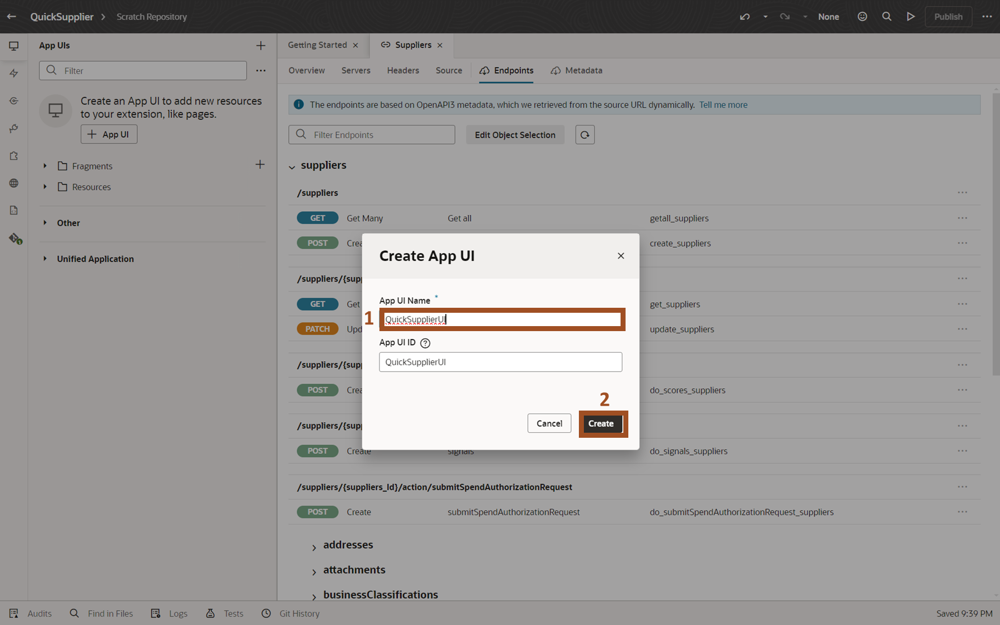

16. Visual Builder has automatically created a default UI leveraging the Oracle provided Redwood template.  Redwood is Oracle's design methodology and pre-defined templates, and design patterns are included in Visual Builder to allow you to create applications that look and function just like Oracle delivered applications.

    > **Double-Click** the **‘main-start’** object.

    

17. Here we see our blank template and a list of some of the provided Redwood design components.  We want to start by adding some components to the screen to hold our data.

    > (1) Confirm you’re in the **Components** tab.  
    > (2) Type **Panel** in the **‘filter’** field.  
    > (3) Drag **Panel** to the dashed rectangle object and drop it in the blue columns that appear (4) shown.

    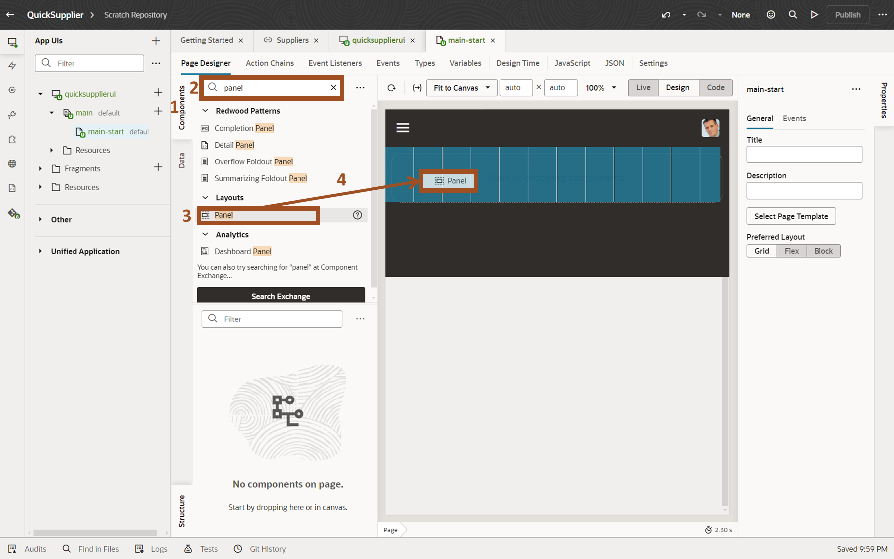

18. Next, you'll add a component to the panel.  The first component we add with be an Input Text field to allow for searching.

    > (1) Confirm you’re in the **Components** tab.  
    > (2) Type **text** in the **‘filter’** field.  
    > (3) Drag **Input Text**  and drop in the blue section that appears when you drop into the Panel (4).

    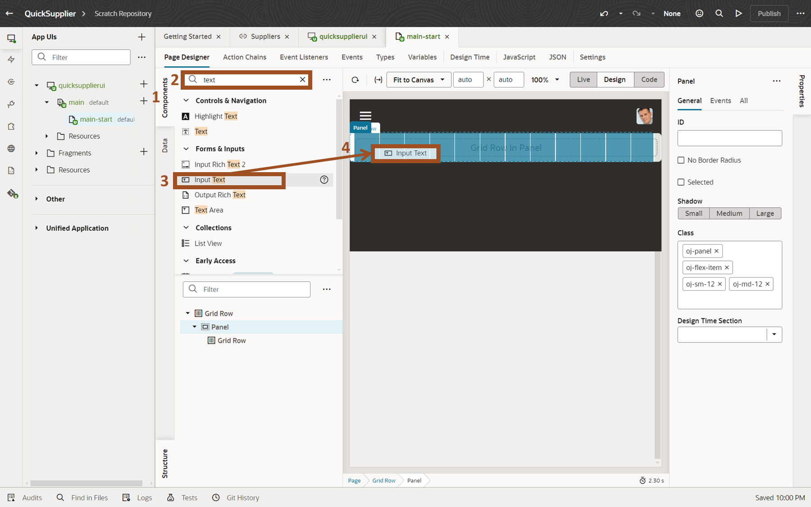

19. In the next 2 steps, you'll add label to your search field and create a page variable.  You can start with the label.

    > (1) Type **Enter Supplier Name Search** in the **Label Hint** field on the **General** tab of the **Properties** panel on the right.  
    > (2) Click the **Data** tab in the **Properties** panel.  

    

20. Create a page variable to save the contents of your new Input Text field

    > (1) Click the (x) icon on the top right of the Value field.  If the (x) is not showing, move your cursor to the Value field and it will appear.  
    > (2) The **Variables** pop-up window will appear.  Click **Create** next to the **Page** option.

    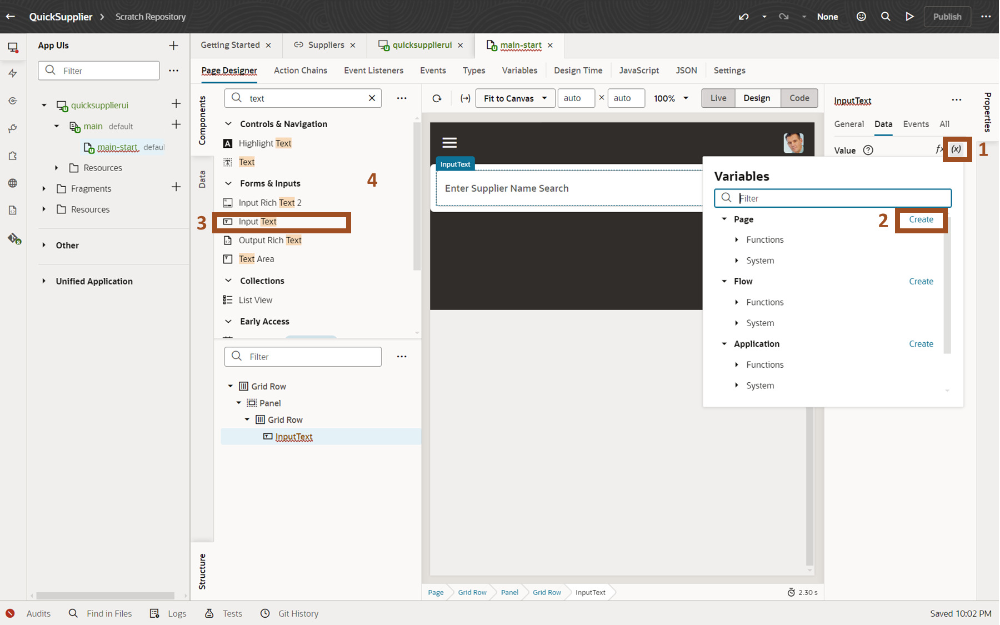

21. Name your page variable.

    > (1) Type **SupplierSearchString** in the ID Field. 
    > (2) Click the **Create** button.

    

22. You’ll now add a Table component to the Panel.

    > (1) Enter  **Table** in the **‘filter’** field.  
    > (2) Drag **Table** to the white space below your text field.  Be sure that it’s in the white space just below the text field and not in the brown section further down.

    

23. You now have a table to hold the data. Next, you’ll add the Supplier data from our REST API. You can use the Quick Start feature to help with this task.

    > (1) Click in the newly created **Table** region. 
    > (2) You should now see the Table Properties region appear on the right.

    

24. The Quick Start features simply common tasks.  You can use the Add Data Quick Start feature to show data from the Supplier REST API.

    > (1) Click the **'Quick Start'** table in the Table Properties area.  
    > (2) Click the **'Add Data'** tile.

    

25. You can see the various Supplier related data available from the Supplier REST API.  You’ll just use the Suppliers data for this scenario.

    > (1)  Click **'Suppliers'** to expand the Suppliers region.  
    > (2)  Click **'Suppliers'** tile.  
    > (3) Click the **Next** button.

    

26. You’ll select a few fields to display on the new screen.  This screen will be used to search for Suppliers and allow for quick update of a few pieces of Supplier Data.

    > (1)  Click **'Checkbox'** next to the following fields.  You’ll need to scroll the Endpoint Structure to see the Supplier field:  
           - Alias  
           - AlternateName 
           - Supplier 
    > (2) Confirm the list of selected fields.  
    > (3) Click the **Next** button.

    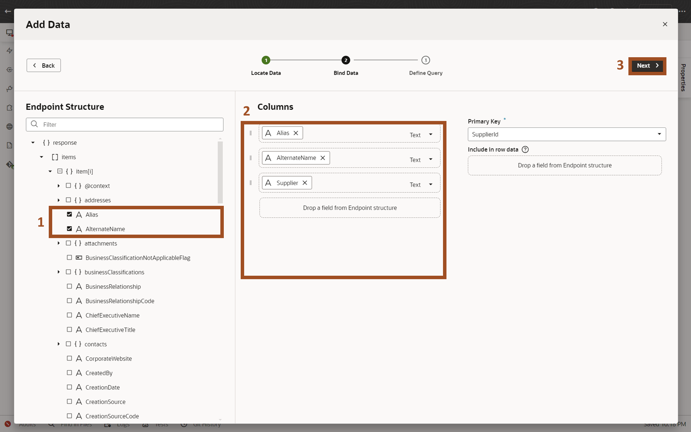

27. Here you can configure the search field.

    > (1) Click on the **filterCriterion** field in the Target section of the screen.  This will cause a **Click to add condition** option to appear at the bottom of the screen.  
    > (2) Click the **Click to add condition** link.

    

28. The next 3 steps will configure the Condition for the filterCriterion.

    > (1) Type **Supplier** in the first field and pick **Supplier** from the resulting pop-up list (2).

    

29. Next you'll select the Operator

    > (1) Click in the **Operator** field and select **contains ($co)** from the resulting pop-up list (2).

    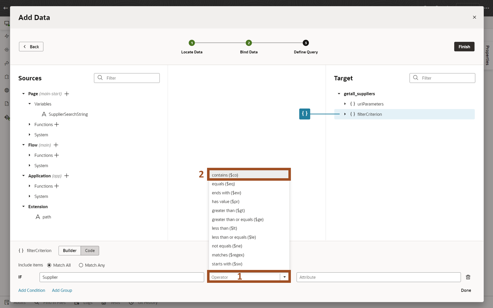

30. And now you'll reference the page variable that we created earlier.

    > (1) Click in the **Attribute** field. 
    > (2) Select **$variables.SupplierSearchString** from the resulting pop-up list.  
    > (3) Click in the **Finish** button.

    

31. Notice that the screen auto-queried Supplier Information.  You can easily move between Design, Live and Code views of our application.  But next, you want the ability to edit data.  So, you’ll use the Quick Start again to add an edit page.

    > (1) Confirm that you're on the **Quick Start** tab.  
    > (2) Click the **Add Edit Page** tile.

    

32. You can select the same or different fields for out Edit Page.  Since the request was to create a simple page, you'll just add a few fields.

     > (1)  Click **'Checkbox'** next to the following fields.  Note that you will likely need to scroll the list of fields:  

      - Supplier 
      - SupplierNumber 
      - TaxpayerId 

    > (2)  Confirm the list of selected fields.  
    > (3) Click the **Finish** button.

    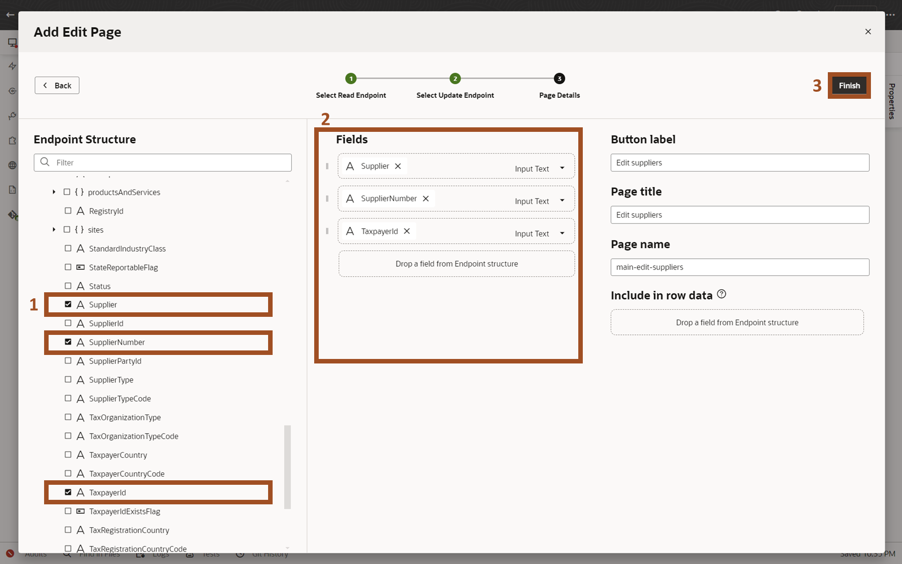

33. You're ready to try your new page.

    > Click the **Preview**  icon on the top right of the screen.

    

34. A new browser tab is launched showing our completed application.  You now have a fully functioning screen that supports query and update capabilities.

    > (1) Enter your search criteria by entering a string in the **Enter Supplier Name Search** field.  You can use **Corp** like shown in the screenshot or enter your **user number (##)** to find the Supplier with your number included as part of the name.   
    > (2) Select a Supplier record by clicking on it (the row will highlight)  
    > (2) Click the **Edit Supplier** button.

    

35. You Edit Supplier screen allows you to update the information and save. The new screen leverages the security and business rules of the application via the standard REST API.

    > (1) Note that the Supplier Number field is non-enterable.  That field is non-updateable and that condition automatically carries through to our new screen.   
    > (2) The Taxpayer ID is enterable, but we’ll end here without doing the update.

    

36. Adventure awaits, click on the image and show what you know, and rise to the top of the leader board!!!

    

### Summary

The two tasks of this adventure introduced you to a few of the capabilities that customers can leverage to configure and extend Oracle Fusion Cloud applications.  These features allow you to fine tune your Oracle Fusion Cloud Applications for peak performance, tailor business processes to your requirements, and fast, efficient usage. You learned how to extend the applications using Oracle Visual Builder Studio to create new screens that can leverage both Oracle and non-Oracle data. 

### Learn More

- [Extending Oracle Cloud Applications with Visual Builder Studio](https://docs.oracle.com/en/cloud/paas/visual-builder/visualbuilder-building-appui)
- [Overview of Guided Journeys](https://docs.oracle.com/en/cloud/saas/human-resources/24c/faijh/overview-of-guided-journeys.html)
- [Configure User Defined Content Task Type for a Journey](https://docs.oracle.com/en/cloud/saas/human-resources/24c/faijh/configure-user-defined-content-task-type-for-a-journey.html)
- [Oracle Documentation](http://docs.oracle.com)

## Acknowledgements
* **Author** - Charlie Moff, Distinguished Cloud Technologist; Casey Doody, Cloud Technologist; Sajid Saleem, Master Principal Cloud Technologist
* **Contributors** - The AI Adventure Team (Gus, Kris, Sajid, Casey, Stephen, Jamil, Sohel, Xavier, Nate, Charlie)
* **Last Updated By/Date** - Sajid Saleem, November 2025