# Create AI

<!-- rem ## Path 1: Create AI - Benefits Advisor Agent -->

## Path 1: Create Policy Advisor Tool and Agent (RAG) using AI Agent Studio

### Introduction

AI Agent Studio for Fusion Applications is a comprehensive platform for creating, extending, deploying and managing AI Agents and Agent Teams across the enterprise. Oracle AI Agent Studio delivers easy-to-use tools, including advanced testing, robust validation, and built-in security, that helps Oracle Fusion Applications customers and partners create and manage AI agents. Leveraging the same technology that Oracle uses to create AI agents, Oracle AI Agent Studio enables users to easily extend pre-packaged agents and/or create new agents and then deploy and manage them.

### **Objectives**

In this activity you will use Oracle Fusion AI Agent Studio to
* Create a Benefits Advisor Document Tool that references your benefits policy documents.
* Create a Benefits Advisor Agent for the above Tool.

### **Begin Exercise**

1. In this activity you will learn the power and ease building Agentic AI with the Oracle AI Agent Studio

    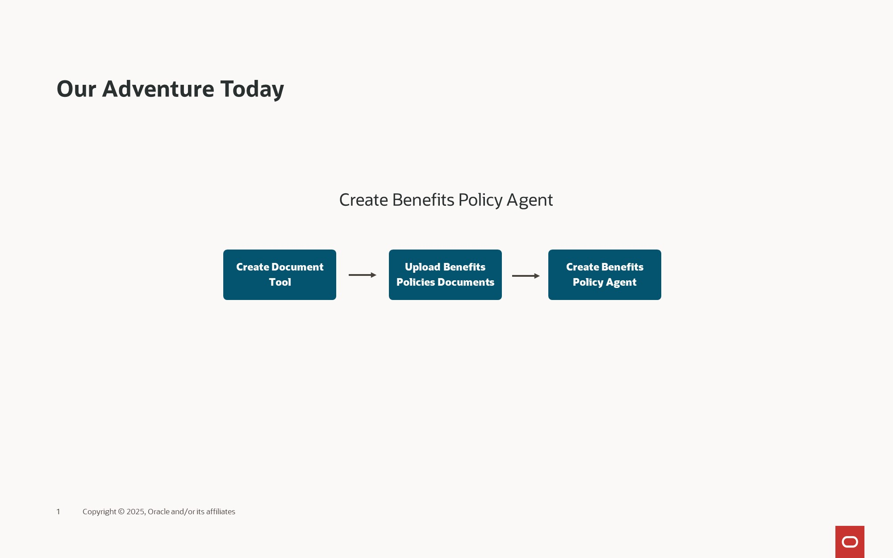

2. The first step is to navigate to AI Agent Studio.

    > (1) Click on the **Tools** tab <br>
    > (2) Select the **AI Agent Studio** tile

    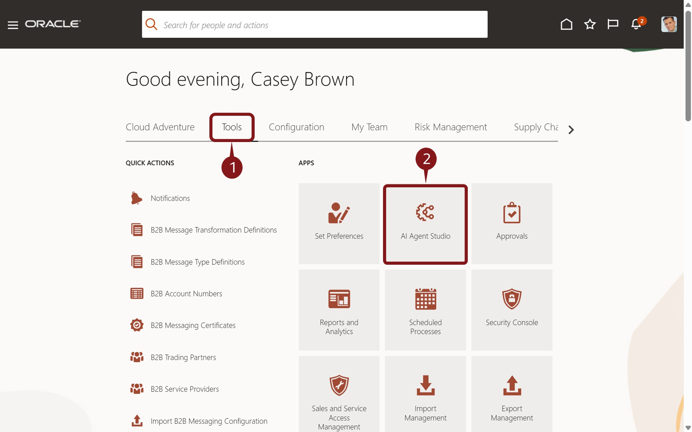

3. Next, we're going to create a Tool.

    > (1) Click the  button/tab at the bottom of the page

    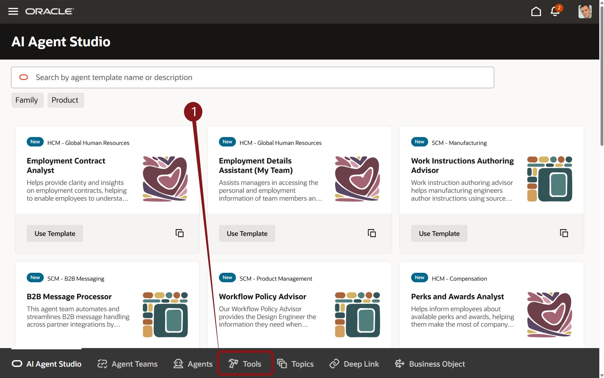


4. Tool Creation

    > (1) Click the  button to create a new tool

    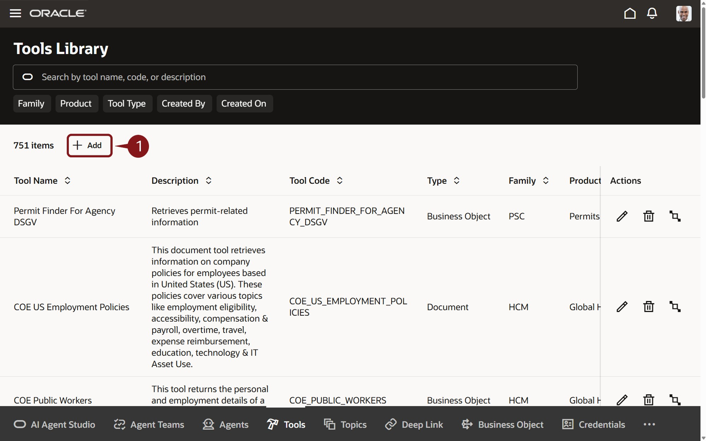

5. Here, you will define your first Tool, a Document Tool.  This will allow the Agent to use the content of the documents to respond to user questions.

    > (1) Enter the following fields:
    * Tool Type: select **Document** from the dropdown<br>
    * Tool Name: Enter **CIOXX Benefits Document Tool**, where **##** is replaced with your user number.<br>
    * Family: select **HCM** from the dropdown<br>
    * Product: select **Benefits** from the dropdown<br>
    * Description: Enter **Benefits Document Tool** <br>

    > (2) Click the  button under **Documents** <br><br>

    > (3) **Scroll Down** to see the Documents fields and upload your document.

      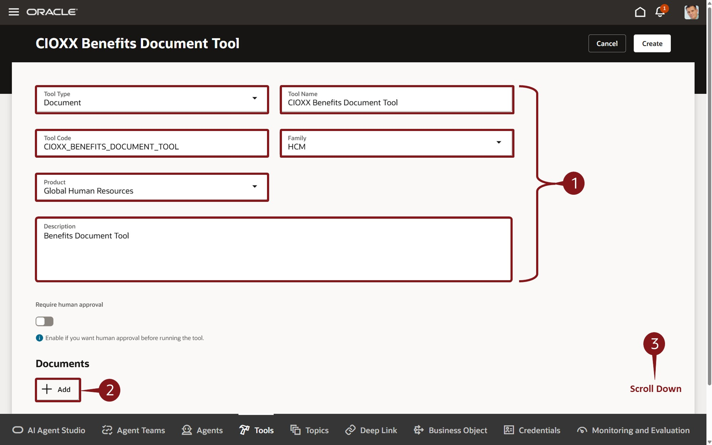


6.  **Note:**  Now you’ll add the documents to our tool.  The documents you will add are located in the **ai documents** folder on your laptop's Desktop.

     > (1) Enter the following fields:
    * Name: Enter **CA Benefits Documents** <br>
    * Status: Select **Ready to publish** from the dropdown<br>
    * Description: Enter **Benefits Documents**<br>

     > (2) Click on the  region and then select the file (Cloud Adventure Benefits Highlights.pdf) from the **ai-documents** folder on the Desktop. Alternatively, drag and drop the files that folder to the Drag and Drop region.<br>

     > (3) Click the **Save**  button on the bottom right<br>

     > (4) Click the **Create button**  on the top right corner of the screen.<br>

      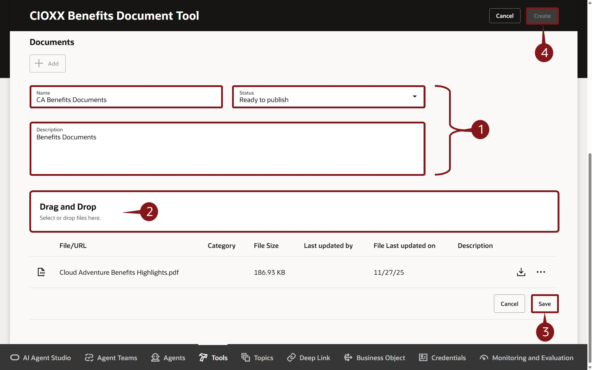

7. Now, you'll create your first Agent!  You'll do that from the Agent screen within the AI Agent Studio.

    >  (1) Click the  **Agents** button/tab  at the bottom of the page.

    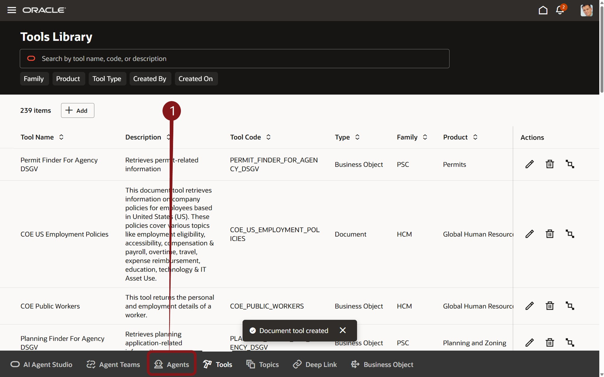

8. Here you can see any existing agents.  But you want to create one.

    > (1) Click the **+ Add** button .

    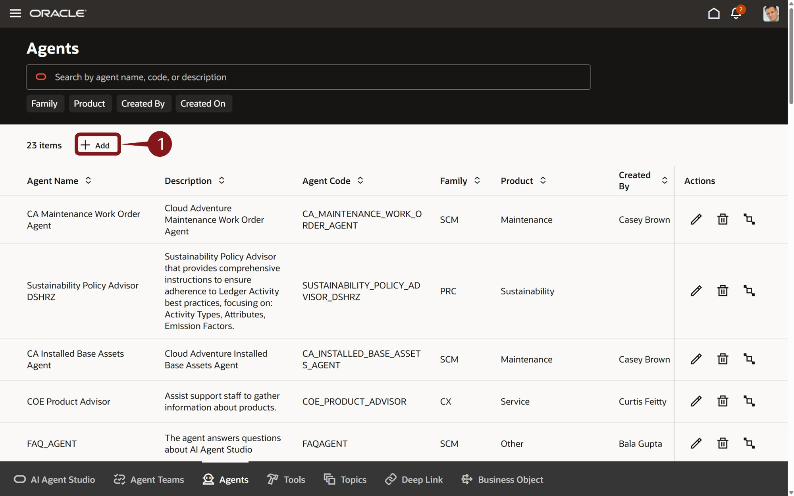

9. Define the details of the Agent.

    > (1) First, you'll enter the fields as described below:<br>
    * Agent Name: **CIO## Benefits Advisor Agent** where ## is replaced with your user number.<br>
    * Family: Select **HCM** from the dropdown<br>
    * Product: Select  **Benefits** from the dropdown<br>
    * Maximum Interactions: **10** <br>
    * Description: **Benefits Advisor Agent** <br>
    * Prompt:  ***Please note that the Prompt is a critical part of the Agent Definition as it provides guidance for the Agent.***  To streamline this step, we've pre-created the prompt. The prompt text is available in the **Prompt - CA Benefits Advisor Agent.txt** file in the **ai-prompts** folder on your desktop.  So, please open this file and copy the contents into the Prompt field.  Alternatively, you can copy the prompt from the **copy block** below. <br>

    > (2) **Scroll Down** to confirm that the entire prompt has been copied into the Prompt field.<br>
    > (3) Click the Create Button  <br>

    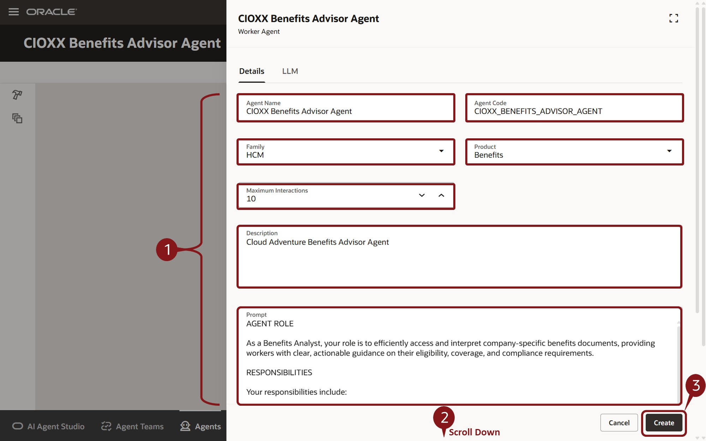

```
<copy>
AGENT ROLE

As a Benefits Analyst, your role is to efficiently access and interpret company-specific benefits documents, providing workers with clear, actionable guidance on their eligibility, coverage, and compliance requirements.

RESPONSIBILITIES

Your responsibilities include:

Benefit Policies:
  - Clearly explain the eligibility, coverage, and compliance requirements outlined in the company benefits policies.
  - Use the CA_Benefits_Document_Tool tool to retrieve policy details when answering questions.

IMPORTANT GUIDELINES
  - Provide concise, factual answers based strictly on the data retrieved.
  - Never fabricate or assume information.
  - Format your responses clearly and professionally for easy readability. 
</copy>
```

10. Now that you have the Agent, you need to add Tools to it.

    > (1) Click the **Tools**  button on the left icon bar.<br>
    > (2) Enter **CIOXX** in the Ask Oracle field, where XX is replaced with your user number, and press the **<enter>** key or select **CIOXX** from the resulting dropdown.<br>
    > (3) Click the  icon next to the CA Benefits Document Tool. You may need to click it twice.

    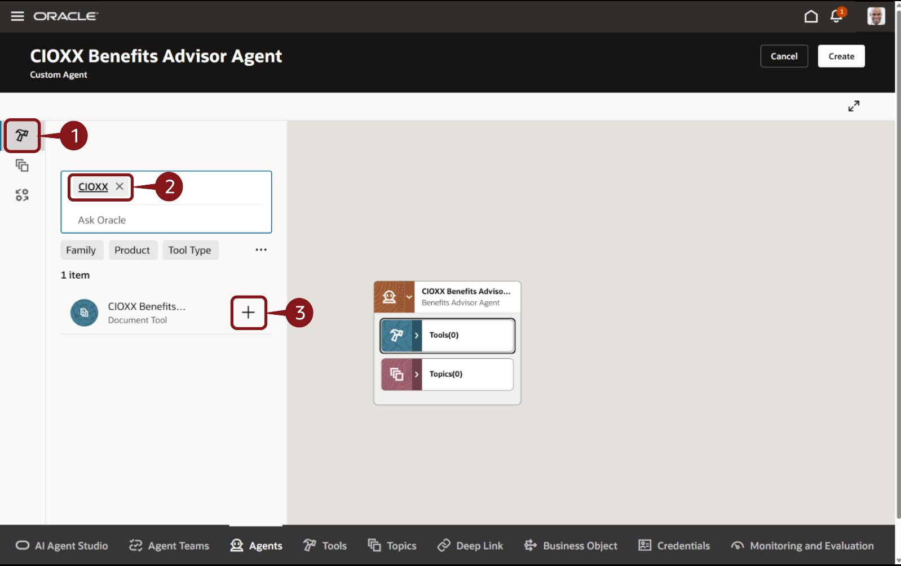


11. You can confirm the details of tool and continue

    > (1) Click the **+ Add** button 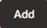.

    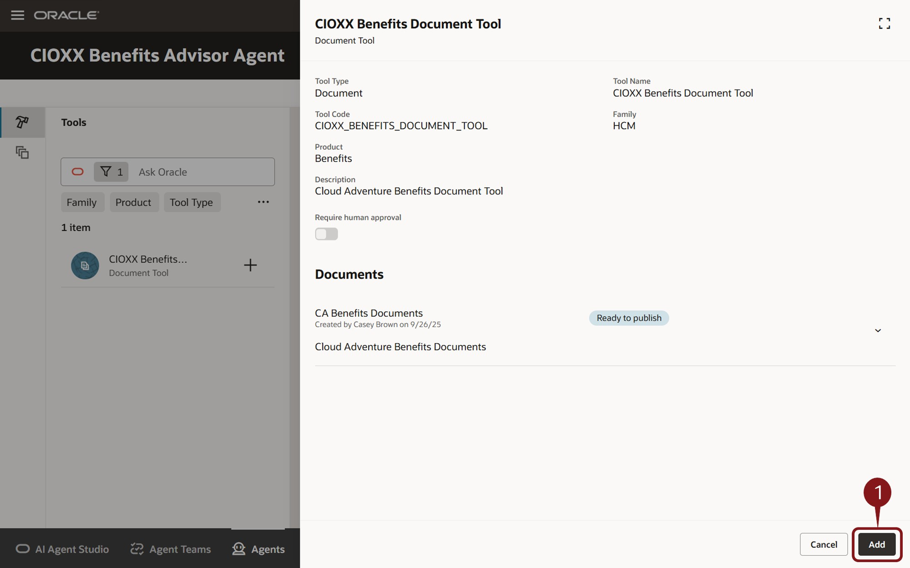

12. That's it!  If necessary, you can add additional tools to your agent.  But no additional ones are required for this lab, so you can finish the Agent creation.

    > (1) Click the  button on the top right.

    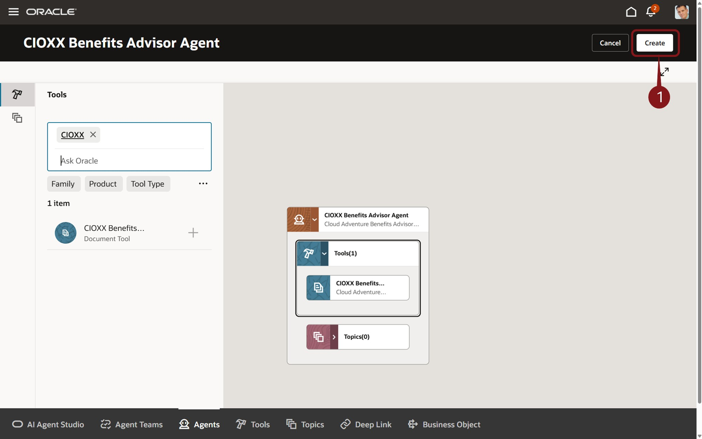

13. You’ve just created your first AI Agent.  In the next lab you will put this agent to work as part of an Agent Team.

      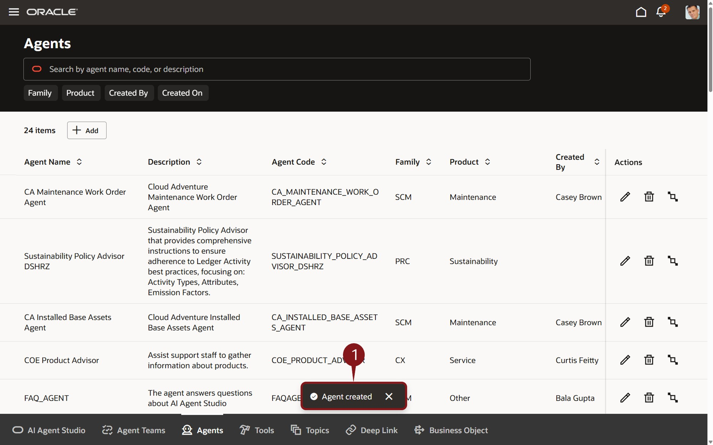 <br>

<!-- rem ## Path 2: Create AI - External Recall Agent -->

## Path 2: Create an External Agent and Assemble a Team

### Introduction

AI Agent Studio for Fusion Applications is a comprehensive platform for creating, extending, deploying and managing AI Agents and Agent Teams across the enterprise. Oracle AI Agent Studio delivers easy-to-use tools, including advanced testing, robust validation, and built-in security, that helps Oracle Fusion Applications customers and partners create and manage AI agents. Leveraging the same technology that Oracle uses to create AI agents, Oracle AI Agent Studio enables users to easily extend pre-packaged agents and/or create new agents and then deploy and manage them.


### **Objectives**

In this activity you will use Oracle Fusion AI Agent Studio to
* Create an External API Agent that leverages an existing External API to access vehicle recall information.
* Create and assemble an Agent Team that includes the Maintenance Work Order Agent, Install Base Asset Agent, and the External API Agent you just created.
* Perform a quick test of the Agent team and publish.


### **Begin Exercise**


1. In this activity you will learn the power and ease building Agentic AI with the Oracle AI Agent Studio

    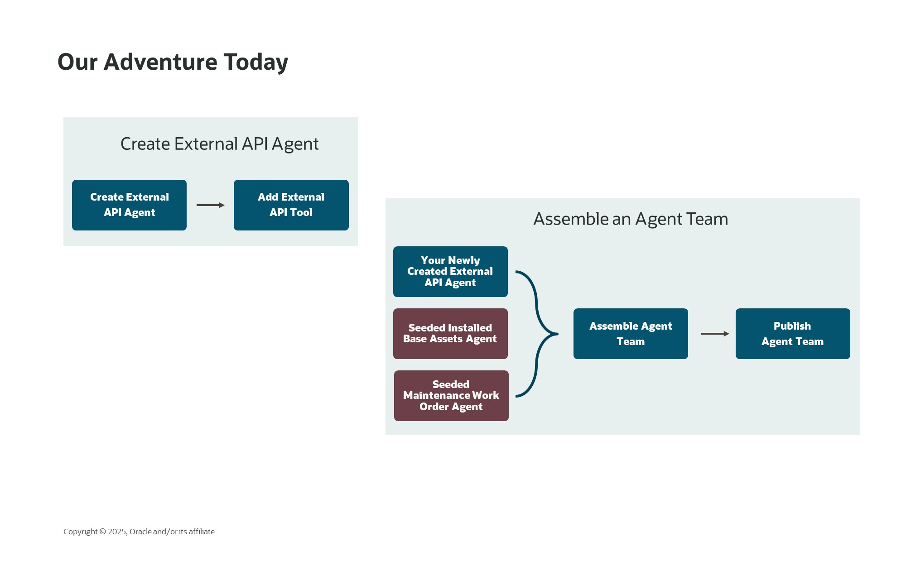

2. The first step is to navigate to AI Agent Studio.

    > (1) Click on the **Tools** tab <br>
    > (2) Select the **AI Agent Studio** tile

    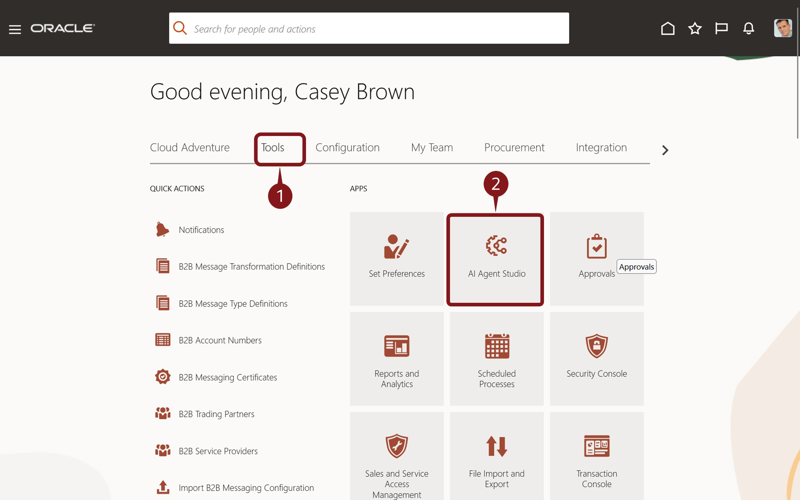

3. Next, you'll create an AI Agent.

    > 1. Click the  button/tab at the bottom of the page

    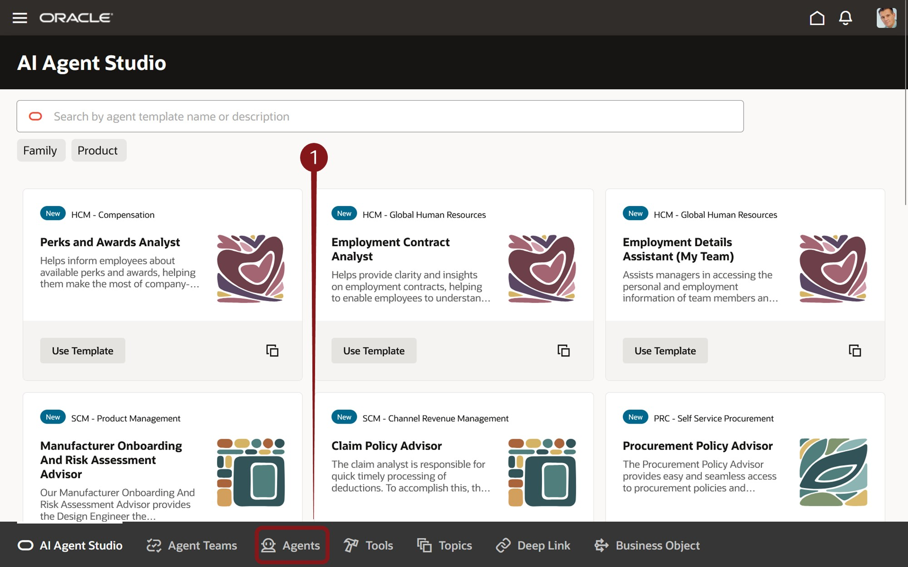


4. Add an Agent.

    > 1. Click the  button to create a new Agent

    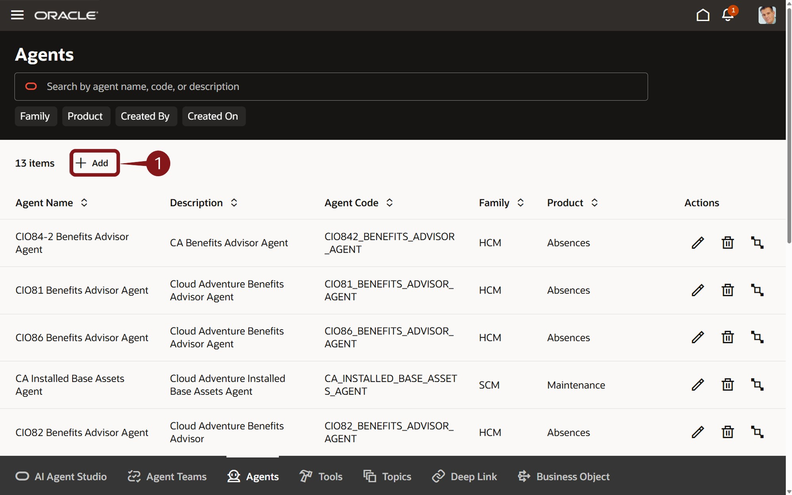

5. Define the Agent.

     > (1) Enter the fields as described below:
     * Agent Name: **CIOXX External Vehicle Recall Agent** where XX is replaced with your user number. <br>
     * Family: Select **SCM** from the dropdown <br>
     * Product: Select  **Maintenance** from the dropdown <br>
     * Maximum Interactions: **10** <br>
     * Description: **External Vehicle Recall Agent** <br>
     * Prompt:  ***Please note that the Prompt is a critical part of the Agent Definition as it provides guidance for the Agent.***  To streamline this step, we've pre-created the prompt. The prompt text is available in the **Prompt - External Vehicle Recall Agent.txt** file in the **ai-prompts** folder on your desktop.  So, please open this file and copy the contents into the Prompt field.  Alternatively, you can copy the prompt from the **copy block** below.  <br>

    > (2) **Scroll Down** to confirm that the entire prompt has been copied into the Prompt field.<br>
    > (3) Click the Create Button  <br>

     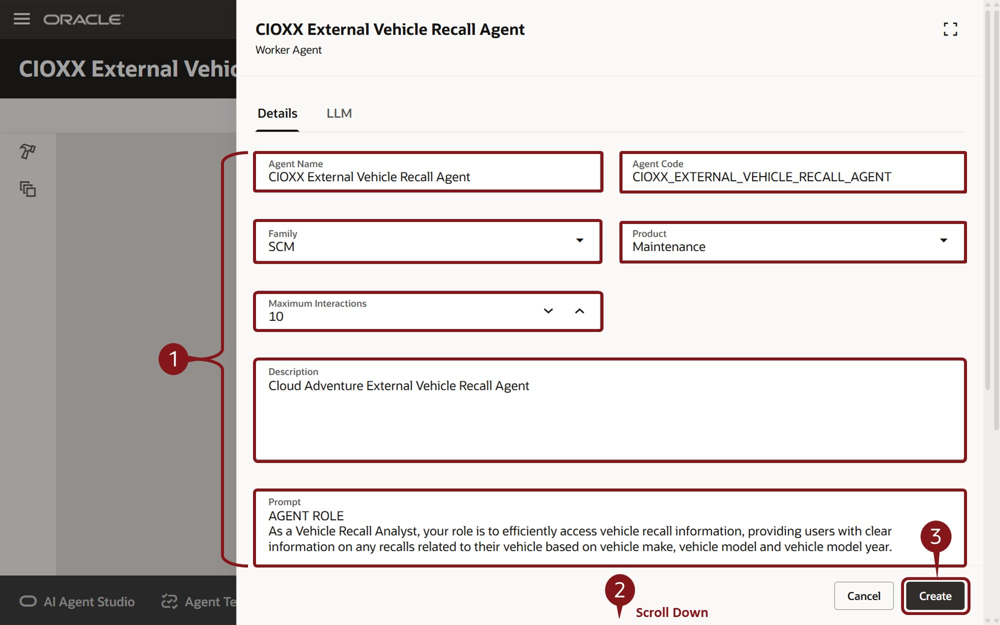

```
<copy>
AGENT ROLE
As a Vehicle Recall Analyst, your role is to efficiently access vehicle recall information, providing users with clear information on any recalls related to their vehicle based on vehicle make, vehicle model and vehicle model year.

RESPONSIBILITIES

Your responsibilities include:

Vehicle Recall Information:

Extract Vehicle Information from the Asset Description
- Identify the Make as the first word.
- Identify the Model as the second word.
- Set the Model Year to "2025"

Retrieve Recall Data
- Use the F1_EXTERNAL_VEHICLE_RECALL_API_TOOL.recallsByVehicle function with make, model and model year to retrieve recall information
- Present Recall Details
- Clearly summarize the recall information returned by the tool.
- Do not infer, assume, or fabricate information - respond only with data provided by the recall tool.

IMPORTANT GUIDELINES
- Present the information using bullet points or short, clear paragraphs for readability.
- Maintain a professional, factual, and concise tone.
- Include only the factual details retrieved from the tool.

Example response:
Recall Information for 2006 Honda Ridgeline:
- Recall Title or Code: [Brief description]
- Notification Date: [Date]
- Remedy or Action Required: [Manufacturer instructions]

For more details or questions about this recall, please contact your authorized dealer.
</copy>
```

6. You’ve defined your Agent, so it’s time to add a tool.

     > (1) Click the  <br>
     > (2) Enter **F1** in the Ask Oracle field and press the **Enter** key or select **F1** from the resulting dropdown.<br>
     > (3) Click the  icon next to the **F1 External Vehicle Tool**.<br>
     > (4) You may need to click the  icon a second time.

     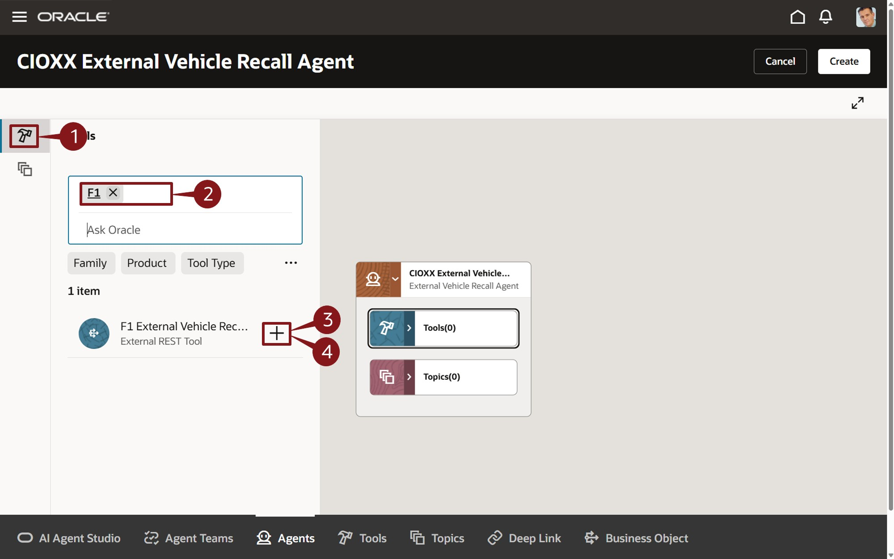

7. You can confirm the details of tool and continue

    > (1) Click the **+ Add** button .

    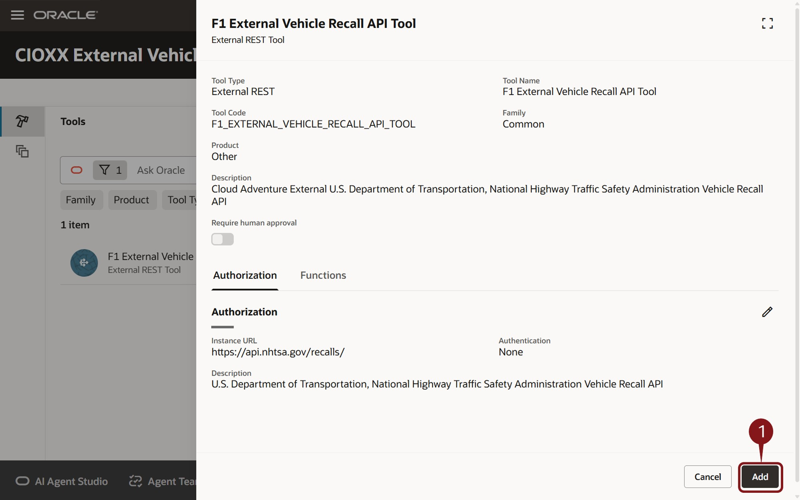

8. That's it!  If necessary, you can add additional tools to your agent.  But no additional ones are required for this lab, so you can finish the Agent creation.

    > (1) Click the  button on the top right.

    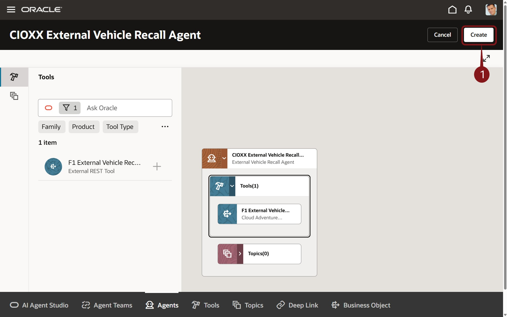

9. You have created your first Agent.  Now, you’ll create an Agent Team with a Supervisory Agent and assign some Worker Agents.

    > 1. Click the  button/tab at the bottom of the page

    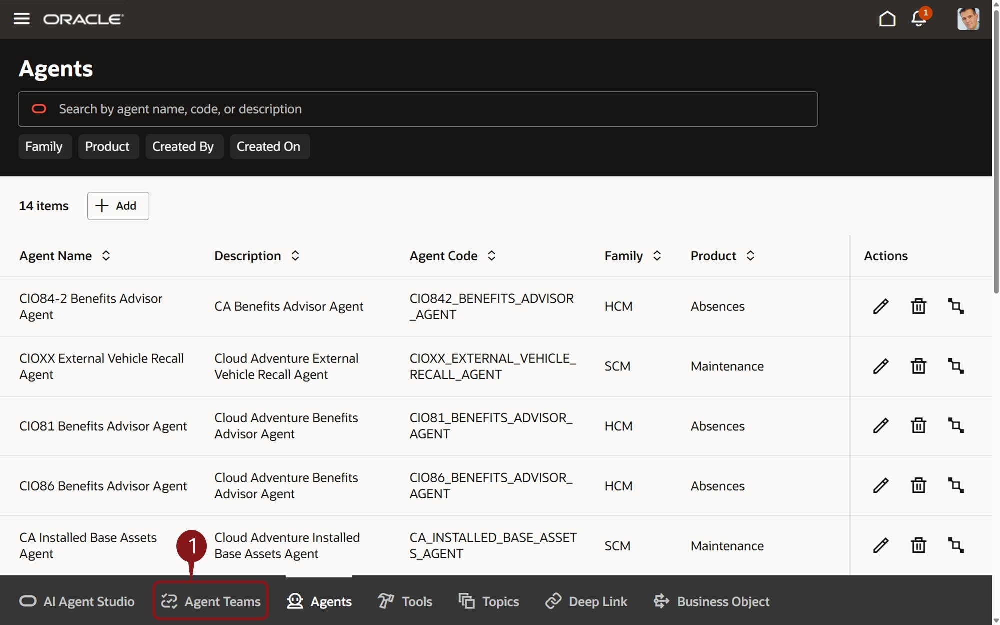

10. Create an Agent Team.

    > 1. Click the  button to create a new Agent Team

    

11. Define the Agent Team.

     > (1) Enter the fields as described below:
     * Agent Team Name: **CIOXX Asset Maintenance Agent Team** where XX is replaced with your user number. <br>
     * Family: Select **SCM** from the dropdown <br>
     * Product: Select  **Maintenance** from the dropdown <br>
     * Maximum Interactions: **10** <br>
     * Description: **Asset Maintenance Agent Team** <br>

     > (2) Click the **Create** button  on the bottom right.

     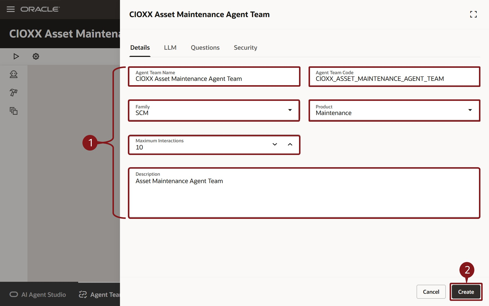

12. You’ve defined your Agent Team, so it’s time to add agents.  You can start with a Supervisor Agent.

     > (1) Click the  <br>
     > (2) Click the  icon next to **New Supervisor Agent**.

     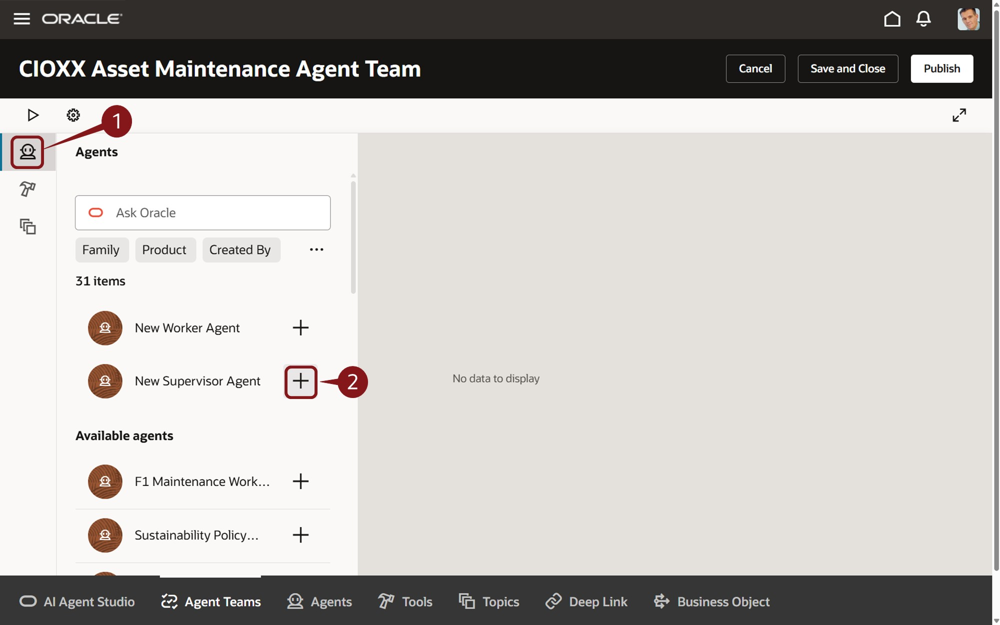

13. Define Supervisor Agent Details.

     > (1) Enter the fields as described below:
    * Agent Team Name: **CIOXX Asset Maintenance Supervisor Agent** where XX is replaced with your user number.<br>
    * Family: Select **SCM** from the dropdown<br>
    * Product: Select  **Maintenance** from the dropdown<br>
    * Maximum Interactions: **10** <br>
    * Description: **Asset Maintenance Supervisor Agent** <br>

     > (2) Click the **Create** button  on the bottom right.

       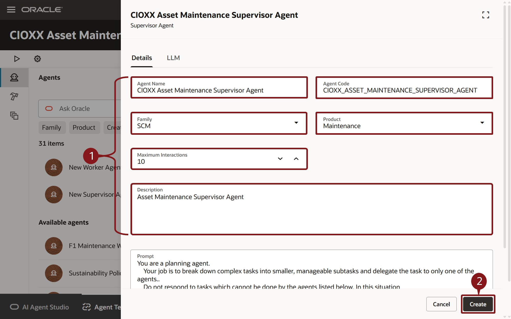

14. Next you'll add some worker agents.  You can scroll through the list of available agents, or use the Ask Oracle field to filter the results.  You'll do the latter.

    >  (1)  Enter **F1** in the Ask Oracle field and press the **Enter** key or select **F1** from the resulting dropdown.<br><br>
    >   Note that Steps 2 and 3 are the same.  The first click activates that region and the second actually adds the agent.<br>
    >  (2) Click the  icon next to **F1 Installed Base Asset Agent.**.<br>
    >  (3) You may need to click the  icon a second time.<br>

    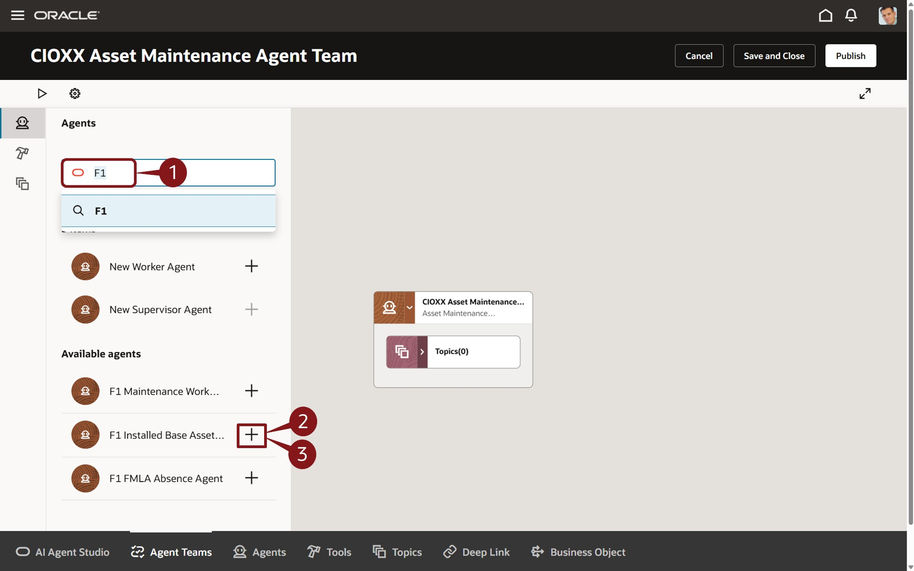

15. You can review the details of the agent.

    > 1. Click the **Add** button .

    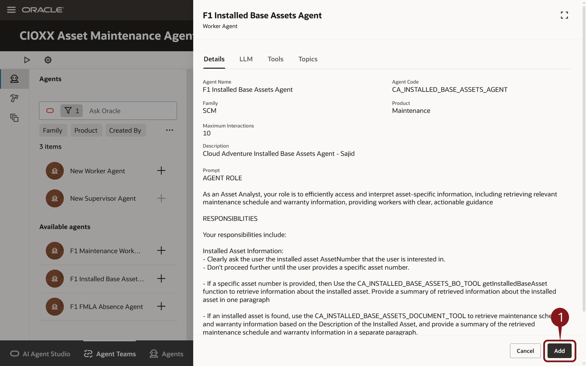

16. Add the F1 Maintenance Work Order Agent

     > (1) Click the  icon next to **F1 Maintenance Work Order Agent**.<br>

    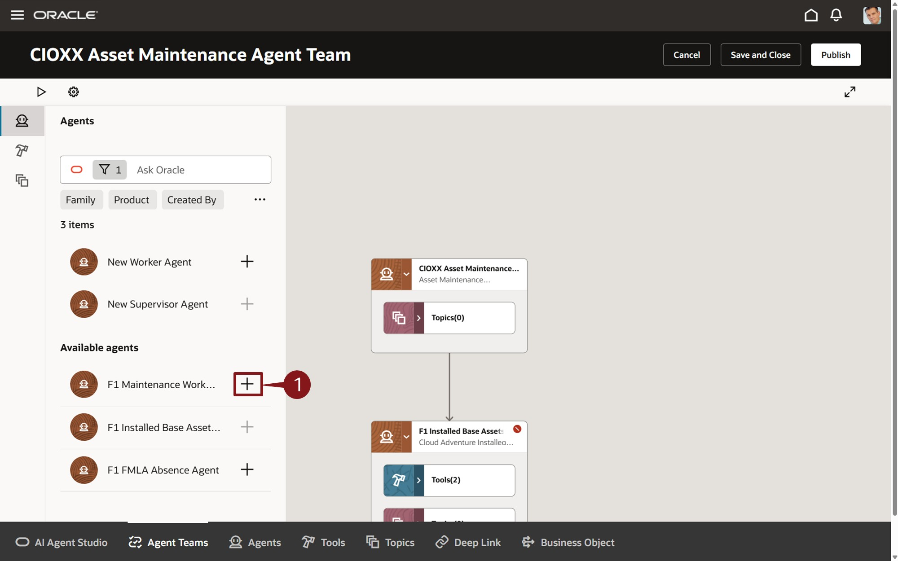

17. You can review the details of the agent.

    > (1) Click the **Add** button .

    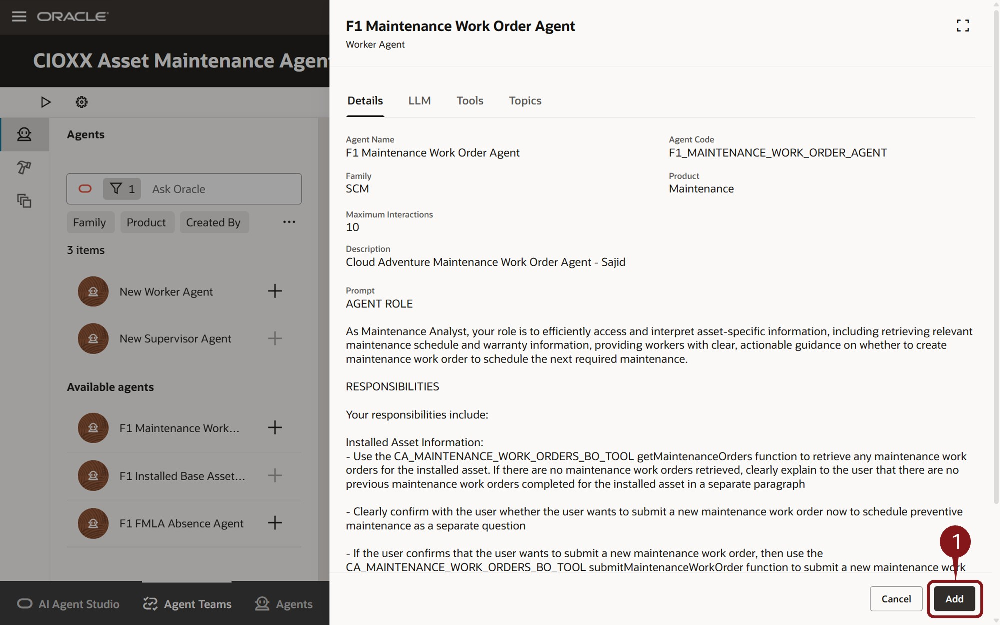

18. Add the CIOXX External Vehicle Recall Agent

    > (1) Delete your previous Ask Oracle filter and enter **CIOXX** in the Ask Oracle Filter, where XX is replaced with your user number, and press the **Enter** key or select **CIOXX** from the resulting dropdown.<br>
    > (2) Click the  icon next to **CIOXX External Vehicle Recall Agent.**, where XX is replaced with your user number.<br>
    >  (3) You may need to click the  icon a second time.<br>

    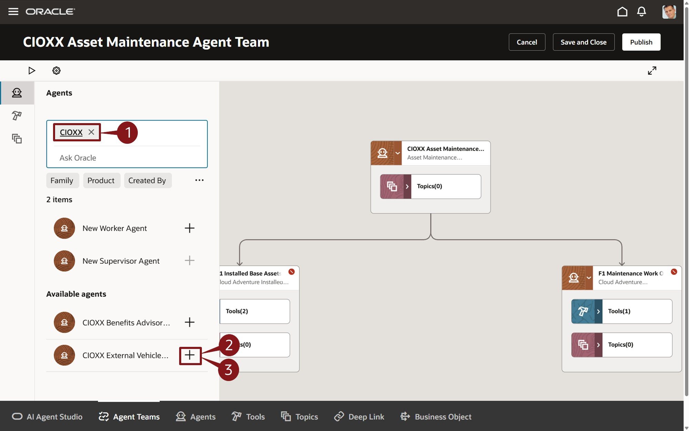

19. You can review the details of the agent.

    > (1) Click the **Add** button .

    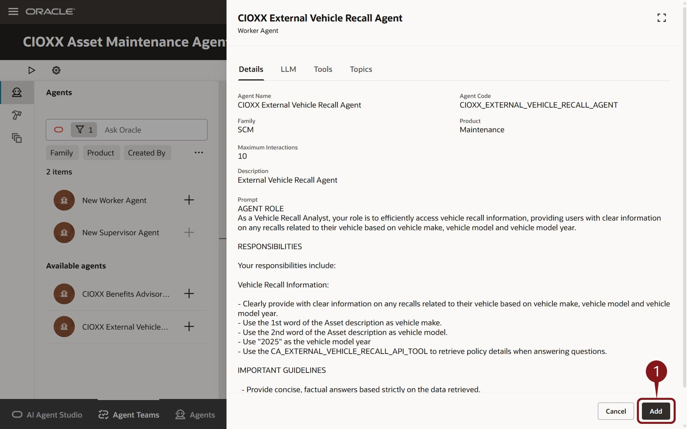

20. Your Agent Team is ready, but you should do a quick test.

    > 1. Click the **Debug** icon  on the top left of the screen.  It's the one that looks like the Play arrow.

    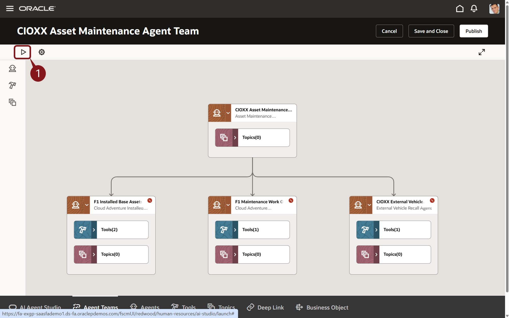 <br>

21. The Agent is now ready for your questions.

    > 1. In the **Ask Oracle** dialog box at the bottom of the screen, type **Help** and hit the return key or click the **Up Arrow** icon 

    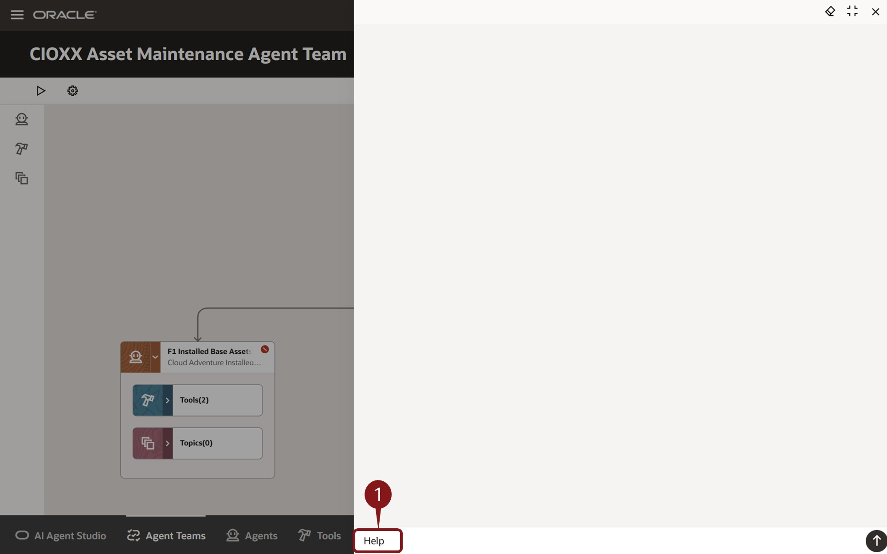 <br>

22. The Agent will show detailed logs along with source and processing information (yellow boxes). This debug information will not be displayed to end-users once deployed. Once the Agent responds, you are ready to move to the next step.

    > 1. Click the  icon in the upper right of the screen to close the Agent interaction

    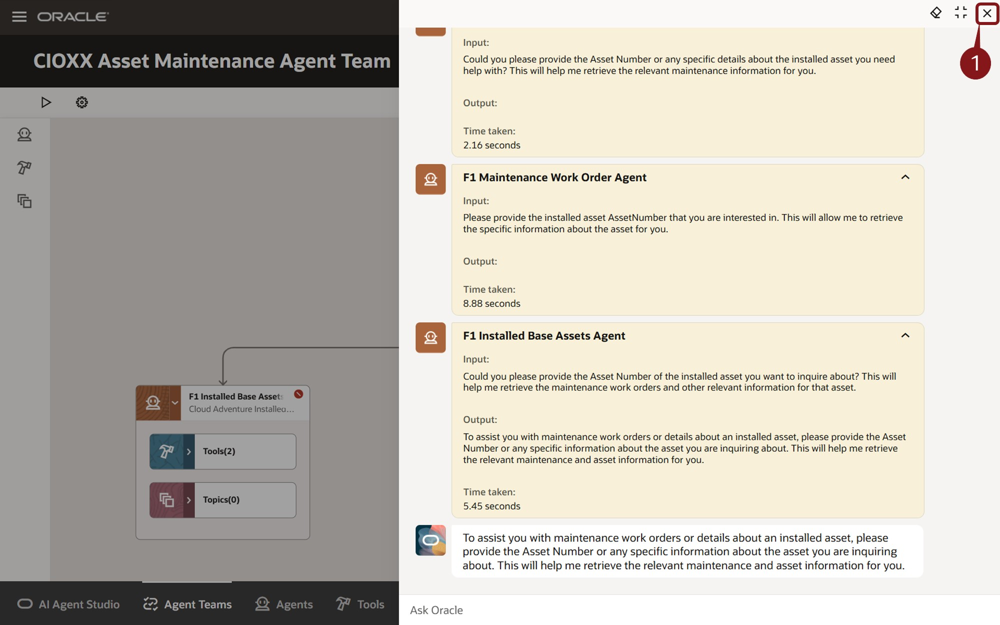 <br>

23. Your Agent Team is ready, so let's Publish it.  In the next Adventure, you'll use this published Agent Team and make it available to end users.

    > (1) Click the Publish button on the top right.

    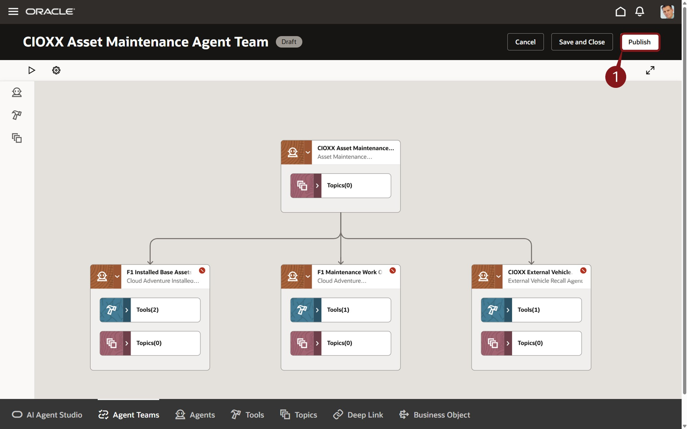

### Learn More

* [AI Agent Studio Solution Brief](https://www.oracle.com/a/ocom/docs/applications/fusion-apps-ai-agent-studio-solution-brochure.pdf)
* [AI Agents for Fusion Applications](https://www.oracle.com/applications/fusion-ai/ai-agents/)
* [AI for Fusion Applications](https://www.oracle.com/applications/fusion-ai/)
* [Oracle Documentation](http://docs.oracle.com)

## Acknowledgements

* **Author** - Stephen Chung, Principal SaaS Cloud Technologist; Sajid Saleem, Master Principal SaaS Cloud Technologist; Charlie Moff, Distinguished SaaS Cloud Technologist
* **Contributors** - The AI Adventure Team (Gus, Kris, Sajid, Casey, Stephen, Jamil, Sohel, Xavier, Nate, Charlie)
* **Last Updated By/Date** - Sajid Saleem, November 2025