# Enable AI

<!-- rem ## Path 1: Create AI - Assemble Benefits Agent Team -->

## **Assemble and Test an AI Agent Team using AI Agent Studio**

### **Introduction**

AI Agent Studio for Fusion Applications is a comprehensive platform for creating, extending, deploying and managing AI Agents and Agent Teams across the enterprise. Oracle AI Agent Studio delivers easy-to-use tools, including advanced testing, robust validation, and built-in security, that helps Oracle Fusion Applications customers and partners create and manage AI agents. Leveraging the same technology that Oracle uses to create AI agents, Oracle AI Agent Studio enables users to easily extend pre-packaged agents and/or create new agents and then deploy and manage them.

### **Objectives**

In this activity you will use Oracle Fusion AI Agent Studio to
* Create and assemble an Agent Team that includes your previously created Benefits Advisor Agent and FMLA Absence Agent.
* Test the Agent Team

### **Begin Exercise**

1. In this activity you will learn the power and ease building Agentic AI with the Oracle AI Agent Studio

    

2. The first step is to navigate to AI Agent Studio.

    > (1) Click on the **Tools** tab  
    > (2) Select the **AI Agent Studio** tile

    

3. You’ve previously created your first Agent.  Now, you’ll create an Agent Team with a Supervisory Agent and assign some Worker Agents.

    > 1. Click the **Agent Teams** button/tab  at the bottom of the page

    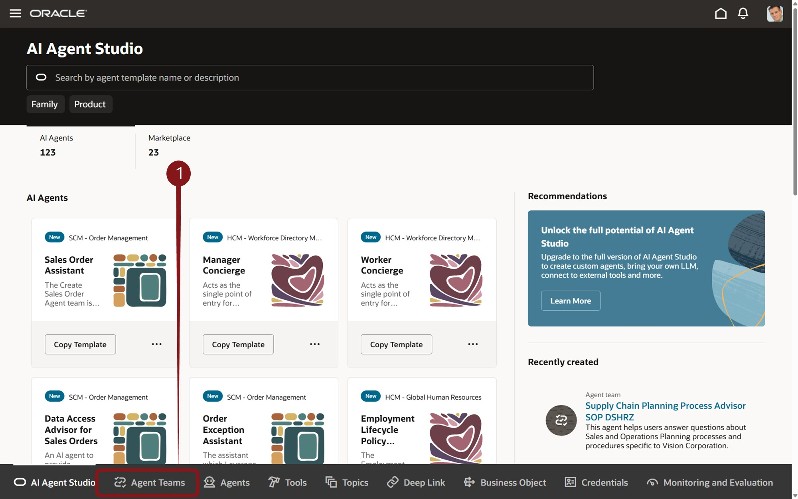

4. Create an Agent Team.

    > 1. Click the  button to create a new Agent Team

    

5. Define the Agent Team.

     > (1) Enter the fields as described below:
     * Agent Team Name: **CIOXX Benefits Agent Team** where XX is replaced with your user number.  
     * Family: Select **HCM** from the dropdown  
     * Product: Select  **Benefits** from the dropdown  
     * Maximum Interactions: **10**  
     * Description: **Agent Team for Benefits and FMLA**  

     > (2) Click the **Create** button  on the bottom right.
     
     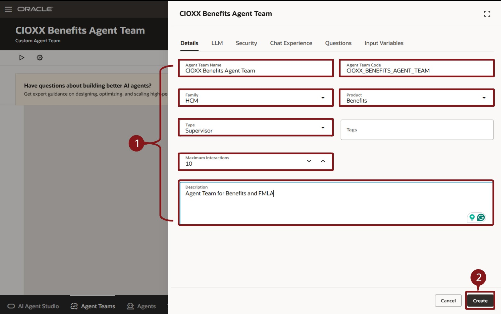

6. You’ve defined your Agent Team, so it’s time to add a Supervisor agent.

     > (1) Click the **Agents** icon  on the top of the left icon tool bar.  

     > (2) Click the **+** icon  next to **New Supervisor Agent**.
     
     

7. Define Supervisor Agent Details.

     > (1) Enter the fields as described below:
    * Agent Team Name: **CIOXX Benefits Supervisor Agent** where XX is replaced with your user number. 
    * Family: Select **HCM** from the dropdown 
    * Product: Select  **Benefits** from the dropdown 
    * Maximum Interactions: **10**  
    * Description: **Supervisor Agent for Benefits and FMLA**  

     > (2) Click the **Create** button  on the bottom right.

       

8. Next you'll add some worker agents.  You can scroll through the list of available agents, or use the Ask Oracle field to filter the results.  You'll do the latter.

    >  (1)  Enter **XX**, where XX is replaced with your user number, in the Ask Oracle field and press the **<enter>** key or select **XX** from the resulting dropdown. 
    >   Note that Steps 2 and 3 are the same.  The first click activates that region and the second actually adds the agent. 
    >  (2)  Click the  icon next to **CIOXX Benefits Advisor Agent**, where XX is replaced with your user number. 
    >  (3)  You may need to click the  icon a second time.

    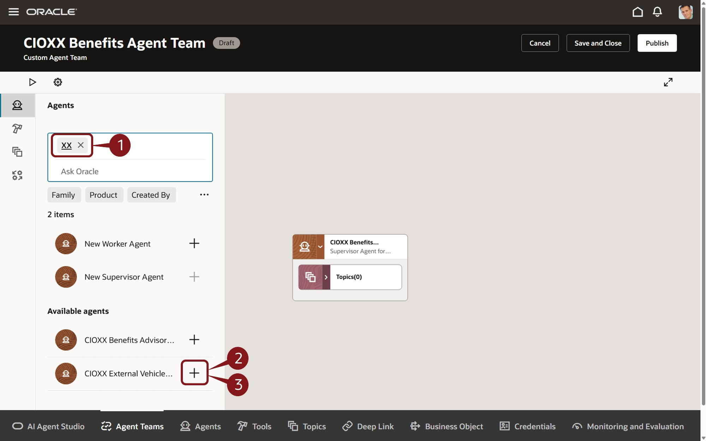

9. You can review the details of the agent before adding.

    > 1. Click the  button on the bottom right of the screen.

    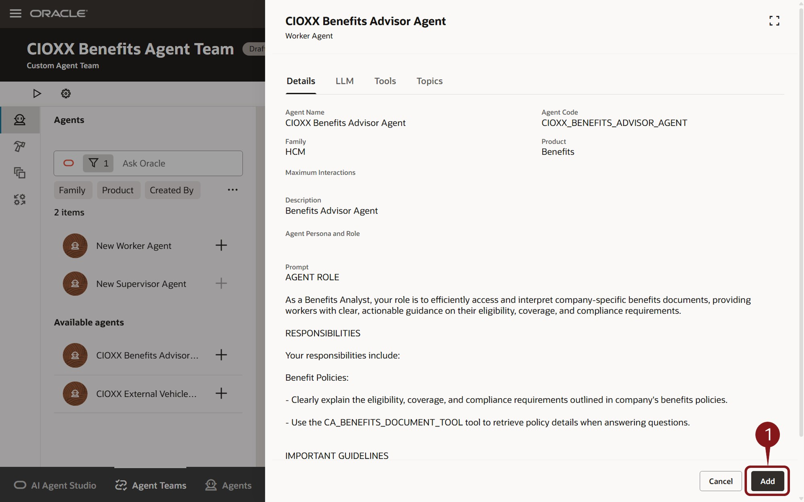  

10. You'll add one more worker agent.  First, you'll filter on something different.

    >  (1) Delete your previous Ask Oracle filter and enter **F1** in the Ask Oracle Filter and press the <enter> key or select **F1** from the resulting dropdown.  

    >   Note that Steps 2 and 3 are the same.  The first click activates that region and the second actually adds the agent.  

    >  (2) Click the  icon next to **F1 FMLA Absence Agent.**, where XX is replaced with your user number. 

    >  (3) You may need to click the  icon a second time. 

    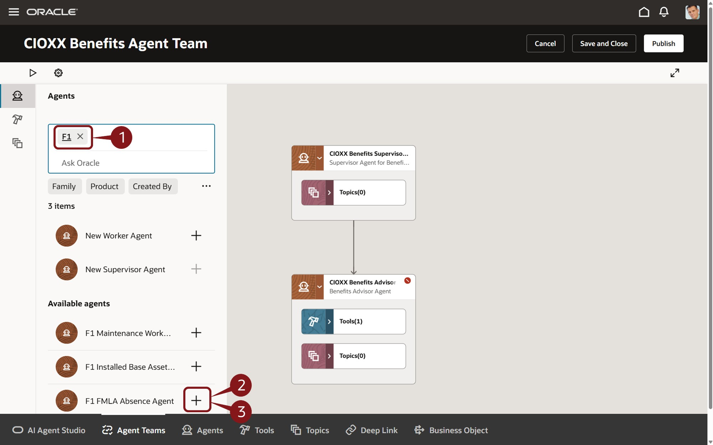

11. You can review the details of the agent.

    > 1. Click the **Add** button .

    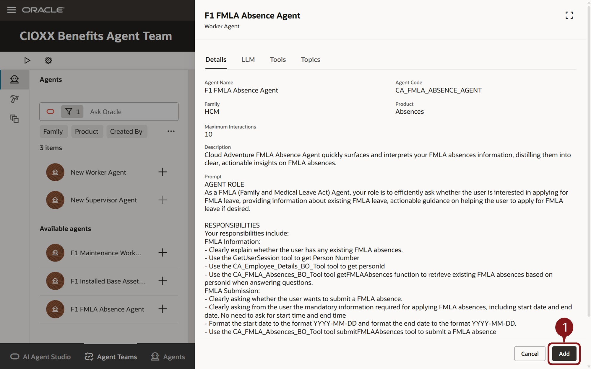  

12. Your Agent Team, with a Supervisory Agent and two Worker Agents is complete.  We can now hide the left Agents panel to see our full Agent Team.

    > 1. Click the **Agents** icon  on the top left of the screen.  You can see that the left panel is now hidden and you can see the entire Agent Team

    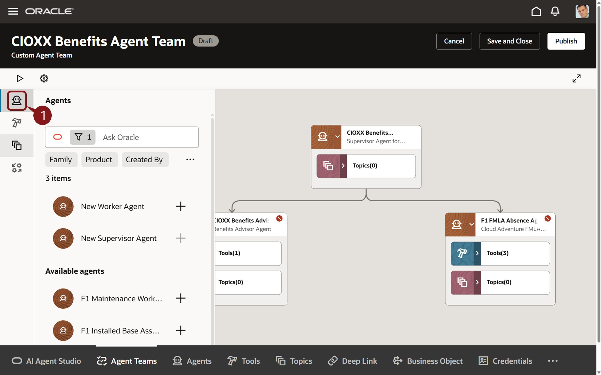  

13. Feel free to admire your newly created Agent Team. Time to test it and see how it responds to your requests.

    > 1. Click the **Debug** icon  on the top left of the screen.  It's the one that looks like the Play arrow.

    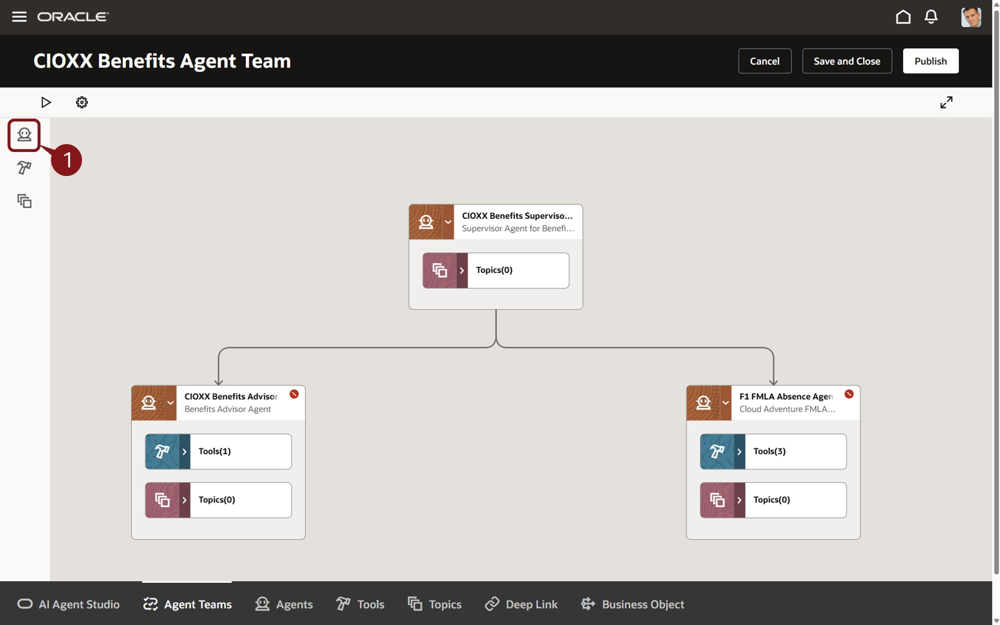  

14. The Agent is now ready for your questions.

    > 1. In the **Ask Oracle** dialog box at the bottom of the screen, type **Please summarize benefits available to me** and hit the return key or click the **Up Arrow** icon 

    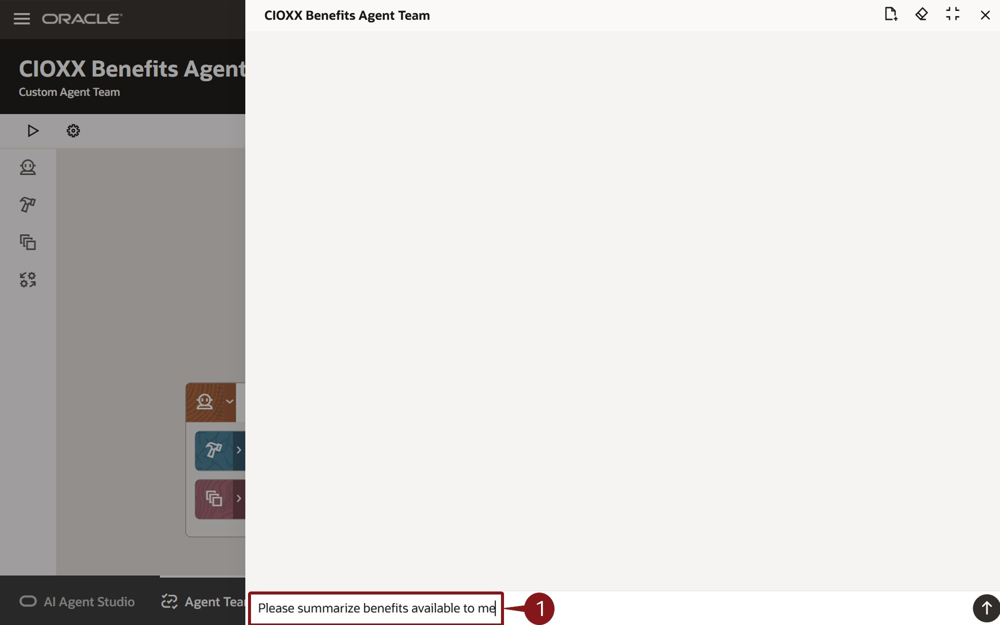  

15. The Agent will respond with information.  In this Debug mode, the Agent will also show you source and processing information (yellow boxes).  These will not be available to end-users once deployed.

    > The Agent responds with information, so we’ll ask an additional question.

    > 1. In the **Ask Oracle** dialog box on the bottom right of the screen, enter **What about FMLA benefits** and hit the **Enter key** or click the **Up Arrow** icon 

    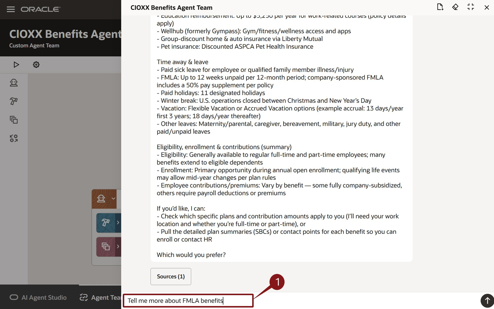  

16. The Agent  checks with HCM Cloud and confirms existing leave requests, if any.  It also offers to create a new request for you if you provide the requested start and end dates.

    You decide to tell the Agent that you’re interested in creating an FMLA absence, but you do so without initially providing the requested dates.

    > 1. In the **Ask Oracle** dialog box on the bottom right of the screen, enter **I would like to create FMLA absence** and hit the return key or click the **Up Arrow** icon 

    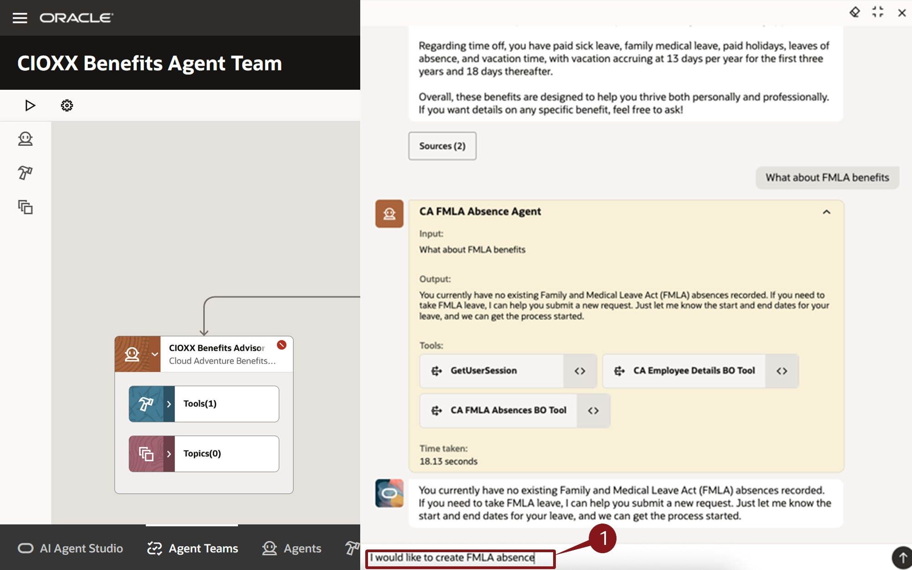  

17. The Agent reminds you that you need to provide start and end dates before the Agent can create the absence request.

    > 1. In the **Ask Oracle** dialog box on the bottom right of the screen, enter **Start Date is 2025-10-28 End Date is 2025-10-29** and hit the return key or click the **Up Arrow** icon 

    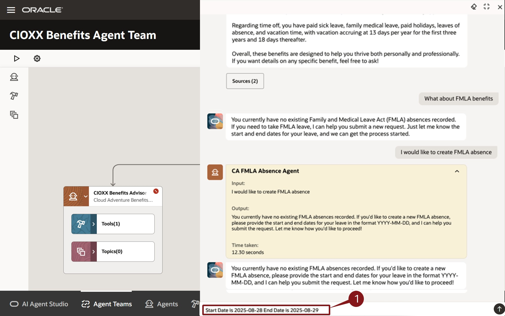  

18. The agent confirms that your request has been created.

    > 1. Review AI Agent Response
    > 2. Click the x icon in the upper right to close the debug screen.

      

19. Let’s go back to the homepage so we can confirm the creation of our absence.

    > 1. Click the Home  **Ask Oracle** icon  on the top right.

    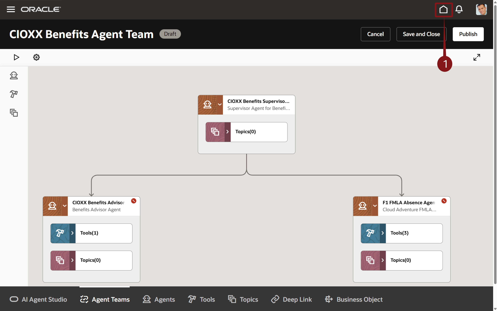  

20. The AI Agent has created your absence request and now you want to find it.

    > 1. In the Search field, type **existing absence** and select **Existing Absences - Me** from the resulting dropdown.

      

35. There it is!  

    > 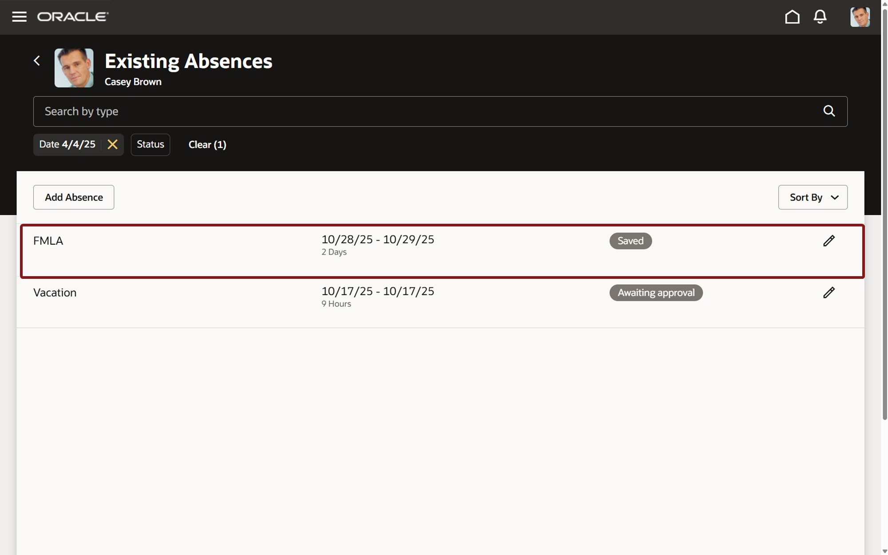  

36. Adventure awaits, click on the image, show what you know and rise to the top of the leader board!!!

    

<!-- rem ## Path 2: Enable AI - Embed Maintenance Agent -->

## **Create a Guided Journey and Embed your AI Agent Team**

### **Introduction**

AI Agent Studio for Fusion Applications is a comprehensive platform for creating, extending, deploying and managing AI Agents and Agent Teams across the enterprise. Oracle AI Agent Studio delivers easy-to-use tools, including advanced testing, robust validation, and built-in security, that helps Oracle Fusion Applications customers and partners create and manage AI agents. Leveraging the same technology that Oracle uses to create AI agents, Oracle AI Agent Studio enables users to easily extend pre-packaged agents and/or create new agents and then deploy and manage them.

### **Objectives**

In this activity you will embed your AI Agent Team in the application for use by end users.
* Create a Guided Journey and Task that references the AI Agent Team.
* Use Visual Builder Studio to Configure the My Maintenance Work page with the Guided Journey.
* Interact with your AI Agent

### **Begin Exercise**

1.  In this activity, you will embed your AI Agent Team in the application for use by end users.

    

2. The first step will involve creating a Guided Journey.  A Guided Journey allows you to embed specific information in standard applications.  In addition to using a Guided Journey to embed an AI Agent (today's example), Guided Journeys can also embed documents, analytics, URLs, Learning, Videos and more.  And like all configurations, Guided Journey configurations are automatically maintained during the release update process.

    > (1) Enter **Guided Journey** in the search field 
    > (2) Select the **Guided Journey** from the resulting dropdown.

    

3. You'll create your Guided Journey here.  It's quite simple.

    > (1) Click the  button.

    

4. Name your Guided Journey.

    > (1) Enter Name:  **CIOXX Guided Journey** where **XX** is replaced with your user number. 
    > (2) Click the  button.

    

5. Next, you'll add a Task to this Guided Journey.  This is where we specify a Task Type of Agent and reference the Maintenance Agent Team you've assembled.

     > (1) Click the  button under the **Tasks** section.  This will pop out the New Task panel from the right.   

     > (2) Enter the fields as described below:
     * Task Name: **Maintenance Guided Journey Task**  
     * Task Description: **Maintenance Guided Journey Task**  
     * Add Instructions: **Enables Maintenance Agent Team in Application UI** 
     * Task Type:  **Agent** from the dropdown  
     * Agent Type: **Workflow Agent** from the dropdown 
     * Workflow Agent: **CIOXX Asset Maintenance Agent Team** where **XX** is your user number from the drop-down. 

    > (3) Click the **Save** button  on the bottom right.
     

6. You’re almost done with the Guided Journey creation.  The last step is to Activate it to make it available for use.

     > (1) Click the Activate button  on the top right 

     > (2) Click the Home icon  in the top toolbar to return to the application home page and get ready for the next step.

     

7. Now, you'll go to the screen where you will embed the AI Agent Team using the Guided Journey we created.

    > (1) Enter **My Maintenance Work** in the search field and select **My Maintenance Work** from the resulting dropdown.

    

8. You'll use Visual Builder to configure the page with the Guided Journey.

    >  (1)  Confirm that **M001 - Seattle Maintenance** is the organization selected in the My Maintenance Work dropdown at the top of the screen.  If not, select **M001 - Seattle Maintenance** from the dropdown. 
    >  (2)  Click the **logged in user icon** icon next to the bell icon in the top right corner and then select **Edit Page in Visual Builder Studio** from the resulting dropdown. 

    

9. You may see multiple projects available.  This allows you to use Visual Builder for various projects, each with their own team and development lifecycle.

    > 1. If multiple projects are displayed, highlight the **Application Extensions** project and then click the Select button  on the bottom right of the screen.

      

10. You can now configure various aspects of the My Maintenance Work screen.  The Journey is simple as it's the first page property on the list. 

    >  (1) Enter **CIOXX\_GUIDED\_JOURNEY** in the **journeycode** field on the right **Page Properties** panel. 

    >  (2) Click the **Preview** icon  on the toolbar on the top right of the page.  This will launch a new tab showing your newly configured screen in a full-functioning preview mode. 

    

11. You can see that the Guided Journey is displayed as an *Ask Oracle** banner.

    > 1. Click the **Ask Oracle** button .

      

12. The Agent appears in a panel pop-out from the right.  You can interact with your agent via the Ask Oracle field at the button of the pop-out panel.  Based on your defined agent, you can ask about Assets, Maintenance, Warranties and even have the Agent create a Maintenance Work Order for your asset.

    > 1. Interact with your agent via the **Ask Oracle** field at the bottom.  Type **What is the manufacturers maintenance schedule for asset CIOXX-RIDGELINE** where XX is the number in your user login and press enter or click the up arrow . 

      

13. You can check for recalls or any existing maintenance work orders.

    > 1. Type **Are there any outstanding recalls** and press enter or click the up arrow . 

    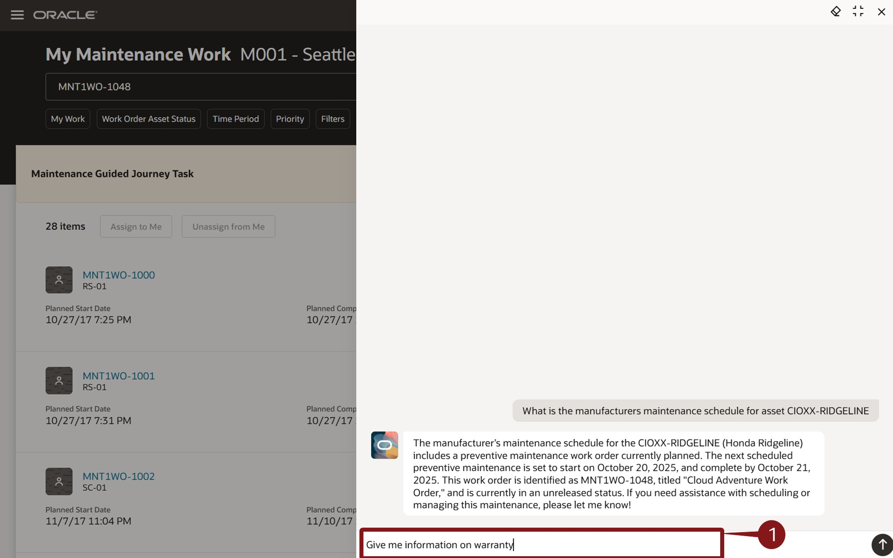  

14. If there are any recalls, you can create a Maintenance Work order to take care of it.  Fortunately, the AI Agent is going to help you!

    > 1. Type **Yes, please create a maintenance work order for this recall** and press enter or click the up arrow . 

    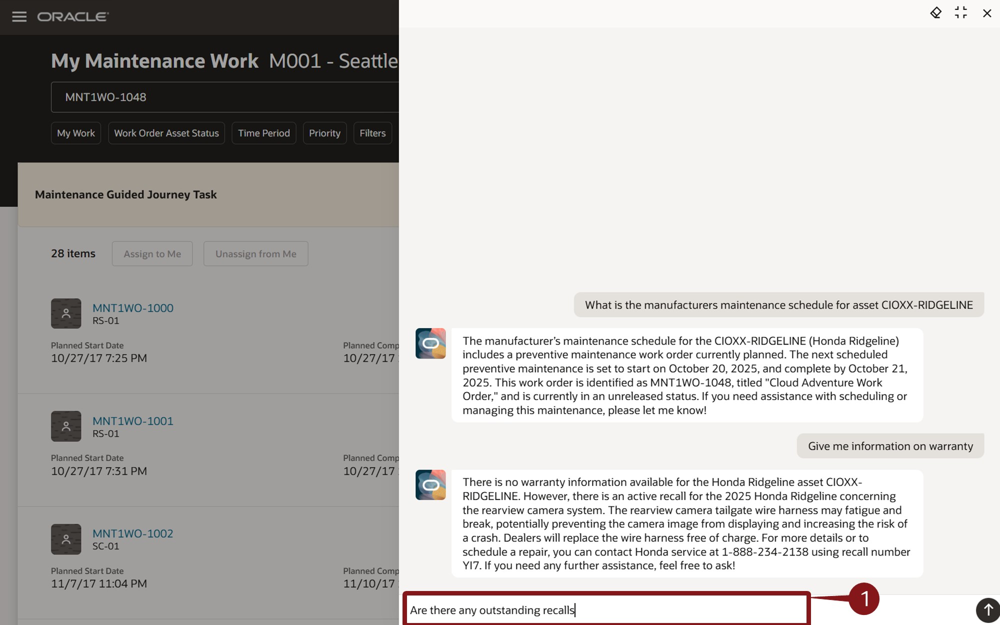  

15. The agent has created your Work Order, so you can query that to verify.

    > 1. Click the **x** in the upper right.

    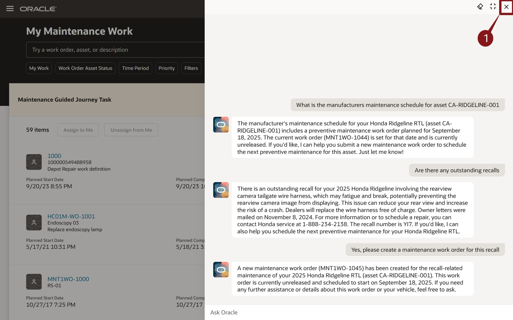  

16. Congratulations.   You've finished the creation and deployment of the AI Agent Team, making it easy for your users to leverage the power of Oracle AI.

17. Adventure awaits, click on the image, show what you know and rise to the top of the leader board!!!

    

## Summary

As you have seen here, AI Agent Studio puts customers in the driver’s seat, helping empower you to design the future of AI in your organizations on top of a bedrock of trust and safety. AI Agent Studio includes a built-in testing environment, validation, and traceability tools to confirm accuracy. Oracle maintains the same data controls at a user level, which means no individual sees data or AI recommendations that they’re not permitted to see.

AI Agent Studio empowers enterprises to configure and build AI agents that extend their workforce and help achieve new levels of productivity. It allows you to harness the full potential of AI agents and transform the way work gets done in your organization.
AI Agent Studio is a design-time environment that provides a set of tools to create, customize, validate, and deploy GenAI features and AI agents to meet the specific needs of the organization. It is the same unified environment Oracle uses to internally build agents, made available now to customers and partners to customize and extend agents from Oracle-provided preconfigured templates or to create new agents and multi-agent workflows.

Like our AI capabilities, Oracle AI Agent Studio was built natively into Fusion Cloud Applications on our trusted, high performance Oracle Cloud Infrastructure (OCI), which means it can easily and securely access Fusion knowledge stores, tools, and APIs and allows agents to be deployed directly into the flow of work. This approach means maximum flexibility and customization without sacrificing reliability or performance.

**You have successfully completed the Activity!

### Learn More

* [AI Agent Studio Solution Brief](https://www.oracle.com/a/ocom/docs/applications/fusion-apps-ai-agent-studio-solution-brochure.pdf)
* [AI Agents for Fusion Applications](https://www.oracle.com/applications/fusion-ai/ai-agents/)
* [AI for Fusion Applications](https://www.oracle.com/applications/fusion-ai/)
* [Oracle Documentation](http://docs.oracle.com)

### Summary

The two tasks of this Extension adventure introduced you to a few of the capabilities that customers can leverage to extend Oracle Fusion Cloud applications.  These features allow you to fine tune your Oracle Fusion Cloud Applications for peak performance, business processes tailored to you requirements, and fast, efficient usage.

You learned how to extend the applications using Oracle Visual Builder Studio to create new screens that leverage both Oracle and non-Oracle data. You also learned how to setup and defined a Guided Journey, which provides your users with the real-time, inline guidance and information required to complete their tasks.

You also learned how to leverage 3rd party Generative AI capabilities by leveraging external LLMs directly from the Guided Journey feature of Oracle Fusion Cloud Applications.
So, check your with you team, double-check your racing harness and get ready for our next Adventure.

### Learn More

- [Extending Oracle Cloud Applications with Visual Builder Studio](https://docs.oracle.com/en/cloud/paas/visual-builder/visualbuilder-building-appui)
- [Overview of Guided Journeys](https://docs.oracle.com/en/cloud/saas/human-resources/24c/faijh/overview-of-guided-journeys.html)
- [Configure User Defined Content Task Type for a Journey](https://docs.oracle.com/en/cloud/saas/human-resources/24c/faijh/configure-user-defined-content-task-type-for-a-journey.html)
- [Oracle Documentation](http://docs.oracle.com)

## Acknowledgements
* **Author** - Charlie Moff, Distinguished Cloud Technologist, Advanced Technology Services; Casey Doody, Cloud Technologist , Advanced Technology Services
* **Contributors** -  Sajid Saleem, Master Principal Cloud Technologist, Advanced Technology Services
* **Last Updated By/Date** - Casey Doody, August 2025