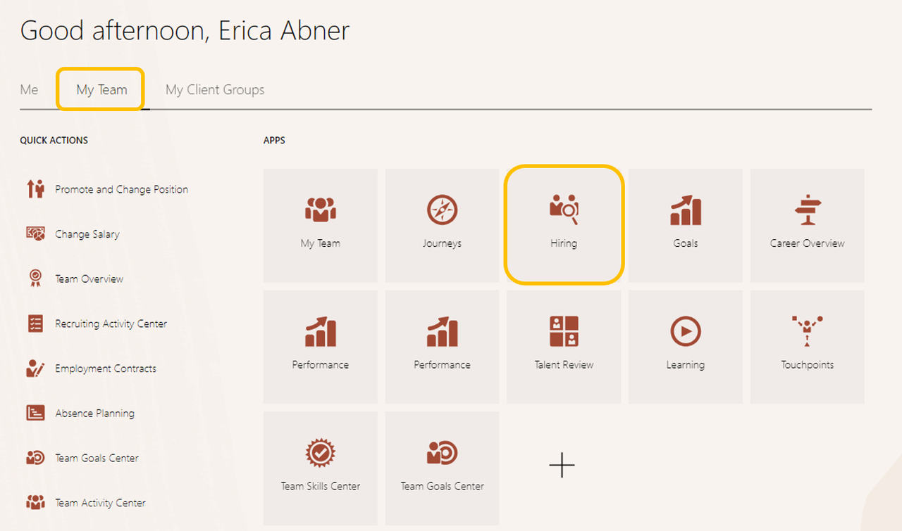
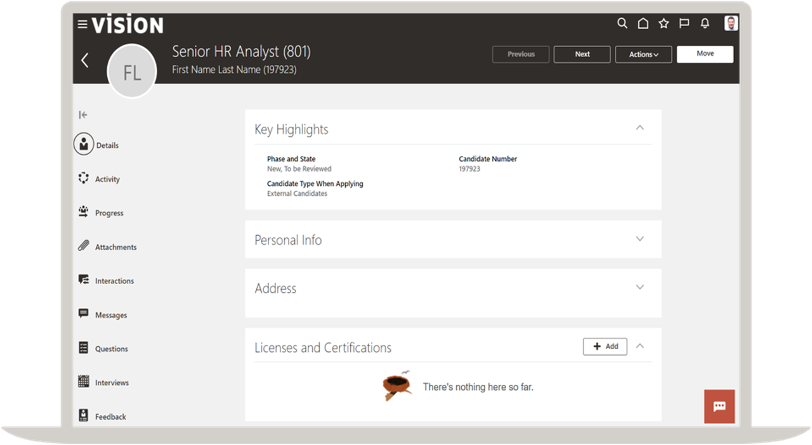

# Manage Candidates

## Introduction

In this lab, you are going to learn how to review an application and candidate management. You'll also learn how to create an Offer Letter

Estimated Time: 10 minutes

### Objectives

In this lab, you will:
* Manage Candidate Information

## Task 1: View the Requisition and Job Application

1. Easily manage and view candidates in your hiring/recruiting area.

    > From the **Home Page**, click the **My Team** tab, and then the **Hiring** tile.

    

2. Search for the requisition you applied to.

    > To Search- remove the current filters by clicking the **"X"** next to each assigned filter, type **801** in the search bar, and then select the **Senior HR Analyst 801** requisition. 

    
3. Find the application you submitted

    > Click on the hyperlink above **‘New- To Be Reviewed’** and then click on the name of the applicant you submitted.

      

4. Review different elements of your application.
   
    > Click on **‘Questions’** link in the left column.

5. Need Help? Choose Review Requisition Guide and follow the guided flow to complete the tasks. Getting Started with Recruiting learning is also available.

6. Complete the Cloud Adventure Checkpoint below

7. Follow along with the speaker to schedule an interview and submit an offer!
 

Adventure awaits, show what you know, and rise to the top of the leader board!!!

    
[Click here](http://apex.oracle.com/pls/apex/f?p=159406:LOGIN_TEAM:::::CC:HCMCLOUDADVENTURE) 

**You may now proceed to the next lab.**

## Acknowledgements
* **Author** - Dorcas Conyers, Principal Sales Consultant, Cloud HCM
* **Contributors** -  Kerilyn Derkasch, Sr. Manager, Cloud HCM
* **Last Updated By/Date** - Dorcas Conyers, March 2024
