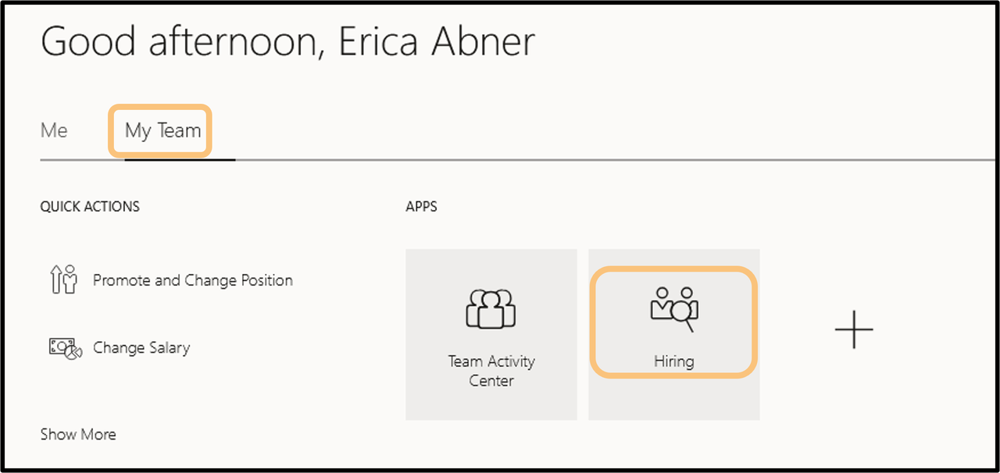
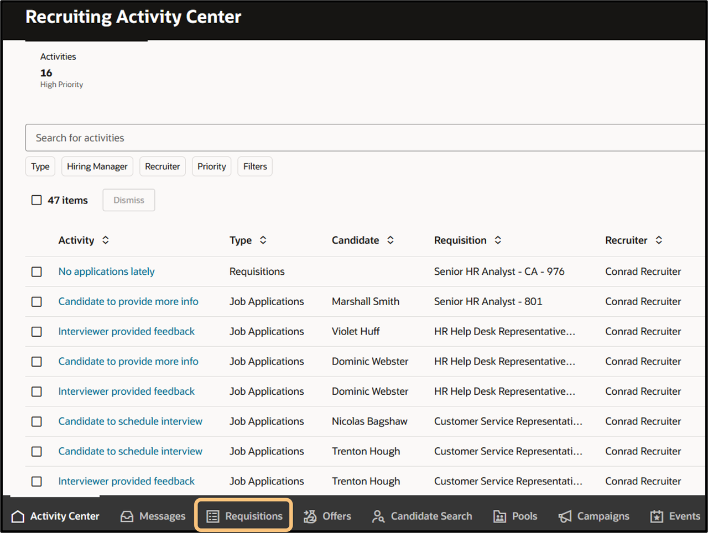
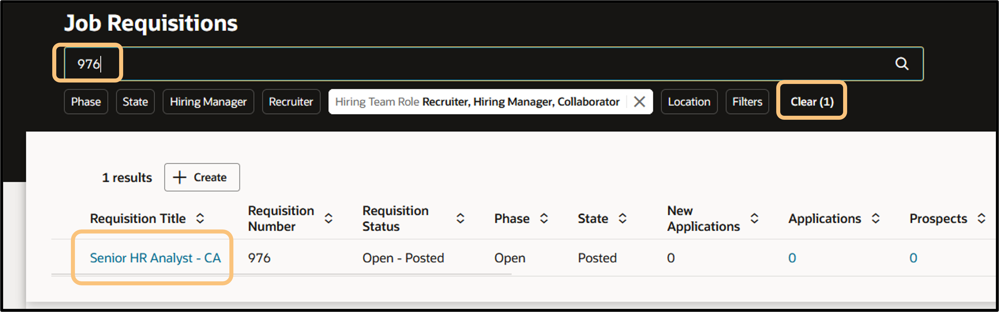
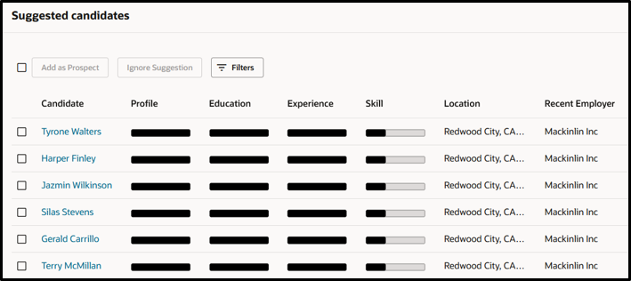
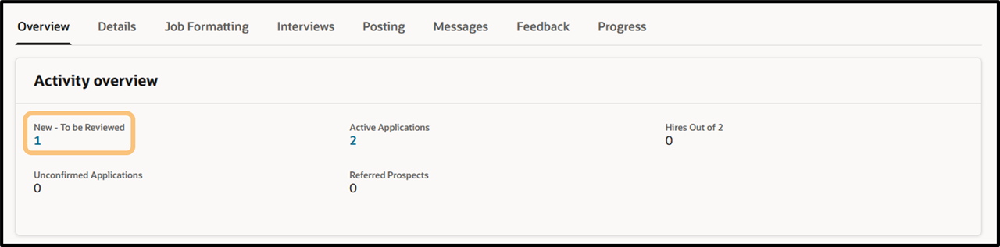
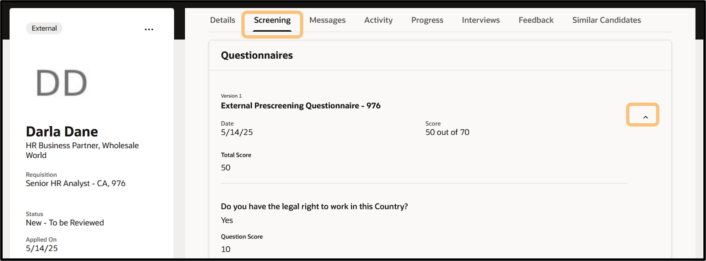

# Lab 1: Recruiter View

## Review Requisition and Manage Candidates

### Introduction

In this lab, you will learn how to review an application and manage candidates.

Estimated Time: 10 minutes

### Objectives

In this lab, you will:
* Access the Recruiter hiring area
* Review the requisition you applied to
* Manage Candidate Information

## Task 1: View the Requisition and Job Application
Easily manage and view candidates in your hiring/recruiting area.

1.  From the **Home Page**, click the **My Team** tab, and then the **Hiring** tile. 
    
    *tip: If the Hiring tile is not under the My Team tab, check under My Client Groups tab. 
    
    

2. You will now be in the Recruiting Activity Center where recruiters can see updates and automated tasks regarding requisitions they are responsible for. Click the **Requisitions** tab towards the bottom-left of the page. 

    

3. Search and drill into the requisition you applied to. To search - type in the requisition number **976** in the search bar to find and click the **Senior HR Analyst - CA** requisition. 
    
    *tip: If the requisition is not showing, try removing the current filters by clicking the **“X”** next to each assigned filter or **"Clear"** next to the filters area.

    

4. Scroll down to see the **suggested candidates** table. Within the flow of your work, while reviewing the open requisition, embedded AI aids recruiters with candidate suggestions. These suggestions are sourced internally within your organization and your external talent pool. 

    
    
5. Find the application you submitted by scrolling to the top of the page and clicking the **number hyperlink** under **"New - To be Reviewed."**

    

6. Click the **name of the applicant YOU submitted.** This will bring you to the candidate profile (screenshot of candidate profile below).

      

7. Review different elements of your application. For example, click the **Screening** tab near the top of the page and then click the **down arrow** in the Questionnaires table.  
 
Adventure awaits, [click HERE](http://apex.oracle.com/pls/apex/f?p=159406:LOGIN_TEAM:::::CC:HCMCLOUDADVENTURE) to access the Cloud Adventure Checkpoint - Recruiter **Questions 2 - 4**, and rise to the top of the leaderboard!

   
## Acknowledgements
* **Author** - Dorcas Conyers, Principal Sales Consultant, Cloud HCM
* **Contributors** -  Kerilyn Derkasch, Sr. Manager, Cloud HCM & Mark Sarmiento, Sr. HCM Solution Engineer
* **Last Updated By/Date** - Mark Sarmiento, May 2025
