# Lab 1: Recruiter

## Introduction

In this lab, you will review candidates and job requisitions in Oracle Recruiting. You will also use Generative AI to update a requisition posting.

Estimated Time: 12 minutes

## Objectives

In this lab, you will:
* Find and access an open job requisition.
* Review candidate information and AI insights.
* Preview resumes and navigate between candidates.
* Use AI to assist in updating the job description, responsibilities, and qualifications.

## Task 1: View the Requisition and Manage Candidate Information

Easily manage and view candidates in your hiring/recruiting area.

1.  From the **Home Page**, click the **My Team** tab, and then the **Hiring** tile. 
    
    *tip: If the Hiring tile is not under the My Team tab, check under My Client Groups tab. 
    
    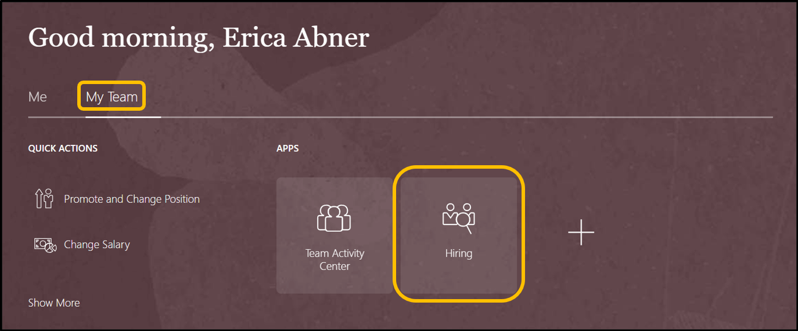

Access requisitions screen.

2. Click the **requisitions tab** at the bottom of the screen. 

    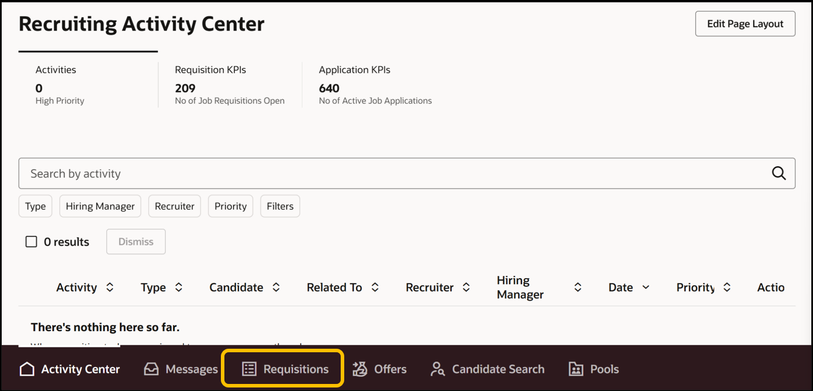

Search for the requisition you applied to.

3. **Clear the filter(s)** under the requisition search bar.
4. Search **1011** in the requisition search bar. The result should show Interdimensional Operations Analyst - AIA (requisition number 1011).
5. Click the **number link** under the **'Applications' column.**
        
    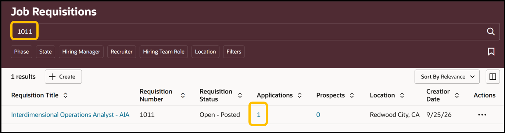
   
Find the application you submitted, review different application elements and available actions for this candidate.
4. Click on the **name** of the applicant you submitted. This will bring you to the candidate profile, which looks like the screen below.
5. Review the **AI insights** surrounding your candidate.
6. Review different elements and details of the application through the **tabs** circled below. You can manage everything for your candidate here.
7. All the actions you may need are available by clicking ***‘…’*** (three dots above candidate name).

    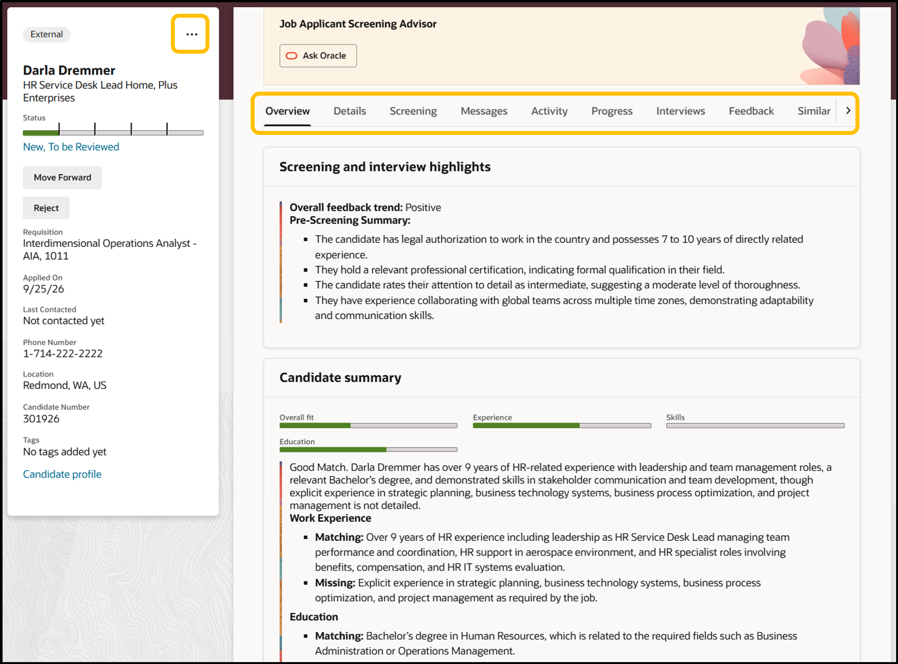

Quickly cycle through different candidates.

8. To the top-right of the screen, you may use the **arrows** to quickly move to different candidate profiles for those that applied to this requisition.

    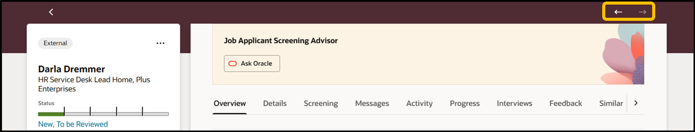  

Efficiently review resumes without downloading.

9. Scroll down and click the **preview button (image of an eye)** within the ‘Candidate attachments’ table to quickly view the candidate’s resume.
10. After you’ve finished previewing the resume, click the **‘X’** at the top-right corner of the attachment preview.
11. Click the **Requisitions** tab to start Task 2 below

## Task 2: Use AI to Assist in Updating and/or Creating a Requisition

Access the requisition you need to update.

1. **Clear the filters** and then search for requisition **801.**
2. Click **Senior HR Analyst** (requisition number 801).

    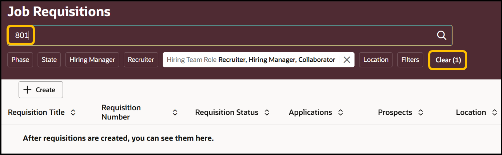
    
    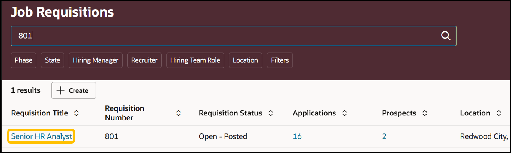

Edit the Posting Description with Generative AI.

3. In the **‘Details’** tab, scroll down to the **‘Posting description’** table and **click the pencil icon** to the top-right of the table.
 
    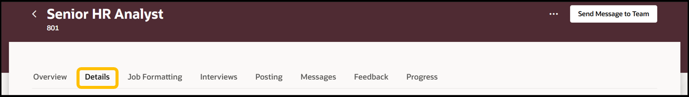
    
    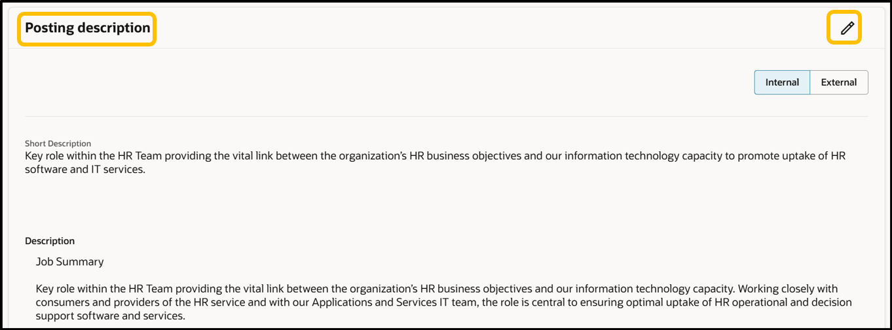

4. Within, **‘Tell AI Assist what you need’** field, type in something like, **"I need a Senior HR Analyst with 5 years of experience and a college degree from an accredited university.”**
5. **Click out of the field** and then click the **‘AI Assist’** button.
 
    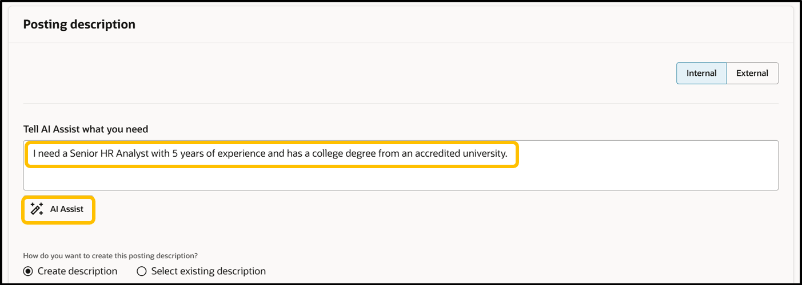

6. In a moment, you will see a pop-up that says, **‘AI Assist completed’** and then you can scroll down to see the AI generated content for the Posting Description, Responsibilities, and Qualifications.
7. The user/human is always in control, you may always update, edit, or delete any content generated by AI.
 
    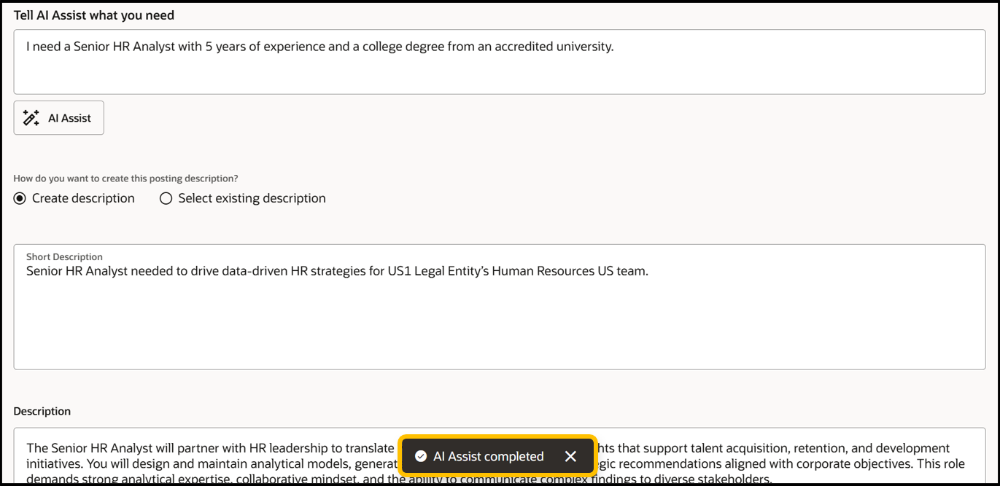

Adventure awaits, [click HERE](http://apex.oracle.com/pls/apex/f?p=159406:LOGIN_TEAM:::::CC:HCMCLOUDADVENTURE) to access the Cloud Adventure Checkpoint - Complete the **Recruiter Section Questions**, and rise to the top of the leaderboard!

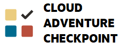
   
## Acknowledgements
* **Author** - Mark Sarmiento, HCM Solution Engineer
* **Contributors** -  Mark Sarmiento, HCM Solution Engineer
* **Last Updated By/Date** - Mark Sarmiento, September 2026

