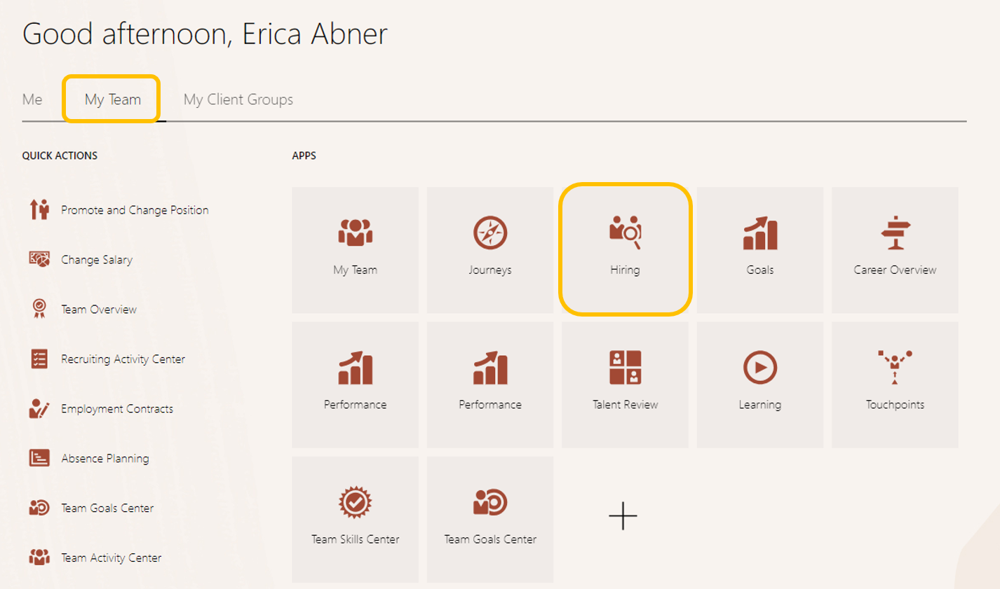

# Manage Candidates

## Introduction

In this lab, you are going to learn how to review an application and candidate management. You'll also learn how to create an Offer Letter

Estimated Time: 10 minutes

### Objectives

In this lab, you will:
* Manage Candidate Information

## Task 1: View the Requisition and Job Application

1. To see how you can easily manage and review candidates

    > Go to **Home Page**, then click on top right corner before the bell icon

    

2. Search for the Senior HR Analyst-801-requisition you applied to.

    > To Search- remove the current filters by clicking the "X" and type "801" in the search bar

    

3. Here you can see the application you just submitted

    > Click on the hyperlink above ‘**New- To Be Reviewed’** to review the application

      

4. Need Help? Choose Review Requisition Guide and follow the guided flow to complete the tasks. Getting Started with Recruiting learning is also available.
   

5. Close the pop up window to return to the main screen.

    > **Click ‘Done’**

6. You are back at the Home Page
 

Adventure awaits, show what you know, and rise to the top of the leader board!!!

    
[Click here](http://apex.oracle.com/pls/apex/f?p=159406:LOGIN_TEAM:::::CC:HCMCLOUDADVENTURE) 

**You may now proceed to the next lab.**

## Acknowledgements
* **Author** - Dorcas Conyers, Principal Sales Consultant, Cloud HCM
* **Contributors** -  Kerilyn Derkasch, Sr. Manager, Cloud HCM
* **Last Updated By/Date** - Kerilyn Derkasch, December 2023
