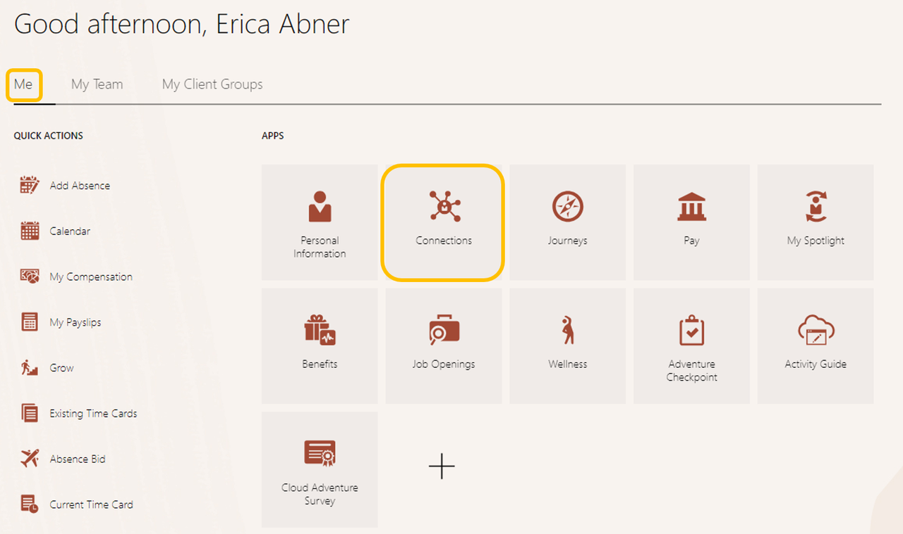

# Connections

## Introduction

In this activity, you'll explore one of our Innovation features, **Connections**, which helps employees build better relationships, highlight their interests and skills, and share feedback on others’ profile. 

Estimated Time: 6 minutes

### Objectives

In this activity, you will:
* Learn about the power of Oracle HCM Connections

## Task 1: Explore Connections

1. Click the **Me** tab, then the **‘Connections’** tile, and search for **‘Curtis Feitty’** to explore his public profile *tip: scroll across to view their entire profile*. 

    

2. Adventure awaits, show what you know, and rise to the top of the leader board!!!
    
     
    
    [Click here](http://apex.oracle.com/pls/apex/f?p=159406:LOGIN_TEAM:::::CC:HCMCLOUDADVENTURE) 

## Summary

Connections is designed to help you and your employees:
  
**Easily connect with others**
Help workers quickly find and connect with others who have specific skills, interests, or experiences.

**Engage and build relationships**
Enable workers to share personal interests and create connections and community, increasing opportunities for inclusion and belonging.

**Build networks**
Allow workers to promote their personal brand by highlighting their skills, accomplishments, and career experience.

  > Click the **‘Home’** Icon

**You may now proceed to the next lab.**

## Acknowledgements
* **Author** - Dorcas Conyers, Principal Sales Consultant
* **Contributors** -  Dorcas Conyers, Principal Sales Consultant
* **Last Updated By/Date** - Dorcas Conyers, March 2024

