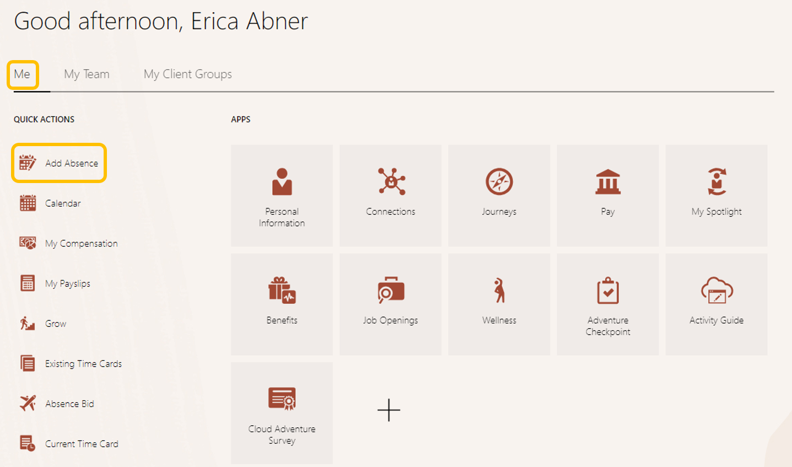
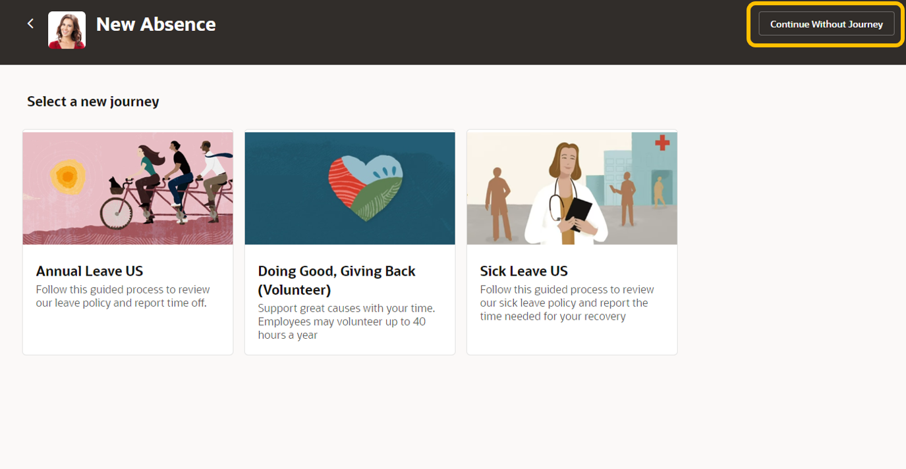

# Employee View

## Introduction

In this activity, you’ll complete two tasks, the first is exploring one of our innovation features, *Connections*, which helps employees build better relationships, highlight their interests and skills, and share feedback on others’ profiles. The second task will showcase how Oracle Cloud HCM can handle various types of *absences* with a simple request process. 

Estimated Time: 10 minutes

### Objectives

In this activity, you will:
* Learn about the power of Oracle HCM Connections
* Submit an absence request as an employee

## Task 1: Explore Connections

1. Click the **Me** tab, then the **‘Connections’** tile, and search for **‘Curtis Feitty’** to explore his public profile *tip: scroll across to view their entire profile*. 

    

    

    

## Task 2:  Absence Request

1. Oracle Cloud HCM can handle any type of absence, to include automating which absences different employees can request/view, based on specific/local rules. This logic also includes accruals and entitlements.

> Under the **‘Me’** tab and **‘Quick Actions’** column to the left, click **‘Add Absence’** (you can also use the digital assistant to request an absence)

2. Click **‘Continue Without Journey’**

3. Choose the **‘Vacation’** absence type from the drop-down list. Select a Start & End Date, and then click submit at the top-right of the page to send your request.

Adventure awaits, **click on the adventure checkpoint tab in your browser,** answer the Employee Experience Questions 5 - 8,** and rise to the top of the leader board!!!
    
     
    
    [Click here](http://apex.oracle.com/pls/apex/f?p=159406:LOGIN_TEAM:::::CC:HCMCLOUDADVENTURE) 

## Acknowledgements
* **Author** - Dorcas Conyers, Principal Sales Consultant
* **Contributors** -  Dorcas Conyers, Principal Sales Consultant
* **Last Updated By/Date** - Dorcas Conyers, October 2024

