# Lab 2: Employee

## Introduction

In this activity, you will explore Oracle Cloud HCM as an employee. You will use My Activity Center, provide feedback in Connections, and submit an absence request. 

Estimated Time: 12 minutes

## Objectives

In this activity, you will:
* Explore and personalize My Activity Center.
* View events on your timeline.
* Find a colleague and provide feedback in Connections.
* Submit a vacation request.

## Task 1: Explore My Activity Center

Access **My Activity Center** directly from the home screen. 
1. In the **‘Me’** tab, click the **‘My Activity Center’ tile.**
     
    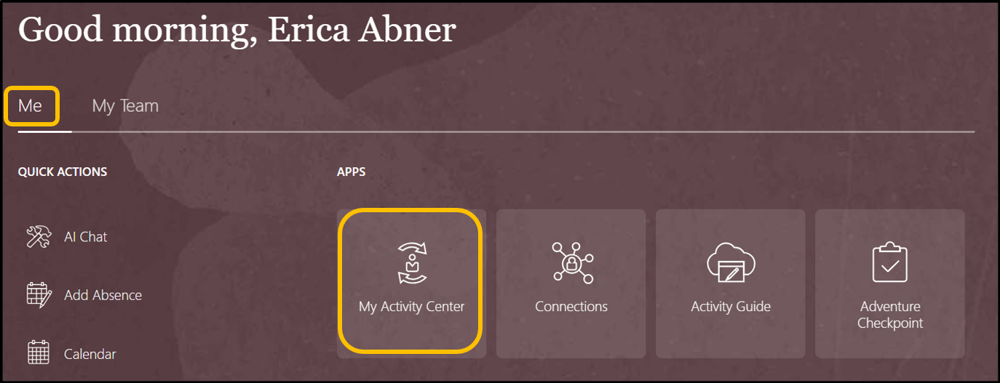

Explore My Activity Center.
1. Click the **arrow** to the right of your analytics header to view different information across the HCM platform (these analytics can be drillable).
        
    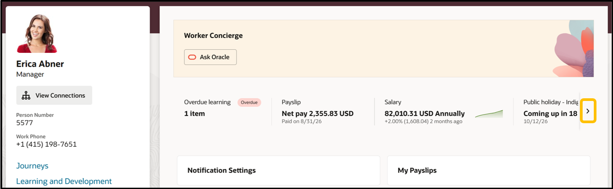

2. Click the **‘View More’** link under your quick actions tiles to personalize your quick actions.
3. **Un-pin** any of the six quick actions, and **pin** the **‘Personal Details’** quick action (if not already done).
4. When you’re done with your selections, click the ‘X’ at the top-right to save your quick actions.
     
    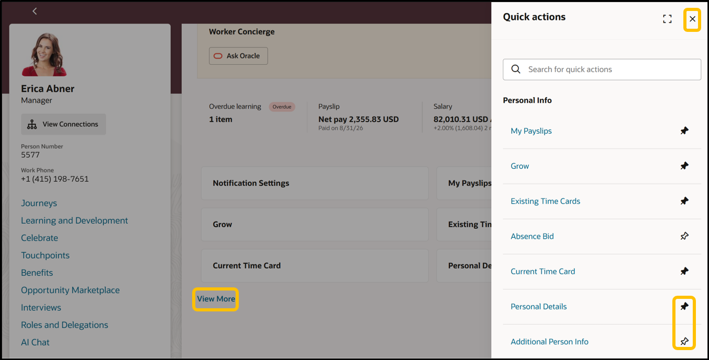

5. **Scroll** down to your event timeline. Click the **graph** icon and then **zoom out (-)** as much as possible to view more events.
6. Here, you can view events such as holidays, work anniversaries, payslips, and year-end documents. Some events can be opened to view additional details.
     
    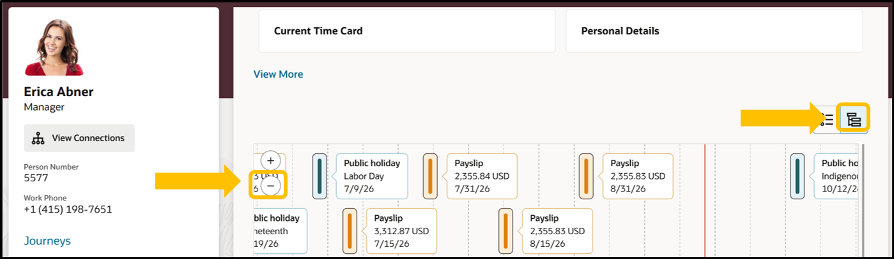

## Task 2:  Provide Feedback in Connections

Access Connections and leave feedback.
1. Click the **‘View Connections’** button, under your profile picture.
2. Click **'Dismiss'** if a pop-up appears. 
     
    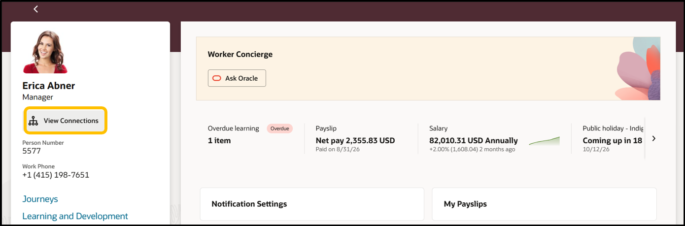
 
    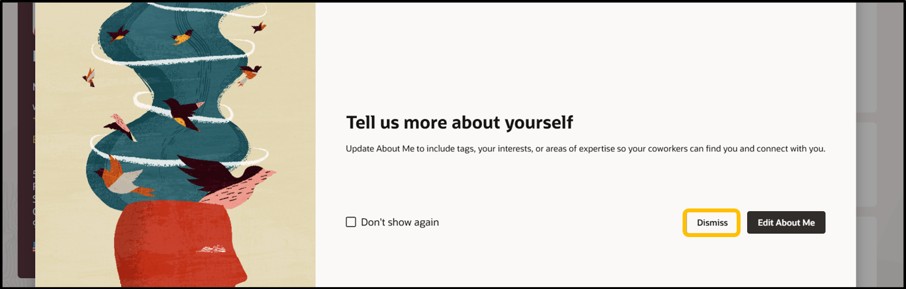

3. In the search bar, **type in ‘Curtis Feitty’** and **click** his name from the list.
     
    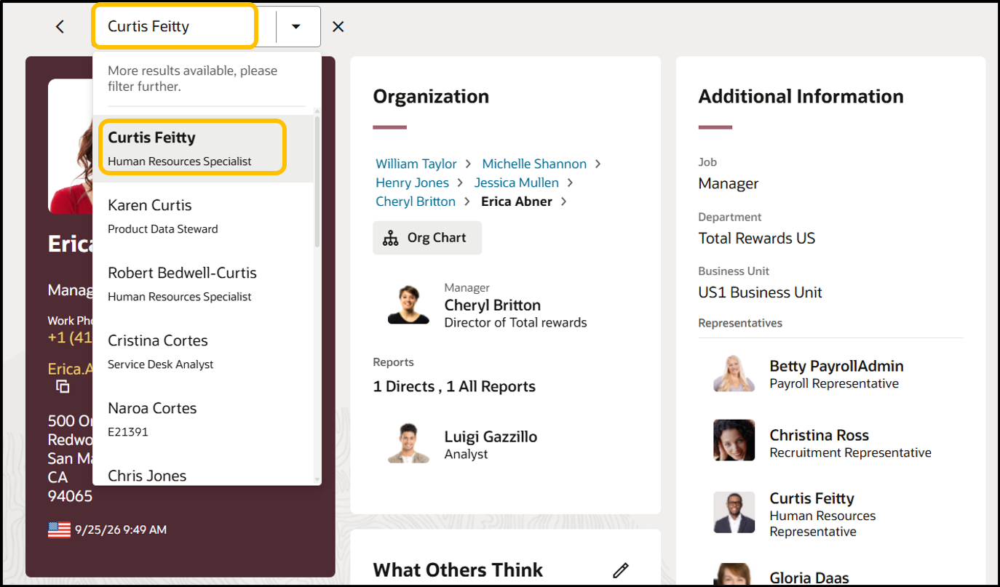

4. Review the details on his Connections page.
5. When you’re done, scroll down to the **‘What Others Think’** table and click the **pencil icon,** to leave him feedback on the stellar work he’s done with onboarding new employees.
     
    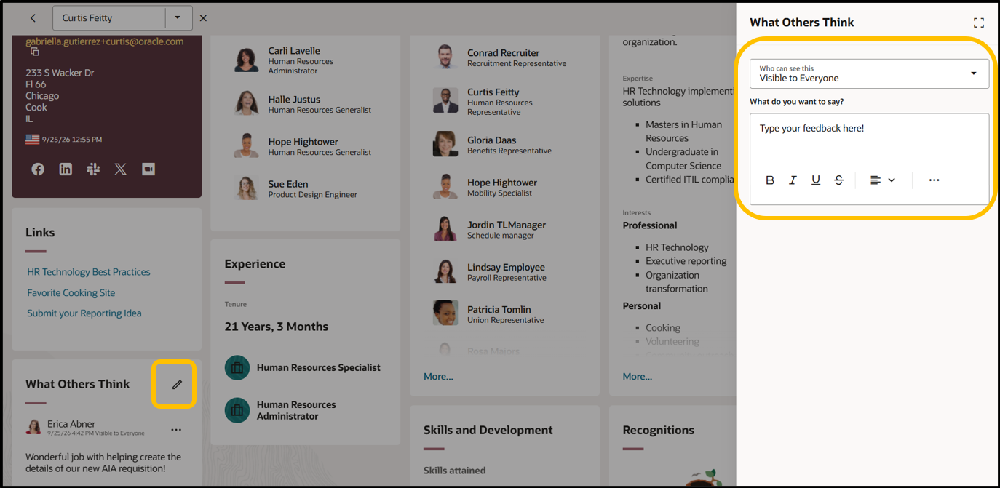

## Task 3: Absence Request

Oracle Cloud HCM can handle any type of absence, to include automating which absences different employees can request/view, based on specific/local rules. This logic also includes accruals and entitlements.
1. Go back to the home page, under the **Me** tab and **Quick Actions** column to the left, click **Add Absence.**
     
    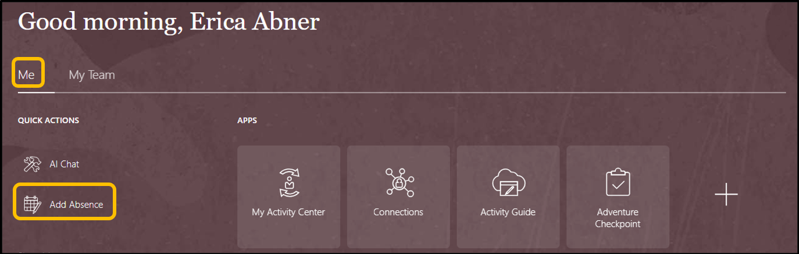

2. Click **‘Continue Without Journey’**
     
    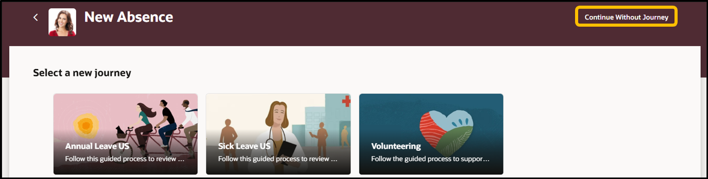

3. Choose the **‘Vacation’** absence type from the drop-down list. Select a **Start & End Date,** and then click **submit** at the top-right of the page to send your request.
     
    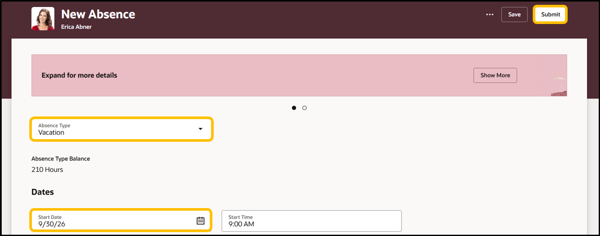

Adventure awaits, [click HERE](http://apex.oracle.com/pls/apex/f?p=159406:LOGIN_TEAM:::::CC:HCMCLOUDADVENTURE) to access the Cloud Adventure Checkpoint - Complete the **Employee Section Questions**, and rise to the top of the leaderboard!
    

    
## Acknowledgements
* **Author** - Mark Sarmiento, HCM Solution Engineer
* **Contributors** -  Mark Sarmiento, HCM Solution Engineer
* **Last Updated By/Date** - Mark Sarmiento, September 2026

