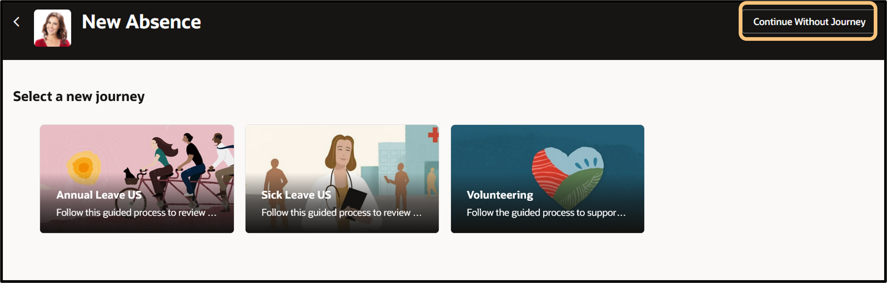

# Lab 2: Employee View

## Explore Connections and Submit an Absence

### Introduction

In this lab, you’ll complete **two** tasks. Task one is exploring one of our innovation features, *Connections*, which helps employees build better relationships, enhance company culture, review feedback on others’ profiles, and highlight their own interests and skills. Task two will showcase how Oracle Cloud HCM can handle various types of *absences* with a simple request process. 

Estimated Time: 8 minutes

### Objectives

In this lab, you will:
* Explore a Connections profile
* Submit an absence request as an Employee

## Task 1: Explore Connections

1. Click the **Me** tab, then the **‘Connections’** tile, and search for **‘Curtis Feitty’** to explore his public profile. You'll find various profile elements, such as his position in the org chart, who he reports to, his interests, skills, and feedback received. 
    
    *tip: Scroll across to view their entire profile. 

    

    

    

## Task 2:  Absence Request

Oracle Cloud HCM can handle any type of absence, to include automating which absences different employees can request/view, based on specific/local rules. This logic also includes accruals and entitlements.

1. Under the **‘Me’** tab and **‘Quick Actions’** column to the left, click **‘Add Absence’** (you can also use the digital assistant to request an absence).

2. Click **‘Continue Without Journey’**

3. Choose the **‘Vacation’** absence type from the drop-down list. Select a **Start & End Date**, and then click **Submit** at the top-right of the page to send your request.

    *tip: Before submitting, you may also click the **calculate** link, to see your projected accrual balance for this absence type. 

Adventure awaits, [click HERE](http://apex.oracle.com/pls/apex/f?p=159406:LOGIN_TEAM:::::CC:HCMCLOUDADVENTURE) to access the Cloud Adventure Checkpoint - Employee **Questions 5 - 8**, and rise to the top of the leaderboard!
    

    
## Acknowledgements
* **Author** - Dorcas Conyers, Principal Sales Consultant
* **Contributors** -  Dorcas Conyers, Principal Sales Consultant & Mark Sarmiento, Sr. HCM Solution Engineer
* **Last Updated By/Date** - Mark Sarmiento, May 2025

