# Lab 3: Manager

## Introduction

In this activity you will discover how managers can view direct reports and take action where needed, all in one place.

Estimated Time: 10 minutes

## Objectives

In this lab, you will:
* Experience how Manager Concierge helps managers quickly surface relevant team insights and identify what needs attention. 
* View the Team Activity Center for managers and explore the various actions that can be taken for an employee. 
* Perform a Promotion. 

## Task 1: Manager Concierge

Use the **Manager Concierge agent** to quickly understand what’s happening across your team and identify areas that may need attention.
1. Navigate to **My Team – Team Activity Center.**

    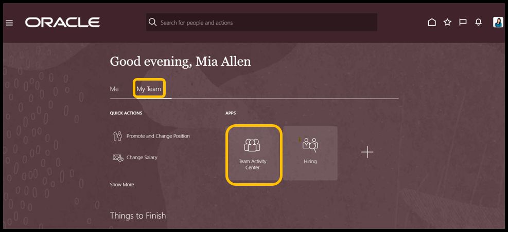

2. Locate the **Manager Concierge** agent at the top of the page. Click **Ask Oracle** in the banner.       

    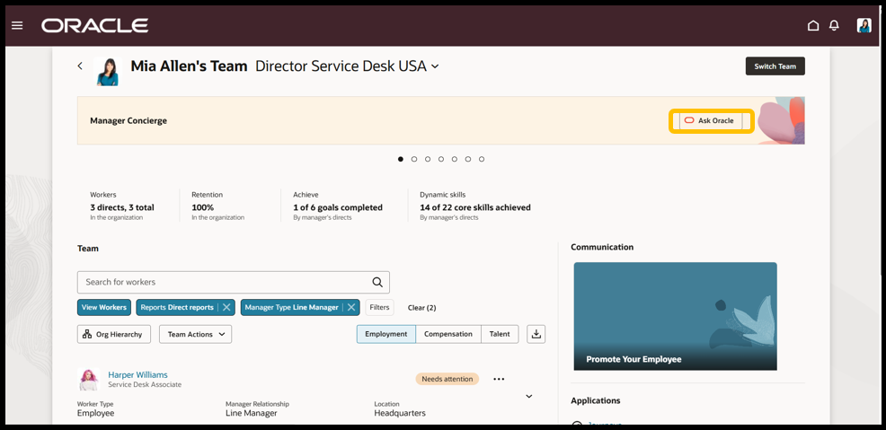

3. Choose an employee from the employee list.

4. Ask what is “XXX” current salary? Then hit enter. *You need to replace XXX with the employee's name.*
    
    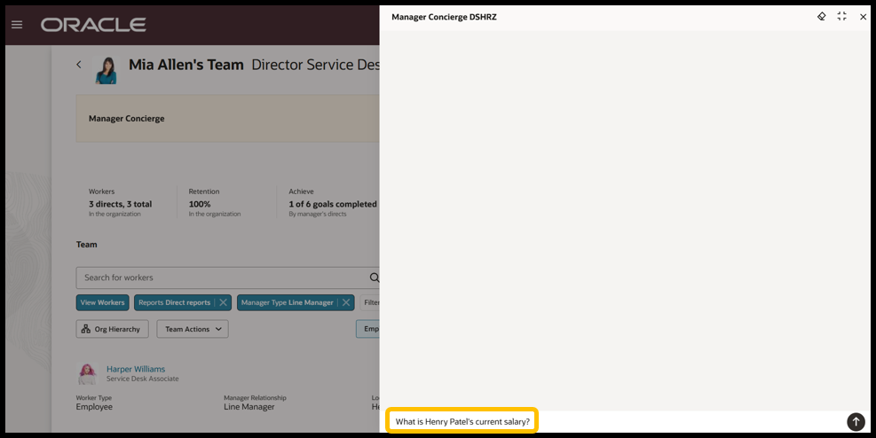

5. Once a response is received, you may proceed by asking, Has “XXX” received any salary raise this year? Then hit enter. *You need to replace XXX with the employee's name.*

    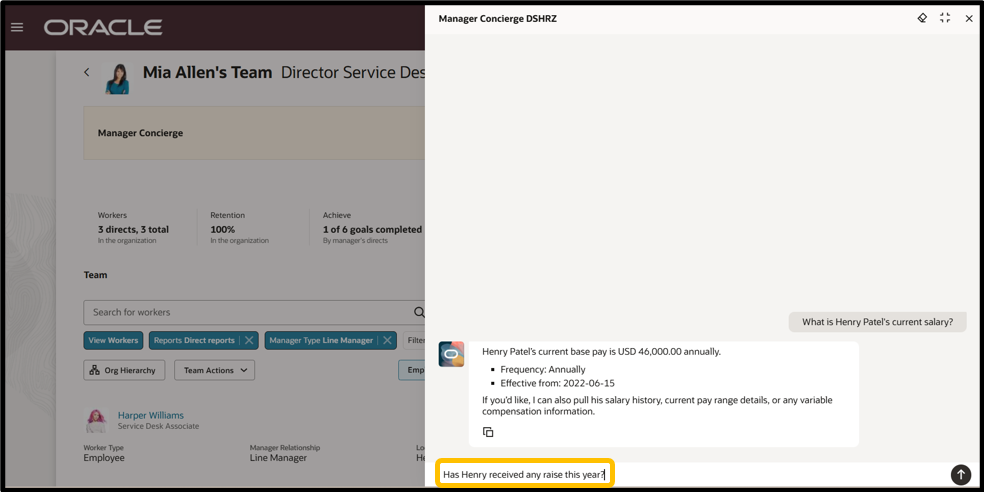
    
    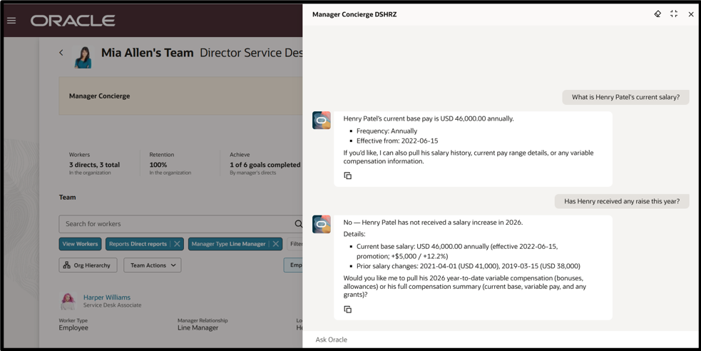

6. Click the **'X'** in the top-right corner of the page to return to the Team Activity Center, where you can continue exploring its features and available activities.
    
    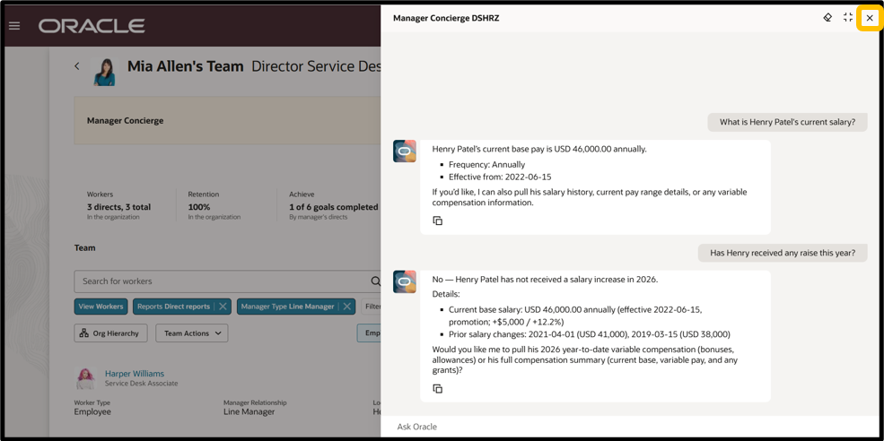

## Task 2: Your Team

The **Team Activity Center** provides managers with the most critical insights, alerts, and tasks for their team as well as the tools to act on them at their fingertips.

*Tip: If you ventured off, go back to the home page, click the ‘My Team’ tab, and then click the ‘Team Activity Center’ tile.*

1. Continue working with the employee you previously selected.

2. Click the **3 dots (…)** located to the right of their name.

3. Select **‘View More’** to open the various actions a manager can orchestrate directly from this all-in-one page. Take a moment to explore the actions that are available.

    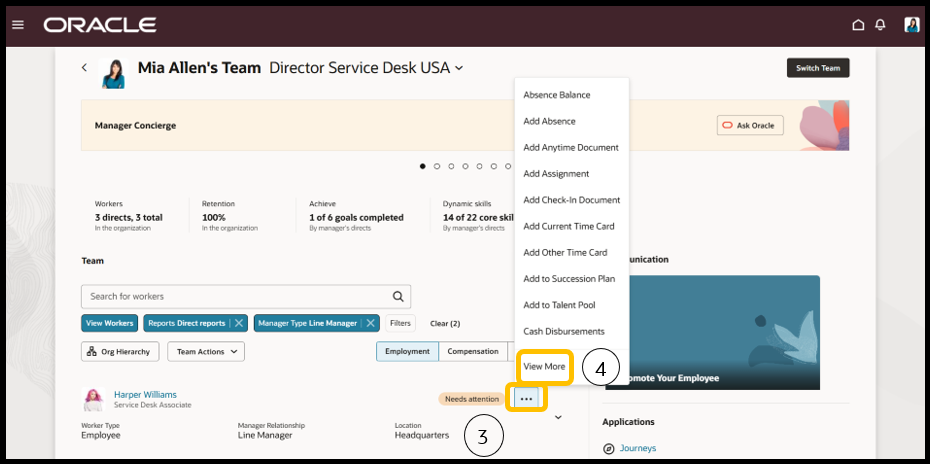

4. When you have finished exploring, move to **Task 3: Promote.**      

## Task 3: Promote

Process a promotion for an employee. Continue working from the **Team Activity Center.**

*Tip: If you ventured off, go back to the home page, click the ‘My Team’ tab, and then click the ‘Team Activity Center’ tile.*

1. Choose an employee.

2. Click the **3 dots (…)** located to the right of their name.

3. Select **‘View More’** from the available list of actions.

    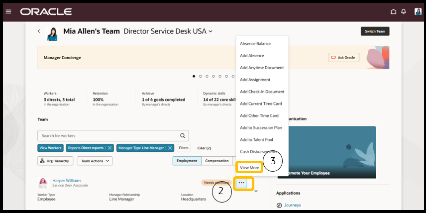

4. Type **Promote** in the search bar. Click **Promote.**

    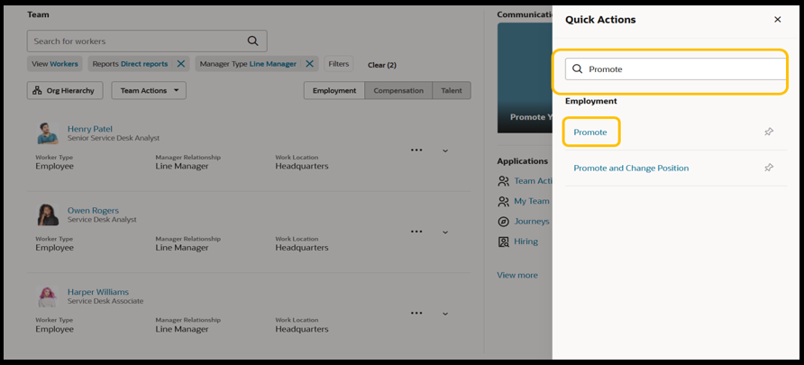

5. Under the **‘Info to include’** section – Toggle the **Salary** button and then click **continue.**

    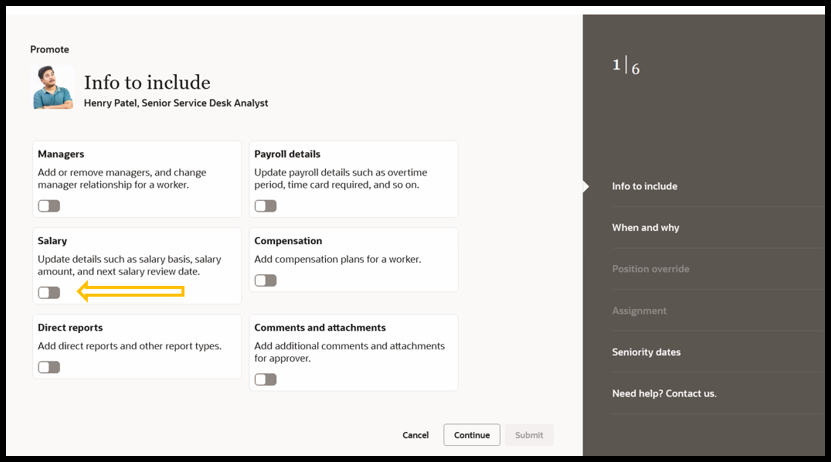

6. In the **‘When and why’** section, enter **today's date** as the effective date for the promotion *(‘What's the way to promote’ will auto populate).* Click **Continue.**

    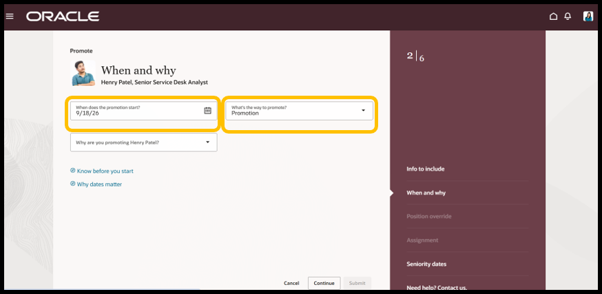

7. In the Position override section DO NOT MAKE ANY CHANGES. Click **Continue.**

8. In the Assignment section DO NOT MAKE ANY CHANGES. Click **Continue.**

9. In the **‘Salary’** section, enter a salary adjustment amount or adjustment percent *(to see an example of the guardrails for entry - enter a salary adjustment greater than 60%).*

    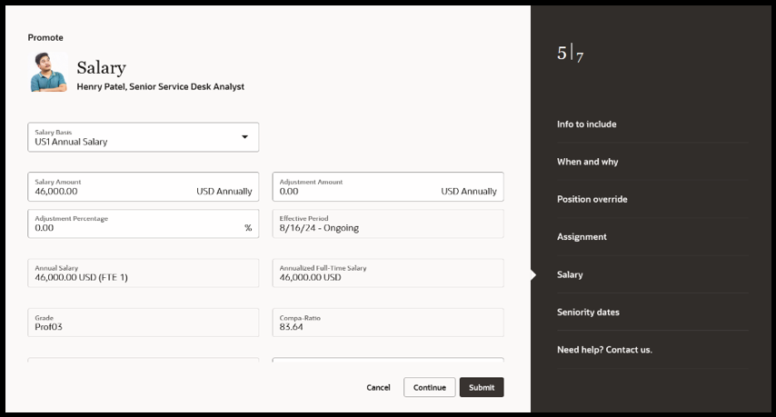

10. To complete the transaction, click **Submit.** Congratulations, you just promoted your employee!

## Checkpoint

Adventure awaits, [click HERE](http://apex.oracle.com/pls/apex/f?p=159406:LOGIN_TEAM:::::CC:HCMCLOUDADVENTURE) to access the Cloud Adventure Checkpoint - Complete the **Manager Section Questions**, and rise to the top of the leaderboard!
    

## Acknowledgements
* **Author** - Dorcas Conyers, Principal Sales Consultant
* **Contributors** -  Dorcas Conyers, Principal Sales Consultant
* **Last Updated By/Date** - Mark Sarmiento, September 2026

