# Connections

## Introduction

Welcome to Oracle’s Cloud Adventure.  This is a fresh and unique way to offer you a chance for hands-on experience of highly differentiated and specifically curated content of numerous vignettes that are typically encountered Supply Chain Management. We hope you will enjoy today’s adventure exploring a complete and unified solution for the office of the COO.

As you follow along, do not forget to answer the Adventure Check Point questions! 

Estimated Time: 10 minutes

### Objectives

In this activity, you will:

* Use Oracle Global Order Promising’s robust profitable to promise capabilities to commit to Steel Fitness’ request with confidence and successfully fulfill our customer’s needs with the lowest cost available.  

 
## Task 1: Use Oracle Global Order Promising to determine most profitable to promise and on-time delivery options to satisfy customers' needs.  

1. You have recently entered a new Sales Order for which manual scheduling is required.   Let’s review our options and ensure that GOP has selected the most cost-effective option.

    > Click on the **Order Management** tab and select **Manage Orders** from the Quick Actions List.

    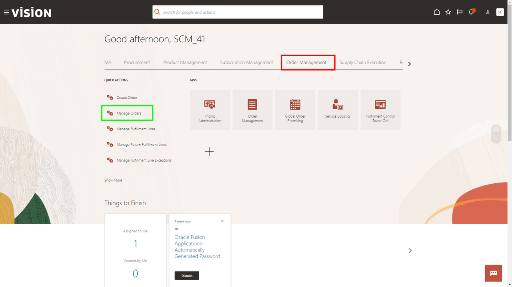

2. Manage Orders allows you to search orders based on a multitude of criteria.

    > Enter order number **98456** in the order field and click **Search.**   Order 98456 will appear in the **Search Results.**  

    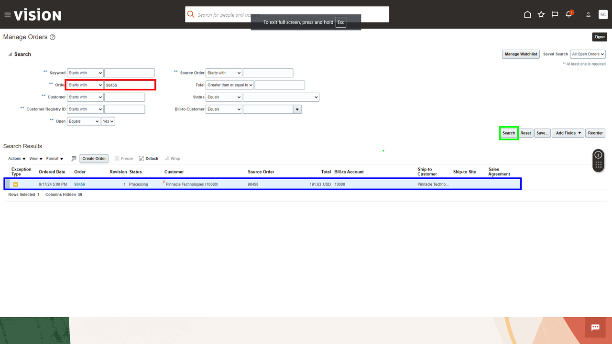

3. Clicking on a sales order will allow you to drill down into the details of the order and interact with it.

    > Click on order number **98456** in the Search Results area.

    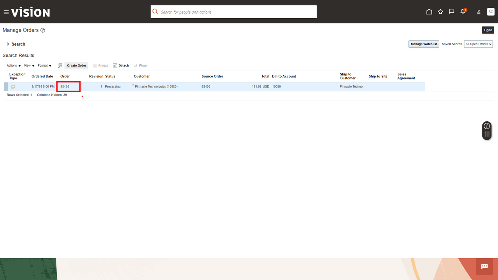

4. All information regarding a Sales Order can be accessed via this screen, including its current state, and all fulfillment details.

    > (1) Click on **Actions.**  
    
    > (2) Then **Switch to Fulfillment View.**  

    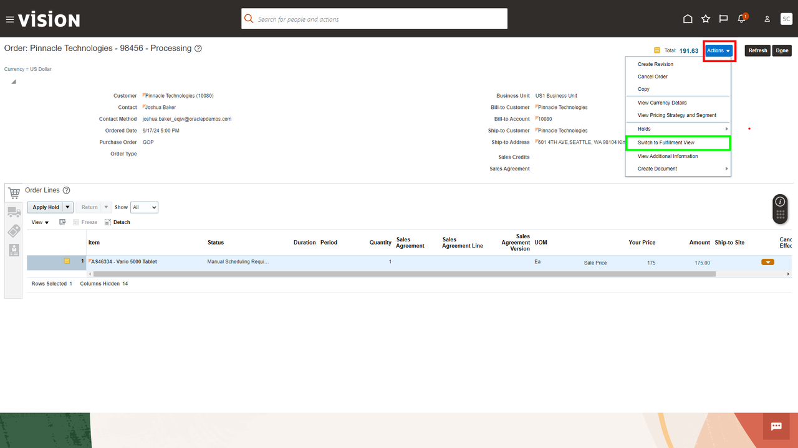

5. The Fulfillment View provides all the relevant details for each line such as inventory details, promising dates, scheduling details, and shipping parameters. Real-time availability checking and order scheduling allows users to quickly investigate delivery exceptions.  

    > Click on **Check Availability**.

    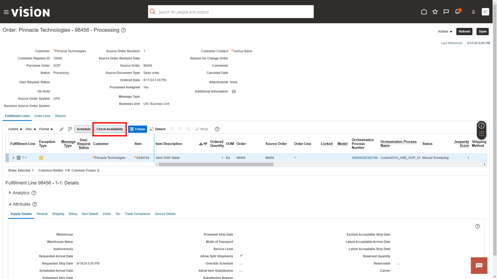

6. The Availability Status indicates the sales order will be delivered on-time!  Oracle Cloud Global Order Promising has found sufficient supply to fulfill the order.

    > Review the details and other available options by clicking on **View Availability Options**.

    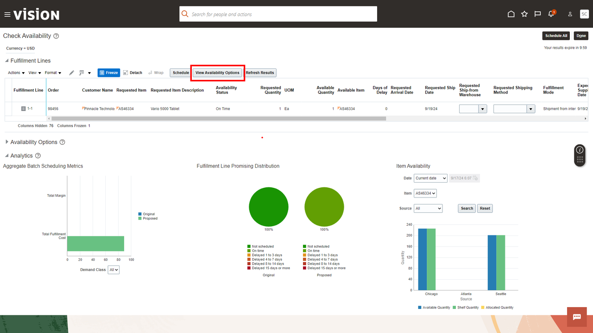

7. The Availability Options shows multiple options based on different shipping methods. However, Oracle Cloud Global Order Promising using Profitable to Promise considered the default option with lowest fulfillment cost. 

    > **Review the options, and record the cost, shipping date, and shipping method for the most profitable selection.**

    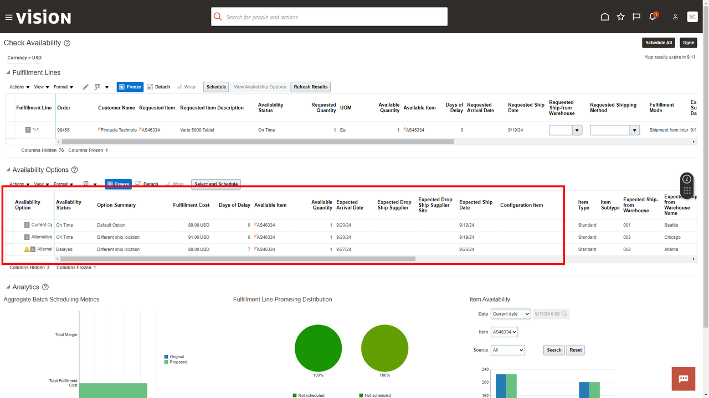

8. If you want to see more options, you can run a “What If” scenario to determine what would happen if you make a change to the currently selected option.  

    > Select the **Blank Box** next to the line highlighted.

    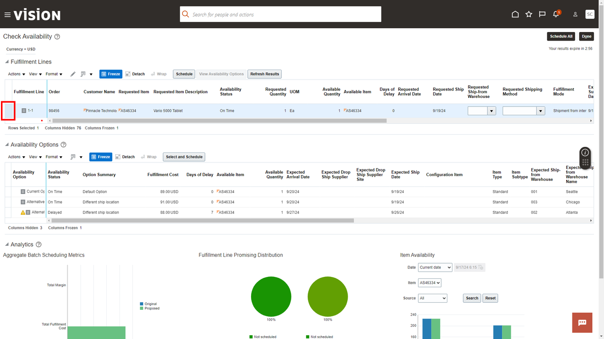

9. Availability Details will give you a full view into the specifics of the fulfillment process, including all purchases, manufacturing, and transfers that are required.

    > Select the Actions icon and click Edit.  

    > GOP can be configured to consider several variables when considering profitability.

    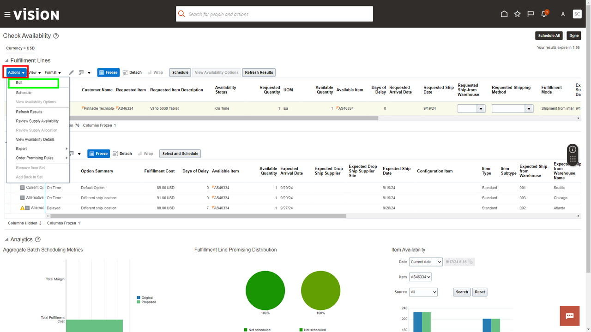

10. The “What If” scenario allows you to include substitute products, split the line into multiple shipments, and even ignore reservations for other customers.  

    > Answer Yes to return to the first three questions.  

    > (1) Allow Substitutions  
    > (2) Allow Splits  
    > (3) Ignore Reservations  

    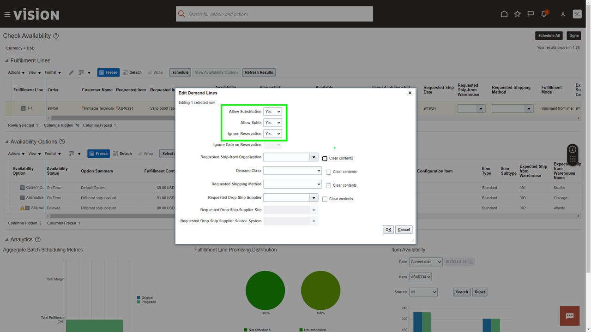

11. In this example, Global Order Promising reviewed the profitable supply chain network to promise the order. 

    > Click on the **Refresh Results** button to return to your landing page.

    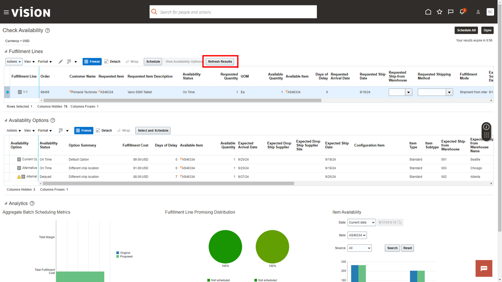

12. Our Order Management environment is configured to require that orders be manually scheduled.   This process can be automated as well, with full confidence that GOP will select the most profitable fulfillment option based on your company’s specific needs.

    

11. Adventure awaits, click on the image, show what you know and rise to the top of the leader board!!!

     

## Summary

Order Promising is a critical supply chain process that drives major costs and customer service levels. Every company’s reputation rests on their ability to provide the highest levels of customer service, while their financial viability depends on their ability to determine both reliable and profitable order fulfillment. 

In this example, we used Oracle Global Order Promising’s robust profitable to promise capabilities to commit to Steel Fitness’ request with confidence and successfully fulfill our customer’s needs with the lowest cost available.  

**You have successfully completed the Activity!**

**For extra credit (and possibly some Oracle swag) please make sure you record the information regarding the option GOP selected, and be prepared to discuss what variables were considered by GOP in making the decision.**

## Acknowledgements
* **Author** - Ben Chromilk, Principal Solution Engineer
* **Contributors** -  Betty Jane Madden, Principal Solution Engineer
* **Last Updated By/Date** - Ben Chromilk, July 2024

