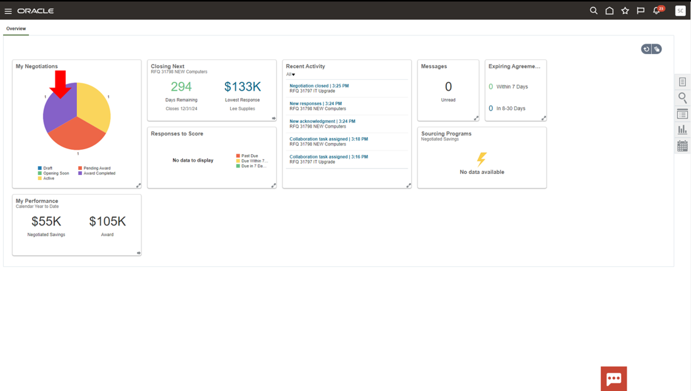
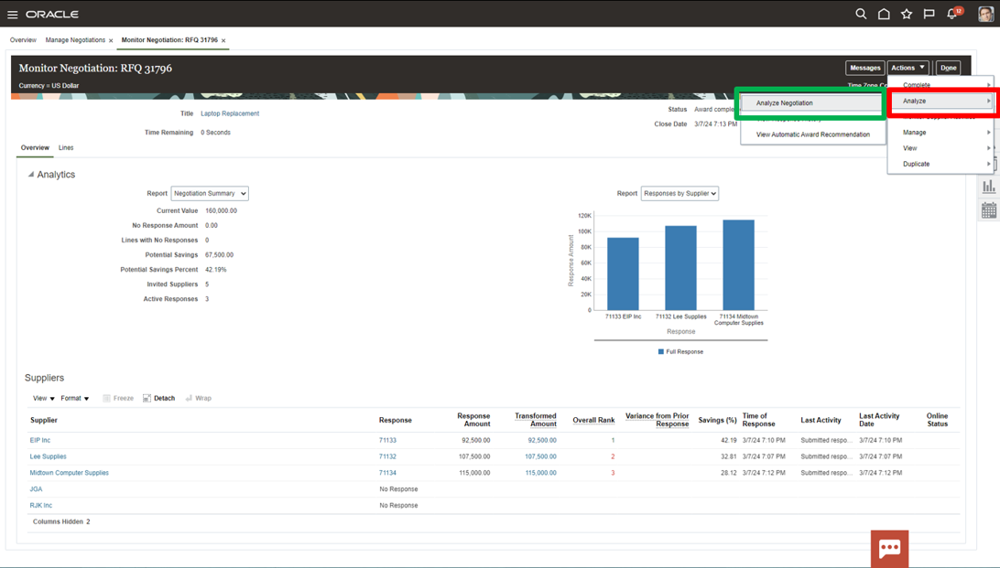
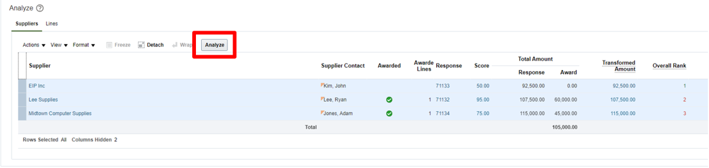

# Connections

## Introduction

This is a fresh and unique way to offer you a chance for hands-on experience of highly differentiated and specifically curated content of numerous vignettes that are typically encountered in accounting and finance. We hope you will enjoy today’s adventure exploring a complete and unified solution for the office of the CFO.

As you follow along, do not forget to answer the Adventure Check Point questions! 

Estimated Time: 10 minutes

### Objectives

In this activity, you will:
* You need to figure out why the Automatic Award Recommendation has elected not to award EIP Inc. in this negotiation. 
 

## Task 1: Discover why the Automatic Award Recommendation has elected not to award EIP Inc. in this negotiation.

1. You will need to go to the negotiations page.

    > Navigate to the **Procurement** tab and select **Negotiations**

    

2. The negotiations dashboard has Infolets with insights into sourcing programs and activity. This information is drillable to give the user and intuitive experience. You need to drill into Award Completed to analyze the recent sourcing negotiation.

    > In the **My Negotiations** Infolet select the **Award Completed** piece of the pie chart (Purple)

    

3. You could drill into the negotiation details by clicking the hyperlink. However, you need to analyze the individual supplier responses, so you need to click the monitor icon.

    > Click the **Monitor** icon for Negotiation 31796

    

4. Here is the initial monitor page. There is some analytical information available at the top of the page. This includes the current value, potential savings, and supplier response amounts.  
    
    At the bottom of the page are the suppliers. Four were invited, and three responded. You can see the details to the right. Once again you will notice EIP was ranked first but still wasn’t awarded so you must dive deeper.

    > Select **Actions** drop down in the top ribbon

    

5. In order to see more information about this negotiation you need to utilize the analytical tools available through Cloud Procurement. To do this, select analyze negotiation from the menu options.  

    > First, click **Analyze**.

    Then, select **Analyze Negotiation** from the drop-down menu.

    

6. Here are more analytics built into the sourcing process. The analysis breaks down the awards by supplier, total savings, and savings by line item. 

    
    
    At the bottom of the page are the suppliers. Four were invited, and three responded. You can see the details to the right. Once again you will notice EIP was ranked first but still wasn’t awarded so you must dive deeper.

    > To highlight all the supplier responses, click the **white space** next to ‘Supplier’ as indicated.

    

    > Once they are all highlighted in blue, click **Analyze**

    

7. The table will populate with some of the supplier response data. To see the requirements sections, you will need to expose more fields.
    
    To expose more fields, simply use the tools to add some response elements to the table.

    > Click **Actions** drop-down, then select **Add or Remove Response Elements**

    

    > Click the **double right** icon to add all the requirement response elements to the table.

    

    > When all the desired response elements are in the right column click **OK** and the tool will update the table.

    

8. Once, the analysis has been run there will be more analytics provided at the top of the page. As you scroll down you will see comprehensive response details for each supplier including the requirement scoring. You will notice that EIP is missing a required certification and therefore they have not been awarded part of this negotiation. To ensure this doesn’t happen again or if you wish to let them re-bid this sourcing negotiation your team must communicate the need for this certification.

    

    > Select the **Home** icon in the top ribbon to navigate back to the Procurement springboard.

    

9. Adventure awaits, show what you know, and rise to the top of the leader board!!!
    
     
    
    [Click here](https://apex.oracle.com/pls/apex/f?p=159406:20:::::CC:SCMCLOUDADVENTURE) 

## Summary

Sourcing is a comprehensive set of tools designed to facilitate easy negotiation between you and your vendors.

Easily identify and negotiate goods and services all in one tool.

Drive better savings by increasing competition between your vendors.

Shorten cycle times with easy-to-use tools and AI and machine learning built into the process.

  > Click the **‘Home’** Icon

**You may now proceed to the next lab.**

## Acknowledgements
* **Author** - Matt Bailey, Staff Solution Engineer
* **Contributors** -  Betty Jane Madden, Principal Solution Engineer
* **Last Updated By/Date** - Matt Bailey, March 2024

