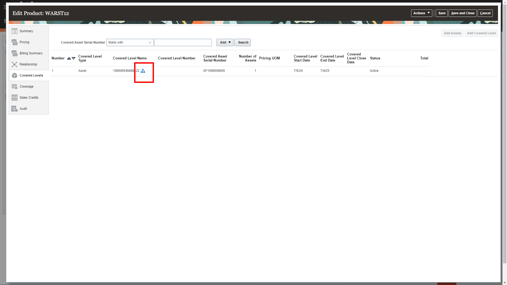
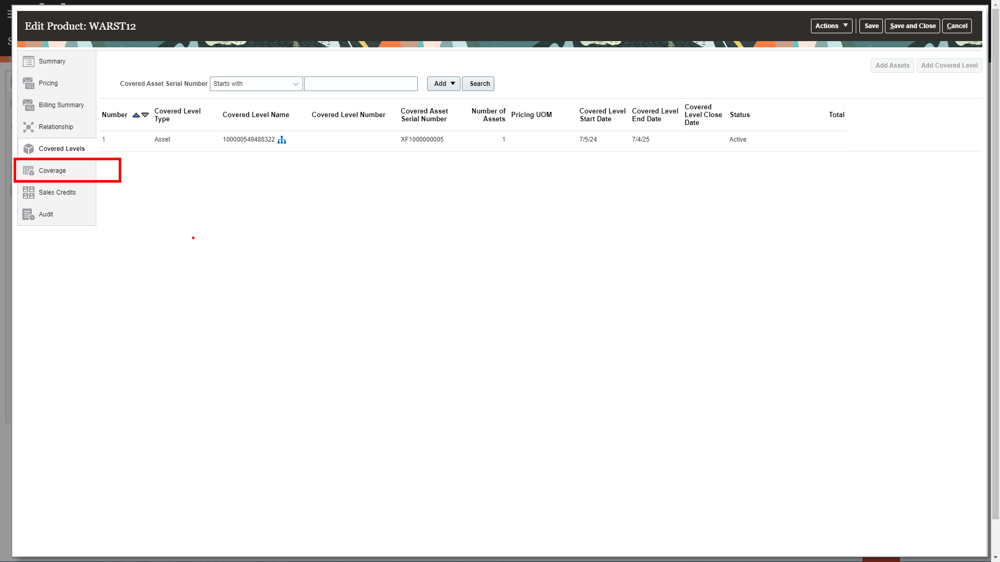

# Connections

## Introduction

This is a fresh and unique way to offer you a chance for hands-on experience of highly differentiated and specifically curated content of numerous vignettes that are typically encountered Supply Chain Management. We hope you will enjoy today’s adventure exploring a complete and unified solution for the office of the COO.

As you follow along, do not forget to answer the Adventure Check Point questions! 

Estimated Time: 5 minutes

### Objectives

In this activity, you will:
* Use Oracle Subscription Management to serve a customer by checking what assets are covered and what they entitlements they have on their warranty.  
 

## Task 1: Use Oracle Subscription Management to serve a customer.

1. You sold an asset to an important customer that included a warranty.  The customer calls and asks what entitlements they have and which assets are covered.

    > Click on the **Subscription Management** tab and select **Subscription Management** from the Quick Actions List.

    

2. Saved searches allows you to search orders based on a multitude of criteria and save the information you most frequently want to find.

    > Enter subscription number **39026** in the Subscription Number field and click **magnifying glass**.   Order 39026 will appear in the **Search Results**.

    

3. Clicking on a subscription number will allow you to drill down into the details of the order and interact with it.

    > Click on order number **39026** in the Search Results area.

    

4. All information related to a subscription can be seen on this screen.  This includes the customer ship to and bill to information, terms of the contracts, status, etc.

    To see the details of the specific product lines on the contract, select the relevant line. 

    > Click on **WARST12**.

    

5. Detailed information related to the subscription line includes terms, billing frequency and invoice preferences, renewal information, and early termination penalties if applicable.

    > Click on **Covered Levels**.

    

6. Here you can see what assets are covered for this customer’s warranty.

    > Review the details of the covered asset by clicking on **the blue hierarchy symbol**.

    

7. Review the covered level asset name, product information, serial number, quantity, and dates.  Once finished, return to the prior screen.

    > Click **Done**.

    

8. Next, let’s take a look at what entitlements the customer has for this specific asset.

    > Select **Coverage**.

    

9. Entitlement rules identify how quickly the company will respond to an issue covered under the warranty.  It also identified what service activities are covered and the percentage that will be the customer’s responsibility.

    Note the Calendar that provides the service level supported for this asset.

    > Once you have reviewed the entitlement rules, click **Cancel** to return to the main menu.

    

    > Select the **Home** icon to return to the landing page.

    

10. Adventure awaits, click on the image, show what you know and rise to the top of the leader board!!!

     

## Summary

Subscription Management is a critical supply chain process that drives recurring revenue and higher customer service levels. Oracle Subscription Management provides a complete solution to sell subscriptions, services, and usage-based products that include tangible items, such as periodic copier ink delivery, or intangible items, such as complex usage-based software subscriptions.  Charge your customers based on how much they consume, with usage collected from any source via a web service.  Increase customer lifetime value by improving renewal rates and reducing revenue leakage with the renewal capabilities in Oracle Subscription Management.

In this example, we used Oracle Subscription Management to serve a customer by checking what assets are covered and what they entitlements they have on their warranty.  

In this example, we used Oracle Warehouse Management’s embedded Mobile App to look up item information.  

**You have successfully completed the Activity!**

## Acknowledgements
* **Author** - Tracy Mengyan, Master Principal Solution Engineer
* **Contributors** -  Betty Jane Madden, Principal Solution Engineer
* **Last Updated By/Date** - Tracy Mengyan, July 2024

