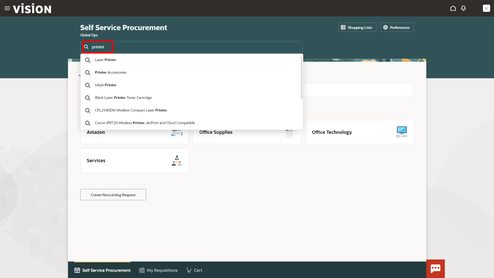
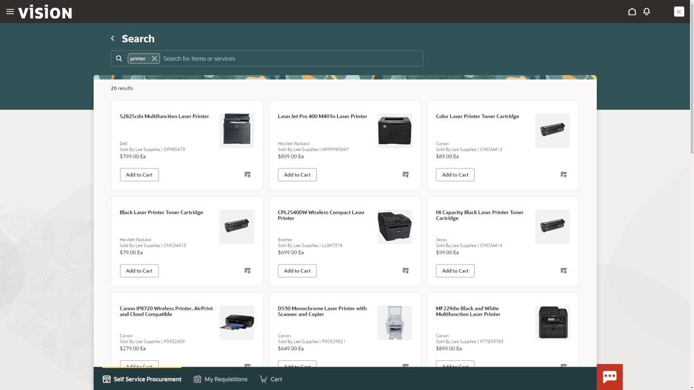
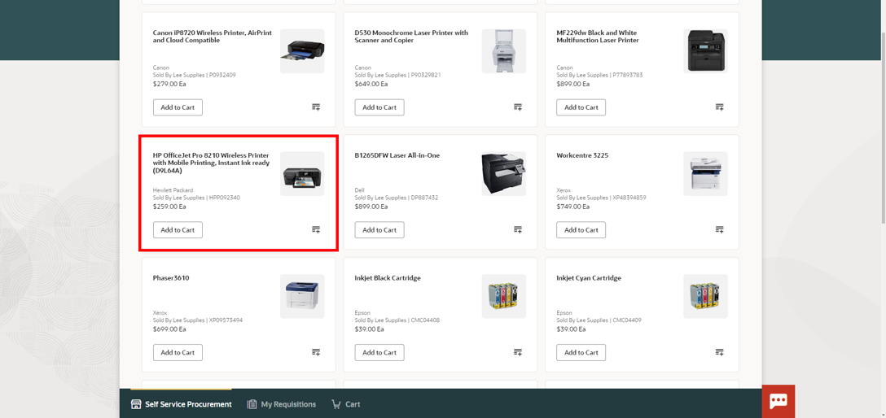
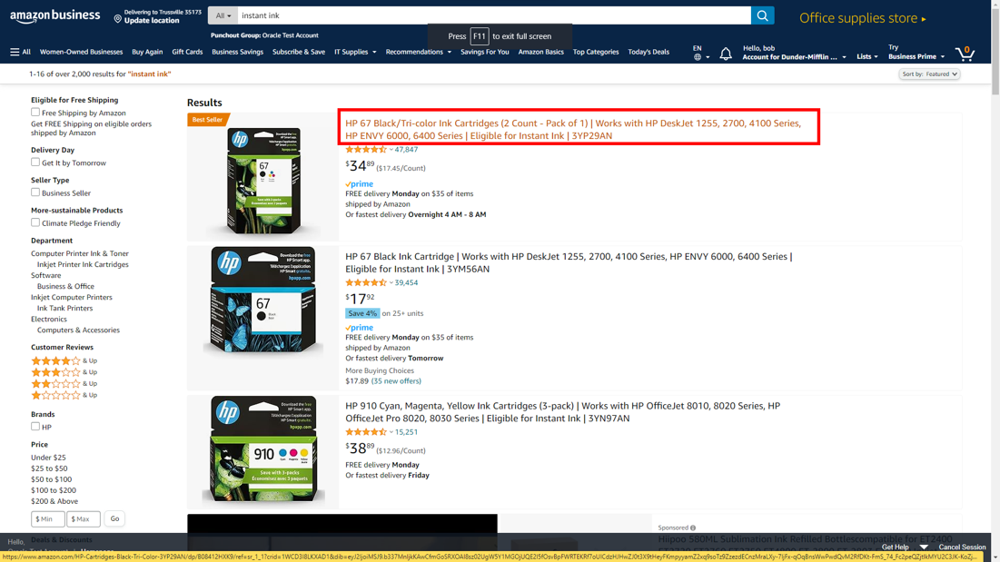
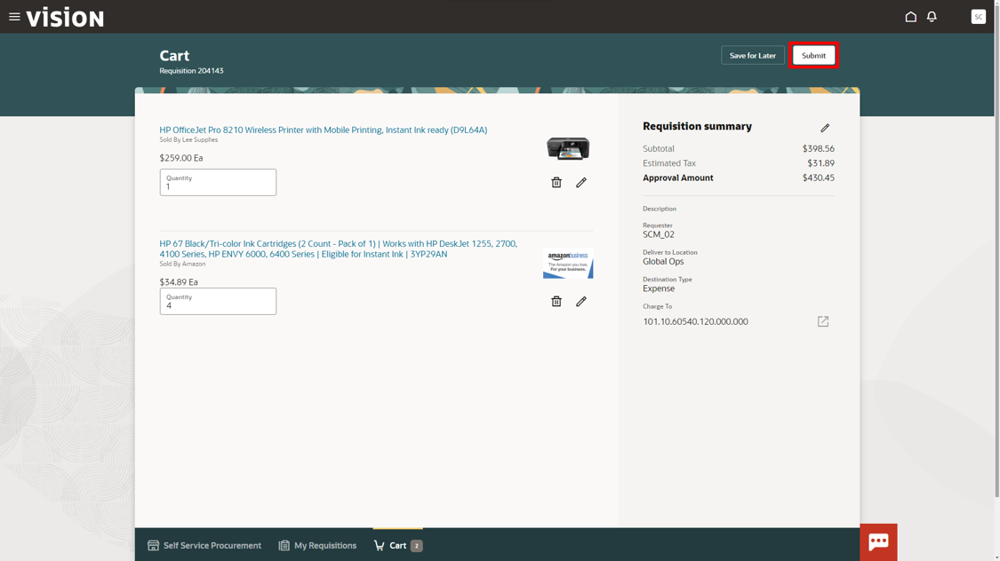

# Connections

## Introduction

This is a fresh and unique way to offer you a chance for hands-on experience of highly differentiated and specifically curated content of numerous vignettes that are typically encountered in accounting and finance. We hope you will enjoy today’s adventure exploring a complete and unified solution for the office of the CFO.

As you follow along, do not forget to answer the Adventure Check Point questions! 

Estimated Time: 10 minutes

### Objectives

In this activity, you will:
* Utilize Self Service Procurement to requisition a new printer and ink to go with your work laptop
 

## Task 1: Utilize Self Service Procurement to requisition a new printer and ink

1. You have recently been given approval to work remotely and need to requisition a new printer and ink to go with your work laptop. To do this you will need to utilize Self Service Procurement.

    > Go to **Procurement**, then click **Purchase Requisitions**

    

2. The catalog shopping experience has intuitive search capabilities built in. Due to this you can search for pre-approved printer options quickly and even see recent searches.

    > Click on the Search Bar and search for **printer**

    

3. The catalog will populate all the pre-approved printer options but you just need something simple and quick. However, you do not need a large multifunction printer that requires toner for a small home office.

    > Scroll down the page until the smaller at home printers appear.

    

    > Select the **HP OfficeJet Pro 8210** by simply clicking on the tile.

    

4. You will have access to all the details of the printer and even be able to see the Supplier and purchasing agreement associated with this catalog item.

    > Once you have reviewed the item details, click **Add to Cart**

    

5. Once you have added your new printer you will need to buy ink for the printer as well.  To add more items under the same requisition, go back to the requisition landing page and continue shopping.

    > Click the **Self Service Procurement** link at the bottom of the page.

    

6. You will be taken back to the requisition’s homepage. The consolidated dashboard allows you to easily punch-out to other vendors by selecting conveniently located icons.

    > Select the **Amazon** link to punch out to Amazon’s website

    

7. For added security, the Amazon punch out will ask you for your username (e.g. SCM01.CLOUD, SCM02.CLOUD…etc) in order to access Amazon Business.

    > Enter your individual **Cloud Adventure username** and select **Start Shopping**

    

8. Once you have punched out to Amazon Business you can utilize the entire Amazon Business UI to search for what you need and compare products.

    > Search for **instant ink**
    
    Press **Enter** on your keyboard.

    

    > Next, select **HP 67 Black/Tri-color Ink Cartridges**

    

9. Amazon will give you all the product details as well as pricing and potential savings. 

    Notice the buy more save more option!

    Once you have determined this is the ink you would like to buy add it to your cart.

    > Change the quantity to **4** using the drop-down
    
    **Click ‘Add to Cart** 

    

10. Like catalog shopping you can continue to shop and add more items to the cart.

    For now, all you need is ink to get your home office started. Submit this item for approval.

    > Click the **Submit these items for approval**

    

11. As you can see Self Service Procurement has empowered you to catalog shop and punch out to another vendor seamlessly. 
    The items from both activities have been added to the same requisition. You will notice the correct delivery to location and charge accounts will auto-populate as well.

    Once the requisition is approved POs will go to the correct vendors for each line item. 

    > Review the requisition document then Click **Submit**

    

12. To see a consolidated and actionable list of all requisitions and their statuses, you can access the My Requisitions page

    > Select the **My Requisitions** tab at the bottom of the page.

    

13. This page allows users to not only see the approval status of any line item they have requested but also act on the individual line items if needed.
    Notice the status of the request you have just submitted.

    > Select the **Home** icon in the top ribbon to navigate back to the Procurement springboard.

    

14. Adventure awaits, show what you know, and rise to the top of the leader board!!!
    
      
    
    [Click here](apex.oracle.com/pls/apex/f?p=159406:20:::::CC:SCMCLOUDADVENTURE) 

## Summary

Utilize modern requisitioning tools to easily navigate pre-negotiated goods and services to make the requisition to PO process seamless.

Ensure compliance with pre-established internal, external, and informational catalogs for requisitioning purposes.

Streamline processes and shorten cycle times with established and configurable approval workflows.

  > Click the **‘Home’** Icon

**You may now proceed to the next lab.**

## Acknowledgements
* **Author** - Matt Bailey, Staff Solution Engineer
* **Contributors** -  Betty Jane Madden, Principal Solution Engineer
* **Last Updated By/Date** - Matt Bailey, March 2024

